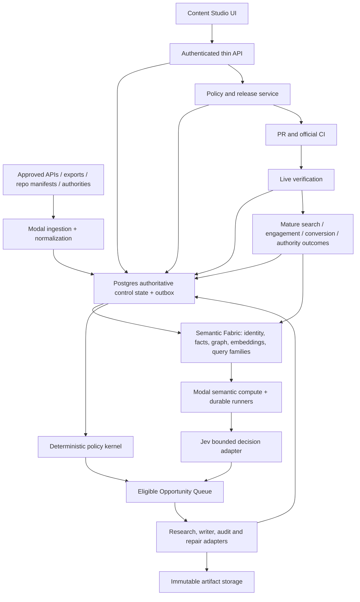
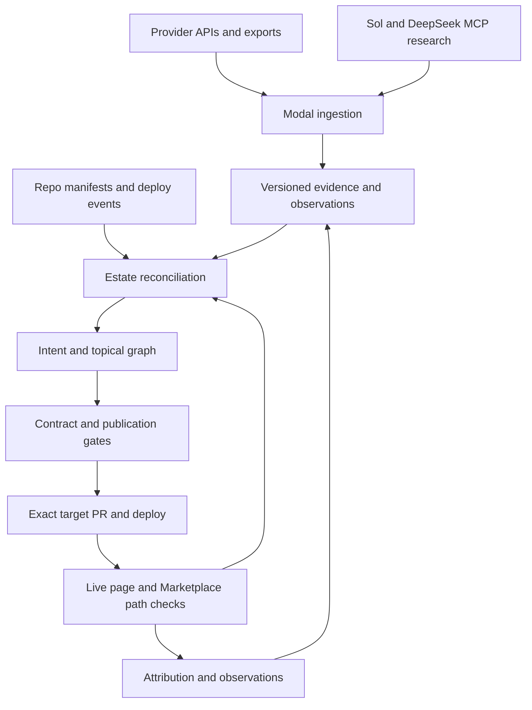

# Content Studio — Evidence-led SEO Architecture
Version CS-2026.09.22.4 · Master design specification · Implementation not started
Owner: Kyle · Architecture/release: GPT Sol · Executor: DeepSeek through the existing ds bridge.

## 1. Objective and authority
Build an intelligence-led editorial operating system that improves qualified audience outcomes, maintains the existing estate, earns trust and measures business value. Writing is one possible intervention; research, refresh, consolidation, technical repair, internal linking, authority work, observation and deliberate NO_ACTION are equally valid outcomes. Article volume is never the objective.

This specification is the requested design, not a claim of implementation, production acceptance or guaranteed rankings. “Never violate a gate” means every protected operation is mediated by enforceable, fail-closed controls and tested bypass resistance. No architecture can promise 100% correct model judgments, future uptime or Google outcomes.

Authority order: current human authorization; repository AGENTS.md and approved design; Supervisor Arc v2026.09.21.1; SEO Brief and current repository parity matrix; this design. Conflicts block the affected action. This design does not amend phase thresholds or authorize broad CREATE, outreach, destructive actions, merges or deployments by itself.

Baseline read on 2026-09-22: Portal main snapshot 3d248afd09290a97250cb472152afaa57b2a0292; Hjarni SEO Brief records P0–P8 closed and P9–P13 pending; repository matrix confirms P9–P13 pending. The existing Notion grade-5 roadmap still describes P8 as NEXT and is historical for this specification. Reconcile live main, current jobs and all scoped rules before implementation. Any later P9 progress supersedes this snapshot only with evidence. Do not touch MARKET-PORTAL-AUTH-HANDOFF-1102 or sibling jobs.

## 2. Existing structure and redesign boundary
Inspected repository sources establish:
- components/design/admin-content-studio.tsx coordinates Discover, Plan, Brief, Write, Check, Approve and Track, with many intelligence/editor/queue panels.
- app/api/content-studio/generate/route.ts awaits the contracted pipeline within the request and returns draft/audit/ship results. This creates request-lifecycle coupling; inspection does not establish that this particular route caused a production 1102.
- WritingContractV2 already binds evidence, source health, jurisdiction-aware identity, ownership, sealed brief and model selection with hashes.
- contentStudioPipeline/Core and writingContractStore preserve recovery claims, leases, heartbeat and JSON/SSE execution context; renderTarget protects approved content and publication digests.
- P1 deliberately removed browser access to content_jobs in favor of authenticated API polling. Do not restore anonymous table subscriptions.
- P8 binds review to unchanged content and audits renderer-added sources before Git writes. Preserve this protection.

Preserve these semantics, ownership.ts as the estate authority, existing evidence/history and current publication proofs. Replace the request-bound runner with durable execution, the large coordinating UI with route-level workspaces, and fragmented action checks with a common policy boundary. Do not transplant AsyncLocalStorage across processes: persist explicit execution identity and fence every write.

Existing UI comments exclude Marketplace publishing. Marketplace demand and commercial destinations remain intelligence inputs. Marketplace content publication is a separate explicitly commissioned adapter; do not silently enable it during this redesign.

Alternatives assessed:
1. Optimize the current Worker pipeline: least migration effort, but keeps CPU/import and request-lifetime coupling.
2. Thin edge + durable state + Modal compute + common policy: recommended; preserves current TypeScript semantics while separating heavy work.
3. Full Python rewrite/event-platform replacement: largest parity risk and operational burden; unnecessary initially.

## 3. Target topology


The diagram shows logical responsibilities, not permission for every runner to write every table.

- **Browser:** navigation, editor, bounded lists, previews and authenticated progress reads. No provider secrets, policy decisions or release authority.
- **Cloudflare edge:** authenticate, authorize scope, validate small input, transact command/outbox creation, read bounded projections and return. No crawling, LLM generation, embeddings, full-document audit or synchronous release orchestration.
- **Postgres/Supabase:** authoritative run state, immutable contracts, lease/fencing counters, gate evidence, intent reservations, approval records, outbox and publication manifests. Large bodies stay outside list rows.
- **Modal:** bounded durable research, generation, Jev calls, audits, rendering, live verification and scheduled reconciliation. Container images pin dependencies and source revision.
- **Artifact store:** private immutable objects, content-addressed with checksums, restricted download capabilities and retention policy. Use existing approved storage unless a measured requirement justifies another store.
- **Release service:** separate credential boundary; creates PRs only after authorization. No writer/research container has Git merge or deployment credentials. Sol retains merge authority.
- **Official CI:** exact-head checks, protected-main merge and repository deployment. Modal code deployment also uses a reviewed official workflow; no local production deploy shortcut.

Initially run the extracted, tested TypeScript domain code inside a Node-equipped Modal container, with a small Python Modal entrypoint invoking a bounded Node process. Build this shared domain package once from the same commit for edge-compatible policy helpers and Node runners. Keep Node-only compute imports out of edge bundles. Port individual workloads to Python only when measured value and contract-equivalence tests justify it.

### Layered responsibility model added in CS-2026.09.22.4
The target topology is interpreted as seven cooperating layers rather than one AI pipeline: **source/evidence → estate truth → semantic understanding → deterministic eligibility → bounded decision → execution/release → outcome learning**. Sections 27–42 define the semantic/decision/learning layers in detail. They are additive to this topology: Postgres remains authoritative, Modal remains bounded compute, Jev remains advisory/bounded decision intelligence, and release authority remains separate.

## 4. Policy kernel and phase model
Use one versioned policy evaluator and one authoritative database transition API. Models may recommend; policy decides permission. UI controls are explanatory projections of server capability decisions.

Separate:
- **Program gates:** canonical phase closures and explicit exceptions, with source evidence. Imported historical PASS is not invented fresh proof.
- **Action gates:** requirements applicable to RESEARCH, REFRESH, CONSOLIDATE, REPAIR, LINK, AUTHORITY, CONVERSION, GEO, OBSERVE and CREATE.
- **Release gates:** current contract/body/artifact/owner/source validity, review, CI, deployment and live proof.

A refresh does not require pretending P9–P13 are complete. P13 CREATE requires predecessor closure under the canonical matrix, P12 expansion evidence and a cluster-scoped unlock. Regressions in an applicable earlier gate invalidate pending dependent permissions.

Every gate result contains gateId, ruleVersion, scope, status, evaluatedAt, expiresAt, evidenceIds, evidenceHash, inputHash, reasonCodes, evaluatorVersion and affectedAction. Statuses retain PENDING, IN_PROGRESS, PASS, ACCEPTED_EXCEPTION, BLOCKED_EXTERNAL and FAIL; NEXT remains a scheduling pointer. Missing, partial, stale, failed or unavailable evidence does not become PASS.

ACCEPTED_EXCEPTION is not equivalent to PASS automatically: only canonical policy may permit a scoped exception, with named authorizer, reason, expiry and compensating checks. No exception may silently clear CREATE freeze, ownership ambiguity, fabricated credentials or missing YMYL review. A policy change requires its own review and explicit authority.

### P0–P13 traceability
| Phase | Preserved gate | Studio enforcement and acceptance |
|---|---|---|
| P0 Estate truth | No retired Marketplace URL emission; exact-tip branch hygiene; retain unique/active work | Resolve host/repo/path/canonical via ownership.ts for every contract and render. Scan runtime emissions and test old aliases. Branch cleanup belongs to the supervisor lane and requires exact-tip evidence; Studio cannot delete branches. |
| P1 Measurement | Reproducible current GSC; priority index evidence; failed audits excluded; unavailable is not zero | Version complete source snapshots, query windows, coverage and freshness. Raw/qualified/off-mission/junk remain separate. Expired or incomplete required inputs block decisions. Test provider failure and paginated/truncated data. |
| P2 Technical | Zero invalid sitemap URLs or meaningful canonical conflicts; priority orphans resolved/justified | Validate proposed and rendered URLs, indexability, redirects, schema and links; recheck deployed output. Zero known invalid sitemap URLs in complete verification scope; incomplete estate coverage cannot claim whole-estate PASS. |
| P3 Ownership | 100% strategic and at least 95% active priority intent mapping; owner resolution before CREATE | Reserve normalized jurisdiction + entity + reader intent/query family transactionally; one primary owner. Supporting pages require distinct sub-intent and parent relationship. Concurrent owner collision test must block. |
| P4 Consolidation | No unresolved major collision in priority clusters; evidence/review/rollback for destructive actions | Recommend-first decision record using current qualified GSC and authoritative owner. No deletion/redirect/noindex mutation from model recommendation alone. Regression and rollback proof mandatory. |
| P5 Mission fit | Raw and qualified data available; off-mission cannot generate missions; explicit high-impression dispositions | Mission eligibility uses qualified evidence only. Keep off-mission visibility inspectable. Ingestion, opportunity creation and regeneration all apply the same predicate. |
| P6 Internal authority | At least 80% approved useful backlog verified applied OR explicitly rejected/stale; multiple relevant inbound links for strategic canonicals | Track planned, staged, deployed, live-verified, rejected/stale separately. Denominator, unknown and truncated flags visible. Test zero applied + valid stale dispositions without falsely labelling them applied. |
| P7 Winners | Selected near-wins have before/after evidence and observation schedule | Refresh contract binds query×page baseline, proposed difference, source-backed information gain, CTA and owned +7/+14/+28-day observations or approved alternatives. |
| P8 Trust | Truthful authorship/review/source evidence on priority YMYL; no fabricated credentials | Claim-source ledger and real reviewer sign-off bound to exact revision. No manufactured self-review, unknown dates or inherited shipReady. Audit rendered additions before Git writes. |
| P9 Authority | Verified won backlinks | Won requires live referring URL, actual href/target, retrieval time and retained proof. Outreach/sent/accepted/lost remain distinct; internal score is never third-party DR/DA. |
| P10 Attribution | At least one strategic cluster traced to meaningful business event | Consent-aware landing→CTA→service→lead/order pipeline; deduplicate event IDs and verified webhooks. Synthetic tests prove wiring only; real observed events are required for program PASS. |
| P11 GEO | Current estate recognized; failed audits excluded; ownership-led remediation | Record provider/model/prompt/date, success coverage, exact cited URLs and competitor citations. Report denominator and failures. No generic llms.txt task without evidence. |
| P12 Validation | Technical gates green, measured progress OR documented failure diagnosis; authority works; fresh measurement; no duplicate owners | Mature observations distinguish data absence, negative result and positive result. Outcome review gates expansion; diagnostic failure is recorded, not converted into success. |
| P13 Expansion | Cluster unlock and immutable writing contract per new page | Broad CREATE stays frozen until signed cluster authorization and all required predecessor/action gates. Preserve evidence-led waves and 40/20/20/10/10 portfolio default; changes require real reward evidence. |

### Enforcement points
Enforce at command acceptance, job claim, contract sealing, post-rewrite audit, review approval, PR creation, final merge check and live acceptance. Re-evaluate changes to owner, sources, policy or content; do not reuse stale badges. Every historical route—including SEO Factory, manual editor, regeneration, scheduled engine, admin repair and legacy ship helpers—must reach the same boundary or reject the mutation. Enumerate the route/call graph before cutover and test each sink.

The publisher consumes a short-lived, single-use release permit bound to action, actor, job, contract hash, body hash, rendered artifact hash, ownership version, policy version and expected repository base. Consume transactionally and record the external operation intent before dispatch. A hash detects change; it is not itself authorization.

## 5. Intelligence and editorial pipeline
1. **Observe:** ingest GSC query×page, index/crawl facts, live internal links, qualified Marketplace/service demand, attribution, backlinks, first-party questions and successful AI-citation audits. Preserve source, window, completeness, authorization, freshness and failure status.
2. **Normalize:** use canonical estate/intent identity; redact personal data; deduplicate evidence; partition jurisdiction, effective dates and audience stages.
3. **Resolve semantics:** bind query/page/section/claim/service observations to versioned entities, reader jobs, intents, journey stages and temporal/jurisdictional qualifiers. Build typed candidate relations and multi-grain embeddings as derivative evidence only. A semantic match cannot create ownership, verify a claim or clear a gate.
4. **Diagnose:** distinguish lack of demand, technical exclusion, ownership collision, weak or missing answer units, stale semantic facts, missing evidence, weak internal/external authority, competitor information advantage and conversion failure. A competitor SERP is a demand/format signal, never proof of a legal claim.
5. **Choose:** evaluate eligible interventions only. Deterministic policy removes forbidden actions first; Jev then supplies bounded classifications/scores over the reconciled semantic and metric state. Ineligible high-volume topics cannot outrank safe eligible work.
6. **Research:** fetch primary authorities and relevant first-party experience; build claim-level supporting and contradicting evidence with locators, retrieval time, effective dates and hashes. Research gaps block affected claims.
7. **Seal:** compile immutable contract, semantic information-gain plan and observation plan. Authoritative sources must substantively support the planned assertions, not merely have prestigious domains.
8. **Write:** pinned commissioned text model creates answer-first copy using the sealed brief. It may not invent evidence, credentials, experience, dates, fees, eligibility rules or success rates.
9. **Audit and revise:** deterministic structure/links/ownership/source checks, independent semantic claim review, editorial review and required human expertise. Rewrites produce new revisions and invalidate dependent approvals.
10. **Release:** render target artifact; audit additions; create reviewed PR; exact-head CI; Sol merge; official deployment; independently verify live canonical, body marker/digest, authorship, sources, links and CTA.
11. **Learn:** collect mature outcomes at query-family, page, semantic-answer-unit and commercial-path grain; decide defend, repair, consolidate, expand or stop. Do not optimize on draft count, a single synthetic SEO score or model confidence.

Human-like means specific, useful, coherent prose with varied natural rhythm, contextual examples and honest limits. It never means defeating AI detection or disguising fabricated personal experience. Remove generic filler, repetitive templates and forced keyword floors; word budgets reflect reader need. Harper/grammar/readability tools remain diagnostics, not proof of factual quality. Preserve meaningful query coverage without keyword stuffing.

### Trust and YMYL publication rules
These are proposed YouSafe controls, not a Google certification:
- Each externally checkable consequential claim maps to evidence and jurisdiction/effective date. Unsupported or contradictory critical claims block release.
- Immigration eligibility, legal rights, deadlines, fees and consequential recommendations require an identified qualified human reviewer with verified remit. AI cannot sign as a human reviewer; missing reviewer means BLOCKED.
- Real experience uses consented first-party material, with provenance and appropriate anonymization. Illustrative scenarios are labelled; no invented testimonial or case outcome.
- Author, reviewer, methodology, sources, correction route and genuinely known published/modified dates must render truthfully.
- Freshness policy is field-specific: proposed maximum retrieval age at release is 24 hours for mutable fees/deadlines/rules, seven days for procedural guidance and 30 days for stable background. Primary authority changes or unresolved contradictions invalidate immediately. Sol/domain reviewer may tighten these; widening requires recorded rationale.
- Clear scope and service boundaries; disclaimer does not cure unsupported advice. Commercial CTAs must reflect actual services and avoid outcome guarantees.
- Evaluate original usefulness: a verified decision aid, first-party insight, clarified exception, practical comparison or genuinely better answer. Rewording competitors is insufficient.

Google emphasizes people-first reliability and truthful Who/How/Why; E-E-A-T is not a single numerical ranking factor. Scaled production without user value risks spam-policy violations. No “Google E-E-A-T score” or ranking guarantee is displayed. [G1][G2]

## 6. Jev decision plane
Verified TypeSafe API: POST https://api.typesafe.ai/v1/systemone with state, model and typed questions. Choice returns choice/probabilities/confidence; Score returns score/legend/probabilities/confidence; Noul returns a 0–1 value without a separate confidence field. Pin an available version; docs currently list jev-1.13.0. Verify access and limits before enabling. [J1][J2][J3]

Jev runs server-side in Modal, not in the browser. It does not write prose and has no release credentials. Its structured output can still be substantively wrong.

Atomic tasks: classify mission fit and intent ambiguity; choose among already eligible REFRESH/RESEARCH/LINK/etc.; triage claim-support uncertainty and YMYL risk; score information-gain candidates; route to expertise or further research. A new source or candidate cannot become verified merely through a Jev answer.

DecisionRecord stores input artifact hashes, question/rubric version, actual model version, full returned distribution, selected option, calibration version, independent policy result and reason codes computed from recorded facts. No invented textual rationale attributed to Jev.

For semantic tasks, Jev receives a compact `DecisionState` assembled from **recorded facts and derived semantic features**, not raw uncontrolled web pages. Required fields identify the semantic identity, authoritative owner/version, candidate relation types, hard eligibility result, evidence freshness/completeness and the exact alternatives Jev is allowed to choose. Section 29 defines the decision hierarchy, abstention and calibration contract; it does not broaden Jev's authority.

Start in shadow mode. Proposed promotion test: independently labelled 500-case holdout covering jurisdictions, off-mission demand, same-number collisions, stale sources, prompt injection and critical YMYL claims; at least 100 critical cases. Compare task error, false-safe rate, Brier score/reliability and abstention coverage against a rule-only baseline. Zero critical false-safe cases in this set is a release criterion, not a population guarantee. Sol approves task-specific thresholds; until then all decisions remain advisory. Never interpret confidence=0.9 as proven 90% domain accuracy.

Timeout/malformed response/rate limit/overload → bounded retry with jitter and provider guidance, then abstain. Missing Jev does not silently substitute an unapproved model or clear a gate. Read-only deterministic work may continue; dependent decision work waits or enters explicit human review. Cache by model + rubric + evidence + policy version, never by topic alone.

## 7. Modal execution and failure semantics
Use asynchronous submitted jobs; no Cloudflare request waits for completion. Modal supports spawned functions and retries, but its result retention is not the product ledger. Persist durable stage outputs externally before acknowledgement. [M1][M2]

Command transaction creates run + stage + outbox row together. A scheduled Modal dispatcher claims bounded outbox batches using short database locks, commits the claim, then spawns work outside the transaction. A periodic reconciler recovers expired dispatch claims. A best-effort wakeup can reduce latency; it is never the sole delivery guarantee.

Assume at-least-once dispatch and completion. Every stage uses (jobId, stage, inputHash, policyVersion) idempotency plus monotonic fencing token. A worker must present current token and unexpired lease for every state change. Duplicate spawns can compute redundantly but cannot commit stale results or release twice.

Proposed initial limits: 60-second lease, renewal every 20 seconds, three transient retries with backoff, per-stage wall and resource budgets, two editorial revision loops, bounded global and per-project concurrency. Pin actual limits in versioned configuration and load-test; CPU research and GPU inference are separate pools. Do not provision GPUs for API-only tasks.

Crashes: immutable output written → checksum checked → database checkpoint committed → event recorded. Orphan uploads are reclaimed only after retention grace. Cancellation revokes the lease first; delayed workers cannot publish. Timeouts do not erase saved output. Provider budget exhaustion parks work with an explicit reason.

External writes require intent/outbox record and reconciliation. For uncertain PR creation, inspect the operation marker and repository before retrying. Never claim exactly-once network delivery. GitHub dispatch/merge/deploy hooks are signed, replay-deduplicated and checked against expected repository and SHA.

Schema-incompatible worker versions cannot claim a run. Each run pins policy, contract schema, worker image digest and evaluator versions. Modal outage leaves jobs visibly queued/blocked while browsing and editing saved drafts remain available.

Modal is also the **semantic compiler and cost-governed compute plane** described in section 28. Deterministic parsing/graph work stays on CPU where practical; embeddings/reranking use the smallest measured accelerator that meets the acceptance target; larger local LLM inference is an escalation tier, not the default. Every semantic stage records resource class, wall time, billable-resource telemetry when available and cache/reuse status so the $30 monthly credit is managed from measured cost rather than assumed article counts or GPU hours.

## 8. Data and API contracts
Extend current content_jobs, writing-contract and evidence tables where semantics match; do not create a competing truth store. New names below are logical entities; A0 maps exact existing schema before migrations.

| Entity | Minimum invariant |
|---|---|
| EvidenceSnapshot / SourceClaim | Immutable substantive payload hash, source URL/locator, jurisdiction, observed/effective dates, health, scope and completeness; claim support separate from source reputation. |
| IntentOwner / Reservation | Versioned authoritative owner; unique normalized intent key; atomic reservation for CREATE; supporting sub-intent explicitly distinct. |
| ContractV3 | V2 identity/evidence/ownership retained plus action, policy version, program snapshot, information gain, trust requirements, baseline, commercial path, link plan, publication rules and observation owner/window. |
| Job / Stage / Attempt | Durable state, expected version, fence, lease, input/output refs, deadline, retry budget and error classification. |
| GateEvaluation | Immutable rule/version/scope/evidence/result; expiry and invalidation links; not a mutable green checkbox. |
| DecisionRecord | Jev schema/model/rubric/input hash, distribution and calibration; deterministic eligibility result separate. |
| Revision / Review | Immutable body and render hashes; reviewer identity/role; verdict and timestamp; approval invalidated by substantive or renderer changes. |
| Release / PublicationProof | Expected base, candidate SHA, CI checks, merge SHA, deployed version, live artifact marker/digest, verification timestamp and rollback reference. |
| Observation / Reward | Baseline and actual window, mature status, source completeness, qualified metrics, confounders and attributed outcome; unknown values nullable. |
| Outbox / AuditEvent | Unique event ID, operation key, sequence, actor, reason, attempted state, delivery state and durable reconciliation evidence. |

Contract hashes use the existing canonical serialization specification and shared golden fixtures; no Python/JavaScript hashing discrepancy. V2 remains readable and immutable. New V3 envelopes link to V2 history; do not “upgrade” historical contracts by inventing evidence.

API proposal, under /api/content-studio/v3:
- GET /overview and /opportunities: bounded projections with freshness/coverage and cursor pagination.
- POST /jobs: accepts action, opportunity ID, expected owner/policy version and idempotency key; returns 202 only after durable transaction.
- GET /jobs/:id and /jobs/:id/events?after=sequence: authorized state and bounded event pages.
- POST /jobs/:id/contract: seal server-resolved evidence; clients cannot supply trusted hashes as authority.
- POST /jobs/:id/revisions: optimistic concurrency via expected version; reject conflicts with 409.
- POST /jobs/:id/review: role-checked approval of exact revision/render hashes.
- POST /jobs/:id/release: creates release intent only; never returns “published” on PR creation.
- POST /jobs/:id/cancel or /retry: fence prior attempt and reuse identity; retry requires fresh eligibility.
- GET /jobs/:id/artifacts/:artifactId: scope-checked short-lived download capability.

Errors: 401/403 auth; 409 version/contract conflict; 413 oversized payload; 422 invalid contract; 429 explicit backpressure; 503 temporarily unavailable persistence. Include stable reason codes and recovery action. No raw credentials or provider internals in client errors.

Internal job progression: PROPOSED → RESEARCHING → CONTRACT_READY → DRAFTING → AUDITING → REVIEW_REQUIRED → APPROVED → PR_CREATED → MERGED → DEPLOYED → LIVE_VERIFIED → OBSERVING → CLOSED. BLOCKED, FAILED, CANCELLED and SUPERSEDED are explicit. Non-writing actions use declared subsets; they do not manufacture drafts or publication proof. Every transition has one allowed actor, precondition, atomic update and event.

## 9. Complete UI redesign
Replace stage tabs as the application's primary navigation with an evidence-first workspace. Retain familiar editorial typography using existing studio tokens; introduce consistent status, spacing and interaction primitives. No full application rewrite in a single component.

Global shell: project/estate selector, current program phase, CREATE lock, source freshness, running/blocked jobs and role-appropriate actions. Status always includes reason, evidence and next permitted step.

| Workspace | Layout and primary interaction | Required states |
|---|---|---|
| Command Centre | Qualified progress, trust debt, opportunities, blocked decisions and due observations; raw metrics one click away. Default action “Investigate opportunity”. | Current/partial/stale/unavailable; no article quota or vanity output counter. |
| Intelligence | Query×page and cluster table with jurisdiction/intent filters, source drawer, measured windows and owner view. Compare refresh vs new page vs no action. | Raw/qualified/off-mission/junk toggles; clear denominators and estimated labels. |
| Opportunity Detail | Left: evidence and diagnosed problem. Centre: eligible interventions and expected reader benefit. Right: gate reasons and Jev uncertainty. | Recommendation, abstention, blocked and explicitly dismissed with reason. |
| Research & Contract | Claim/source matrix, contradictions, research gaps, information-gain plan, owner, link/CTA plan and observation owner. | Sealed contract read-only; edit creates new version. Sources preview with locator. |
| Editorial Desk | Desktop three panes: outline/claims, document editor, source/trust checks. Inline claim anchors and revision diff. | Saved/unsaved/conflict, queued/running/stalled, changed-after-review. Human edits invalidate relevant checks. |
| Trust Review | Exact rendered preview with critical claims, reviewer remit, changes since last approval and correction details. | Approve/return with evidence; incapable role cannot approve. No AI-as-human badge. |
| Release Desk | PR diff, exact-head checks, policy permit, deployment timeline and live proof in separate cards. | PR created ≠ merged ≠ deployed ≠ live verified. Wrong/stale SHA disables release. |
| Authority & Outcomes | Internal-link lifecycle, backlink proof, privacy-aware funnel, GEO success coverage and mature experiments. | Planned/applied/live verified; outreach/won/lost; unknown/no effect/negative/positive. |
| Operations & Policy | Queues, provider health, CPU/memory/error trends, budgets, gate versions and audit history. | Read-only policy for ordinary editors; changes require reviewed release. |

Interaction requirements:
- Nested routes under existing /dashboard/admin/content preserve deep links and allow incremental migration.
- Server-filtered pagination defaults to 25, max 100; select-all refers only to explicit scope. No giant loaded job bodies.
- Authenticated polling defaults to five seconds for visible active jobs, backs off on inactivity/error and pauses in hidden tabs. Deduplicate requests. Optional bounded SSE only projects persisted events, never owns the compute lifetime.
- Run cards show last real event, stage, elapsed time, heartbeat age and retry state. A stale heartbeat says “connection/execution status needs reconciliation”; no fabricated percentage or endless “Working”.
- Editor autosaves revision checkpoints with conflict detection; reconnect restores durable state. Cancellation explains whether compute stopped or only cancellation was requested.
- Full keyboard access, visible focus, screen-reader labels, non-color status cues and WCAG 2.2 AA target. Reduced motion. Destructive commands require explicit scoped review.
- At narrow widths, three panes become Evidence / Draft / Checks tabs with a persistent blocker summary; no horizontal page overflow. Long tables have deliberate bounded scroll.
- Proposed visual tokens: warm neutral document canvas, high-contrast ink, restrained teal for valid actions, amber for incomplete evidence and red for failures; test actual combinations for contrast. Use serif headings sparingly and sans-serif controls/body for dense workflows.
- Model/provider controls belong in task configuration and operations, not the main editorial flow. The main UI explains evidence and decisions in plain language.

Acceptance journeys: qualified refresh from evidence to live proof; frozen CREATE refusal with reason; contradictory YMYL source requiring research; draft edit invalidating approval; two users editing with conflict; provider outage and browser reconnect; small-screen reviewer completion; screen-reader blocked-action explanation.

## 10. Cloudflare 1102 prevention and performance contract
Cloudflare documents separate CPU and memory limits; waiting for network I/O is not CPU execution. Memory is 128 MB per isolate, shared across concurrent requests. Actual account limits/configuration must be read before rollout. Modal relocation alone does not fix heavy SSR, middleware imports or unbounded JSON. [C1][C2]

Engineering controls:
- Separate thin command/read dependency graph from compute. CI forbids transitive imports of writer, crawler, DOM/PDF parsers, embedding or full audit packages into edge routes.
- Serve the shell/assets efficiently; lazy-load editor, charts and evidence tools by route. Preserve existing public/static auth bypass behavior; authenticate all protected API/data requests.
- Precompute summaries in Modal. Bounded indexed reads, cursor pagination and projection-only rows; no estate scans on page load.
- Proposed command payload cap 64 KiB; list response cap 128 KiB; event batch cap 100. Large documents upload directly via scoped storage capability and are processed in Modal. Enforce actual bytes, not only Content-Length.
- Static assets may be public-cacheable. Private API/content responses default to private/no-store; never cross-user shared caches. Signed preview/download expiry and authorization remain enforced.
- Limit parallel backend calls, cancel redundant reads and apply queue admission limits. Slow/failing provider does not trigger browser retry storms.
- Track CPU separately from wall latency; aggregate by route/build. Track exceededCpu, exceededMemory, 1102, 503, isolate startup, payload size, queue age and database latency.

Proposed acceptance budgets, to be measured rather than claimed:
- Edge p95 CPU ≤ min(10 ms, 25% of configured CPU cap); p99 ≤ 50% of that cap. If existing auth alone fails the budget, redesign/profile it before enabling the route.
- Worst supported isolate load remains below 80 MiB measured allocation; do not rely on average per-request memory.
- Warm command acceptance p95 ≤ 750 ms, cold p95 ≤ 1.5 s, excluding explicitly measured external network latency; returned 202 never waits for research.
- Initial Studio route ≤ 200 KiB gzip JavaScript excluding separately reported shared authentication/runtime; incremental lazy route chunk ≤ 150 KiB. Record total transfer too, so exclusions cannot hide bloat.
- Target p75 LCP ≤ 2.5 s, INP ≤ 200 ms, CLS ≤ 0.1 on defined mobile test and then field data; lab success does not claim field success.
- Run 30-minute load test at 2× observed peak, minimum 50 concurrent active sessions, including cold starts, list pagination, editor saves and job status polling. Zero 1102/exceededCPU/exceededMemory; error rate below 0.5%, excluding intentional 4xx denials.
- Canary observation must cover 24 hours and at least 10,000 representative API requests (supplement in staging where production volume is low; label separately). Any resource-limit incident holds promotion and triggers diagnosis.

Targets may be revised only with measured evidence and Sol approval, never silently relaxed to pass. Raising CPU limits is not the primary remedy. Browser shell remains usable during Modal outage; a database outage cannot acknowledge an unpersisted job.

## 11. Security, truth and release integrity
Keep current privileged-table grants; no public content_jobs or decision/evidence reads. Use authenticated server APIs and resource-level project/role checks. Enable RLS in exposed schemas and apply least-privilege service roles; server credentials can bypass RLS, so service code/RPC authorization and restricted grants are mandatory. [S1]

Research inputs are untrusted data. Strip executable markup, isolate parsing, prevent SSRF/private-network access, bound redirects/download size, and never let retrieved instructions alter prompts, policy, capabilities or tool selection. Do not send client case files or personal identifiers to Jev/providers by default.

Compute workers receive only required read/stage-write permissions. Release credentials are separate. Audit actor, source version, decision, approval, intent and external result. Scope and expire callback credentials; deduplicate replayed events. No secrets in logs, artifacts or prompts.

Pre-release freeze owner reservation and contract; resolve repository base drift and rerun changed-source checks. Final GitHub check must match the actual candidate SHA. Cross-repo interfaces/releases serialize where dependent; one writer per conflict domain. Unchanged green evidence may be reused only when still applicable.

Rollback is a reviewed Git revert/official redeploy plus data compatibility path. Kill switches stop new dispatch/release independently. Rollback must preserve gate enforcement: if the legacy runner lacks required policy, disable affected actions rather than reopen a bypass. Never rewrite historical proofs or discard in-flight jobs to make migration appear complete.

## 12. Migration and Sol/DeepSeek execution map
These are architecture work packages and exit conditions. Sol must turn the approved specification into bounded implementation packets after current-state inspection; exact file/test commands come from the repository, not guesses in this document.

| Package | Scope | Required exit evidence |
|---|---|---|
| A0 Reconcile | ds health once; current repos/main/jobs; route and write-sink inventory; schema/migrations; provider/account capabilities; latency/import baseline; active conflicts | Evidence-linked compatibility map, actual existing policy sinks, performance baseline and explicit blockers. Jev/Modal access unverified until tested. |
| A1 Policy | Common evaluator, applicability matrix, gate evidence, intent reservation, permits and bypass closure | P0–P13 fixture coverage; every sink mapped; concurrent/expired/unknown/exception cases denied correctly. No phase advancement. |
| A2 Durable runtime | Atomic outbox, Modal dispatcher/runners, fencing, checkpoints, artifacts, cancellation and reconciliation | Crash-before/after-dispatch, duplicate completion, lease loss and uncertain-write recovery tests. No edge heavy imports. |
| A3 Intelligence/Jev | Evidence normalization, claims, semantic identity, bounded decisions and shadow evaluation | Qualified demand parity; holdout/calibration report; wrong-jurisdiction/off-mission/injection tests; abstention works. |
| A4 Editorial/trust | ContractV3, claim-linked writing, independent review, rendered artifact validation and reviewer workflow | V2 readability; rewritten bytes invalidate approval; unsupported critical claims and fabricated reviewer blocked. |
| A5 New UI | Route-level workspaces, editor, gates, progress, release and outcomes | All acceptance journeys, mobile/keyboard/a11y checks and bundle/performance measurements. |
| A6 Release/observe | GitHub adapter, official Modal/Cloudflare workflows, source-bound live checks, real observation scheduling | Exact-SHA release test; P6/P9/P10/P11 truth distinctions; scheduler execution and owner proof; rollback drill. |
| A7 Cutover | Shadow → internal read-only → refresh canary → staged adoption; retire alternate writers only after parity | Exact-head repository gates, production source/live evidence, resource canary and recovery sign-off. CREATE remains frozen unless actual P13 authorization exists. |

No big-bang deletion. Additive migrations first; verify role grants and ledger after official application. Backfill only observed facts; missing legacy evidence remains missing. Drain or explicitly resume in-flight V2 jobs with pinned compatible runtime; never switch runners mid-attempt. Shadow execution has no publication or outreach authority. Old endpoints become compatibility adapters or explicit safe failures once all callers migrate.

Sol packet must state task ID/revision, absolute worktree, verified base, objective, scope/exclusions, dependencies, interfaces, acceptance, source references, capabilities, checkpoint conditions and recovery record. DeepSeek owns heavy investigation/build/test work through Sol→RDC→ds; Sol reviews design, first representative change and final candidate. No replacement harness. Optional Astra acceptance applies only when explicitly enabled; absence follows the recorded fallback. Do not create duplicate jobs after timeouts.

Release path remains branch → PR → required checks → Sol approval → main → official deployment → source-proven live acceptance. CI green, deployed, live verified and objective achieved are different states. Checkpoints are continuity records, not instructions to stop.

## 13. Verification contract and definition of done
Mandatory adversarial/regression cases:
1. All P0–P13 predicates map to executable tests and evidence artifacts; canonical thresholds unchanged.
2. Same-number jurisdiction collision, duplicate intent race, off-mission demand and retired host never authorize a mission.
3. Stale/missing/partial provider data stays unavailable; failed GEO audits do not lower successful citation share.
4. High Jev score cannot override deterministic failure; malformed/absent Jev abstains.
5. Failed lease, cancelled worker, duplicate dispatch and replayed callback cannot change terminal state or publish.
6. Rewrite, source change, ownership change, policy change or renderer addition invalidates appropriate approvals.
7. Every legacy/manual/scheduled route meets the same release boundary; direct raw pipeline invocation cannot bypass it.
8. P6 rejection never becomes applied proof; P9 outreach never becomes won; unknown conversion never becomes revenue.
9. Auth/IDOR/CSRF/replay/SSRF tests, least-privilege SQL role probes and secret scanning pass.
10. Required focused suites, TypeScript, full repository suite, Next/OpenNext build, SEO audit guard and Content Studio Review pass on the exact candidate; honour scoped AGENTS.md.
11. Contract-to-render-to-live hashes/markers, canonical/indexability, source/trust surfaces and cache freshness verified after official deploy.
12. Performance/load/canary, worker crash/recovery and rollback checks meet section 10; record the actual workload and limitations.

Done means A0–A7 evidence complete, no critical bypass, approved canary, user journeys verified, source/operations runbook delivered and owner-backed observation scheduling proven. SEO outcome maturity remains a separate measurement state. No unresolved provider/reviewer/schema prerequisite is hidden behind “complete”.

Preimplementation dependencies owned by Sol: verify TypeSafe account/model access and Modal workspace/secrets; confirm worker plan/resource budgets; identify qualified domain reviewers; reconcile later P9 progress; inventory approved data rights and retention; confirm cross-repo adapter support. Failure blocks only dependent work and is recorded with the next recovery action. This document creates no actual scheduled jobs.

## 14. Source register and maintenance
Primary project evidence:
- [Supervisor Arc](https://hjarni.com/notes/33465), contract v2026.09.21.1.
- [SEO Brief](https://hjarni.com/notes/34332), current checkpoint and P0–P13 gates.
- [Repository parity matrix](https://github.com/kylemwalkerpr-ship-it/portal/blob/3d248afd09290a97250cb472152afaa57b2a0292/docs/superpowers/seo-parity-matrix.md).
- [Repository AGENTS.md](https://github.com/kylemwalkerpr-ship-it/portal/blob/3d248afd09290a97250cb472152afaa57b2a0292/AGENTS.md).
- Current-structure inspection at that SHA: components/design/admin-content-studio.tsx (header/imports only), app/api/content-studio/generate/route.ts, lib/seoFactory/writingContract.ts, contentStudioPipeline.ts, contentStudioPipelineCore.ts, writingContractStore.ts, renderTarget.ts and ownership.ts. This is architectural grounding, not a complete repository or live-runtime audit.
- [Notion roadmap](https://app.notion.com/p/3e21a73ccb008116bf7ecd8e9142f329), historical phase description; phase status superseded by the baseline above.

Official vendor references, read 2026-09-22:
- [J1 TypeSafe API](https://docs.typesafe.ai/api).
- [J2 TypeSafe models](https://docs.typesafe.ai/models).
- [J3 Confidence semantics](https://docs.typesafe.ai/confidence).
- [M1 Modal job processing](https://modal.com/docs/guide/job-queue).
- [M2 Modal failures and retries](https://modal.com/docs/guide/retries).
- [C1 Cloudflare limits](https://developers.cloudflare.com/workers/platform/limits/).
- [C2 Error 1102](https://developers.cloudflare.com/support/troubleshooting/http-status-codes/cloudflare-1xxx-errors/error-1102/).
- [G1 Google helpful content](https://developers.google.com/search/docs/fundamentals/creating-helpful-content).
- [G2 Google spam policies](https://developers.google.com/search/docs/essentials/spam-policies).
- [S1 Supabase RLS](https://supabase.com/docs/guides/database/postgres/row-level-security).

All numeric engineering budgets, calibration corpus sizes and editorial freshness windows are proposed acceptance controls, not verified current performance or vendor guarantees. Revalidate provider APIs and account limits during A0.

Keep this version identical in Notion, Hjarni and its Markdown handoff. Amend by explicit version increment and recorded reason; never silently overwrite Supervisor Arc or SEO Brief gates. On implementation approval, commit the approved spec under the repository's design convention and link all execution packets to its version/hash. Product changes or automatic phase promotion are outside this writing task.

## 15. Fifty-variable intelligence contract — mandatory revision
Added by Kyle's explicit revision request. Version CS-2026.09.22.2 supersedes .1 as the design handoff. Sections 15–20 integrate all 50 requested keys; earlier gates, freeze, authority and unimplemented status remain unchanged. “All variables supported” means every key has a defined type, source strategy and honest availability state, not that every provider supplies a number.

### Corrections that are part of the contract
- Search volume is a scoped estimate; organic difficulty is a provider model. Google Ads competition is advertising competition, not organic difficulty.
- lsiKeyword is retained only as a compatibility alias for related semantic concepts; do not claim an LSI metric or Google requirement.
- Keyword density, power words, heading/list counts and transition counts are editorial diagnostics, never independent ranking guarantees or production quotas.
- Google does not prescribe fixed 60/160-character hard limits for title/meta descriptions. Keep those as optional preview warnings, including device-width simulation.
- GA4 bounce rate is non-engaged-session rate. timeOnPageAverage is explicitly relabelled active engagement per page view. Exact dwellTime remains unavailable.
- searchResultCount is not the total Google index or a dependable competition metric. Its default decision weight is zero.
- Informative image alt text, link anchors and image filenames are collections, not one string for the entire page. Preserve the requested keys with correctly typed values.
- Organic sessions, organic users and GSC clicks are distinct. Shares are not share-button clicks; truth signals are not a numerical E-E-A-T score.
- None of these 50 fields replaces claim support, jurisdiction, ownership, trust review, canonical health, source freshness, verified authority, privacy or business-outcome evidence.

### Source procurement and execution ownership
Sol commissions each source and confirms account entitlement; DeepSeek implements and verifies adapters through the existing bridge. The specification does not purchase subscriptions, connect accounts or assume credentials already work.
- **GSC:** existing approved integration, read-only authorized property. Modal imports query×page/date/country/device/search-type snapshots; record provider timezone/data-state, privacy omissions and row limits. Paginating every returned row does not establish full query-universe coverage.
- **Google Ads:** optional authorized account and developer-token access to historical keyword metrics. Modal performs bounded batch requests. Store geo, language, network, currency, historical months and provider grouping. Missing access blocks this adapter, not safe refresh work with adequate first-party evidence.
- **Ahrefs:** optional commissioned Keywords Explorer API for organic difficulty; no subscription assumption. Keep Google Ads and Ahrefs series separate, select source explicitly and expose disagreements. Do not fill missing values with invented Jev scores.
- **GA4:** authorized read-only Data API for compatible aggregate dimensions/metrics; check metadata/compatibility and response sampling/thresholding notices. BigQuery export is optional for event-level session reconstruction. Property access and export activation are dependencies, not inferred from GSC access.
- **First-party events:** consent-aware collector plus verified lead/order webhooks. Only defined event names and allowlisted fields; no raw client case descriptions. Deduplicate immutable event IDs. Never fingerprint or reconstruct denied-consent identities.
- **CMS/assets/editor:** approved database reads, rendered artifacts and real editorial records. Immutable revisions and primary-source/claim evidence are reused.
- **Social/SERP APIs:** individually approved, licensed sources only; rate/permission limits and platform coverage visible. No automated scraping added to manufacture absent metrics.
- **Modal analyzer:** parses Markdown/HTML once per artifact hash, then computes all deterministic metrics from the shared AST/tokenization. Model calls only for ambiguous semantics; Jev is not used for simple counts.
- **Jev/editor:** bounded intent and editorial recommendations; model probability is not observed evidence. Human approval and consequential-claim review remain independent.

### Registry: definition, acquisition and role for every key
Refresh values below are proposed policy defaults. “Revision” invalidates immediately on changed input bytes or analyzer version. “Render” means the actual target artifact, not only editor text. TTL is age of retrieval, not permission to treat an old measurement window as current.

| Key | Value type | Source and calculation | Grain and units | Refresh/invalidation | Pipeline, UI and phases | Decision rule / missing-data behavior |
|---|---|---|---|---|---|---|---|
| targetKeyword | string | Approved P3 owner/query-family record, informed by qualified GSC query×page; editor confirms canonical primary phrase. | Per intent + contract; nonempty normalized phrase. | Contract change | Intelligence → sealed brief; P3/P5/P13 | Required for keyword-led editorial action; cannot transfer ownership by editing text. |
| searchVolume | number | Google Ads KeywordPlanIdeaService.GenerateKeywordHistoricalMetrics; authorized account/developer token. Approved Ahrefs Keywords Explorer alternative kept as a separate series. | Approximate monthly searches; country/language/network/month range and match grouping recorded; ≥0. | 30 days | Opportunity context; P1/P7/P13 | Optional estimate; GSC impressions are NOT search volume; null without licensed access. |
| keywordDifficulty | number | Commissioned Ahrefs Keywords Explorer overview difficulty; provider/version pinned. No assumed account access. | Provider organic difficulty, 0–100; country/query/snapshot. | 30 days | Opportunity effort estimate; P1/P7 | Optional; never substitute Google Ads advertising competition or compare mixed providers. |
| searchIntentType | string | Qualified query evidence + authorized SERP sample + Jev Choice; editor validates ambiguity. | informational, commercial_investigation, transactional, navigational, mixed or unknown. | 7 days or evidence change | Diagnosis and owner fit; P3/P5/P13 | Required resolved intent for contract; unknown/mixed unresolved blocks owner-dependent work. |
| keywordDensity | number | Modal deterministic main-content tokenizer; non-overlapping case-folded exact-phrase occurrences / wordCount ×100. | Percent 0–100; primary phrase, tokenizer and language pinned. | Revision | Editorial diagnostics; P7 | No target density and no minimum repetition; repetition flags prompt human review. |
| costPerClick | number | Same authorized Google Ads historical metrics request; average_cpc_micros / 1,000,000, with account currency. Distinct provider alternative allowed. | Currency units per click, ≥0; currency mandatory. | 30 days | Commercial context; P1/P10 | Optional estimate, not willingness to buy or expected SEO revenue; no silent currency conversion. |
| primaryKeywordPlacement | object | Modal AST/rendered HTML checks title, H1, intro and meta; retain exact/variant/absent matches and locators. | Map of title/H1/intro/meta to exact, variant, absent or not_applicable. | Revision + render | Editorial Desk; P7 | Natural placement advice; exact phrase in every location is not required for release. |
| longTailKeyword | array | Qualified GSC questions, consented first-party questions, approved keyword provider and reviewed brief. | Unique string array of specific phrases; no fixed word-count definition. | 7 days or contract change | Research/outline/query coverage; P3/P7/P13 | Candidates not observed in a source must be labelled hypotheses; no separate competing page automatically. |
| lsiKeyword | array | Compatibility key mapped to semanticTerms: primary-source entities, related concepts, qualified queries and reviewed research. | Unique string array; provenance per concept in evidence ledger. | Contract change | Research and answer completeness; P7/P11 | Deprecated label: not a Google LSI ranking input. UI says Related concepts; never a stuffing quota. |
| searchResultCount | number | No default acquisition. Optional licensed SERP-provider reported estimate or explicitly sourced manual observation only. | Approximate result count ≥0; exact query/location/device/time. | 24 hours if supplied | Advanced diagnostics only; P1 | Default unavailable: not a reliable count of Google's indexed pages. Excluded from opportunity score and every gate. |
| wordCount | number | Modal visible main-content text extraction; exclude nav/footer/scripts, count headings/list text once. | Integer words ≥0; language/tokenizer pinned. | Revision + render | Editor and scope planning; P7 | Reader-led budget warning; never length-for-ranking or automatic filler generation. |
| headingCount | number | Modal Markdown/HTML AST counts H2/H3/H4; persist per-level breakdown and nesting findings. | Integer total ≥0. | Revision + render | Structure checks; P2/P7 | Count diagnostic; malformed hierarchy or missing required sections assessed separately. |
| readabilityScore | number | Modal English Flesch–Kincaid grade: 0.39×words/sentences + 11.8×syllables/words −15.59; pinned syllable implementation. | Grade value, may be negative; algorithm/language mandatory. | Revision | Editor guidance; P7/P8 | Unsupported language or zero denominators = unavailable/not_applicable; never simplify away legal accuracy. |
| sentenceLengthAverage | number | Modal sentence segmentation and tokenizer: words / nonempty sentences. | Words per sentence ≥0. | Revision | Editor clarity; P7 | Diagnostic; language-specific segmentation, abbreviations and bullets covered by fixtures. |
| paragraphLengthMax | number | Modal AST: maximum prose-paragraph word count; list items measured separately. | Integer observed maximum ≥0; configured warning limit stored in policy, not this value. | Revision | Editor/mobile readability; P7 | Words rather than rendered lines; default English warning >120 words, reviewable and not a hard SEO gate. |
| passiveVoicePercentage | number | Modal pinned language parser detects passive candidates / eligible sentences ×100; retain spans. | Estimated percent 0–100. | Revision | Editor clarity; P7 | Advisory heuristic; unsupported language unavailable. Passive voice can be appropriate. |
| callToActionCount | number | Modal counts explicit unique CTA placements from structured CTA nodes plus editor-confirmed unstructured candidates. | Integer placements ≥0; shared CTA identity and each location retained. | Revision + render | Conversion design; P7/P10 | Every new/rewritten article requires the verified contextual Marketplace path in section 25; never maximize CTA count. |
| introHookLength | number | Modal counts main-content words after title and before first H2; if no H2, intro ends at editor-marked boundary. | Integer words ≥0. | Revision | Editor answer-first check; P7 | No boundary = unavailable; no mandatory teaser delaying a useful answer. |
| altTextString | array | Author provides image descriptions; Modal parses rendered img attributes; reviewer checks purpose and context. | Per-image records: id, alt string, decorative flag, missing flag; empty alt valid for decorative images. | Revision + render | Asset inspector/accessibility; P2/P8 | Missing meaningful alternative on informative image blocks that asset's release under project accessibility policy. |
| bulletPointCount | number | Modal AST counts unordered list items in main content; store unordered-list count separately. | Integer items ≥0. | Revision + render | Editor scannability; P7 | No list quota. Definition corrects ambiguity between lists and items. |
| titleTagLength | number | Modal rendered title extraction and Unicode grapheme count; preview width computed separately. | Integer characters ≥0. | Render | SERP preview; P2/P7 | 60-character soft warning only; descriptive unique title required, count itself not a ranking gate. |
| metaDescriptionLength | number | Modal rendered meta description grapheme count; retain description and simulated device preview. | Integer characters ≥0. | Render | SERP preview; P2/P7 | 160-character soft warning only; snippet may differ. Absence triggers editorial review, not automatic ranking failure. |
| urlSlug | string | P3 ownership resolver + repository route adapter; parse planned and deployed canonical path. | Validated path segment(s); host/path mapping version. | Contract + deploy | Ownership/release; P0/P2/P3 | Do not rename existing ranking URLs for keywords; change needs P4 evidence, redirect plan, review and rollback. |
| schemaMarkupType | array | Modal extracts JSON-LD/microdata types; renderer selects approved adapter for actual page content. | Unique supported schema type strings; separate structured-data validation report. | Render + deploy | Technical preview; P2/P8/P11 | Invalid/misleading markup blocks release; no guarantee of rich results or invented review/product data. |
| canonicalUrl | string | ownership.ts planned canonical; rendered rel=canonical + redirect chain live check; Google-selected canonical separately from GSC inspection when available. | Absolute approved HTTPS URL. | Contract + pre-release + deploy | Estate authority; P0/P2/P3 | Owner mismatch blocks. Declared canonical is a signal, not proof Google selected it. |
| internalLinkCount | number | Modal extracts main-content anchor occurrences whose resolved host belongs to versioned YouSafe estate; stores same-host/cross-estate breakdown. | Integer occurrences ≥0; also store unique destinations and inbound edges separately. | Render + deploy | Authority inspector; P2/P6 | Outbound count does not establish inbound authority. Only live-verified edges close P6. |
| externalLinkCount | number | Modal extracts main-content links outside estate, resolves destinations and joins source ledger. | Integer occurrences ≥0; distinct destinations and rel flags separate. | Render + deploy | Sources/trust; P2/P8 | More links is not more trust; relevance, support and health matter. |
| imageFileNames | array | Asset manifest + uploaded storage metadata + rendered src reconciliation. | Per-asset id, basename and content digest. | Asset/revision change | Assets; P2/P7 | Descriptive names without stuffing; no breaking existing URLs purely for naming. |
| anchorText | array | Modal AST + live DOM per-link extraction; normalize visible text, retain accessible name separately. | Per-link id, text, accessibleName, target URL and location. | Render + deploy | Link relevance; P2/P6/P8 | Descriptive truthful destination labels; empty or deceptive functional links require repair, not exact-match quota. |
| robotsTagState | object | Modal reads meta robots, bot-specific directives and HTTP X-Robots-Tag; robots.txt crawl state recorded separately. | Object with raw directives, bot scope, index/follow interpretation and conflict findings. | Render + pre-release + deploy | Indexability; P0/P2/P4 | Unintended noindex/conflict blocks intended-indexable release. robots.txt disallow is not noindex; changes need authority. |
| clickThroughRate | number | GSC Search Analytics clicks / impressions ×100 for the same page/query/country/device/search-type/window. | Percent 0–100; numerator and denominator retained. | Daily, 72h sync TTL | Winner packaging and outcome; P1/P7/P12 | Zero impressions = null. Sum counts before division; never average row CTRs or infer conversions. |
| bounceRate | number | GA4 Data API bounceRate, or 100×(sessions−engagedSessions)/sessions with property engagement settings saved. | Percent 0–100 at landing-page/session cohort grain. | Daily, 72h sync TTL | Outcomes; P10/P12 | GA4 non-engaged sessions, not single-page visits. Untracked/consent-denied cohort excluded and coverage disclosed. |
| dwellTime | number | No supported exact search→site→return-to-SERP measurement from normal site analytics. | Seconds; unavailable by default. | Not collected | Advanced explanatory field only; P1 | Never substitute GA4 engagement or tab-open duration under this name; separate labelled proxy if later commissioned. |
| scrollDepth | number | Consented first-party events at 25/50/75/90/100% article progress; Modal aggregates session-page maximums. | Mean maximum percent 0–100; eligible session-page count and depth distribution retained. | Daily, 72h sync TTL | Reading UX; P10/P12 | Use article container and versioned viewport formula; no event != zero. GA4 default scroll alone is not a full depth distribution. |
| conversionRate | number | Verified first-party lead/order events + consented eligible organic landing sessions; server webhook deduplication; GA4 key events as separate attribution source. | 100×unique converting eligible sessions / eligible sessions; 0–100. | Daily; settle window configured | Business outcomes; P10/P12 | Specify event set and 30-day attribution window as proposed default. Unattributed orders remain separate; event/session ratios with repeated conversions are not this rate. |
| exitPageRate | number | Authorized GA4 BigQuery event export or first-party session ledger; explicit completed-session ordering with deterministic tie-breaks. | 100×completed tracked sessions ending on page / tracked pageviews of page, same cohort/window. | Daily after session closure | UX diagnostics; P10/P12 | Derived partial-observation estimate; browser-close unknown is not observed exit. No export/ledger → unavailable. |
| organicTrafficVolume | number | GA4 Data API sessions filtered by sessionDefaultChannelGroup=Organic Search and landing page; users separately if requested. | Integer sessions ≥0, not users and not GSC clicks. | Daily, 72h sync TTL | Qualified traffic/outcomes; P1/P10/P12 | Direct is a different channel. Record channel-definition version and consent/reporting limits. |
| socialShareCount | number | Only commissioned platform APIs that expose actual share counts; per-platform URL/time series and permissions. | Integer verified shares ≥0; platform subset mandatory. | Daily, 72h sync TTL | Distribution context; P9/P12 | No universal complete total. Share-button clicks are separate events, not confirmed shares; no API = unavailable. |
| timeOnPageAverage | number | Compatibility display for measured active engagement: consented engagement_time_msec or first-party focused-visible intervals, deduplicated by page instance. | Total measured engagement seconds / eligible observed page instances; unit seconds. | Daily, 72h sync TTL | Reading UX; P10/P12 | UI label Average active engagement per page view; not exact time, dwell or unlabelled GA4 avg-per-user metric. |
| commentCount | number | First-party CMS/comment database aggregate for approved, public, non-spam comments attached to canonical content ID. | Integer ≥0; moderation-state snapshot. | Daily or moderation event | Community context; P8/P12 | Disabled comments = not_applicable; query failure = unavailable; no requirement to add comments for SEO. |
| urgencyFactor | object | Contract/evidence-led review of each urgency statement; Jev may flag unsupported pressure; human validates deadline/scarcity source. | Object: none, factual_deadline, verified_scarcity or unsupported; claim/source IDs and expiry. | Revision + deadline/source change | Trust Review; P8/P10 | Unsupported urgency or expired scarcity blocks affected copy. No numeric persuasion target for YMYL. |
| powerWordCount | number | Modal matches pinned language-specific editorial lexicon, preserves spans and dictionary version. | Integer matched occurrences ≥0. | Revision | Optional editorial diagnostics; P7/P8 | Not a ranking input or objective; do not force emotionally manipulative language. |
| readTimeMinutes | number | Modal derived ceil(wordCount / 225) with minimum 1 for nonempty English text; configurable language/format rate pinned. | Integer minutes ≥0; empty content = 0. | Revision | Reader-facing estimate; P7 | Label estimate; exclude this and wordCount from independent scoring to avoid double counting. |
| fleschReadingEase | number | Modal English formula 206.835 −1.015×words/sentences −84.6×syllables/words. | Unclamped score; values can fall outside 0–100. | Revision | Editor readability; P7/P8 | Shares counts with FK grade but different scale; unsupported language/empty denominator unavailable. |
| transitionWordDensity | number | Modal pinned phrase lexicon: non-overlapping transition spans / sentences ×100; retain matching method. | Occurrences per 100 sentences, may exceed 100. | Revision | Optional flow diagnostics; P7 | No target quota; transitional meaning assessed editorially. UI must show this denominator. |
| problemStatement | string | Consented first-party question + qualified search/intent evidence; editor seals the reader's actual problem. | Nonempty proposition and supporting evidence IDs. | Contract change | Research/brief/intro; P3/P5/P7 | Required reader-problem articulation for explanatory copy; no fabricated fear or assumed personal situation. |
| solutionStatement | string | Reviewed outline tied to primary-source claims and actual service capabilities; human approves scope. | Nonempty proposed answer/next step with evidence IDs. | Contract/source change | Brief/draft/CTA; P7/P8/P10 | No guaranteed outcome; contradiction or unsupported consequential solution blocks release. |
| benefitCount | number | Structured benefit claims selected by editor; Modal counts distinct supported reader outcomes; deduplicate paraphrases. | Integer verified benefits ≥0; claim IDs retained. | Revision + evidence change | Editorial/CTA review; P7/P8/P10 | Quality not quantity; unsupported benefit is an issue even if excluded from verified count. |
| trustSignalCount | number | Truth ledger + rendered page: count distinct verified visible source/reviewer/credential/review/award/statistic/quote records. | Integer verified signals ≥0; evidence and type breakdown required. | Revision/render + source expiry | Trust Review; P8 | Never EEAT score. One fabricated credential blocks despite many valid signals; no badge stacking. |
| headlineType | string | Editor selects contract form; Jev Choice suggests; Modal/editor checks actual title and body. | how_to, listicle, question, explainer, comparison, service or other. | Revision | Packaging experiments; P7/P12 | Fit intent and delivered answer; list title count must match. No clickbait or unproven superlatives. |

## 16. Pipeline, gate and UI integration for these variables
### Evidence acquisition and joins
Create a metric subject for intent, page or immutable revision. Historical analytics attach to a published page/window, never directly to an unpublished draft. Each observation retains its own scope; one snapshot may reference multiple grains and must not pretend they share a denominator.

Join through stable content ID + versioned canonical history + query-family ownership, with jurisdiction, language, country, device, channel and window explicitly matched. URL redirects are not permission to combine unrelated audiences or intents. Preserve raw provider rows or permitted hashed evidence plus retrieval parameters; provider licensing governs retention.

Daily GSC/GA4 pulls use idempotent partitions and bounded overlap for late data: default re-fetch previous seven days, with weekly 28-day reconciliation; store restatements as revisions. No query-row sum is labelled property total when privacy or top-row limits omit data. Present raw and qualified views side by side.

Sessions close after the configured inactivity timeout (record the actual setting; proposed default 30 minutes) plus a 72-hour late-event grace for derived exit metrics. Conversion cohorts remain provisional until the attribution window plus grace matures. Store attribution method, consent coverage and unresolved joins. Dates alone do not prove scheduled observation ran.

### How the numbers influence work
- **Discover/diagnose:** targetKeyword, intent, long tails, related concepts and actual qualified GSC guide the problem. Volume/KD/CPC add optional context. Missing estimates do not erase demonstrated demand.
- **Contract:** seal approved target/intent/problem/solution, owner, expected answer, source and link/CTA plans. Store metric snapshot ID + definitionSetHash + evidence IDs. Do not seal a global SEO score.
- **Draft/check:** compute content structure, placements, readability, links/assets and metadata from immutable bytes. Use warnings with exact spans and rationale. Unsupported claims, manipulative urgency, false trust and technical conflicts are substantive blockers regardless of good counts.
- **Release:** re-extract from target rendering and re-evaluate applicable P0/P2/P3/P4/P8/P13 checks. Record proposed vs rendered vs live values separately.
- **Observe:** CTR, qualified organic sessions, confirmed conversions and supported authority outcomes inform P7/P10/P12. Engagement and distribution metrics diagnose problems; they are not asserted Google ranking inputs.
- **Learn:** only mature, scope-compatible observations enter reward attribution. Control for device/country/query mix, seasonality, position change, simultaneous interventions and reporting changes. Observational deltas do not establish causality.

There is no “50/50 green” release badge. The UI shows coverage (available / applicable keys), mandatory gate blockers and optional diagnostics separately. Unavailable optional providers do not fabricate failure or success. Missing mandatory ownership, claim or release evidence blocks only the dependent action.

### UI additions
- Intelligence has Search demand and Measured search performance tabs; estimates show provider/date/geo and never use the same visual label as observed GSC.
- Editorial Desk has Clarity, Structure, Coverage and Assets panels; selecting a finding highlights the exact draft/render span. Separate prose requirements from soft suggestions.
- Technical Review compares planned/rendered/live canonical, robots, schema, links and metadata. Show declaration versus Google-selected canonical separately.
- Outcomes shows search, sessions, engagement and conversions as separate funnels. Every rate opens its numerator, denominator, cohort, window, coverage and maturity.
- Evidence drawer on every metric: source run, method/version, original evidence, missing/stale reason, expiry, scope and permitted uses. Show conflicts and historical values, not just the latest.
- Advanced diagnostics hides deprecated/unsupported fields by default while retaining their named status in exports.
- No forced zero cards, keyword-density traffic lights, fabricated urgency slider or E-E-A-T gauge.
- Paginated APIs return selected projection fields; opening a detail fetches one metric group. Full 50-field provenance export is an asynchronous artifact, not a Worker response assembled from raw data.

### Default analysis conventions
Main-content AST excludes repeated navigation/footer and hidden boilerplate; preserve lists/headings/image captions as distinct nodes. Decode HTML entities, normalize Unicode NFC and whitespace, segment using pinned locale-aware rules. Keep exact substring locators against the original artifact. Heading text is counted once.

Ranges default to UTC internally but retain each source's reporting timezone; never shift provider daily buckets without documenting transformation. Percentages in the product are 0–100; adapters convert provider fractions explicitly. Currency uses ISO currency code and provider-native precision; no silent FX. Zero numerator with positive denominator can be zero; zero denominator is null. Round only display values, not stored source counts.

Freshness: daily metrics expire 72 hours after successful retrieval, while their window remains explicit. Keyword estimates expire after 30 days. Retain stale values for history but exclude from mandatory current-evidence decisions. Critical-source freshness remains governed by section 5 even if metrics are fresh.

Telemetry proposal: raw consented events retained 90 days, non-identifying daily aggregates 25 months, metric evidence/release references according to approved audit and provider retention. Sol must validate these against actual consent, business and provider requirements before enabling collection; shorter mandatory restrictions win. No scheduled collector exists until deployment and observed run evidence.

## 17. Typed object schema and class template
The following is a design template for the existing TypeScript domain, not shipped code. It replaces untyped “number-or-zero” metric bags. All 50 keys are required as envelopes; unsupported fields still exist with null value, state and reason.

```typescript
// Design template: shared TypeScript domain contract; no provider I/O here.
type ISOTime = string;
type Hash = string;
type Placement = Record<"title" | "H1" | "intro" | "meta",
  "exact" | "variant" | "absent" | "not_applicable">;
type ImageAlt = { id: string; alt: string; decorative: boolean; missing: boolean };
type ImageFile = { id: string; basename: string; digest: Hash };
type LinkText = { id: string; text: string; accessibleName: string; target: string; location: string };
type RobotsState = {
  raw: string[]; bot: string; index: boolean | null; follow: boolean | null;
  conflicts: string[]; crawlAllowed: boolean | null
};
type Urgency = {
  kind: "none" | "factual_deadline" | "verified_scarcity" | "unsupported";
  claimIds: string[]; evidenceIds: string[]; expiresAt: ISOTime | null
};
export interface MetricValues {
  targetKeyword: string;
  searchVolume: number;
  keywordDifficulty: number;
  searchIntentType: "informational" | "commercial_investigation" | "transactional" | "navigational" | "mixed" | "unknown";
  keywordDensity: number;
  costPerClick: number;
  primaryKeywordPlacement: Placement;
  longTailKeyword: string[];
  lsiKeyword: string[];
  searchResultCount: number;
  wordCount: number;
  headingCount: number;
  readabilityScore: number;
  sentenceLengthAverage: number;
  paragraphLengthMax: number;
  passiveVoicePercentage: number;
  callToActionCount: number;
  introHookLength: number;
  altTextString: ImageAlt[];
  bulletPointCount: number;
  titleTagLength: number;
  metaDescriptionLength: number;
  urlSlug: string;
  schemaMarkupType: string[];
  canonicalUrl: string;
  internalLinkCount: number;
  externalLinkCount: number;
  imageFileNames: ImageFile[];
  anchorText: LinkText[];
  robotsTagState: RobotsState;
  clickThroughRate: number;
  bounceRate: number;
  dwellTime: number;
  scrollDepth: number;
  conversionRate: number;
  exitPageRate: number;
  organicTrafficVolume: number;
  socialShareCount: number;
  timeOnPageAverage: number;
  commentCount: number;
  urgencyFactor: Urgency;
  powerWordCount: number;
  readTimeMinutes: number;
  fleschReadingEase: number;
  transitionWordDensity: number;
  problemStatement: string;
  solutionStatement: string;
  benefitCount: number;
  trustSignalCount: number;
  headlineType: "how_to" | "listicle" | "question" | "explainer" | "comparison" | "service" | "other";
}
export type MetricKey = keyof MetricValues;
export interface MetricScope {
  projectId: string; subjectId: string; subjectKind: "intent" | "page" | "revision";
  canonicalUrl: string | null; contractHash: Hash | null; artifactHash: Hash | null;
  language: string; country: string | null; device: string | null;
  channel: string | null; searchType: string | null; propertyId: string | null;
  windowStart: ISOTime | null; windowEnd: ISOTime | null;
  timezone: string; currency: string | null; cohortId: string | null;
}
interface Provenance {
  observationId: string; definitionVersion: string; sourceRunId: string;
  sourceKind: "gsc" | "google_ads" | "ahrefs" | "ga4" | "event_ledger" |
    "cms" | "artifact_analyzer" | "editor" | "jev" | "social_api" | "serp_provider" |
    "ubersuggest_export" | "dataforseo" | "bing_webmaster" | "tinyfish" |
    "github" | "cloudflare" | "marketplace_catalog" | "indexnow_receipt";
  method: string; methodVersion: string; modelVersion: string | null;
  evidenceIds: string[]; inputHashes: Hash[]; scope: MetricScope;
  observedAt: ISOTime; ingestedAt: ISOTime; validUntil: ISOTime | null;
  quality: "observed" | "derived" | "estimated" | "editorial" | "model_judgment";
  completeness: "complete" | "partial" | "unknown";
  numerator: number | null; denominator: number | null; sampleSize: number | null;
  coverage: number | null; confidence: number | null; unit: string;
  warnings: string[];
}
type Present<T> = Provenance & {
  status: "available" | "stale"; value: T; reason: string | null
};
type Absent = Provenance & {
  status: "unavailable" | "not_applicable" | "pending" | "failed";
  value: null; reason: string
};
export type MetricObservation<T> = Present<T> | Absent;
export type SeoMetricSnapshot = {
  schemaVersion: "seo.metrics/1";
  definitionSetHash: Hash;
  observations: { [K in MetricKey]: MetricObservation<MetricValues[K]> };
};
type Validator = (input: unknown) => asserts input is SeoMetricSnapshot;
export class SeoMetrics {
  private readonly snapshot: SeoMetricSnapshot;
  constructor(input: unknown, validate: Validator) {
    validate(input); // compiled strict JSON Schema + contextual invariants
    this.snapshot = structuredClone(input);
  }
  observation<K extends MetricKey>(key: K): MetricObservation<MetricValues[K]> {
    return structuredClone(this.snapshot.observations[key]);
  }
  valueForDecision<K extends MetricKey>(
    key: K, now: Date, expectedArtifactHash?: Hash
  ): MetricValues[K] | null {
    const x = this.snapshot.observations[key];
    if (x.status !== "available") return null;
    if (x.validUntil && Date.parse(x.validUntil) <= now.getTime()) return null;
    if (expectedArtifactHash && x.scope.artifactHash !== expectedArtifactHash) return null;
    return structuredClone(x.value);
  }
  export(): SeoMetricSnapshot { return structuredClone(this.snapshot); }
}
// This class returns values, NOT eligibility or publication approval.
// Only the policy kernel may decide whether completeness/source/quality is sufficient.
// Never coerce null to zero, and never expose this whole snapshot in list APIs.

```

### Runtime object schema contract
Generate a strict JSON Schema from MetricValues + the versioned registry as one build artifact, then generate TypeScript declarations and SQL definition seeds from that same source. No independently hand-maintained browser, Python and SQL definitions. Modal Python transports opaque JSON; Node owns validation/canonical hashing until shared fixtures prove another implementation identical.

Schema rules:
- Root has exactly schemaVersion, definitionSetHash and observations; observations has exactly the 50 registry keys, all required, additionalProperties=false.
- Every envelope includes all Provenance fields; each nested object disallows unknown properties. Array items use the types above, with unique IDs; string arrays are deduplicated.
- available/stale requires the registry value type; unavailable/not_applicable/pending/failed requires JSON null and nonempty reason. No numeric strings, NaN, Infinity or implicit casts.
- Counts are integers ≥0; rates declared as percent range 0–100; CPC/volume are ≥0; keywordDifficulty 0–100. FK and Flesch are unclamped finite numbers. transitionWordDensity is ≥0 with no 100 ceiling.
- Placement and other enumerations exactly match the TypeScript contract. URLs must pass the project's canonical/safe URL parser in addition to schema format checks.
- ISOTime is a validated RFC3339 instant; Hash is lowercase 64-hex SHA-256. Currency and country codes use their versioned supported registries.
- available/stale evidenceIds and inputHashes must be nonempty; unavailable observations link to the failed/unconfigured source run but may have empty evidence. Ratio rows require numerator ≥0 and denominator >0; conversion numerator cannot exceed eligible sessions.
- provenance confidence and coverage are null or 0–1 with distinct meanings. Unit is constrained per key. Method/model/definition changes create new versions.
- Artifact-derived observations require artifactHash; keyword metrics require query subject/country scope; currency-bearing CPC requires currency; outcome rates require cohort/window/timezone. Contextual validation enforces these cross-field rules.
- Budget: max 100 array records per synchronous observation object and 256-character scalar labels except reviewed problem/solution text (max 4,000). Overflow collections live in paginated child records/artifacts; observation points to their complete evidence. Never silently truncate and claim complete.
- A schema-valid metric cannot grant publication permission. Policy checks eligibility, source authority, completeness, expiry and evidence independently.

Example missing field:
```json
{
  "key": "dwellTime",
  "status": "unavailable",
  "value": null,
  "reason": "EXACT_SERP_RETURN_NOT_OBSERVABLE",
  "allowedUse": "display_only"
}
```
This short example illustrates the state, not the full required provenance envelope.

## 18. Database design and persistence boundaries
Keep existing contracts/jobs/evidence as their source of truth. Add the following **private schema**, outside public Data API exposure; actual foreign keys to current project/content/contract tables are mapped in A0. Do not create a parallel content or ownership catalogue.

| Table | Purpose / keys | Required constraints and indexes |
|---|---|---|
| metric_definitions | (metric_key, definition_version); value/envelope JSON Schema; source policy, unit, TTL, allowed uses and deprecation alias | Immutable definitions; exactly 50 seeded keys for seo.metrics/1; schema checksum; only reviewed migration role writes. |
| metric_subjects | (project_id, subject_id); subject_kind + reference to existing intent/page/revision and canonical-history version | Unique (project_id, kind, existing_object_id); composite tenant keys; existing-object existence/ownership validated transactionally. |
| metric_source_runs | (project_id, run_id); adapter/version, provider account reference (not secret), request hash, query scope, window/timezone, source health, retrieved time, coverage and raw artifact ref | Unique project + adapter + idempotency key; failed runs retained; index project/status/retrieved_at; no privileged token fields. |
| metric_observations | Immutable observation ID; project/subject/key/definition/source-run, scope hash, envelope, artifact hash and supersedes ID | Composite tenant foreign keys; JSON Schema validation; unique project/subject/key/definition/run/scope/artifact identity; index project/subject/key/observed_at descending. |
| metric_evidence_links | Observation→existing evidence; role=input/support/contradiction and locator | Composite tenant foreign keys; unique observation/evidence/role/locator. Revocation invalidates dependent use, never deletes historical proof. |
| metric_snapshots / metric_snapshot_items | Snapshot hash, definition-set hash, contract/revision refs; 50 key→observation bindings | Unique snapshot/key; all same project; finalize only when exactly one of each registry key is present and valid for declared scope. Immutable once sealed. |
| metric_current_projection | Small latest-eligible views per subject, metric and normalized scope | Never overwrite history; compare-and-swap ordering by source effective window + retrieval + sequence; rejected/stale late completion cannot replace fresh data. |
| page_assets / page_links / editorial_claims | Reuse existing normalized equivalents; otherwise revision-bound child facts for images, anchors, CTAs, benefits and urgency/trust records | Stable node IDs, artifact/claim/evidence foreign keys; avoid giant JSON arrays; paginated reads. |
| consented_events / daily_outcomes | Reuse first-party event ledger; event_id, consent/purpose/version, pseudonymous session/page IDs, safe event payload and occurred/received time | Unique project/event_id; indexed project/date/page; retention partitioning only when volume justifies it; aggregate metric observations reference derivation runs. |

Minimal Postgres template for the core invariant (design only; no migration applied):
```sql
create schema if not exists studio_metrics;
revoke all on schema studio_metrics from public, anon, authenticated;
-- Verify extension availability/version in A0; no fallback that skips validation.
create extension if not exists pg_jsonschema with schema extensions;

create table studio_metrics.metric_definitions (
  metric_key text not null,
  definition_version text not null,
  schema_json json not null,
  schema_hash text not null check (schema_hash ~ '^[0-9a-f]{64}$'),
  primary key (metric_key, definition_version)
);
create table studio_metrics.metric_subjects (
  project_id uuid not null,
  subject_id uuid not null,
  subject_kind text not null check (subject_kind in ('intent','page','revision')),
  existing_object_id text not null,
  primary key (project_id, subject_id),
  unique (project_id, subject_kind, existing_object_id)
);
create table studio_metrics.metric_source_runs (
  project_id uuid not null,
  run_id uuid not null,
  adapter text not null,
  idempotency_key text not null,
  request_hash text not null check (request_hash ~ '^[0-9a-f]{64}$'),
  health text not null check (health in ('pending','ok','empty','unavailable','failed')),
  retrieved_at timestamptz,
  scope jsonb not null,
  primary key (project_id, run_id),
  unique (project_id, adapter, idempotency_key)
);
create table studio_metrics.metric_observations (
  project_id uuid not null,
  observation_id uuid not null,
  subject_id uuid not null,
  metric_key text not null,
  definition_version text not null,
  run_id uuid not null,
  scope_hash text not null check (scope_hash ~ '^[0-9a-f]{64}$'),
  artifact_key text not null, -- 'none' or verified 64-hex artifact hash
  observed_at timestamptz not null,
  envelope jsonb not null,
  primary key (project_id, observation_id),
  foreign key (project_id, subject_id)
    references studio_metrics.metric_subjects(project_id, subject_id),
  foreign key (project_id, run_id)
    references studio_metrics.metric_source_runs(project_id, run_id),
  foreign key (metric_key, definition_version)
    references studio_metrics.metric_definitions(metric_key, definition_version),
  check (artifact_key = 'none' or artifact_key ~ '^[0-9a-f]{64}$'),
  unique (project_id, subject_id, metric_key, definition_version,
          run_id, scope_hash, artifact_key)
);
create index metric_observation_read
  on studio_metrics.metric_observations
  (project_id, subject_id, metric_key, observed_at desc);

create function studio_metrics.validate_observation()
returns trigger language plpgsql security invoker
set search_path = pg_catalog, studio_metrics, extensions as $$
declare s json;
begin
  select schema_json into strict s
    from studio_metrics.metric_definitions
    where metric_key = new.metric_key
      and definition_version = new.definition_version;
  if not extensions.jsonb_matches_schema(s, new.envelope) then
    raise exception 'METRIC_SCHEMA_INVALID';
  end if;
  if new.envelope #>> '{scope,projectId}' is distinct from new.project_id::text
     or new.envelope #>> '{scope,subjectId}' is distinct from new.subject_id::text
     or new.envelope ->> 'sourceRunId' is distinct from new.run_id::text
     or new.envelope ->> 'definitionVersion' is distinct from new.definition_version
     or new.envelope ->> 'observationId' is distinct from new.observation_id::text then
    raise exception 'METRIC_IDENTITY_MISMATCH';
  end if;
  if (new.envelope ->> 'observedAt')::timestamptz
       is distinct from new.observed_at then
    raise exception 'METRIC_TIME_MISMATCH';
  end if;
  if coalesce(new.envelope #>> '{scope,artifactHash}', 'none')
       is distinct from new.artifact_key then
    raise exception 'METRIC_ARTIFACT_MISMATCH';
  end if;
  return new;
end $$;
create trigger metric_observation_validate
before insert on studio_metrics.metric_observations
for each row execute function studio_metrics.validate_observation();

alter table studio_metrics.metric_definitions enable row level security;
alter table studio_metrics.metric_subjects enable row level security;
alter table studio_metrics.metric_source_runs enable row level security;
alter table studio_metrics.metric_observations enable row level security;
revoke all on all tables in schema studio_metrics from public, anon, authenticated;
revoke all on all functions in schema studio_metrics from public, anon, authenticated;
```

This deliberately grants no application access yet. A0/A1 must add scoped existing-object foreign keys, schema seeds and approved database roles before activation. Dedicated worker role gets definition/subject/run reads and validated observation INSERT only; no UPDATE/DELETE on observations/definitions. Outbox coordinator alone updates run state; trusted policy role seals snapshots. RLS policies follow actual project/service identity, not client-supplied project IDs. Do not assume service_role is restricted by RLS.

Recompute scope_hash using the shared canonical serializer inside the trusted ingest transaction; verify source run belongs to the same scope/adapter and source authority is permitted for the key. Caller-supplied hashes are checked, not trusted. Untrusted clients cannot INSERT observations directly. SQL schema checks enforce shape; a role-bound ingest function/service enforces evidence FKs, units, scope consistency and complete snapshot rules. Gate evaluation only reads sealed snapshots from that boundary.

Definitions and observations are append-only to application roles; corrections insert a new observation/definition with provenance. Privacy deletion, if required, uses a separately authorized retention process and retains non-personal tombstones sufficient to invalidate dependent evidence. Migration owner access is audited; no runtime self-granting.

Postgres pg_jsonschema supports schema validation; verify supported JSON Schema dialect/features against the deployed extension and run the same accept/reject fixture corpus in Node and SQL. If an extension is unavailable, implement a reviewed equivalent validator before ingestion; never silently disable the constraint.

## 19. Acceptance tests and delivery additions
Extend existing A0–A7 packages; these are not a second independent project or permission to advance SEO phases.
- A0: source-entitlement inventory, existing GA4/Ads/GSC/CRM/CMS schema, retention/consent review, raw extraction fixtures and all 50 definitions.
- A1: registry/versioned schema and contextual validators; SQL grants/RLS and ingest-boundary tests; gates cannot consume unsupported proxies.
- A2: Modal extraction cache, bounded provider batches, durable evidence, projection refresh and event deduplication. Instrument resource use.
- A3: provider adapters, proper grains, null/estimate/provenance handling and Jev advisory routing.
- A4: editor claim/asset/benefit/trust records; stale metrics invalidated on rewrite, new render, model or analyzer changes.
- A5: panels, per-field evidence drawers, truthful labels, missing/stale UI and accessible explanations.
- A6: verified analytics events, attributed outcomes and live metadata/link reconciliation.
- A7: parity, load and migration tests before production activation.

Required fixtures:
1. Exactly 50 unique registry keys; each appears in typed values, schema, database seed, source policy, UI mapping and acceptance matrix.
2. Missing key, extra key, wrong scalar/array, numeric string, bad enum, NaN, wrong unit, negative count and ratio beyond valid domain rejected.
3. Null with unavailable accepted; unavailable=0 rejected; measured zero with evidence accepted; empty denominator unavailable.
4. Unicode titles, Markdown tables, nested lists, abbreviations, legal citations, image-only pages, decorative/informative images and unsupported languages produce defined results.
5. GSC omitted queries/partial pages, provider 429, revoked token, no Ads/Ahrefs license, GA4 thresholding and no social API produce honest states without synthetic replacements.
6. GA4 bounce fraction conversion, exact numerator/denominator aggregation, multiple conversions per session, bot/test-event exclusion, duplicate webhook and late event corrections.
7. Unknown dwellTime never becomes engagement time; share clicks never become actual shares; Ads competition never becomes organic KD.
8. Different geo/currency/device/windows cannot merge without explicit compatible transformation; provisional cohorts cannot enter mature reward.
9. Changed artifact/source/policy/analyzer invalidates corresponding metric snapshots and approvals. Concurrent obsolete run cannot replace current projection.
10. SQL schema parity and cross-project ID mismatch fail; anon/authenticated cannot read private observations; workers cannot change definitions or overwrite evidence.
11. Full 50-key exports are asynchronous; list APIs stay within section 10 budgets. A large page with 1,000 links uses complete child records, not giant edge JSON or silent truncation.
12. Excellent soft metrics cannot override CREATE freeze, owner collision, unsupported YMYL claims, fabricated trust, false urgency or a failed release gate.

No new provider is “connected”, event “tracked”, schema “applied”, or gate “passed” until its actual acceptance evidence is recorded. The code and SQL here are templates for Sol's review and DeepSeek's implementation, not tested production modules.

## 20. Additional primary references and revision record
Official documentation checked for this revision:
- [Google Ads historical keyword metrics](https://developers.google.com/google-ads/api/docs/keyword-planning/generate-historical-metrics).
- [Ahrefs Keywords Explorer overview](https://docs.ahrefs.com/en/api/reference/keywords-explorer/get-overview).
- [GSC Search Analytics limitations](https://developers.google.com/webmaster-tools/v1/searchanalytics/query).
- [GA4 engagement and bounce rate](https://support.google.com/analytics/answer/12195621?hl=en).
- [GA4 active engagement](https://support.google.com/analytics/answer/11109416?hl=en).
- [GA4 Data API metric/dimension schema](https://developers.google.com/analytics/devguides/reporting/data/v1/api-schema).
- [Google title links](https://developers.google.com/search/docs/appearance/title-link).
- [Google snippets/meta descriptions](https://developers.google.com/search/docs/appearance/snippet).
- [Structured-data policies](https://developers.google.com/search/docs/appearance/structured-data/sd-policies).
- [Supabase pg_jsonschema](https://supabase.com/docs/guides/database/extensions/pg_jsonschema).

CS-2026.09.22.2: incorporates all 50 requested variables, corrects misleading measurement definitions, specifies acquisition and unavailability, extends UI/pipeline/gates, adds typed object/class and private Postgres design, and defines acceptance coverage. Original phase statuses are a dated baseline, not newly reverified progress. No production changes or new subscriptions authorized by this documentation revision.

CS-2026.09.22.3: added binding estate-wide connector/data-fabric, reconciled estate state, publication-target/slug safety, topical-map and Marketplace-funnel contracts.

CS-2026.09.22.4: adds the Semantic Fabric, ontology/identity model, multi-grain semantic compiler, hybrid retrieval/reranking, competitive territory and information-gain model, SemanticOpportunity/decision passports, Modal budget scheduler, Jev calibration/promotion, temporal change propagation, outcome learning, War Room UI and expanded adversarial acceptance. Earlier gates and authority are preserved.

## 21. Estate data fabric and connector wiring — binding extension
CS-2026.09.22.4 retains and deepens the estate-wide integration and Marketplace-funnel requirements introduced in .3. This extension governs source acquisition, cross-repository reconciliation, topical ownership and publication routing. Existing P0–P13 gates and CREATE freeze remain unchanged. DataForSEO is the provider intended by “Data4SEO”; “Bingmasters” means Bing Webmaster Tools.

### Two integration planes, one evidence boundary
**Production plane:** scheduled/event-triggered Modal adapters call approved provider APIs or ingest authenticated exports; they persist evidence through the same validated ingestion service. Production must function without an open chat, Mac, interactive OAuth prompt or Sol/DeepSeek session.

**Agent plane:** Sol and DeepSeek use explicitly granted MCP tools for bounded investigation and implementation. MCP output becomes usable product evidence only after an ingest job validates, versions and stores it. A tool result in chat is not a durable production data feed. This ChatGPT connection does not automatically connect the ds harness or deployed application.

**Shared contract:** provider response → immutable raw artifact within license limits → schema/identity/completeness validation → normalized observations → reconciled estate snapshot → eligible opportunities → sealed writing contract → reviewed publication → live verification → outcome measurement. No external text writes ownership or gate PASS directly.

Use direct APIs for repeatable production batches. Use MCP for task-driven research and diagnostics; a production MCP client is allowed only when its noninteractive auth, transport, tool schema and lifecycle are explicitly commissioned. Do not route every scheduled import through an LLM.



### Source-to-consumer integration matrix
All schedules are proposed configuration to deploy and verify, not currently running automation. Costs/quotas are checked before dispatch; paid adapters default disabled until budget authority exists.

| Source | Production wiring and authentication | Agent/MCP wiring | Persisted data and consumers | Proposed cadence / failure |
|---|---|---|---|---|
| Google Search Console | Official Search Analytics and URL Inspection APIs, scoped OAuth or authorized service identity with actual property access | Existing verified GSC tool if available; otherwise internal read-only adapter MCP, not an invented official server | Query/page clicks, impressions, CTR, position; inspection coverage and selected canonical → P1/P2/P3/P7/P12 | Daily metrics with late-data reconciliation; priority URL inspection within quota after releases/weekly. Quota exhaustion = partial coverage. |
| Google Analytics 4 | Official Data API plus consented first-party events; optional authorized BigQuery export | Verified GA4 MCP if commissioned; otherwise internal adapter exposing named read methods | Organic landing sessions, engagement, attribution cohorts → P10/P12, funnel diagnostics | Daily aggregates; event ingestion asynchronous. Thresholding/consent loss retained; never reconcile clicks to sessions by force. |
| Google Ads keyword data | Authorized historical keyword API; credentials and developer-token entitlement verified | Optional scoped adapter reads only | Geo/language/month-specific volume and CPC → opportunity context | Monthly refresh, explicit budget and scope. Failure leaves estimates unavailable. |
| Ahrefs | Official API endpoints for entitled Keywords/Site Explorer datasets; separate API secret | Use official/approved MCP only after live discovery; otherwise internal read adapter | Organic KD, estimates, backlinks and provider-labelled DR → P7/P9 context | Keywords monthly; backlinks weekly; priority refresh on demand. Counts/DR never become Google authority or live-win proof. |
| Ubersuggest | Validated user/authorized report exports; upload to private storage → Modal parser. Official help currently says no API/webhooks | No assumed API/MCP. A future adapter needs provider-supported access; no reverse-engineered private endpoints | Exported keyword/topic/competitor/backlink estimates with export timestamp, country and report type | Import-driven, stale after configured TTL; UI says Manual import required. No invented scheduled live sync. |
| DataForSEO | Official v3 SERP, keyword/Labs/backlink datasets as entitled; API login/password in secret manager; bounded asynchronous tasks where supported | Official DataForSEO MCP, remote https://mcp.dataforseo.com/mcp or pinned official local package; client-specific documented auth | SERP result URLs/features/ranks; related topics and provider estimates → opportunities, competitor cohorts, P7/P9/P11 | Weekly sampled priority SERPs, monthly keyword expansion, on-demand selected queries; paid tasks budgeted. HTTP success alone insufficient—validate task status/result/errors. |
| Bing Webmaster Tools | Official APIs, OAuth 2.0 preferred or authorized API key; enumerate verified sites | Internal read adapter unless an independently verified supported MCP is commissioned | Page/query traffic, crawl/index diagnostics exposed by actual API → separate Bing measurements and P2/P11 context | Daily traffic, weekly diagnostics. UI-only features such as AI reports require supported export/API evidence before automation claims. |
| IndexNow | Outbound post-deploy notifier, verified per-host key/keyLocation; queued URL batches | No model decides URLs; internal submit tool unavailable to research roles | Submission receipt/error/retry state → discovery ledger only | Changed/new/deleted URLs after the intended live state is verified. Receipt never means indexed, ranked or Google submission. |
| TinyFish | Official Search/Fetch APIs, X-API-Key server-side; Agent/Browser only when interaction is needed and authorized | Official OAuth MCP https://agent.tinyfish.ai/mcp; use discovered search/fetch tools first | Competitor page observations, sources, topics, headings, answer gaps, CTA patterns and timestamped locators → research graph | Weekly priority cohort, selected pre-brief refresh. Search is discovery, not authoritative geo rank measurement; SERP provider supplies that. |
| GitHub, all estate repos | GitHub App installation scoped read; signed push/PR/workflow webhooks; tree/manifest retrieval pinned to SHA | Existing GitHub MCP with per-packet rights; no generic direct-main write grant | Code manifests, route ownership, open/in-flight PR targets, required checks and merge/deploy source → publication and conflict guards | Webhooks plus hourly missed-event reconciliation; nightly full inventory. Incomplete tree/pagination blocks affected release. |
| Cloudflare | Least-privilege API and official workflow receipts; read deployment/config/analytics; public HTTP verification | Existing Cloudflare MCP for assigned task only | Worker/Pages version and source association, 1102/503/resource signals, cache state → release proof/operations | Deployment event + daily health; pre/post-release checks. API unavailable does not imply deploy succeeded. |
| Supabase/CMS/Marketplace | Restricted database roles and service APIs; read real catalog/category/provider/product IDs and publication state | Existing Supabase MCP read-only by default; migrations only through approved workflow | Inventory, stable slugs, supply, service scope, reviewed editorial records, leads/orders → targets, funnel, P8/P10 | Catalog events + hourly reconciliation; target recheck before release. Unknown supply cannot authorize a link to an empty subcategory. |
| Primary authorities and first-party expertise | Allowlisted official sources + consented reviewer/client-question records | TinyFish fetch or approved browser where required | Claim-level support, jurisdiction/effective dates, expertise and corrections → P8 and sealed briefs | Section 5 freshness rules; changed critical source invalidates pending approvals. |

Do not duplicate the same underlying Google Ads dataset through multiple vendors and call it independent corroboration. Keep provider lineage and definitions separate. Unknown integrations remain REGISTERED_UNCONFIGURED, never falsely ONLINE.

### MCP commissioning contract
For every approved MCP binding record: server ID, official source/repository, pinned package/image or verified remote URL, transport, client location, auth secret reference, account/project scope, discovered tool names and schemas, schema hash, allowed operations, timeout, quotas, cost ceiling, retention and last successful probe. Record these in a private integration registry; commit only nonsecret configuration and schema fixtures.

Commission in this order:
1. Verify official endpoint/package and license; pin a reviewed release rather than runtime @latest.
2. Configure the existing ds bridge client for the specific run and load only needed tools. Do not replace the harness or expose every connector.
3. Perform MCP initialize/version negotiation and tools/list. Persist schemas and map stable internal operations to actual tool names. Unsupported operations remain disabled.
4. Perform one bounded read probe against an authorized known property/repo; verify account identity, resource scope and response fields.
5. Route result through the ingest contract; compare normalized output with the direct API/export fixture.
6. Test token expiry, schema change, pagination, timeout and unauthorized write denial. Tool annotations alone do not enforce security.
7. Activate only after Sol reviews the mapping/probe artifacts. Version changes require replay against fixtures before promotion.

Existing GitHub/Supabase/Cloudflare tool availability here is not proof of the executor's access. Verify required model-facing access in the actual ds run. The production service uses its own credentials; never copy human chat tokens into Modal. Remote OAuth is stored/refreshed by the authorized client; expired credentials block that adapter. Read-only research roles cannot access merge, SQL mutation, account administration or outreach-send operations.

## 22. Reconciled estate state and free-first database
### Database decision
Use **Supabase Postgres**, reusing the current authoritative project when capacity and access permit. It already fits the application's relational contracts and migration model; adding a second free database would create a second source of truth. Do not migrate/downgrade an existing paid project or create a new project during this writing task.

Supabase's published Free tier currently includes a 500 MB database and 1 GB object storage, can pause after a week of inactivity, and does not include automatic backups. These limits do not support a promise of unlimited full-fidelity SEO history or always-on production service. A genuinely free deployment is conditional on measured estate size and workloads fitting those limits. Provider APIs and Modal compute have separate costs.

**Free-first controls proposed for A0:** record current database/index/object/egress usage and projected 90-day growth; retain complete normalized current estate and non-personal decision/release ledger in Postgres; place compressed raw evidence in private object storage within rights and capacity. Do not duplicate page bodies in metric rows. At 60% quota warn and forecast; at 75% stop optional bulk research; at 85% reject new bulk jobs and reserve capacity for release/audit writes. Never silently delete required evidence, truncate the estate or call missing data complete. If capacity is insufficient, Sol presents measured retention or hosting alternatives; no automatic paid upgrade.

Export encrypted database backups daily and after approved critical migrations, plus independent artifact manifests/objects, to an approved separate durable destination; do not keep the only backup in the same project. Proposed recovery objective: ≤24-hour data loss and ≤4-hour restore, proven by monthly restore drills; these are targets, not Free-plan guarantees. Missing backup destination or failed restore blocks production activation. Git stores schemas/manifests, not secrets, private analytics or full personal datasets. If strictly zero hosting spend is nonnegotiable and quotas fail, production acceptance remains blocked rather than claimed.

### One registry, multiple truthful states
Extend the existing ownership catalogue with typed references, not a parallel competing host map:
- estate_repositories: actual repo ID/full name, protected branch, source head, integration installation, instruction/manifest hashes and approved workflow IDs.
- estate_hosts: host ID, public/operational/transaction role, owning repository/application, canonical policy, property IDs and deployment target IDs.
- estate_routes: route ID/content ID, target adapter, stored slug/path, intent/cluster IDs, intended indexability, current published revision, canonical history and source object.
- repo_route_snapshots: complete build manifest at exact SHA, including static routes, dynamic route patterns, content/data lookup IDs, redirects, sitemaps and robots outputs.
- live_route_observations: timestamped HTTP/redirect/canonical/robots/body/source/CTA proof, verifier and coverage.
- estate_snapshots: per-repo source and deploy watermarks, catalog version, crawl IDs, observation windows, completeness and explicit drift findings.
- intent_owners, topical_nodes, topical_edges, route_reservations, marketplace_targets and article_funnels as detailed below.
- connector_bindings, source_runs and index_submission_receipts reuse source/metric provenance; do not collapse discovery notifications into index status.

Preserve separately: planned, source-merged, deployed, live-verified, crawl-discovered, search-index-observed and outcome-observed. Repo HEAD is not deployed state; a 200 response is not proof of current body; a declared canonical is not Google's chosen canonical.

Each official build exports a route manifest from its actual renderer/content loader. Dynamic gigs/products/providers are discovered through the real catalog, not inferred from filesystem names. Inventory is union(repo manifests, catalog, sitemaps, crawl observations, known GSC/Bing URLs, redirect/tombstone ledger). Reconcile every difference; use NOT_IN_SOURCE, NOT_DEPLOYED, UNVERIFIED_LIVE, UNEXPECTED_INDEXABLE, MISSING_OWNER and CATALOG_DRIFT reason codes.

Daily estate reconciliation and pre-release delta validation must cover all registered hosts/repositories with no unknown pages in the target conflict domain. New repositories/hosts are quarantined until registered, ownership-scoped and tested. An inaccessible or unknown host cannot be ignored when claiming estate-wide coverage. A decision snapshot records each watermark; no false claim of a single atomic instant across providers.

## 23. Source targets, route manifests and publication contract
Current Portal ownership.ts and Marketplace URL contract were read for this revision. The following is a verified **routing baseline**, not proof all targets are currently deployed or publishable. Resolve actual workflow IDs, branch protections and runtime manifests in A0; do not infer them from a filename pattern.

| Host / role | Repository | Current resolver conventions / publication rule |
|---|---|---|
| yousafeconsultancy.com — apex | kylemwalkerpr-ship-it/yousafe-consultancy | landing-page; apex /blog/<slug> maps to landing-page/app/blog/<slug>/page.tsx, with actual blog index updates checked by adapter. |
| usa.yousafeconsultancy.com | Same repo | usa/content/universities/<slug>.md, usa/content/from/<slug>.md, usa/content/blog/<slug>.md where actual route manifest supports them. |
| ca.yousafeconsultancy.com, uk.yousafeconsultancy.com, au.yousafeconsultancy.com | Same repo | Corresponding ca/uk/au application paths from resolver; route existence and official deployment target must be proven, not assumed. |
| legal.yousafeconsultancy.com | kylemwalkerpr-ship-it/caseworks | Resolver currently proposes app/<path>/page.tsx; dynamic guide routes need actual loader/source mapping. Never invent static files solely from URL syntax. |
| market.yousafeconsultancy.com | kylemwalkerpr-ship-it/portal | Live canonical categories, gigs, providers and shop routes backed by real catalog. Editorial Studio links to these; it does not create supplier gigs. |
| portal.yousafeconsultancy.com | Portal | Authenticated operations; not a competing public Marketplace landing or article target. |
| checkout/payment destinations and any other discovered host | Register from verified deployment/catalog evidence | Transactional destinations only by approved offer mapping; not guessed editorial hosts. Unknown mapping blocks affected funnel/release. |

The existing resolver's market catalogue file candidates are **not publication authorization**. The same code says Marketplace pages are provider-fed. No new Studio writer may ship catalogue MDX merely because a resolver returns such a path. Preserve this distinction until a separate approved publication adapter exists.

Every target implements a checked adapter contract:
```typescript
interface PublicationTarget {
  adapterId: string; adapterVersion: string;
  repositoryId: string; applicationId: string; hostId: string;
  routeId: string; contentId: string; primaryIntentId: string; clusterId: string;
  operation: "refresh" | "create" | "consolidate" | "repair";
  canonicalUrl: string; storedSlug: string; routePolicyVersion: string;
  sourcePaths: string[]; indexPaths: string[]; expectedBlobHashes: string[];
  baseCommit: string; reservationId: string;
  contractHash: string; bodyHash: string; renderHash: string;
  marketplaceTargetId: string; funnelVersion: string;
  requiredCheckIds: string[]; officialWorkflowIds: string[];
  expectedDeploymentTargetId: string;
}
```
These fields must come from registry/manifest/catalog/approved contract, not writer text. No placeholder workflow ID, guessed file or generated market slug is accepted. Adapter validates parse/render round trip, route + content-loader existence, index registration, safe repository-relative paths and target ownership. Dynamic parameter names such as [slug] and [student] require explicit route-manifest conflict checks.

Release sequence: reserve intent/route → seal snapshot/contract/target → render and audit → recheck current repository base and reservations → create scoped PR → required exact-head CI/Sol review → protected-main merge → official deployment → verify canonical content and Marketplace path → queue discovery notifications → observe. A source change invalidating ownership/route/funnel blocks merge until reconciled. Cross-repo targets deploy in dependency order; no article may assume an unshipped service page exists.

IndexNow batches are grouped by verified host/key scope, idempotent on route + change version + engine, and record retries/receipts separately. Added/updated pages require canonical live verification; deletions require intended removal/redirect verification. Notify participating engines only. Do not invoke Google's restricted Indexing API for ordinary articles. Sitemaps and verified GSC/Bing observations retain their separate roles.

## 24. Slug safety and cannibalization prevention
**URL identity and search intent are separate constraints.** Different slugs can still cannibalize; a clean slug alone proves neither ownership nor distinct value.

- Reuse current lib/fiverr.ts buildSlug/buildUniqueSlug for new/draft gig slugs and lib/marketplaceSeo.ts URL rules. Do not normalize published gig slugs at read time or regenerate them from new titles.
- New editorial slugs use the target adapter's approved policy. Normalize Unicode consistently, case and separators as required, strip unsafe input, and enforce route-specific length/reserved-word rules. Reject traversal, encoded slash/backslash ambiguity, control characters, query/fragment injection, invalid percent encodings and path escapes. Normalize once under an explicit decoding rule; repeated decoding cannot turn a safe path into traversal.
- Validate canonical HTTPS host allowlist and URL parser output. Query tracking is never part of route identity. Preserve legitimate path semantics and host-specific slash/case conventions; do not globally lowercase existing paths.
- Database unique constraints on (host_id, canonical_path_key) cover drafts/reservations and active routes; historic aliases/tombstones remain reserved. Acquire locks in stable order and serialize competing reservations. Expiry cannot release a route while an unresolved PR/external write owns it.
- A collision is investigated before suffixing. Marketplace's deterministic -2/-3 rule preserves distinct provider offers only; suffixes never justify duplicate editorial intent.
- All emitters—page route, sitemap, canonical, hreflang where applicable, JSON-LD, breadcrumbs, internal links, feeds, API lookups and checkout references—consume the same stored route ID/URL. Do not rebuild URL strings independently.
- Retired /marketplace public URLs and /templates canonicals must not reappear; /templates aliases redirect once to /shop. Validate real taxonomy IDs; for Studio funnels reject an unknown category instead of relying on a helper's generic fallback.
- Live URL changes need P4 evidence, exact affected refs, approved one-hop redirects, collision/cycle tests and rollback. No automatic mass cosmetic rewrite.

Cannibalization preflight runs across **all** hosts, repo source, pending jobs/PRs, historical URLs and qualified query×page observations:
1. Deterministic jurisdiction + legal entity/program + reader job + audience stage + language intent identity.
2. Existing authoritative owner resolution, including approved supporting sub-intent distinctions.
3. Similarity/entity/answer-overlap retrieval as candidate detection only; Jev triages uncertainty, never invents ownership.
4. Qualified competing-page evidence and reviewer diagnosis; two pages receiving a query is not by itself harmful cannibalization.
5. One primary owner transactionally enforced per approved intent; unresolved major collisions block new drafts/release in that conflict domain.
6. Existing winner → refresh; truly distinct evidenced sub-intent → supporting page only under P13 unlock; overlap → consolidate recommendation; unknown → research.
7. Post-deploy query-owner drift is monitored and opens a diagnosis task, never autonomous deletion/noindex.

Tests include US I-485 versus Australia 485, F-1/OPT/STEM OPT, UK Student/Graduate/Skilled Worker, parent vs child category, case/trailing slash/encoded separator collisions, identical intent on different hosts, simultaneous draft reservations, live gig title changes, and static/dynamic route conflicts.

## 25. Topical map and mandatory Marketplace funnel
### Editorial north star
Build demonstrable subject expertise around the supported immigration, study, work and settlement pathways, linked to real matching services. Do not chase off-mission traffic or write doorway pages to move users between domains. Every article must answer its own question well and offer a relevant, truthful next step to Marketplace.

“Domain authority” is an external provider-specific estimate when labelled DR/DA; topical authority is a strategic objective evidenced by depth, accurate coverage, useful relationships, verified links and measured qualified outcomes. Do not create an internal metric and label it Google's authority score. No arbitrary DA threshold overrides user value.

### Typed topical graph
A topical node records topic_id, jurisdiction, program/entity, audience, journey_stage, language, intent_id, primary_owner_route_id, parent_id, required_claims, distinct_information_gain, approved_marketplace_target_id, evidence IDs and status. Edges have explicit types: prerequisite, parent, supporting_answer, comparison, next_step, evidence_source and commercial_path. A parent has a primary owner; a child must solve a distinct reader job.

Initial program families follow the existing evidence-led waves: Australia subclass 485; Canada family; US F-1/OPT/STEM OPT; UK student/dependant/work; Express Entry. These are planning cohorts, not authority to create pages. Populate exact existing nodes/routes from the estate snapshot first. Broad CREATE stays locked until P13.

For each cluster, map reader progression: understand options → assess relevant requirements → prepare → act → maintain status/settle, including only stages supported by the actual jurisdiction and services. Avoid generic duplicate pages for every country/city. Local/regional variants need real distinct evidence and audience need.

### Every-article commercial path contract
Add a required ArticleFunnel record to ContractV3 for every new/rewritten article:
- article route/content ID, cluster/intent, audience/jurisdiction, reader next step;
- target type category, active gig, qualified provider or published shop product;
- exact stored target ID and canonical URL, catalog revision, source of fit evidence;
- approved CTA text/placement, offer scope and availability checks;
- attribution event IDs, consent behavior, primary goal and observation owner;
- permitted verified fallback target ID and conditions, or explicit BLOCKED_NO_RELEVANT_SUPPLY.

Choose **one primary contextual Marketplace destination**. Secondary links are allowed when they serve distinct reader needs. Source citations remain external primary authorities; commercial CTAs do not replace them. Target language must be transparent about advice, paid service and eligibility limits.

Target selection is rule-first: matching jurisdiction + service scope + reader stage + active supply + canonical/indexability policy. Jev can rank eligible candidates; it cannot fabricate providers, slugs, prices, licensing or availability. Existing confirmed editorial owner remains unchanged just because another host has a stronger offer.

Before release, validate target catalog identity, provider status where applicable, target response/canonical, substantive supply, correct CTA and working navigation. Category subpages require positively confirmed supply. No match means hold the dependent publication/funnel revision and open a supply-gap task; do not redirect everyone to a generic immigration shelf. Existing useful articles remain live while remediating gaps—do not delete them solely because supply is missing.

Apply the required funnel to new/rewritten articles prospectively. Audit all existing articles for missing/mismatched funnels and remediate in qualified, reviewed batches; this request does not authorize destructive retroactive enforcement. Static “all articles have a funnel” acceptance requires the full registered cohort audited with no unknowns.

Suggested placements: one contextual next step after useful guidance, plus a restrained closing CTA if appropriate. Never obstruct the answer, invent urgency, imply government affiliation or promise immigration outcomes.

### Conversion measurement
Track article_cta_view → article_cta_click → market_landing → service_view → lead_submitted/order_created → verified_payment/refund state. Each event carries a non-personal content/route/cluster/CTA/target/release ID; event names are proposed internal schema, not claimed existing implementation.

Keep the same approved GA4 property/tag and cross-domain configuration where applicable. Do not use internal UTM links that overwrite acquisition attribution. First-party consented journey IDs are short-lived; canonical URLs remain clean. When cross-domain identity cannot be linked, retain unattributed events honestly and compare aggregate cohorts. No fingerprinting, PII in URLs, or inferred sales.

Optimize qualified lead/order value and helpful task completion, constrained by trust, accuracy and service fit. CTR, scroll, CTA counts and vendor KD are explanatory signals. Before adding pages, fix broken commercial paths and improve existing supported clusters.

## 26. Delivery controls, explicit unknowns and acceptance
Extend A0–A7 with the following concrete artifacts:
1. **estate-registry manifest:** every repo/host/application/source path convention, real workflow/deployment IDs, verified property IDs, route adapter/version and scope.
2. **connector capability manifest:** each matrix row's transport/auth reference, actual endpoint/tool schema, permission probe, quotas, costs, fallback and deployment health.
3. **source mapping fixtures:** raw API/export → normalized evidence/metric/estate rows, including all provider errors and unavailable modes.
4. **topical-map snapshot:** every strategic intent and existing route, gaps/collisions, primary owner and Marketplace target/supply evidence.
5. **publication-target manifest:** exact adapter round trip, route reservation and all URL emitters plus canonical/funnel checks.
6. **database capacity/restore report:** actual existing usage, forecast, free-tier fit, backup destination and successful restore.
7. **release/ingestion runbook:** checkpoint recovery, stale data, provider schema changes, token expiry, manual Ubersuggest imports, uncertain PR writes and post-deploy notification reconciliation.

No speculative production config is accepted. A0 discovers concrete values from authoritative APIs/repository manifests; unresolved required values receive BLOCKED_CONFIGURATION with owner and next proof. This is the defined failure behavior, not permission for DeepSeek to choose a plausible value.

Release acceptance additionally requires:
- Disconnect each optional vendor: truthful availability and qualified-first-party operation survive; disconnect required estate/ownership/catalog proof: affected release blocks.
- API and MCP fixtures normalize to the same semantics; compromised/prompt-injected page cannot invoke tools or mutate policy.
- Ubersuggest export has schema/version/source/time validation; IndexNow receipts never turn into indexed status.
- Miss a GitHub/catalog webhook: scheduled reconciliation detects the drift; stale source/live/catalog versions cannot approve a conflicting publication.
- Two concurrent cross-repo jobs cannot own the same intent or canonical path.
- Published gig slug immutability and every Marketplace URL contract regression pass; no accidental catalogue writer is enabled.
- Every new/rewritten article has a verified relevant Marketplace path; wrong jurisdiction, inactive offer, invented slug and empty supply block.
- Entire topical graph and estate inventory expose incomplete coverage; no estimate is labelled verified authority.
- Resource/capacity pressure throttles optional jobs while preserving mandatory audit records; backup/restore and section 10 performance gates pass.
- Exact-head CI, official deployment, live content, canonical/slug, contextual CTA target and real observation mechanism all have separate proof.

### Additional primary sources read for .3
- [Portal ownership resolver](https://github.com/kylemwalkerpr-ship-it/portal/blob/main/lib/seoFactory/ownership.ts) and [Marketplace SEO URL contract](https://github.com/kylemwalkerpr-ship-it/portal/blob/main/docs/MARKETPLACE_SEO_URL_CONTRACT.md). Re-pin current SHA during implementation.
- [Ubersuggest API/webhook limitations](https://ubersuggest.zendesk.com/hc/en-us/articles/4405444620059-Ubersuggest-API-and-Webhooks-What-Users-Need-to-Know).- [Official DataForSEO MCP setup](https://dataforseo.com/help-center/setting-up-the-official-dataforseo-mcp-server-simple-guide).
- [TinyFish MCP](https://docs.tinyfish.ai/mcp-integration) and [authentication](https://docs.tinyfish.ai/authentication).
- [Bing Webmaster API access](https://learn.microsoft.com/en-us/bingwebmaster/getting-access) and [API method reference](https://learn.microsoft.com/en-us/dotnet/api/microsoft.bing.webmaster.api.interfaces.iwebmasterapi?view=bing-webmaster-dotnet).
- [IndexNow protocol](https://www.indexnow.org/documentation).
- [Supabase pricing](https://supabase.com/pricing) and [database limits](https://supabase.com/docs/guides/platform/database-size).

CS-2026.09.22.3 was the prior documentation revision. It commissioned no providers, database, MCP installation, scheduled tasks, outreach or production mutation. Its contracts remain incorporated into .4 unless explicitly superseded below.

## 27. Semantic Fabric and knowledge ontology — binding extension
CS-2026.09.22.4 formalizes the semantic layer implied by sections 21–25. It does **not** create a second truth store, a new phase system, a generic SEO score or new authority to publish. The existing estate registry, `ownership.ts`, evidence ledger, policy kernel, contracts and P0–P13 gates remain authoritative. Semantic objects are versioned derived/reconciled representations that help the system understand *what the estate means*, find candidate relationships and prepare bounded decisions.

### Layered operating model
The architecture is intentionally layered so a lower-trust inference cannot silently become higher-trust state:

| Layer | Responsibility | Authoritative outputs / prohibition |
|---|---|---|
| L0 Governance and authority | Human authorization, AGENTS.md, Supervisor Arc, SEO Brief, P0–P13, policy versions | Defines what may happen. Models cannot modify this layer at runtime. |
| L1 Observation | GSC, GA4, Bing, DataForSEO, Ahrefs, Ubersuggest exports, TinyFish, repo/deploy/catalog/authority observations | Immutable source runs with scope/completeness/failure; no interpretation promoted as fact. |
| L2 Normalization and evidence | Identity normalization, deduplication, source/claim locators, metric definitions, privacy handling | Versioned evidence/observations; unknown remains unknown. |
| L3 Estate truth | Repos/hosts/routes, canonical history, intent owners, catalog IDs, contracts, revisions, gate state, publication proof | Postgres/Supabase authoritative state. No embeddings or Jev outputs can overwrite it. |
| L4 Semantic Fabric | Entities, aliases, reader jobs, query families, facts, answer units, typed relations, embeddings | Derived/reconciled meaning with provenance; candidate relations are clearly marked non-authoritative. |
| L5 Compute | Modal deterministic transforms, embeddings, reranking, semantic extraction, competitor decomposition | Durable derived artifacts and feature snapshots; cost/failure/version recorded. |
| L6 Decision | Deterministic eligibility followed by Jev bounded decisions and executor routing | DecisionRecord + abstention; never grants permission outside policy. |
| L7 Research/editorial | Primary-source research, ContractV3, answer-first writing, claim-linked revisions, reviewer workflow | Immutable contract/revision/review artifacts. |
| L8 Release | Release permit, PR, exact-head CI, merge, official deployment and live proof | Release/publication proof; PR creation is not publication. |
| L9 Outcome | Search, authority, engagement, Marketplace and business observations with maturity/coverage | Observation/Reward records; no forced attribution. |
| L10 Learning | Retrieval thresholds, Jev calibration, opportunity priority, compute routing and playbook updates | Versioned proposals/approved configuration only; cannot auto-rewrite governance. |
| L11 Operations/security | Budgets, provider health, leases/fencing, secrets, RLS, audit, recovery, rollback | Enforces reliability and least privilege across every layer. |

Data flows upward only through validated contracts; invalidation can flow downward from authority/source/owner changes to dependent derived state. UI may project any layer but cannot bypass its write boundary.

### Core invariant
Use the following sentence as a design and review invariant:

> **Similarity discovers. Semantics describes. Evidence substantiates. Ownership governs. Jev recommends. Policy authorizes. Qualified humans review consequential legal content. Outcomes teach.**

No embedding distance, cluster assignment, model label, provider keyword score, Jev probability or competitor observation may substitute for a verified owner, primary-source claim support, gate evidence or human review where required.

### Semantic identity
Every strategic query family, page purpose and proposed content unit resolves—when evidence permits—to a versioned `SemanticIdentity` rather than a keyword string alone. Minimum dimensions:

```typescript
interface SemanticIdentity {
  schemaVersion: "studio.semantic-identity/1";
  semanticId: string;
  jurisdiction: string | null;
  legalSystem: string | null;
  entityIds: string[];              // e.g. program, visa class, institution, service
  programOrPathwayId: string | null;
  audienceId: string | null;
  readerJobId: string | null;       // what the reader is trying to accomplish
  journeyStage: "understand" | "assess" | "prepare" | "apply" |
                "maintain" | "transition" | "settle" | "unknown";
  searchIntent: "informational" | "commercial_investigation" |
                "transactional" | "navigational" | "mixed" | "unknown";
  language: string;
  temporalContext: {
    effectiveAt: string | null;
    validFrom: string | null;
    validTo: string | null;
  };
  serviceContextIds: string[];
  evidenceIds: string[];
  resolverVersion: string;
  status: "resolved" | "ambiguous" | "partial" | "unknown";
}
```

Identity resolution is conservative. Unknown remains unknown. A numerical token such as `485` cannot resolve an intent without jurisdiction/entity evidence: US I-485 and Australian subclass 485 are explicit collision fixtures. Audience and reader job are independent: two readers can discuss the same entity while seeking materially different answers.

### Ontology node types
The first ontology supports these versioned node classes. New classes require a reviewed schema migration and fixtures rather than free-form labels:

| Node | Meaning | Truth boundary |
|---|---|---|
| `entity` | Real program, visa/status, institution, authority, service, product or recognized concept | Reconciled from authoritative records/evidence; aliases do not create new entities. |
| `reader_job` | Concrete task the reader is trying to complete | Derived/reviewed editorial identity; must be specific enough to distinguish supporting sub-intents. |
| `intent` | Search/business intent at a scoped query-family grain | Observed + model-assisted classification; owner remains external authoritative record. |
| `query_family` | Group of observed/hypothesized queries expressing one resolved/ambiguous job | Membership is derived and versioned; raw queries retained. |
| `route` | Registered estate URL/content target | Existing estate registry is authoritative. |
| `revision` | Immutable draft/render/live bytes | Existing revision/render hashes authoritative. |
| `claim` | Externally checkable proposition in content | Claim ledger + evidence authoritative. |
| `answer_unit` | Section/paragraph/list/table/tool that answers a defined reader question | Derived from immutable artifact and editor confirmation. |
| `source` | Primary authority, first-party evidence, approved provider or competitor observation | Evidence registry authoritative; source reputation is separate from claim support. |
| `offer` | Verified Marketplace category/gig/provider/product destination | Marketplace/catalog registry authoritative. |
| `competitor_document` | Timestamped observed public competitor artifact | Observation only; never authority for legal facts. |
| `topic_cluster` | Reviewed grouping used to manage subject coverage | Derived/reviewed planning construct, not a Google property. |

### Typed semantic relations
Relations are directed, versioned and carry provenance. Do not store an untyped generic `related_to` edge when a stronger type is known.

**Knowledge / legal relations:** `IS_A`, `PART_OF`, `REQUIRES`, `HAS_REQUIREMENT`, `HAS_EXCEPTION`, `APPLIES_TO`, `EXCLUDES`, `HAS_DEADLINE`, `HAS_FEE`, `HAS_DURATION`, `CHANGES_TO`, `PRECEDES`, `FOLLOWS`, `COMPARES_WITH`, `EVIDENCED_BY`, `CONTRADICTED_BY`.

**Reader / answer relations:** `ANSWERS`, `PARTIALLY_ANSWERS`, `PREREQUISITE_FOR`, `SUPPORTING_ANSWER_FOR`, `NEXT_READER_JOB`, `DISTINCT_SUBINTENT_OF`, `SAME_READER_JOB_AS`.

**SEO / estate relations:** `PRIMARY_OWNER_OF`, `SUPPORTS_OWNER`, `SEMANTICALLY_OVERLAPS`, `CANDIDATE_COLLISION_WITH`, `LINKS_TO`, `SHOULD_LINK_TO`, `RECEIVES_AUTHORITY_FROM`, `NEAR_WIN_FOR`, `GAP_FOR`, `REFRESH_CANDIDATE_FOR`, `CONSOLIDATION_CANDIDATE_WITH`.

**Commercial relations:** `SERVED_BY`, `NEXT_COMMERCIAL_STEP`, `HAS_ACTIVE_SUPPLY`, `HAS_NO_VERIFIED_SUPPLY`, `CONVERTS_TO`, `FALLBACK_OFFER_FOR`.

Every edge stores `relationType`, subject/object IDs, scope, jurisdiction/language, evidence IDs, derivation method/version, confidence where model-derived, valid/effective dates, status and invalidation reason. `CANDIDATE_*`, overlap and suggested-link edges are explicitly non-authoritative.

### Semantic fact contract
Consequential knowledge uses an Entity–Predicate–Value–Qualifier–Evidence shape, not a prose blob:

```typescript
interface SemanticFact {
  factId: string;
  entityId: string;
  predicate: string;
  value: unknown;
  qualifiers: {
    jurisdiction: string | null;
    audienceId: string | null;
    programOrPathwayId: string | null;
    validFrom: string | null;
    validTo: string | null;
    effectiveAt: string | null;
  };
  evidenceIds: string[];
  contradictionEvidenceIds: string[];
  sourceHealth: "current" | "stale" | "conflicted" | "unavailable";
  verification: "observed" | "reviewed" | "derived" | "model_candidate";
  extractorVersion: string | null;
  reviewerId: string | null;
  factHash: string;
}
```

For YMYL claims, `model_candidate` cannot be promoted to usable claim support without the section 5 evidence/reviewer rules. A primary authority may support one predicate and not another. A source URL alone is not a fact.

### Query meaning graph
Every observed or hypothesized query retains its raw text and source, then maps through a versioned interpretation path:

`raw query → normalized query → entity candidates → jurisdiction/audience → reader job → search intent → journey stage → query family → authoritative owner or unresolved state`.

Membership edges record whether a query is `CORE_EXPRESSION`, `PARAPHRASE`, `QUESTION`, `EXCEPTION`, `PREREQUISITE`, `FOLLOW_ON`, `COMPARISON`, `BRANDED/NAVIGATIONAL` or `AMBIGUOUS`. A query can participate in more than one candidate family until evidence/review resolves ambiguity; the system does not force a single cluster merely to simplify reporting. Raw GSC query×page observations remain attached to the original query, so semantic regrouping never destroys the measurement history.

A query-family merge/split is a versioned operation with before/after members, reason, owner impact analysis and replay of affected opportunity/observation projections. Historical reports remain interpretable under the definition version that produced them.

### Semantic grains and meaning profiles
Generate semantic representations at multiple grains; do not use one whole-page vector as the universal representation:

1. query and query-family;
2. page purpose/title/meta;
3. section/answer unit;
4. atomic claim;
5. entity/reader job/intent description;
6. Marketplace offer/service capability;
7. competitor answer unit;
8. source passage where licensing/retention permits.

Each published/proposed page has a `PageMeaningProfile` containing primary/secondary entities, reader job, audience, intent, journey stage, questions answered, claim IDs, answer-unit IDs, explicit exclusions, unique information, overlaps, parent/child relationships, internal-link role and commercial next step. Profile fields are bound to an artifact hash; substantive revision invalidates derived fields.

### Temporal and jurisdictional semantics
Legal/immigration meaning is time- and scope-dependent. A fact must be able to represent a rule that was true during one effective period and not another. Historical values remain queryable but cannot silently satisfy current-release evidence. The resolver must not merge facts across jurisdictions because the names or numbers are similar.

`effectiveAt`, `validFrom`, `validTo`, jurisdiction, program and audience filters are applied **before** semantic ranking where known. A vector search that returns a semantically similar but wrong-jurisdiction fact is a retrieval candidate, not usable evidence.

### Semantic information gain
Before CREATE or a major expansion, compute a reviewed information-gain record:

`proposed answer units / predicates – adequately satisfied current owner coverage = candidate distinct information gain`.

Record the actual missing reader question/predicate and evidence. Do not reduce this to a universal threshold. A new page with high lexical novelty but the same reader job and answer set has low useful information gain. A narrow exception with modest search volume can have high information value when it solves a distinct, evidenced reader problem.

Semantic information gain can justify further research; it cannot independently unlock CREATE. P13 and owner reservation remain mandatory.

## 28. Modal semantic compute plane, hybrid retrieval and cost governance
Modal becomes the durable **semantic compiler and compute scheduler**, not merely an article generator. The goal is to spend compute on transformations that improve the quality and speed of estate decisions, while escalating only genuinely difficult cases to larger models.

### Semantic compilation pipeline
For each new/changed immutable artifact or imported source batch:

```text
bytes / rows
  → canonical parse + content boundary detection
  → deterministic normalization
  → entity/alias candidate extraction
  → claim + answer-unit segmentation
  → reader-job / intent candidate features
  → multi-grain embeddings
  → lexical + vector + graph candidate retrieval
  → optional cross-encoder/reranker
  → relation proposals / gap features
  → reconciled semantic snapshot
  → Jev DecisionState or human/research escalation
```

Persist each stage output before acknowledgement under section 7 failure semantics. Derived semantics are keyed by `(artifactHash, semanticStage, modelOrRuleVersion, ontologyVersion)`, making them naturally reusable and invalidatable.

### Compute classes
Use measured execution classes rather than one always-on 27B model:

| Class | Typical work | Default resource principle |
|---|---|---|
| S0 deterministic CPU | parsing, hashing, AST, URL/route checks, counts, joins, graph traversal, diffs | CPU only; no GPU. |
| S1 embedding | query/section/claim/entity/offer embeddings | Smallest accelerator/CPU implementation that meets throughput and quality benchmark; batched. |
| S2 reranker | cross-encoder relevance, claim↔passage or query↔answer-unit reranking | GPU only when measured benefit over CPU/embedding rank justifies cost. |
| S3 small semantic model | extraction/classification that deterministic parser/Jev cannot perform | Quantized small model; batch/offline first. |
| S4 larger local model | difficult competitor decomposition or semantic synthesis | Explicit escalation budget; not default. |
| S5 frontier/external reasoning | hard research, architecture, ambiguous legal/editorial cases | DeepSeek/Grok/Sol/human under existing authority model. |

A workload cannot escalate solely because a GPU is available. Each escalation records the failed/insufficient lower tier and expected value of the higher tier.

### Hybrid retrieval
Candidate discovery uses **hard scope filters + lexical retrieval + vector retrieval + graph context**, followed by reranking when needed.

1. Apply project/estate, language, allowed host, jurisdiction and temporal filters that are already known.
2. Retrieve lexical candidates with Postgres full-text search/trigram/exact entity/alias matching.
3. Retrieve semantic candidates using pgvector in the same Postgres estate where capacity permits.
4. Union candidates with existing graph neighbors (owner, parent, supporting, prerequisite, same entity).
5. Combine rankings using a pinned fusion method such as reciprocal-rank fusion; do not average incomparable provider/model scores without calibration.
6. Rerank a bounded candidate set with a cross-encoder or measured alternative.
7. Return candidate relations with component evidence; never write owner or gate status from retrieval.

Supabase/Postgres `pgvector` + full-text search is the preferred initial implementation because it keeps relational scope, provenance and vectors close to the existing truth store. Verify the deployed pgvector version and benchmark index behavior before choosing parameters. HNSW is the default candidate index for read-heavy evolving data, but exact KNN remains the reference set for recall evaluation. Do not assume approximate retrieval returns every eligible row under selective filters; test iterative scans/oversampling where supported.

### Embedding model registry and semantic spaces
Every vector row stores `embeddingModel`, exact revision/digest, dimensionality, pooling/normalization, truncation/chunking policy, source text hash, ontology/language scope and generated timestamp. Vectors from incompatible model spaces are never directly compared.

An embedding upgrade follows:

`shadow new space → backfill representative corpus → exact labelled retrieval benchmark → compare recall/precision/latency/cost → approve → staged re-embed → switch read alias → retain rollback window`.

Do not overwrite old vectors in place. A model upgrade cannot silently change ownership/cannibalization decisions; affected derived candidates/DecisionRecords are superseded and re-evaluated.

### Incremental recomputation
Use dependency hashes to avoid wasting Modal credits:

- unchanged artifact + unchanged model/ontology → reuse all semantic products;
- metadata-only change → recompute only dependent profile/route features;
- changed section → reparse/re-embed that answer unit and dependent page aggregate;
- changed source fact → invalidate dependent claim support and pages, not unrelated cluster vectors;
- changed embedding model → create a new model space rather than rewriting facts;
- changed owner/policy → re-evaluate decisions/gates without regenerating embeddings unless their inputs changed.

### $30 monthly Modal credit governance
The $30 Starter credit is a **budget envelope**, not an article target and not a presumed number of GPU hours. Modal pricing/resource mix can change; read actual workspace/environment billing telemetry. The production scheduler maintains:

```typescript
interface ComputeBudget {
  month: string;
  creditCeilingUsd: number;
  hardReserveUsd: number;
  spentUsd: number | null;
  estimatedCommittedUsd: number;
  perWorkloadCaps: Record<string, number>;
  optionalWorkPaused: boolean;
}
```

Proposed operating rule: reserve a protected share for freshness/recovery and never let optional competitor expansion consume the final budget needed for owner/source invalidation work. Exact percentages are tuned from measured cost; do not hard-code the earlier 180–250 article assumption.

Every Modal stage records CPU/memory/GPU class, cold/warm state where observable, inputs, batch size, cache hit, duration and billing allocation/tag if available. Compute `cost_per_semantic_unit`, `cost_per_decision_state`, `cost_per_accepted_intervention` and `cost_per_mature_positive_outcome` over time. A cheaper model that causes more retries/escalations may be more expensive in accepted-work terms.

### Batch and concurrency policy
Prefer offline batches for embeddings/reranking/competitor corpora. Group by model/version and compatible sequence length. Use bounded concurrency and backpressure so one large import cannot starve source freshness or release verification. Warm containers are an optimization only; correctness cannot depend on them.

Modal's result retention is never the ledger; Postgres/artifact checkpoints remain authoritative. Billing reports/usage telemetry are ingested as operations evidence, not inferred from invocation count.

### Semantic compute acceptance
Before promotion:

- labelled retrieval set includes same-number cross-jurisdiction collisions, close paraphrases, distinct reader jobs on the same entity, historical/current fact variants and Marketplace offer matching;
- compare approximate index results against exact KNN reference and lexical-only baseline;
- record Recall@k, Precision@k/nDCG or MRR where appropriate, wrong-jurisdiction retrieval rate, owner-collision candidate recall, latency p50/p95 and cost per 1k units;
- no critical expected collision may disappear solely because an ANN index/filter returns too few rows;
- adversarial retrieved text cannot modify system/tool instructions or become evidence without validation;
- resource budgets and timeout behavior are tested at 2× expected semantic batch size.

## 29. Jev semantic decision hierarchy, calibration and routing
Jev is most valuable after Modal has compressed raw estate state into bounded, auditable features. It is not asked to browse the web, invent rationale, establish legal facts or choose from actions the policy kernel already forbids.

### Decision hierarchy
Split decisions into atomic tasks; calibrate each independently.

**D0 — semantic ambiguity:** choose `SAME_READER_JOB`, `SUPPORTING_SUBINTENT`, `DISTINCT_INTENT`, `WRONG_SCOPE`, `AMBIGUOUS`.

**D1 — diagnosis:** among eligible diagnoses choose `MISSING_ANSWER`, `STALE_FACT`, `TECHNICAL_EXCLUSION`, `OWNER_COLLISION`, `WEAK_INTERNAL_AUTHORITY`, `WEAK_EXTERNAL_AUTHORITY`, `CTR_PACKAGING`, `COMMERCIAL_PATH`, `INSUFFICIENT_EVIDENCE`, `OTHER/ESCALATE`.

**D2 — intervention:** choose only from policy-supplied eligible actions such as `RESEARCH`, `REFRESH`, `EXPAND_OWNER`, `LINK`, `REPAIR`, `CONSOLIDATE_RECOMMENDATION`, `CONVERSION`, `OBSERVE`, `NO_ACTION`, and `CREATE` only when P13 supplies CREATE as eligible.

**D3 — priority band:** score urgency/value within the already eligible queue; input components remain inspectable. Jev priority cannot override a blocked gate.

**D4 — executor route:** choose the minimum sufficient route from `RULE_ENGINE`, `MODAL_CPU`, `MODAL_EMBEDDING`, `MODAL_RERANKER`, `MODAL_LOCAL_MODEL`, `DEEPSEEK`, `GROK`, `SOL`, `QUALIFIED_HUMAN`.

**D5 — abstention/escalation:** explicit when distributions are close, required fields unavailable, out-of-distribution markers fire, or a critical policy requires human expertise.

### DecisionState
The Jev adapter accepts a compact schema similar to:

```typescript
interface SemanticDecisionState {
  decisionTask: string;
  subjectId: string;
  semanticIdentityHash: string;
  ownerId: string | null;
  ownerVersion: string | null;
  policyVersion: string;
  eligibility: { action: string; eligible: boolean; reasonCodes: string[] }[];
  semanticFeatures: {
    lexicalOverlap: number | null;
    vectorSimilarity: number | null;
    rerankerScore: number | null;
    entityOverlap: number | null;
    readerJobOverlap: number | null;
    claimOverlap: number | null;
    informationGain: number | null;
    jurisdictionMatch: boolean | null;
    temporalMatch: boolean | null;
  };
  evidenceState: {
    completeness: string;
    freshness: string;
    contradictions: number;
    requiredReviewer: boolean;
  };
  outcomeFeatures: Record<string, number | string | null>;
  allowedChoices: string[];
  inputArtifactHashes: string[];
}
```

A feature may be null. Null is never coerced to low risk. The question/rubric instructs Jev only on interpretation of the provided state; policy facts are not re-litigated by the model.

### Confidence, distributions and abstention
Store the full returned distribution and native confidence semantics. Never rewrite `0.90` as “90% accurate.” Promotion thresholds are empirical per task and risk class. For critical YMYL routing, false-safe errors carry a much higher cost than abstentions.

Use margin/entropy/coverage features in addition to top probability if useful, but do not invent a composite confidence without a calibrated definition. Close alternatives trigger escalation rather than forced certainty.

### Calibration ladder
Promotion occurs separately for each `(decisionTask, modelVersion, rubricVersion, ontologyVersion, domainSlice)`:

1. **shadow** — no workflow authority; compare to labelled/reference decisions;
2. **advisory** — visible recommendation requiring human/approved model confirmation;
3. **bounded automation** — only low-risk actions such as queue ordering or read-only semantic triage under threshold;
4. **expanded bounded automation** — only after mature production error evidence and explicit Sol policy approval.

No Jev tier may autonomously publish, merge, delete, redirect/noindex, fabricate a reviewer, clear CREATE freeze or alter a legal claim.

### Calibration dataset
Extend the section 6 holdout into a living corpus with stratified slices:

- jurisdiction-number/name collisions;
- near-duplicate reader jobs and truly distinct sub-intents;
- stale vs current source facts;
- off-mission high-volume topics;
- competitor text containing prompt injection/instructions;
- incomplete GSC/provider coverage;
- Marketplace supply mismatch;
- CREATE cases deliberately designed to look attractive but fail ownership/information-gain gates;
- critical YMYL claim-support uncertainty.

Track confusion matrices, task error, false-safe/false-block rates, Brier/reliability, abstention rate, coverage and downstream reversal rate. A threshold change is versioned policy evidence, not a UI setting.

### Decision passport
Every opportunity carries a reconstructable chain:

`observation IDs → reconciled semantic snapshot → eligibility result → Jev DecisionRecord → executor route → contract/revision → review → release proof → mature outcome`.

This is the explanation surface. Do not generate retrospective natural-language “reasoning” that was not actually recorded.

## 30. Semantic Opportunity Engine and competitive territory model
Content Studio's primary work unit becomes a **SemanticOpportunity**, not an article quota or raw keyword.

```typescript
interface SemanticOpportunity {
  opportunityId: string;
  subjectIdentityId: string;
  readerJobId: string | null;
  queryFamilyIds: string[];
  ownerRouteId: string | null;
  problemType: string;
  semanticGapIds: string[];
  competitorGapIds: string[];
  metricSnapshotId: string;
  evidenceIds: string[];
  informationGainRecordId: string | null;
  cannibalizationRiskState: "none" | "candidate" | "confirmed" | "unknown";
  authorityGapState: string;
  commercialPathState: string;
  eligibleActions: string[];
  policyVersion: string;
  jevDecisionId: string | null;
  predictedOutcome: { metric: string; direction: string; horizon: string }[];
  interventionCostClass: string;
  observationPlanId: string;
  status: "detected" | "investigating" | "eligible" | "blocked" |
          "executing" | "observing" | "mature" | "dismissed";
}
```

### Territory states
For each strategic query family/reader job, maintain an observed management state—not an election-style prediction or guaranteed ranking outcome:

- `OWNED`: currently strong verified search presence for the defined cohort/window;
- `WINNING`: materially positive current movement/coverage under explicit thresholds;
- `NEAR_WIN`: observed positions/impressions indicate a bounded existing-owner improvement opportunity;
- `CONTESTED`: multiple strong pages/domains or unstable ownership signal; diagnose rather than create reflexively;
- `DECLINING`: mature negative movement requiring diagnosis;
- `LOST`: previously strong cohort materially weakened under defined window;
- `UNCLAIMED`: evidenced relevant demand without a resolved adequate owner;
- `UNKNOWN`: source coverage or maturity insufficient.

These labels are internal operational states derived from explicit windows/populations. They are not guarantees of future ranking and do not replace raw measurements.

### Competitive semantic gap analysis
Competitor analysis decomposes a timestamped page/SERP cohort into answer units, entities, predicates, questions, evidence patterns, tools/decision aids, structured data/format observations, internal-link roles and commercial journey. Compare those features against the authoritative YouSafe owner.

Classify differences as:

`ALREADY_COVERED`, `WEAKER_ANSWER`, `MISSING_ANSWER`, `MISSING_EXCEPTION`, `MISSING_EVIDENCE`, `MISSING_DECISION_AID`, `FORMAT_ONLY`, `OFF_MISSION`, `UNVERIFIED_COMPETITOR_CLAIM`, `NOT_REPRODUCIBLE`.

Competitor copy is never imported or paraphrased as authority. The system uses the gap to open research against primary sources. A competitor's greater word count, heading count or keyword usage is not itself an information gap.

### Entity–attribute coverage matrix
For strategic entities maintain coverage at predicate/reader-question grain:

| Entity | Predicate / reader question | Current owner | Evidence health | Answer strength | Demand evidence | Action state |
|---|---|---|---|---|---|---|
| Example program | eligibility | route A | current | strong | observed | defend/observe |
| Example program | exception X | route A | current | partial | observed | expand owner |
| Example program | document rule | route B | stale | unknown | observed | research/refresh |

`answer strength` is a reviewed/defined rubric outcome, not a Google score. Store the underlying reasons/answer-unit IDs.

### Priority without a magic SEO score
Do not collapse the estate into one opaque `SEO_SCORE`. The queue stores a **priority vector**:

- observed qualified demand;
- current search position/CTR trend where available;
- semantic information deficit;
- owner confidence/collision risk;
- source/evidence readiness;
- internal/external authority gap;
- commercial relevance and verified supply;
- user-risk/trust burden;
- estimated execution cost;
- maturity/observation debt;
- competitive change pressure.

Deterministic rules remove ineligible work. Jev may map the remaining vector to a bounded priority band. UI exposes the components and uncertainty.

### Intervention selection principles
- Existing adequate owner + missing answer unit → `EXPAND_OWNER` or `REFRESH`, not CREATE.
- Existing winner + weak internal support → `LINK`.
- Strong impressions/position with snippet mismatch but adequate answer → packaging experiment/`REFRESH` after diagnosis.
- Two pages same reader job → collision/consolidation review before new content.
- Distinct evidenced reader job + no owner + P13 unlock → CREATE candidate.
- Competitor advantage unsupported by primary research → `RESEARCH`, not mimicry.
- No meaningful demand/mission fit → `NO_ACTION` even if content is cheap to generate.
- High conversion potential with weak/missing verified supply → supply-gap/commercial-path task, not misleading CTA.

### Semantic Marketplace routing
Map article reader job → next reader job → service capability → jurisdiction/audience eligibility → active verified offer. Only after deterministic filtering may Jev rank multiple valid targets. Offer embeddings are discovery aids; catalog IDs, scope and availability remain authoritative.

A funnel mismatch can open a `CONVERSION` opportunity without changing the editorial owner. Commercial relevance never grants permission to create redundant search pages.

### Ranking War Room
Add a strategic cluster view showing, with explicit source windows:

- query families by territory state;
- owner pages and owner conflicts;
- entity/predicate coverage and missing answer units;
- near-win cohorts;
- declining owner alerts;
- semantic internal-link gaps;
- competitor-only useful answer candidates pending primary research;
- evidence/trust debt;
- verified Marketplace path coverage;
- mature intervention outcomes and observation debt.

Default ordering is by evidence-backed opportunity, not draft count. The interface must always permit `NO_ACTION`/dismiss with reason.

## 31. Knowledge-change propagation, freshness and legal trust graph
The semantic layer becomes especially valuable when authoritative facts change. Treat source/claim changes as dependency events rather than expecting editors to remember every affected page.

### Claim dependency graph
Maintain:

`source passage → semantic fact → claim → answer unit → revision/render → route → contract/review/release/observation`.

A source health or fact change traverses only dependent objects. The graph records why each dependency exists; do not invalidate unrelated content merely because it mentions the same broad topic.

### Change classes
- `SOURCE_UNAVAILABLE`: retrieval/health failure; existing evidence may become stale/unverifiable according to policy.
- `SOURCE_CONTENT_CHANGED`: bytes/locator changed; re-extract dependent facts.
- `FACT_VALUE_CHANGED`: verified predicate/value/effective-date changed.
- `FACT_CONTRADICTED`: current authoritative sources disagree beyond accepted scope.
- `SCOPE_CHANGED`: jurisdiction/audience/program applicability changed.
- `EFFECTIVE_DATE_REACHED`: scheduled known future rule becomes current only after re-verification.
- `REVIEWER_REMIT_CHANGED`: reviewer no longer satisfies required remit.

### Propagation behavior
1. Ingest new source revision as immutable evidence.
2. Re-run only affected source passage/fact extraction.
3. Compare fact hashes and qualifiers.
4. Mark dependent claim support `needs_revalidation`; do not rewrite historical proof.
5. Invalidate pending approvals/contracts/releases whose policy requires current fact support.
6. Open a bounded `RESEARCH`/`REFRESH` opportunity for affected live owners.
7. Prioritize by consequentiality + traffic/user exposure + effective date, not by generic freshness score.
8. After reviewed update and deployment, close with new live proof and observation schedule.

A fact change never triggers an autonomous legal-content rewrite-and-publish loop.

### Scheduled future changes
Known future rules/deadlines are stored as facts with future effective qualifiers and a verification checkpoint. The system may prepare research/draft work in advance but cannot represent a future value as current before its effective date and fresh source confirmation.

### Contradiction handling
If two authoritative sources materially conflict, preserve both evidence objects, classify the contradiction and block affected consequential claims until reconciled by an appropriate reviewer. Jev may triage the contradiction state; it cannot decide which legal authority is correct from confidence alone.

### Source deduplication and independence
Normalize canonical source identity so mirrored/repackaged copies of the same underlying authority do not count as independent corroboration. Similarly, two SEO vendors exposing the same underlying Google Ads estimate remain one lineage where known.

## 32. Semantic persistence, vector boundaries and event contracts
Add one private logical schema, tentatively `studio_semantics`, mapped in A0 to existing objects. It stores derivative/reconciled semantic state while the existing content, owner, evidence, contract and publication tables remain authoritative.

### Logical tables
| Table | Purpose / invariant |
|---|---|
| `semantic_entities` | Canonical reviewed entity IDs and type; external aliases separated. No duplicate entity because two models used different names. |
| `semantic_aliases` | Alias text/language/scope → candidate canonical entity with provenance and review status. |
| `semantic_reader_jobs` | Versioned concrete reader tasks with jurisdiction/audience scope. |
| `semantic_identities` | Resolved/ambiguous identity tuple bound to evidence and resolver version. |
| `semantic_facts` | Entity–predicate–value–qualifier–evidence records; consequential facts preserve verification state. |
| `semantic_documents` | Pointer to existing route/revision/source/competitor object + immutable bytes hash; not a second CMS. |
| `semantic_segments` | Section/answer-unit/source-passage spans with stable local IDs and locators. |
| `semantic_embeddings` | Model-space/version/dimension/source-hash keyed vector; derivative and replaceable. |
| `semantic_relations` | Typed edge with scope, provenance, validity and authoritative/candidate status. |
| `semantic_clusters` / `semantic_cluster_members` | Reviewed/query-family/topic planning groups; membership versioned. |
| `semantic_features` | Bounded numerical/categorical features used by Jev; always traceable to input observations/relations. |
| `semantic_opportunities` | Work-object projection referencing authoritative owner/policy/evidence. |
| `semantic_decision_links` | Opportunity ↔ existing DecisionRecord and calibration slice. |
| `semantic_outcomes` | Mature outcome references; does not duplicate raw GSC/GA4 observations. |

Every row has `project_id`, created/superseded timestamps, schema/version and provenance. Tenant/project constraints prevent cross-estate semantic leakage.

### Vector storage
Use `vector`/`halfvec` only after A0 confirms deployed extension/version, dimensions and storage budget. Store embeddings at segment grain only where retrieval value is demonstrated; avoid embedding every trivial field. Use HNSW as an initial ANN candidate only after benchmark; preserve exact-search test corpus.

A vector row is deletable/rebuildable derivative state. Deleting a vector cannot delete the underlying evidence/claim/owner. Conversely, missing vectors cannot turn an owner into unknown if the authoritative owner exists.

### Event vocabulary
Add durable outbox events (names illustrative but schema fixed before implementation):

- `semantic.document.changed`
- `semantic.segment.ready`
- `semantic.embedding.requested|ready|failed`
- `semantic.identity.changed`
- `semantic.fact.changed|conflicted|stale`
- `semantic.collision.candidate`
- `semantic.opportunity.opened|blocked|superseded`
- `semantic.decision.recorded`
- `semantic.gate.invalidated`
- `semantic.outcome.matured`

Each event carries event ID, project, subject, source sequence, input hash, producer version and idempotency key. Consumers use fencing/version checks; events are facts about state transitions, not commands to publish.

### Reconciliation jobs
Nightly/bounded reconciliation verifies:

- every active strategic route has a current PageMeaningProfile or explicit pending reason;
- every primary owner maps to exactly the intended identity under current owner version;
- no semantic relation points to deleted/unresolvable objects without tombstone status;
- vector rows use approved model spaces and current source hashes;
- Jev decisions reference existing feature snapshots and policy versions;
- open opportunities whose evidence/owner changed are superseded/re-evaluated;
- no blocked/failed semantic job is silently excluded from coverage denominators.

## 33. Semantic UX, territory explorer and decision transparency
The UI remains evidence-first. Semantic features are exposed as navigable explanations, not colorful pseudo-science.

### New/extended workspaces
**Command Centre:** add Semantic Coverage, Territory Changes, Source/Fact Changes, Owner Conflicts, Decision Abstentions, Modal budget health and Observation Debt cards. Counts open the scoped records; no vanity “AI score.”

**Intelligence → Query Family Explorer:** query variants, resolved identity, reader job, country/device/window, owner, SERP cohort, semantic/lexical candidates and raw GSC evidence. Users can see why two similar phrases are one family or remain ambiguous.

**Intelligence → Semantic Territory:** entity/topic tree + typed graph, strategic reader jobs, owner coverage, missing answer units, internal-link edges, evidence freshness and Marketplace path. Default graph is bounded around selected node; never render the whole estate graph into the browser.

**Opportunity Detail:** show Problem, Evidence, Meaning, Eligible Actions, Jev Distribution, Policy Blockers, Expected Outcome, Cost Class and Observation Plan as separate cards. A Jev recommendation cannot visually resemble an approved gate.

**Research & Contract:** show entity/predicate/claim matrix, temporal/jurisdiction qualifiers, contradictions, answer units and information-gain delta against the current owner. Sealing records the semantic snapshot hash.

**Editorial Desk:** highlight which reader question each section answers, claim anchors, duplicate answer units, source changes and proposed internal-link semantics. Suggestions remain dismissible unless backed by an actual gate.

**Trust Review:** render changed consequential facts since last approval and exact affected claims/sections first. Reviewer sees current source/effective-date evidence, not a generic freshness badge.

**Authority & Outcomes:** add typed internal-link graph, semantic coverage changes and query-family outcomes alongside existing P6/P9/P10/P11 proof.

**Operations & Policy:** add model-space versions, ontology/resolver versions, Jev calibration status, semantic queue/backlog, retrieval benchmark health and Modal spend/forecast by class.

### Decision transparency rules
For any recommendation the user can inspect:

- authoritative owner + version;
- hard eligibility result/reasons;
- metric/source windows and completeness;
- semantic identity and ambiguity;
- candidate relation/features used;
- Jev model/rubric/version and returned distribution;
- whether the decision is shadow/advisory/automated;
- previous reversals/outcome maturity where available.

Do not show chain-of-thought. Show recorded evidence, features, rules and decisions.

### Mobile and accessibility
Graph views collapse to ordered relation lists and node detail on small screens. Every edge has a text label; no meaning conveyed by color alone. Keyboard navigation supports graph/list traversal, evidence opening and action review. Large similarity matrices are server-paginated/exported, not client-loaded.

## 34. Outcome learning, reward attribution and safe experimentation
The system learns from **mature intervention outcomes**, not draft volume, model preference or immediate ranking noise.

### Prediction record before execution
Before an eligible intervention begins, persist:

```typescript
interface InterventionPrediction {
  opportunityId: string;
  action: string;
  baselineSnapshotIds: string[];
  predictedMetrics: { metric: string; direction: "up" | "down" | "stable"; horizon: string }[];
  targetQueryFamilies: string[];
  expectedReaderBenefit: string;
  confoundersKnown: string[];
  observationWindows: string[];
  predictionAuthor: "rule" | "jev" | "model" | "human";
  createdAt: string;
}
```

The prediction is not rewritten after results arrive.

### Outcome maturity
Observation compares compatible populations/windows and retains raw inputs. At minimum account for query/device/country mix, seasonality, SERP/algorithm volatility where observable, concurrent page changes, redirects, measurement definition changes and source coverage. `unknown`/`insufficient_data` is a valid mature conclusion.

Do not claim causality from a simple before/after delta. Store attribution confidence/method separately from the observed change.

### Reward dimensions
Maintain separate outcome dimensions rather than one scalar reward:

- qualified impressions/clicks/position/CTR;
- query-family coverage/owner stability;
- live internal authority changes;
- verified external authority outcomes;
- engagement/task-completion diagnostics;
- verified lead/order/refund outcomes;
- trust/evidence freshness and correction burden;
- compute/editor/reviewer cost;
- cannibalization/technical regressions.

Policy can define which dimensions matter for a particular experiment. Revenue cannot compensate for a trust/legal gate failure.

### Safe experimentation boundary
Permitted experiments after applicable gates may include truthful title/meta packaging, internal-link placement/anchor variants, non-misleading CTA presentation, answer ordering/format and helpful decision aids. Do **not** A/B test contradictory legal facts, eligibility rules, deadlines, fabricated urgency, reviewer identity, disclaimers intended to cure unsupported advice or intentionally incomplete YMYL answers.

Search-visible URL/canonical/noindex/consolidation experiments require their existing technical/ownership gates and rollback plan.

### Learning updates
Use outcome history to tune:

- opportunity priority bands;
- intervention selection rubrics;
- retrieval/reranking thresholds;
- Jev abstention/promotion thresholds;
- semantic gap patterns worth researching;
- Modal routing/cost policy;
- content/format patterns that repeatedly help the defined readers.

A learning update is versioned and evaluated against held-out history before activation. Do not let online outcomes automatically rewrite policy or ontology.

## 35. CS-2026.09.22.4 implementation map, adversarial suite and completion contract
This section deepens A0–A7; it is not a separate program and does not advance P9–P13.

### Package extensions
| Package | Semantic/Modal/Jev extension | Required additional exit evidence |
|---|---|---|
| A0 Reconcile | Inventory current route/owner/evidence schemas; Supabase pgvector/extension/version/capacity; Modal workspace billing/resource limits; TypeSafe live model access; representative GSC/query/page/competitor corpus | Signed semantic compatibility map, exact extension versions, labelled benchmark seed set, real provider capability probes and monthly cost baseline. |
| A1 Policy | Define semantic identity/ontology registries, relation authority classes, CREATE/information-gain invariants and decision-task applicability | Golden fixtures for US I-485/AU 485 and other collisions; no semantic/model path can mutate owner/gate directly. |
| A2 Durable runtime | Add semantic stage/outbox/idempotency/fencing, dependency invalidation, vector generation queues and billing tags | Crash/duplicate/stale-worker tests across embedding/reranking/fact-change jobs; budget exhaustion parks optional work without losing critical invalidations. |
| A3 Intelligence/Jev | Hybrid retrieval, multi-grain embeddings, entity/reader-job resolver, competitor semantic diff, Jev DecisionState and calibration harness | Retrieval benchmark, wrong-jurisdiction rate, Jev per-task calibration report, abstention/holdout results and model-space migration drill. |
| A4 Editorial/trust | PageMeaningProfile, answer-unit/claim/fact links, semantic information gain and source-change propagation into ContractV3/review | Changed consequential fact invalidates exact dependent approvals; low-info duplicate CREATE blocked; distinct sub-intent preserved. |
| A5 New UI | Territory Explorer, Query Family Explorer, semantic opportunity/decision views, cost/calibration operations surfaces | Mobile/a11y journeys; evidence/rule/Jev states visually distinct; graph bounded and performant. |
| A6 Release/observe | Semantic live-profile verification, query-family observation, intervention prediction/outcome ledger and knowledge-change scheduler | Exact live artifact maps to expected semantic/owner/funnel profile; mature outcome job actually runs; no release claim from IndexNow/PR creation. |
| A7 Cutover | Shadow semantics → read-only analyst → opportunity advisory → low-risk bounded automation; maintain old pathway until parity | Canary demonstrates no critical owner/gate bypass, acceptable retrieval/calibration, bounded Modal spend, recovery/rollback and audited human-review path. |

### Agent execution and cross-family review
The product architecture must not depend on one interactive model session, but implementation work follows the supervised harness discipline already used across the program:

- **Sol** remains architecture/review supervisor and final merge/release authority under the standing contract.
- **DeepSeek through the existing ds bridge** remains the default heavy executor unless the current standing order authorizes another route.
- **Grok** may be used as a parallel executor/auditor when explicitly authorized for the packet and proven healthy in the same managed harness; its availability never creates merge authority or permission to bypass packet scope.
- Jev's `D4 executor route` is a product/runtime routing concept. It does not independently alter the human/agent standing orders governing repository implementation.
- Parallel executors use separate non-competing worktrees/jobs with a verified common base, explicit file/conflict domains and durable checkpoints. Two agents do not edit the same conflict domain merely for speed.
- Where two model families participate, prefer cross-family review: a model should not be the sole auditor of its own substantive implementation. Sol still performs architecture and final-candidate review.
- Timeouts, serialization failures or lost final prose do not justify duplicate dispatch. Reconcile the existing job/checkpoint first; preserve useful worker outputs independently of final-response formatting.
- Harness/provider OAuth, MCP initialization and worker maintenance failures are operational faults. They must surface as explicit blocked/retryable states and cannot be "fixed" by bypassing the supervisor contract or using unapproved credentials.
- Git commits, pushes and PR creation remain packet-scoped actions with audited repository identity; merge/deploy remain under the release boundary.

The executor matrix is an implementation acceleration mechanism, not a source of product truth. All product evidence still enters through the validated ingestion/policy contracts in this specification.

### Mandatory adversarial semantic cases
Add to section 13:

1. Same number/name across jurisdictions returns candidate similarity but cannot merge identities.
2. Same entity + different reader job remains distinct when evidence supports it.
3. Different wording + same reader job is detected as candidate overlap.
4. Historical fact and current fact are never mixed into one current answer.
5. Wrong-country high vector similarity is filtered/rejected before evidence use.
6. Competitor prompt injection becomes inert content and cannot modify tools/policy/ontology.
7. Duplicate mirrored source does not count as independent corroboration.
8. HNSW/ANN filtering cannot hide a labelled critical collision; benchmark catches recall loss.
9. Embedding model change cannot compare new/old vectors or silently alter owner decisions.
10. Jev high confidence with deterministic gate FAIL remains blocked.
11. Jev unavailable/timeout leaves dependent decision pending/abstained; no substitute model clears it.
12. Optional Modal budget exhausted: freshness/release/security jobs retain reserved capacity or enter explicit blocked state; no hidden drop.
13. One changed authority predicate opens only dependent refreshes and invalidates affected reviews, not the whole cluster.
14. Marketplace semantic similarity cannot route to wrong jurisdiction/inactive supply.
15. Proposed page with high search volume but negligible distinct information gain remains blocked from CREATE.
16. `NO_ACTION` survives as a first-class outcome and is not overridden by article quota pressure.
17. Observation with missing/partial provider rows cannot train a false positive reward.
18. Concurrent semantic reconciliation and owner change uses fencing/version checks; stale decision cannot release.

### Performance and scale benchmarks
Before canary, measure with representative data rather than synthetic empty tables:

- semantic parse/embedding/rerank throughput and p95 latency;
- Postgres exact KNN vs HNSW recall/latency at expected row counts;
- hybrid retrieval query latency with jurisdiction/tenant filters;
- graph neighborhood and opportunity list response sizes;
- incremental recomputation ratio after single-section/source changes;
- Modal cold/warm batch cost and monthly forecast under realistic cadence;
- Jev decision latency/error/retry/abstention behavior;
- browser route bundle/CPU remains within section 10 because semantic matrices never execute in Cloudflare request path.

### Operational SLO proposals
These are initial engineering targets to validate, not vendor guarantees:

- 100% of semantic derived rows trace to source object/hash + producer version;
- 0 critical owner or gate mutations from embedding/Jev-only evidence;
- 0 cross-project semantic/vector leakage in authorization probes;
- 100% consequential live claims either current-supported or explicitly blocked for review under policy;
- ≥99% semantic job terminal states reconciled within the defined repair window; exact window set from A0 operational baseline;
- monthly optional compute automatically throttles before the configured hard reserve is consumed;
- retrieval benchmark and Jev calibration status visible before enabling any bounded automation.

### Source additions for .4
Primary/current vendor references to revalidate during A0:

- Modal documentation: https://modal.com/docs
- Modal batch processing: https://modal.com/blog/batch-processing
- Modal LLM workload/batching guidance: https://modal.com/llm-almanac/workloads
- Modal billing/usage reporting: https://modal.com/docs/cli/latest/billing
- Supabase pgvector: https://supabase.com/docs/guides/database/extensions/pgvector
- Supabase hybrid search: https://supabase.com/docs/guides/ai/hybrid-search
- Supabase HNSW/vector indexes: https://supabase.com/docs/guides/ai/vector-indexes/hnsw-indexes
- Existing TypeSafe J1/J2/J3 references in section 14 remain the Jev API/model/confidence authority and must be live-probed before enablement.

### Revision record
**CS-2026.09.22.4** integrates the Modal + Jev strategic work and the specific-semantics design into the existing evidence-led architecture. It adds a versioned Semantic Fabric, ontology/fact model, multi-grain embeddings and hybrid retrieval, cost-governed Modal compute cascade, atomic Jev decision hierarchy, SemanticOpportunity/competitive-territory engine, knowledge-change propagation, semantic persistence/events/UI, mature outcome learning and a semantic adversarial/canary contract.

This revision deliberately preserves the existing program constraints: no ranking guarantee, no broad CREATE authorization, no model-as-source-of-truth, no fabricated evidence/reviewer, no automatic destructive consolidation, no production/provider commissioning by documentation alone, and no weakening of P0–P13 or exact-head release controls. Implementation remains Sol-led with DeepSeek through the existing bridge unless the standing contract is explicitly amended.
## 27. Semantic Fabric and knowledge graph — binding architecture
This section makes semantics a first-class subsystem. It does not create a second truth store, second ownership map or model-controlled ontology. The existing estate registry, ownership resolver, evidence ledger, topical graph, contracts and policy kernel remain authoritative. Semantic outputs are versioned derived intelligence that help discover relationships, gaps and conflicts; policy and reviewed evidence still decide what may happen.

### 27.1 Semantic north star
The system must answer six distinct questions without collapsing them into one score:
1. **What is this thing?** Resolve jurisdiction, legal/program entity, audience, reader job, journey stage, language and time context.
2. **What does this page/query/claim mean?** Represent the subject and intended answer at the correct grain.
3. **How is it related to the estate?** Resolve owner, parent/supporting relationships, prerequisites, comparisons, next steps and commercial paths.
4. **What is missing or weak?** Compare required semantic coverage with current verified coverage and competitor/demand evidence.
5. **What action is eligible?** Apply deterministic policy and gate constraints before recommendation.
6. **What action is most worthwhile now?** Let Jev prioritize only among eligible bounded actions, with abstention when state is incomplete or ambiguous.

The invariant is:

> **Similarity discovers. Semantics describes. Evidence substantiates. Ownership governs. Jev recommends. Policy authorizes. Human expertise reviews consequential legal content. Outcomes teach.**

No vector distance, cluster, model confidence or semantic score is publication permission.

### 27.2 Canonical semantic identity
Every strategic query family, topical node, page and proposed content action resolves—where evidence permits—to a versioned `SemanticIdentity`. The identity is not inferred from keywords alone.

```typescript
interface SemanticIdentity {
  semanticIdentityId: string;
  ontologyVersion: string;
  jurisdictionId: string | null;
  legalSystemId: string | null;
  entityIds: string[];
  programIds: string[];
  audienceIds: string[];
  readerJobId: string | null;
  journeyStage: "understand" | "assess" | "prepare" | "act" | "maintain" | "settle" | "unknown";
  intentType: "informational" | "commercial_investigation" | "transactional" | "navigational" | "mixed" | "unknown";
  language: string;
  countryContext: string | null;
  effectiveAt: string | null;
  serviceContextIds: string[];
  sourceEvidenceIds: string[];
  resolutionState: "resolved" | "partial" | "ambiguous" | "conflicted" | "unavailable";
}
```

`readerJobId` expresses the reader's task rather than the site's desired keyword. Examples include `determine_eligibility`, `understand_requirement`, `prepare_documents`, `compare_pathways`, `resolve_exception`, `estimate_timeline`, `understand_cost`, `choose_next_step` and `obtain_assistance`. New reader jobs require reviewed ontology changes; models cannot mint arbitrary production IDs.

Same-number and same-acronym resolution is explicit. `I-485` in US immigration and `Subclass 485` in Australia may share lexical tokens while resolving to different jurisdiction/entity/program identities. Ambiguous numeric or acronym queries stay `ambiguous` until evidence resolves them.

### 27.3 Ontology layers
Use a small reviewed ontology with explicit layers. Do not attempt an unconstrained world knowledge graph.

| Layer | Examples | Authority / mutation rule |
|---|---|---|
| Jurisdiction | AU, CA, US, UK; province/state where materially relevant | Registry-backed; reviewed migration only |
| Legal/program entity | visa class, permit, pathway, application/form, credential process | Evidence-backed canonical entity; aliases versioned |
| Audience | international student, graduate, applicant, sponsor, employer, newcomer | Controlled vocabulary; audience may be composite |
| Reader job | determine eligibility, prepare, compare, resolve exception | Reviewed taxonomy; separate from search phrase |
| Journey stage | understand → assess → prepare → act → maintain/settle | Controlled lifecycle; only applicable stages used |
| Intent | informational, commercial investigation, transactional, navigational, mixed | Observed/inferred with evidence and ambiguity |
| Claim/predicate | requires, permits, excludes, costs, lasts, changes, applies_to | Claim-level provenance required for consequential facts |
| Content role | primary owner, supporting answer, comparison, glossary, service | Deterministic owner remains external authority |
| Commercial role | served_by, next_commercial_step, no_matching_supply | Catalog-backed only |

Ontology aliases are searchable but canonical IDs are stable. Renaming a label does not silently change identity. Deleting an entity requires a tombstone and migration path for historical decisions.

### 27.4 Semantic facts and evidence
Important legal/immigration meaning must be representable as qualified facts rather than only prose embeddings.

```typescript
interface SemanticFact {
  factId: string;
  subjectEntityId: string;
  predicateId: string;
  objectEntityId: string | null;
  scalarValue: string | number | boolean | null;
  unit: string | null;
  jurisdictionId: string | null;
  audienceIds: string[];
  validFrom: string | null;
  validTo: string | null;
  evidenceIds: string[];
  supportState: "supported" | "contradicted" | "partial" | "historical" | "unverified";
  sourceAuthorityClass: string;
  claimHash: string;
}
```

Examples: `program REQUIRES condition`, `program PERMITS work_right`, `fee HAS_AMOUNT value`, `rule APPLIES_TO audience`, `exception EXCLUDES applicant_type`. A fact may be current, historical, contradicted or partial; absence of a fact is not automatically evidence that the opposite is true.

### 27.5 Typed semantic relations
Extend the existing topical graph with explicit relation semantics. Suggested relation registry:

**Knowledge:** `IS_A`, `PART_OF`, `REQUIRES`, `PERMITS`, `EXCLUDES`, `HAS_EXCEPTION`, `APPLIES_TO`, `CHANGES`, `SUPERSEDES`, `COMPARES_WITH`, `PRECEDES`, `FOLLOWS`, `EVIDENCED_BY`.

**Reader/task:** `ANSWERS`, `PREREQUISITE_FOR`, `NEXT_STEP_FOR`, `ALTERNATIVE_TO`, `RESOLVES_EXCEPTION_FOR`.

**SEO/editorial:** `PRIMARY_OWNER_OF`, `SUPPORTS_OWNER`, `SEMANTICALLY_OVERLAPS`, `CANDIDATE_CONFLICT_WITH`, `NEAR_WIN_FOR`, `COVERAGE_GAP_FOR`, `REFRESH_CANDIDATE_FOR`, `LINKS_TO`, `RECEIVES_AUTHORITY_FROM`.

**Commercial:** `SERVED_BY`, `NEXT_COMMERCIAL_STEP`, `HAS_ACTIVE_SUPPLY`, `HAS_NO_RELEVANT_SUPPLY`, `CONVERTS_TO`.

Every edge stores source, version, confidence/state, created/observed time and, where applicable, evidence IDs. Model-inferred edges are marked `candidate` until reconciled; authoritative owner/commercial edges must come from existing registries/catalogs and policy.

### 27.6 Semantic state classes
Do not present all semantics as equally trustworthy. Each node/edge/fact has one of:
- `AUTHORITATIVE`: registry, reviewed evidence or deterministic source-of-truth mapping;
- `OBSERVED`: direct provider/estate observation;
- `DERIVED_DETERMINISTIC`: reproducible calculation from trusted inputs;
- `MODEL_INFERRED`: extracted/classified by a pinned model;
- `REVIEWED_INFERENCE`: model or analyst inference accepted by authorized review;
- `CONFLICTED`: incompatible current evidence;
- `STALE`: expired for the declared use;
- `UNAVAILABLE`: not observed or not supported.

Policy defines which classes are permitted for each decision. A `MODEL_INFERRED` legal fact never satisfies a consequential claim-support requirement by itself.

## 28. Semantic compiler: Modal extraction, embeddings and reconciliation
Modal becomes the bounded semantic compiler for large-scale processing. It transforms immutable inputs into derived semantic artifacts; it does not gain owner, release or policy authority.

### 28.1 Incremental pipeline
For each new or changed artifact, query corpus, competitor page or source document:

```text
immutable input
  → safe parser / content extraction
  → structural segmentation
  → language + jurisdiction candidate detection
  → entity/alias linking
  → reader-job and intent candidates
  → claim/predicate extraction
  → deterministic lexical features
  → multi-grain embeddings
  → candidate retrieval
  → reranking / overlap analysis
  → graph-delta proposal
  → deterministic reconciliation checks
  → persisted semantic artifact + provenance
```

Each stage is independently hashed and cacheable. If only one section changes, unchanged section embeddings, entity links and claims are reused when analyzer/model/ontology versions remain compatible. No whole-estate recomputation is required merely because one article changed.

### 28.2 Multi-grain representations
Do not use one page embedding as the estate's semantic representation. Store embeddings at the grain appropriate to the decision:
- query and query-family representation;
- title/H1 and page-purpose representation;
- section/chunk representation with stable locators;
- question/FAQ representation;
- claim representation;
- entity description/alias representation;
- reader-job representation;
- topical-node representation;
- Marketplace service/offer representation derived only from verified catalog text;
- approved source passage representation for research retrieval where license permits.

Whole-page vectors may exist for coarse discovery but are never the only signal for intent ownership or claim support.

### 28.3 Embedding contract
Each vector record stores:

```typescript
interface SemanticVector {
  vectorId: string;
  projectId: string;
  objectType: "query" | "query_family" | "page" | "section" | "claim" | "entity" | "reader_job" | "topic" | "offer" | "source_passage";
  objectId: string;
  artifactHash: string;
  embeddingModel: string;
  embeddingModelVersion: string;
  vectorDimensions: number;
  normalization: string;
  semanticSpaceVersion: string;
  ontologyVersion: string;
  createdAt: string;
  validUntil: string | null;
}
```

Vectors from incompatible semantic spaces are never directly compared. Model change triggers a new `semanticSpaceVersion`; migration runs shadow comparison before cutover. Historic decisions retain the vector/version IDs used at decision time.

### 28.4 Candidate generation is hybrid
Candidate discovery combines:
1. exact/normalized lexical retrieval;
2. BM25/full-text retrieval where available;
3. vector nearest neighbors;
4. entity and jurisdiction overlap;
5. reader-job/intent compatibility;
6. topical graph proximity;
7. current owner/query-family observations;
8. route/catalog hard filters.

Hard contradictions such as wrong jurisdiction or retired route are filtered before reranking. A vector-nearest wrong-jurisdiction page may be useful for research but cannot become the owner candidate.

### 28.5 Reranking
Use a pinned cross-encoder or appropriately small local model only on bounded candidate sets. Rerankers answer questions such as:
- Does this page actually answer this reader job?
- Are these two pages same-answer, supporting-subintent, prerequisite, follow-on, comparison, exception or unrelated?
- Does this evidence passage substantively support this proposed claim?
- Is this Marketplace offer semantically appropriate after rule filtering?

Persist input candidate IDs, model/version, output scores/distribution and exact text hashes. Reranking remains derived evidence, not truth.

### 28.6 Reconciliation and abstention
Semantic extraction may return multiple candidates. The reconciler applies deterministic registries and conflict rules. If top candidates remain too close, evidence is missing, or jurisdiction/program identity conflicts, store `AMBIGUOUS` and open research/review rather than forcing a winner.

No background model is permitted to silently rewrite canonical entity IDs, reader-job taxonomy or owner mappings to reduce ambiguity.

## 29. Hybrid retrieval, query-family resolution and cannibalization intelligence
This section deepens section 24 without changing its authority model.

### 29.1 Query-family pipeline
Each observed query enters:

```text
raw query
 → normalization without meaning loss
 → language detection
 → jurisdiction/entity candidate resolution
 → reader-job candidate
 → intent candidate
 → lexical/vector neighbors
 → qualified query×page observations
 → family assignment or ambiguity
 → authoritative owner lookup
```

Store raw query separately from normalized keys. Never erase meaningful punctuation, legal prefixes, numeric identifiers or jurisdictional qualifiers during normalization.

### 29.2 Relationship classes between queries/pages
When comparing a candidate query or proposed page against an owner, classify the relationship using a controlled vocabulary:
- `SAME_ANSWER` — substantially the same reader job and answer;
- `SUPPORTING_SUBINTENT` — distinct narrower job that supports the owner;
- `PREREQUISITE` — must be understood before the primary job;
- `FOLLOW_ON` — next task after the primary answer;
- `COMPARISON` — reader explicitly needs alternatives contrasted;
- `EXCEPTION` — materially distinct exceptional rule/case;
- `DISTINCT_INTENT` — sufficiently different reader job;
- `AMBIGUOUS` — evidence does not support a safe distinction.

These classes are evidence for the owner/policy process. They do not automatically authorize a new URL.

### 29.3 Collision evidence bundle
A suspected cannibalization case stores:
- owner and candidate route/content IDs;- jurisdiction/program/audience/reader-job identities;
- qualified overlapping query families and windows;
- lexical similarity;
- vector similarity by grain;
- entity and claim overlap;
- unique information gain estimate;
- internal-link topology;
- ranking/CTR behavior by query family;
- current canonical/index state;
- pending PR/job conflicts;
- reviewer/Jev outputs;
- final deterministic policy result.

The system must be able to explain why two pages were treated as distinct or conflicting using recorded evidence rather than only a model statement.

### 29.4 Query ownership drift
Post-release monitoring compares query families against expected owner distributions. Drift states:
- `STABLE_OWNER`;
- `NEW_SUPPORTING_VISIBILITY`;
- `OWNER_WEAKENING`;
- `SPLIT_VISIBILITY_REVIEW`;
- `POSSIBLE_COLLISION`;
- `DATA_INSUFFICIENT`.

Drift creates diagnosis work; it never autonomously noindexes, redirects or deletes a URL.

## 30. Semantic coverage, competitive territory and information gain
Top-tier competitiveness requires understanding **answer territory**, not merely keyword counts.

### 30.1 Coverage matrix
For every strategic cluster maintain an entity–reader-job–predicate coverage matrix. Each cell stores owner, support evidence, freshness, answer quality state and competitor/demand observations.

Example dimensions:

| Entity / reader job | Required predicate/question | Current owner | Coverage state | Evidence freshness | Competitive state |
|---|---|---|---|---|---|
| Program eligibility | Who qualifies? | route A | strong | current | parity |
| Program exception | Passport-limited outcome | route B | weak | current | gap |
| Application prepare | Required documents | route C | strong | current | defended |
| Next step | What happens after expiry? | route D | partial | stale | contested |

Coverage states: `STRONG`, `PARTIAL`, `WEAK`, `MISSING`, `CONFLICTED`, `STALE`, `NOT_APPLICABLE`, `UNKNOWN`.

### 30.2 Competitor decomposition
Competitor pages are untrusted observations. Modal may extract:
- primary entity and reader job;
- questions/sections answered;
- entities and relationships discussed;
- apparent claims and cited sources;
- examples, calculators, checklists, comparison tables and decision aids;
- content format and structured data;
- first-party/unique elements if observable;
- internal-link and commercial journey patterns;
- freshness/publication markers where truthful and visible.

Do **not** import competitor claims as legal evidence merely because multiple competitors repeat them. Primary authorities and approved first-party expertise still substantiate consequential claims.

### 30.3 Distinct information gain
Before CREATE or major expansion, compute a bounded `InformationGainAssessment` against the existing owner/cluster:

```typescript
interface InformationGainAssessment {
  assessmentId: string;
  proposedAnswerUnits: string[];
  alreadySatisfiedUnits: string[];
  genuinelyNewUnits: string[];
  unsupportedUnits: string[];
  uniqueReaderJob: boolean;
  estimatedGainState: "high" | "medium" | "low" | "none" | "unknown";
  evidenceIds: string[];
  analyzerVersion: string;
}
```

This is not a Google metric. It is an internal anti-duplication/editorial decision aid. Low/none gain normally favors REFRESH/CONSOLIDATE/NO_ACTION over CREATE, subject to policy.

### 30.4 Competitive territory states
For each strategic semantic cluster track:
- `OWNED_STRONG` — strong qualified visibility and complete supported answer;
- `OWNED_FRAGILE` — ranking/traffic present but semantic/trust/authority weakness exists;
- `NEAR_WIN` — meaningful demand with owner near target visibility;
- `CONTESTED` — competitors or multiple estate pages meaningfully challenge the owner;
- `DECLINING` — mature negative performance movement requiring diagnosis;
- `GAP_SUPPORTED` — evidenced demand + missing/weak answer territory;
- `GAP_UNSUPPORTED` — apparent gap but insufficient evidence/service/authority;
- `OFF_MISSION` — demand exists but fails mission eligibility;
- `UNKNOWN` — insufficient data.

These are operational states, not ranking predictions or guarantees.

### 30.5 Competitive response hierarchy
When a competitor gains ground, diagnose in this order:
1. technical/indexability/canonical issue;
2. ownership/cannibalization issue;
3. answer mismatch or missing reader job;
4. stale or unsupported claim/evidence;
5. weak information architecture/internal authority;
6. weak external authority/backlink evidence;
7. SERP packaging/CTR issue;
8. commercial/reader-task mismatch;
9. genuinely distinct missing content opportunity.

New-page creation is last, not first.

## 31. SemanticOpportunity: the primary Content Studio work unit
The Studio should operate on evidence-backed opportunities, not article quotas.

```typescript
interface SemanticOpportunity {
  opportunityId: string;
  version: number;
  semanticIdentityId: string;
  queryFamilyIds: string[];
  readerJobId: string | null;
  canonicalOwnerId: string | null;
  clusterId: string;
  jurisdictionId: string | null;
  evidenceSnapshotId: string;

  demandState: string;
  performanceState: string;
  technicalState: string;
  ownershipState: string;
  semanticCoverageState: string;
  competitiveState: string;
  authorityState: string;
  commercialPathState: string;
  trustState: string;

  informationGainAssessmentId: string | null;
  collisionBundleId: string | null;
  eligibleActions: EligibleAction[];
  blockedActions: BlockedAction[];

  modalFeatureSetId: string;
  jevDecisionRecordId: string | null;
  recommendedAction: string | null;
  recommendationState: "pending" | "advisory" | "accepted" | "dismissed" | "abstained";

  expectedOutcomeContractId: string | null;
  observationPlanId: string | null;
  createdAt: string;
  supersededBy: string | null;
}
```

### 31.1 Allowed action vocabulary
Use the existing intervention model with more precise machine states:
- `RESEARCH`;
- `REFRESH`;
- `EXPAND_OWNER`;
- `CONSOLIDATE`;
- `REPAIR_TECHNICAL`;
- `RELINK_INTERNAL`;
- `AUTHORITY_WORK`;
- `CTR_OPTIMIZE`;
- `CONVERSION_PATH_REPAIR`;
- `GEO_REMEDIATION`;
- `CREATE_SUPPORTING`;
- `CREATE_PRIMARY`;
- `OBSERVE`;
- `NO_ACTION`;
- `ESCALATE`.

`CREATE_SUPPORTING` and `CREATE_PRIMARY` remain subject to P13/cluster authorization and every existing gate. Adding them to a vocabulary grants no authority.

### 31.2 Eligibility before ranking
The opportunity engine performs:

```text
facts/evidence
 → deterministic mission/owner/gate checks
 → eligible action set
 → Jev prioritization among eligible actions
 → confidence/abstention policy
 → human/policy acceptance where required
```

Jev never sees forbidden actions as selectable choices for that decision. Example: if CREATE is frozen, CREATE is removed before the Jev request; a high model probability cannot resurrect it.

### 31.3 Decision passport
Every accepted recommendation stores a complete machine-reconstructable passport:
- exact evidence/estate/semantic snapshot hashes;
- ontology, analyzer, embedding, reranker, Jev and policy versions;
- eligible and blocked actions with deterministic reason codes;
- Jev question schema and full probability distribution;
- chosen action and authorized actor;
- expected reader benefit and measurable outcome;
- execution target/model route;
- contract/revision/release IDs if executed;
- observation windows and mature outcome state;
- supersession/reversal history.

Months later, the system must be able to answer **why this intervention existed** without reconstructing intent from prose logs.

## 32. Modal operating model, compute cascade and $30 budget discipline
Modal is an execution substrate, not an excuse to maximize GPU hours. The objective is maximum useful verified SEO intelligence per unit of compute.

### 32.1 Workload classes
Separate pools:

| Class | Typical work | Default resource |
|---|---|---|
| D0 deterministic | parsing, hashing, AST, diffs, graph traversals, statistics, URL checks | CPU |
| D1 vector | embeddings, approximate nearest neighbors, bulk similarity | small GPU or efficient CPU where measured |
| D2 rerank/classify | cross-encoder/reranker, compact classifiers | small GPU |
| D3 semantic extraction | bounded entity/claim/relation extraction where rules insufficient | quantized small/medium model |
| D4 difficult synthesis | exceptional competitor/evidence synthesis | approved larger local or frontier model |
| D5 frontier arbitration | genuinely complex reasoning | DeepSeek/Grok/Sol according to contract |

The scheduler always attempts the cheapest approved class capable of the job. Promotion is evidence-driven; no stage uses a GPU merely because one is available.

### 32.2 Monthly compute ledger
Track, by project/stage/model/image:
- CPU seconds and memory GiB-seconds;
- GPU type and active seconds;
- cold starts and image pulls;
- input/output token counts when applicable;
- cache hit/miss;
- retries and wasted duplicate compute;
- accepted outputs versus rejected/abstained outputs;
- cost estimate and actual provider charge when available;
- cost per accepted semantic artifact/opportunity/intervention.

The `$30/month` allowance is treated as an observed account entitlement to verify in A0, not a permanent architectural constant. Budget policy is configured from actual account state.

### 32.3 Budget envelopes
Define monthly envelopes by value, not article count. Initial policy example—values are configuration, not this document's authorization:
- mandatory estate reconciliation/trust invalidation receives reserved capacity;
- semantic refresh of changed/new artifacts receives next priority;
- near-win/declining-owner analysis receives next priority;
- competitor refresh and broad keyword expansion consume residual budget;
- speculative long-form generation never displaces mandatory truth/ownership work.

When budget pressure rises: throttle optional competitor refresh → delay low-priority embeddings → narrow exploration cohorts → park nonurgent generation. Never skip required release evidence, owner checks or trust invalidation to save compute.

### 32.4 Batching and cache policy
Batch only semantically compatible work with bounded payloads. Cache keys include object hash + model/version + ontology/analyzer version + decision rubric where relevant. A cache hit from an old ontology/model policy is a miss for current decision use.

Warm containers may be retained only when measured savings justify cost. Min-container settings are configuration based on real workload; do not spend the free allowance simply to keep an idle GPU warm.

### 32.5 Failure degradation
If Modal GPU capacity is unavailable:
- deterministic ingest/reconciliation continues where safe;
- stale semantic artifacts remain visible but cannot masquerade as current;
- required decisions depending on unavailable semantic work become BLOCKED/RESEARCH_REQUIRED;
- a different model/provider is not silently substituted;
- already saved drafts/editor work remains accessible through the thin control plane.

## 33. Jev decision system: calibration, promotion and routing
Jev is the fast bounded decision layer, not the evidence or reasoning layer.

### 33.1 Decision families
Create separate task definitions; never reuse one global confidence threshold:
- mission-fit ambiguity;
- intent/reader-job ambiguity;
- semantic relationship classification;
- eligible intervention choice;
- opportunity priority score;
- evidence/claim uncertainty triage;
- YMYL escalation routing;
- executor routing;
- Marketplace offer ranking after rule filters;
- observation outcome classification.

Each family has its own schema, labels, holdout, calibration history and authorization level.

### 33.2 Promotion ladder
A Jev task progresses independently:
1. **SHADOW** — output recorded, never affects queue order or action.
2. **ADVISORY** — visible recommendation; human/policy selects action.
3. **BOUNDED_ASSIST** — may prioritize/reorder low-risk eligible work; no release authority.
4. **AUTO_LOW_RISK** — may trigger reversible/read-only/diagnostic actions explicitly approved by policy.
5. **RESTRICTED_AUTOMATION** — only if separately authorized after mature evidence; never includes destructive consolidation, legal-review substitution, merge/deploy, CREATE unlock or trust fabrication.

Promotion requires task-specific measured evidence. Regression demotes automatically or by Sol policy.

### 33.3 Calibration metrics
For each task and material subgroup (jurisdiction, language, ambiguity class, criticality), record:
- accuracy/error where a labelled truth exists;
- false-safe and false-action rates;
- Brier score or other probability calibration metric appropriate to schema;
- reliability curve;
- abstention/coverage tradeoff;
- disagreement with rule baseline and expert review;
- drift over time/model version;
- realized downstream outcome for accepted decisions where measurable.

A high confidence value is never treated as observed domain accuracy without calibration.

### 33.4 Decision boundary
Jev request state should be compact, structured and already reconciled. Prefer facts such as:

```json
{
  "owner_exists": true,
  "create_allowed": false,
  "reader_job_relation": "SAME_ANSWER_CANDIDATE",
  "semantic_overlap": 0.91,
  "unique_information_gain": "low",
  "near_win_query_count": 14,
  "source_freshness": "current",
  "marketplace_path": "verified",
  "collision_state": "reviewed_candidate"
}
```

Do not send entire crawled pages when a bounded feature state is sufficient. This reduces cost, privacy exposure and prompt-injection surface.

### 33.5 Executor routing
Jev may recommend among **pre-authorized** executors:
`RULE_ENGINE`, `MODAL_CPU`, `MODAL_VECTOR`, `MODAL_RERANKER`, `MODAL_LOCAL_MODEL`, `DEEPSEEK`, `GROK`, `SOL`, `HUMAN_REVIEW`.

Routing uses task risk, ambiguity, required tools, expected cost and model capability. The route does not grant tools or credentials; the harness/policy boundary still does that.

## 34. Temporal semantics, source-change propagation and freshness blast radius
Legal/immigration semantics are time-dependent. The system must know not only what a fact is, but when and where it is valid.

### 34.1 Temporal fact model
Consequential facts store valid/effective ranges separately from retrieval time. A retrieved source may be current while describing a future rule, or retrieved today while supporting a historical rule.

Do not infer `validFrom` or `validTo` merely from page publication dates. Unknown effective dates remain unknown and may block consequential claims.

### 34.2 Dependency graph
Maintain dependencies:

```text
source passage
  → semantic fact / claim evidence
  → article claim
  → section/revision
  → rendered page
  → topical node / owner
  → Marketplace funnel where dependent
  → decision passport / observation
```

When a critical source changes or expires, compute the affected dependency closure. Open bounded work only for affected claims/pages instead of refreshing every page in a cluster.

### 34.3 Change classes
- `SOURCE_CHANGED_NO_SEMANTIC_IMPACT`;
- `NONCRITICAL_WORDING_CHANGE`;
- `FACT_VALUE_CHANGED`;
- `SCOPE_CHANGED`;
- `EFFECTIVE_DATE_CHANGED`;
- `SOURCE_REMOVED`;
- `CONTRADICTION_INTRODUCED`;
- `AUTHORITY_SUPERSEDED`.

Critical change invalidates dependent approvals/release permits according to section 5 policy. Historical versions remain available for audit.

### 34.4 Refresh prioritization
A change propagator considers:
- claim criticality;
- live traffic/demand;
- page owner status;
- how prominently the changed claim appears;
- number of dependent pages;
- legal consequence;
- source deadline/effective date;
- whether the page is currently being edited/released.

This produces an eligible refresh queue, not an autonomous rewrite.

## 35. Outcome, reward and learning contract
The system learns from mature outcomes but must not mistake correlation for causation.

### 35.1 Intervention identity
Every executed change has an `InterventionRecord`:

```typescript
interface InterventionRecord {
  interventionId: string;
  opportunityId: string;
  action: string;
  ownerRouteId: string | null;
  preStateSnapshotId: string;
  postReleaseId: string | null;
  changedDimensions: string[];
  concurrentKnownChanges: string[];
  expectedOutcomeIds: string[];
  observationPlanId: string;
  executedAt: string;
}
```

Do not group multiple materially different edits under one opaque intervention if their effects need to be learned separately.

### 35.2 Outcome dimensions
Possible outcome families:
- search visibility: qualified impressions, position distributions, query-family coverage;
- packaging: CTR with comparable position/query/device mix;
- qualified traffic: organic landing sessions/users with coverage disclosure;
- task engagement: useful completion proxies, scroll/active engagement where valid;
- internal authority: live-verified links and graph connectivity;
- authority: verified backlink outcomes;
- GEO: exact cited URLs/provider/model/prompt snapshots;
- commercial: CTA progression, lead/order/payment/refund with attribution limits;
- trust/quality: corrections, source invalidations, review failures.

No single reward combines these into a hidden magic SEO score.

### 35.3 Maturity and confounders
Outcome records are `PROVISIONAL`, `MATURE`, `CONFOUNDED`, `INSUFFICIENT_DATA` or `INVALIDATED`. Store seasonality, algorithm/reporting changes if known, device/country mix, concurrent edits, major SERP shifts and source coverage changes.

A positive before/after delta is evidence of association, not proof of causation. Strong claims about intervention effectiveness require appropriate experiments or repeated comparable evidence.

### 35.4 Learning use
Mature evidence may update:
- opportunity prioritization features;
- expected cost/benefit bands;
- Jev calibration and routing policies;
- which intervention types tend to work for defined states;
- semantic coverage requirements for specific reader jobs;
- editorial templates/checklists.

It may not automatically relax hard trust, ownership, security or phase gates.

## 36. Semantic War Room and evidence-first UI extensions
Extend section 9 with a territory-oriented view. The UI helps humans supervise search territory, not celebrate article output.

### 36.1 War Room overview
Per estate and cluster show:
- strategic semantic clusters and current state (`OWNED_STRONG`, `OWNED_FRAGILE`, `NEAR_WIN`, `CONTESTED`, `DECLINING`, `GAP_SUPPORTED`, etc.);
- query families monitored and data coverage;
- canonical owners and ownership conflicts;
- semantic coverage matrix summary;
- stale/contradicted critical facts;
- near-win opportunities;
- internal-link graph gaps;
- verified Marketplace path coverage;
- due observations and unresolved blocked decisions;
- compute/provider health and freshness.

Never show an unlabeled “SEO dominance score.”

### 36.2 Semantic graph explorer
Allow users to navigate:
`cluster → entity → reader job → owner → supporting pages → claims → evidence → Marketplace path`.

Edges show type and state. Model-inferred candidate edges are visually distinct from authoritative/reviewed edges. Every node can open provenance and version history.

### 36.3 Opportunity detail
Add panels:
- **Meaning:** identity, reader job, intent, audience, jurisdiction;
- **Demand:** qualified search evidence and estimates separately;
- **Coverage:** existing answer units, missing/weak units, information gain;
- **Competition:** competitor observations and SERP state;
- **Ownership:** canonical owner, collision candidates, pending reservations;
- **Action:** eligible actions, deterministic blockers, Jev distribution/abstention;
- **Commercial path:** active supply and contextual next step;
- **Outcome contract:** expected benefit, observation window and maturity state.

The default button remains an investigation/action appropriate to policy, never “Generate article” merely because a gap exists.

### 36.4 Explainability
For any recommendation the UI must distinguish:
- observed facts;
- deterministic derived metrics;
- model-inferred semantic state;
- Jev recommendation;
- policy permission;
- human decision.

Do not fabricate prose reasons supposedly spoken by Jev. Human-readable explanation is generated from recorded reason codes and facts, labelled as system explanation.

## 37. Semantic security and adversarial resilience
Semantic infrastructure adds new attack surfaces and must fail closed.

### 37.1 Prompt and content injection
Competitor pages, user-generated text and fetched sources are data. Strip/neutralize executable instructions before any model stage. Retrieval text cannot request tools, credentials, policy changes, model routing or publication.

Model prompts explicitly delimit untrusted content and prohibit following embedded instructions. The worker capability set is fixed before retrieved content is processed.

### 37.2 Ontology poisoning
Only reviewed registry roles can create/merge/delete canonical entities, reader jobs or relation types. Models may propose aliases/links into a candidate table. A malicious page repeating a false entity alias cannot mutate canonical identity automatically.

### 37.3 Vector poisoning and collision
Detect abnormal repeated/spam content, embedding duplicates and huge near-duplicate corpora. Candidate retrieval is filtered by trusted metadata and graph constraints; vector similarity alone cannot cross jurisdiction/tenant/project boundaries.

### 37.4 Cross-tenant/project isolation
All semantic tables carry project/estate identity and use the same private-schema/grant model as metrics. Vector indexes must enforce tenant filters in query planning; do not retrieve across projects then filter in application memory.

### 37.5 Privacy
Do not embed raw client case files, personal identifiers, private emails or sensitive free text into shared semantic indexes by default. Approved first-party questions are minimized/anonymized before semantic processing. Retention/deletion rules propagate to embeddings and derived artifacts where legally required.

### 37.6 Supply-chain integrity
Pin model IDs/images/dependencies. Record digest of embedding/reranker/extractor model artifact where available. Changes trigger compatibility/shadow tests. No runtime download of unreviewed model code with remote execution enabled.

## 38. Persistence schema extensions for semantic intelligence
These logical entities extend section 18. Reuse existing tables where semantics already exist; A0 maps exact schema before migrations.

| Entity | Purpose | Critical invariant |
|---|---|---|
| semantic_ontology_versions | ontology/relation/reader-job registry version | immutable after activation; explicit migration |
| semantic_entities | canonical jurisdiction/program/service/concept entities | stable ID; aliases separate; reviewed writes |
| semantic_entity_aliases | observed aliases/acronyms/numeric forms | source/provenance; cannot silently merge entities |
| semantic_reader_jobs | controlled reader-task taxonomy | reviewed registry; no model-created production IDs |
| semantic_identities | resolved jurisdiction/entity/audience/job/intent tuple | resolution state/provenance; no owner authority |
| semantic_facts | subject–predicate–object/value qualified facts | claim/evidence/effective-time binding |
| semantic_documents | artifact/page/source semantic envelope | immutable artifact hash and analyzer version |
| semantic_sections | stable revision-bound sections/chunks | locator + parent doc + content hash |
| semantic_claims | extracted/authorial claims with evidence links | claim hash + support state; YMYL rules apply |
| semantic_vectors | multi-grain embeddings | semantic-space/version compatibility enforced |
| semantic_relations | typed graph candidate/reviewed relations | relation state + evidence/model provenance |
| semantic_query_families | grouped observed queries and family identity | raw queries retained; ambiguity supported |
| semantic_coverage | cluster/entity/job/predicate coverage state | no fake zeros; source/evidence/freshness |
| semantic_collision_cases | cannibalization evidence bundles | owner resolution remains external authority |
| semantic_information_gain | proposed-vs-existing answer-unit comparison | internal diagnostic, not Google metric |
| semantic_opportunities | primary intervention work units | eligible/blocked actions recorded separately |
| decision_passports | reconstructable decision inputs/versions/outcomes | append-only/superseded, not overwritten |
| interventions | executed action identity and change dimensions | release/observation linkage |
| semantic_outcomes | mature/provisional measured results | scope/maturity/confounders explicit |

### 38.1 Vector storage
Use the existing Supabase/Postgres estate when capacity and supported vector extension are verified during A0. Do not add a separate vector database until measured scale/latency/cost demonstrates need. If a secondary vector service is ever added, Postgres keeps canonical object IDs, versions and evidence; the service is an indexed derivative cache, never authority.

### 38.2 Append-only and supersession
Semantic model outputs are immutable observations. A better extraction creates a new artifact and supersession link. Current projections select the latest eligible version but historical decision passports always reference the exact earlier state.

## 39. Revised implementation decomposition inside A0–A7
Do not create a parallel program. The new semantic work is folded into the existing packages:

| Existing package | Added semantic/Modal/Jev responsibility | Added exit evidence |
|---|---|---|
| A0 Reconcile | inventory ontology candidates, vector extension/capacity, current semantic helpers, query/owner data, Modal/Jev account limits | semantic compatibility map; real budget/account capabilities; no duplicate truth store |
| A1 Policy | action eligibility matrix for semantic states; ontology mutation authority; model-state allowed-use rules | fixtures prove inferred semantics cannot override owner/trust/CREATE freeze |
| A2 Durable runtime | semantic stage idempotency, caches, versioned artifacts, change propagation, budget ledger | crash/duplicate/version-change tests; cache invalidation correct |
| A3 Intelligence/Jev | ontology v1, identity resolver, multi-grain embeddings, hybrid retrieval, reranking, coverage, opportunity objects, Jev task holdouts | ambiguity and collision corpus; retrieval/rerank quality; Jev calibration/abstention report |
| A4 Editorial/trust | claim/fact graph, information-gain contract, source-change invalidation, semantic outline/claim checks | changed authority source invalidates exact dependent claims/approvals |
| A5 New UI | War Room, graph explorer, coverage matrix, opportunity explanation and decision passport | acceptance journeys distinguish observed/derived/model/policy/human state |
| A6 Release/observe | intervention IDs, semantic live verification, query-owner drift, outcome maturity and reward records | outcome scheduler runs; no autoclaimed causality; drift creates bounded tasks |
| A7 Cutover | shadow semantic engine → read-only → advisory → bounded assist; legacy similarity helpers retired only after parity | production canary, rollback, budget, retrieval, calibration and security evidence |

### 39.1 Representative implementation order
Within A3, prefer this order:
1. stable ontology/identity types and schema;
2. deterministic query/page extraction and existing owner joins;
3. embeddings for query/page-purpose/section/claim/entity/job;
4. hybrid candidate retrieval;
5. reranking and relationship classification;
6. coverage/information-gain calculation;
7. semantic opportunity object;
8. Jev shadow decisions;
9. UI projections;
10. outcome feedback/calibration.

Do not begin with autonomous article generation.

## 40. Expanded adversarial and quality verification
Add these cases to section 13/19/26 acceptance without removing existing tests:

### 40.1 Identity and ontology
1. US I-485 and Australia Subclass 485 never merge despite lexical/vector similarity.
2. Acronym with multiple programs remains ambiguous until jurisdiction/entity evidence resolves it.
3. Alias/model proposal cannot mutate canonical entity without reviewed registry action.
4. Historical name/renamed program remains traceable without rewriting prior decision history.

### 40.2 Retrieval and vectors
5. Wrong-jurisdiction nearest neighbor is filtered for ownership use.
6. Upgrading embedding model prevents mixed-space comparisons.
7. Re-embedding shadow corpus reproduces or improves labelled retrieval before cutover.
8. Duplicate/spam competitor corpus cannot dominate candidate neighborhoods.
9. Project/tenant filter is applied at vector query boundary.

### 40.3 Cannibalization and information gain
10. High similarity + distinct reader job can remain supporting content after evidence review.
11. Different slugs + same reader job are still detected as collision candidates.
12. Proposed “ultimate guide” with no new answer units cannot pass information-gain requirement for CREATE.
13. Competitor-only unsupported claims do not become content requirements.

### 40.4 Jev
14. Forbidden CREATE is absent from Jev choices while phase freeze applies.
15. Jev timeout/malformed/low-confidence state abstains and does not change gates.
16. Calibration regression demotes the affected task without disabling unrelated Jev tasks.
17. Executor routing cannot grant credentials/tools not present in the packet.

### 40.5 Temporal facts and propagation
18. Authority fee/rule change invalidates all and only dependent active claims, preserving historical versions.
19. Source wording change with identical semantic fact does not create unnecessary estate-wide refresh.
20. Future-effective rule is not presented as current before its effective time.

### 40.6 Modal budget and resilience
21. Budget exhaustion parks optional competitor work while mandatory reconciliation/release checks continue.
22. Cache keyed to old ontology/model version is rejected for current decisions.
23. Duplicate Modal execution cannot double-count budget/result or overwrite newer semantic artifact.
24. No GPU is allocated for deterministic API-only work in representative traces.

### 40.7 Outcome learning
25. Zero impressions yields unknown CTR outcome, not zero-performance penalty.
26. Observation with simultaneous major site migration is marked confounded.
27. Positive ranking movement does not silently raise CREATE authorization or trust thresholds.
28. Decision passport reconstructs exact evidence/model/policy state used months earlier.

## 41. Operating model for continuous competitive improvement
The steady-state loop is:

```text
OBSERVE
  provider + estate + catalog + authority + outcome evidence
        ↓
RECONCILE
  authoritative routes/owners/state/watermarks
        ↓
UNDERSTAND
  semantic identity + graph + coverage + competitors + change impact
        ↓
ELIGIBILITY
  policy removes forbidden actions
        ↓
DECIDE
  Jev prioritizes bounded eligible interventions or abstains
        ↓
EXECUTE
  cheapest capable path: rule → Modal → DeepSeek/Grok → Sol/human
        ↓
VERIFY
  contract → review → exact-head CI → deploy → live proof
        ↓
MEASURE
  mature qualified search/authority/business outcomes
        ↓
LEARN
  calibration + prioritization + playbook evidence, without relaxing hard gates
        ↺
```

The operating objective is **not maximum pages, maximum tokens or maximum model usage**. It is:

> **Continuously identify the highest-value evidence-supported change available anywhere in the SEO estate, execute it at the lowest adequate compute/risk level, verify the real deployed state, and learn from mature outcomes without losing truth, ownership or trust discipline.**

This is the intended mechanism for pursuing top-tier competitive search performance. It does not guarantee rankings and does not convert model confidence into search-engine truth.

## 42. CS-2026.09.22.4 revision record and implementation handoff
This revision deepens, but does not replace, CS-2026.09.22.3. It adds:
- a binding Semantic Fabric and reviewed ontology;
- canonical semantic identity and reader-job modelling;
- qualified semantic facts with temporal/evidence state;
- multi-grain embedding/version contracts;
- hybrid lexical/vector/entity/graph retrieval and reranking;
- query-family and relationship classifications;
- competitive semantic coverage and information-gain analysis;
- `SemanticOpportunity` as the Studio's primary work unit;
- reconstructable decision passports;
- Modal compute cascade, cache and budget governance;
- task-specific Jev calibration/promotion/executor routing;
- source-change dependency propagation;
- intervention/outcome learning without causal overclaiming;
- Semantic War Room and graph-explorer UI;
- semantic security, ontology/vector poisoning controls;
- persistence extensions and integration into A0–A7;
- expanded adversarial/quality acceptance.

All previous authority order, P0–P13 phase/gate semantics, CREATE freeze, YMYL human-review requirements, Marketplace publication boundary, ownership authority, exact-head release controls, Cloudflare performance contract, source provenance and no-ranking-guarantee language remain binding unless a later explicitly authorized version changes them.

Implementation begins only through bounded Sol packets against reconciled current state. A semantic feature is not "implemented" because a schema, prompt or notebook exists; acceptance requires the relevant A0–A7 evidence, production-safe persistence, tests, canary behavior and rollback path.

CS-2026.09.22.4 is a documentation/design revision only. It does not connect providers, purchase compute, install MCPs, apply migrations, create schedules, publish content, unlock CREATE, perform outreach, merge code or deploy production by itself.
