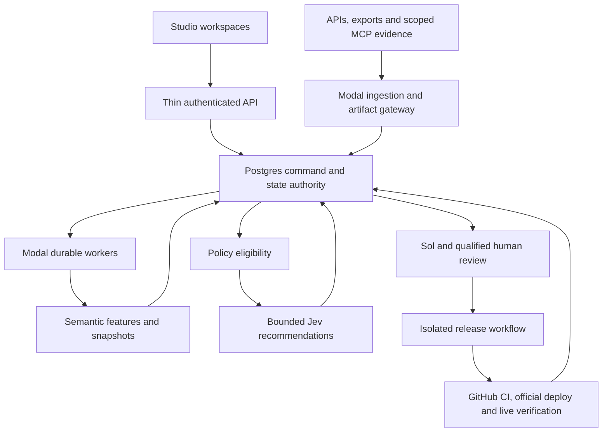

# Content Studio Revamp Implementation Blueprint

**Version CS-2026.09.22.6 / blueprint 1.0 · Design handoff; implementation blocked.**

> For agentic workers: preserve the existing Sol → Remote Desktop Commander → ds → authorized executor contract. DeepSeek is the design default; Grok or another executor requires an explicit packet grant and verified availability. Do not replace the harness. Use the execution-plan workflow task by task after program and A0 gates close. This blueprint authorizes no implementation, provider connection, schema application, outreach, merge or deployment.

**Goal:** build an evidence-governed SEO operating system that chooses useful interventions across YouSafe's estate, publishes safely, directs readers to relevant Marketplace supply and measures mature outcomes.

**Architecture:** Alternative 2 strangler migration. Preserve current ownership, evidence, phase and publication invariants; move compute to Modal behind Postgres durable commands; introduce a small Semantic Fabric and bounded Jev decisions; cut over one authority at a time.

**Tech stack:** existing TypeScript/Next.js/OpenNext control UI; Supabase/Postgres private control state; Modal Python orchestration with pinned Node domain executables; TypeSafe Jev over HTTPS; existing GitHub Actions deployment. Current versions, extensions, credentials, account limits and exact workflow IDs are discovered in A0 and committed as verified non-secret configuration.

**Normative spec:** `docs/superpowers/specs/2026-09-22-content-studio-revamp-architecture.md`, CS-2026.09.22.6. This blueprint is its implementation companion, not a second architecture. Registry interfaces are defined in the spec and imported/generated, never independently rewritten here.

## 1. Authority, evidence and start condition

Read in order: current authorization, applicable AGENTS.md, Supervisor Arc 33465, SEO Brief 34332, current main parity matrix, canonical architecture, this blueprint, then only the current packet's source files. The audit read main `4b0a310f22a43e532c2f16ce08df3897d760caf4`: P0–P8 recorded PASS; P9/P10/P11 IN_PROGRESS; P12/P13 PENDING. P9 has zero verified wins; P10's deployed instrumentation is not its real-outcome gate. Re-pin on execution start; do not reuse this snapshot as a live unlock.

- [ ] Sol verifies the canonical SEO program has closed its remaining gates and explicitly opens Studio implementation.
- [ ] A0.1–A0.7 produce the evidence listed below; downstream packets wait for their actual dependencies.
- [ ] Every production mutation has its own scoped authorization, exact-head review/checks and official workflow.
- [ ] Broad CREATE remains frozen until the program's cluster authorization and per-action checks allow it.

No synthetic event/backlink, model assertion, browser badge or handoff summary closes a phase. Design approval is separate from operational approval. Unavailable capabilities are `BLOCKED_CONFIGURATION` with a recovery owner; they are never guessed. No automatic paid upgrade.

**Review focus:** a valid-looking stale object; two concurrent writers for one intent; external success followed by local timeout; a current-looking wrong-jurisdiction fact; a provider outage misreported as zero. Packets below test each explicitly.

## 2. Service topology and trust boundaries

| Component | Authority / permitted credentials | Forbidden behavior |
|---|---|---|
| Browser | Operator session; bounded projections; scoped short-lived artifact grant | Service role, provider key, policy mutation, trusted hash issuance, full-estate hydration |
| Edge API | Verify operator/project role; bounded command validation; narrowly granted DB transitions/read views | Crawling, model calls, parsing large documents, graph scans, CI waits, Modal job lifetime, Git writes |
| Postgres control kernel | Current authority epochs, ownership/reservations, sealed contracts, reviewer checks, run/lease/fence, outbox, budget reservations | Treating an arbitrary JSON payload as permission; network calls under locks |
| Modal ingestion/compute | Per-source scoped read credentials; immutable artifacts; restricted stage RPCs | Merge/deploy keys, broad service-role writes, self-issued gates/credentials |
| Artifact gateway | Upload/download capability validation; quarantine and sealed object access; artifact publication RPC | Public Volume mount, arbitrary path access, trusted content from unverified bytes |
| Jev adapter | TypeSafe key, compact approved state, request budget; write immutable decision record | Legal truth, ownership assignment, tool acquisition, direct execution/release |
| Human review | Authenticated human principal with verified jurisdiction/remit credential | Model/service principal impersonation; inherited approval after changed bytes |
| Release workflow | Protected GitHub environment + installation-scoped App key; permit transition role | Model-selected credentials, direct-main content writes, candidate modification after review |
| Independent verifier | Bounded public fetch and provider deployment read credentials | Trusting a webhook or successful job as proof of live content |

A0 chooses the exact network endpoints and credentials from real account evidence. The production ingestion plane uses service credentials and works without a chat or Mac session. MCP is the scoped agent investigation plane; its results cross the same validation/evidence boundary. Chat connector access is not inherited by ds or Modal.

## 3. Proposed module/file map

These are target paths to create after A0; existing paths in the right column are verified migration inputs, not instructions to overwrite them blindly. Any conflicting target path is resolved in A0.4 with an explicit map before code is written.

| Target boundary | Target paths | Existing input / disposition |
|---|---|---|
| Generated contracts | `lib/contentStudioV3/contracts/{registry,schema,hashes}.ts`; `tests/content-studio-v3/contracts.test.ts` | Current V2 serializer/writing contracts; retain old decoder and golden fixtures |
| Pure policy and adapters | `lib/contentStudioV3/policy/{evaluate,actions,legacyAdapter}.ts` | `currentGate.ts`, `broadCreateFreeze.ts`, `ownership.ts`, `opportunityIdentity.ts`; wrap until proven successor |
| Durable transitions | `lib/contentStudioV3/runtime/{commands,transitions,events}.ts`; `tests/sql/content-studio-v3-runtime.sql` | Current execution lease RPCs and stage events; live application is A0 evidence |
| Ingestion | `workers/content_studio/sources/`; `lib/contentStudioV3/sources/{envelope,normalize}.ts` | Existing GSC/GA4/provider adapters; no replacement before fixture parity |
| Semantic compilation | `workers/content_studio/semantic/`; `lib/contentStudioV3/semantic/{identity,relations,features}.ts` | `seoEngine/ontology.ts`, `knowledge.ts`, `coverageIntent.ts`, `seoFactory/topicGraph.ts` |
| Jev boundary | `workers/content_studio/jev.py`; `lib/contentStudioV3/decisions/{project,validate,accept}.ts` | New bounded adapter; do not reuse unrelated prose-generation providers |
| Artifact gateway | `workers/content_studio/artifacts.py`; `lib/contentStudioV3/artifacts/{grants,manifest}.ts` | Existing artifact/proof hashes and V2 references |
| Reviewer/editor | `lib/contentStudioV3/editorial/{claims,reviews,invalidate}.ts` | Existing trust/source/rewrite/render audits; preserve P8 protections |
| UI | `app/dashboard/admin/content/` routes; `components/contentStudio/` scoped workspaces | `components/design/admin-content-studio.tsx`; incremental route cutover, not a giant replacement component |
| Release | `.github/workflows/content-studio-release.yml`; `scripts/content-studio/release.mjs`; `lib/contentStudioV3/release/` | `githubContentsCore.ts`, `ship.ts`, official `deploy.yml`; remove inline merge authority only after parity |
| Operations | `scripts/content-studio/{reconcile,verify-manifest}.mjs`; `docs/content-studio/runbooks/` | Existing retry/reconcile crons and source health, not duplicate schedulers |

All new worker images pin Python, Node, packages, model revisions, analyzer versions and lockfiles. Use the existing Node canonicalizer for sealed JSON; Python carries the sealed bytes. No circular dependency from an edge module into a worker package. Generated schema definitions are the source of truth for TS/JSON validation/UI registry; Python consumes validated serialized contracts.

## 4. Database design and schema mapping

Use the **existing Supabase project**, not a parallel estate database. A0 records its actual plan, size, extensions, grants, backup destination and migration ledger. Reuse/harden an existing table when it already owns the domain. The names below are the exact proposed logical target relations under private `studio_core`; A0's `schema-map.json` binds each logical name to one existing physical relation/view or one reviewed new relation. Missing mapping blocks dependent code. Do not create both an authoritative old table and an authoritative new equivalent.

Common types: IDs `uuid`; versions/fences/sequences `bigint CHECK(value>=0)`; instants `timestamptz`; hashes `text CHECK(... ~ '^[0-9a-f]{64}$')`; monetary storage `numeric(20,8)` plus ISO currency; bytes/tokens `bigint CHECK(value>=0)`; probabilities finite double in [0,1]; ratios retain numerator/denominator. PostgreSQL JSON numbers and SQL checks must reject non-finite/cast shortcuts. Every table has `project_id`; all domain FKs include it. All payload JSON is validated against the pinned generated schema and its scalar identity columns.

`H` = immutable history (INSERT only to application roles); `P` = bounded current projection/state (UPDATE only through version/fence-checked transition); `R` = configuration registry promoted by reviewed change. Default delete is RESTRICT. Referential tombstones preserve history. `project_id` is joined to the existing authorized project registry; a request-supplied project ID alone grants nothing.

| Logical relation | Required columns beyond common project scope | Keys / constraints / principal indexes | Kind and first packet |
|---|---|---|---|
| authority_domains | domain text, epoch bigint, active_adapter text, schema_version, cutover_record_id | PK(project,domain); epoch only increases | P, A1 |
| authority_events | event_id, domain, from_epoch, to_epoch, actor_id, reason, evidence_ref, created_at | PK(project,event); UNIQUE(project,domain,to_epoch); FK domain | H, A1 |
| estate_repositories / estate_hosts | repository_id, provider_repo_id, full_name, protected_branch; host_id, ascii_host, repo_id, target_adapter_id | PK per ID; UNIQUE(project,host); repo FK; exact workflow/project IDs in validated payload | R/P, A0/A1 |
| estate_routes | route_id, host_id, exact_path, route_kind, lifecycle, current_revision_id, canonical_route_id, row_version | UNIQUE(project,host,exact_path); path normalization version; alias/tombstone retained; canonical FK same project | P, A1 |
| intent_owners | intent_key text, intent_id, route_id, owner_version, authority_epoch | PK(project,intent_key); one current primary owner across hosts; route/intent FKs; supporting links elsewhere | P, A1; existing authority first |
| reservations | reservation_id, key_kind intent/route, reservation_key, run_id, state, expires_at, fence, owner_version | Partial UNIQUE(project,key_kind,reservation_key) WHERE state='held'; do not use now() in index predicate; release expiry under lock; permanent owner check in same transaction | P, A1 |
| source_bindings / source_runs | binding_id, adapter/schema version, account/property scope, secret_ref, quota policy; source_run_id, binding_id, window, cursor, watermarks, coverage, health, artifact_id | PK IDs; binding/run FK; UNIQUE(project,binding,request_key); source-run completion immutable event | R/P, A2 |
| artifacts / artifact_locations | artifact_id, byte_digest, bytes, MIME, retention class, status; location_id, artifact_id, volume/version/path, upload_id, readback_receipt | UNIQUE(project,digest,MIME) logical manifest; unique upload path; READY requires verified receipt; latest pointer is DB-only | P + H receipts, A2 |
| artifact_refs | ref_id, artifact_id, consumer_kind, consumer_id, consumer_version, hold_until, legal_hold | Indexed(project,artifact_id); FK actual consumer through validated typed reference mapping; GC cannot rely on an unvalidated JSON reference | H/current hold projection, A2 |
| observations | observation_id, subject kind/id, metric_key, definition_version, source_run_id, scope_hash, effective_window, observed_at, envelope | PK(project,observation); UNIQUE(project,source_run,provider_row_key,definition); FK source/artifact; index(subject,metric,window_end DESC) | H, A2 |
| metric_current | subject, metric_key, scope_hash, observation_id, projection_version, source_watermark | PK(project,subject,metric,scope); CAS rejects late/stale observations; never MAX(ingested_at) alone | P, A2 |
| runs / stages / attempts | normative Run/Stage/Attempt fields plus authority_epoch and timestamps | UNIQUE(project,actor_scope,idempotency_key) on runs; UNIQUE(project,run,stage,input_hash,policy_version); attempt FK stage; UNIQUE(project,stage,fence) | P/H, A2 |
| outbox / inbox_receipts | event_id, aggregate_id, aggregate_sequence, type, payload_ref, delivery state/lease; consumer, event_id, receipt | UNIQUE(project,aggregate,sequence); UNIQUE(project,consumer,event); partial pending index on next_attempt_at; receipt != completion | P/H, A2 |
| checkpoints | checkpoint_id, stage_id, fence, input_hash, artifact_id, producer_version, created_at | UNIQUE(project,stage,fence,checkpoint_sequence); only current fence publishes; artifact FK READY | H, A2 |
| budget_accounts / budget_reservations / cost_events | month/provider/currency, cap/reserve/uncertainty/spend_state; reservation_id, attempt_id, upper_bound; cost_id, physical_call_id, amount or unknown estimate | Account row locked for admission; unique physical cost event source; unknown charges remain reserved; cost and business dedupe keys differ | P/H, A2 |
| vocabularies | registry_kind, key, version, validated definition, active flag | PK(project,kind,key,version); predicate/relation definitions include types/scope/cardinality | R, A3 |
| entities / entity_aliases | entity_id, namespace, authoritative_external_id, version, payload; alias_id, normalized_text, original_text, namespace, jurisdiction, language, resolution | External ID unique only in namespace; aliases may have multiple unresolved candidates; exact indexed scoped lookup | H + P current, A3 |
| intents / identity_versions | intent_id, stable_key, current_identity_version; identity_version_id, semantic payload/hash, approved_at | Stable key excludes evidence/model/clock; UNIQUE approved resolved key; unknown scope cannot claim owner | H/P, A3 |
| queries / query_family_versions / family_memberships | query_id, raw/normalized text, language; family/version, reader_job_id; query_id,family_version,role,resolution | Query normalization version explicit; memberships many-to-many candidates, one resolved owner-bearing interpretation per scope; dedupe metrics by observation | H/P, A3 |
| document_revisions / answer_units / claims | document_id, revision_id, source/route ID, artifact_id, parser_version; unit_id, revision_id, locator, text_hash; claim_id, revision, locator, claim_hash, risk | Revision artifact immutable; child FK revision; exact locators reference original bytes and parser | H, A3/A4 |
| fact_assertions / fact_evidence / claim_support | fact_id/version, subject,predicate/version,value,qualifiers,recorded_at,valid_interval; fact_version,source_passage,stance; claim_version,fact_version,support_fingerprint | Entity/claim/passage FKs; contradictory assertions coexist; current selected single-value projection respects full scope and interval | H, A3/A4 |
| semantic_relations | relation_id/version, relation_type/version, subject_kind/id, object_kind/id, scope, authority, health, validity, evidence | Endpoint kinds validated by registry and typed FK mapping; unique edge version; owner relations are views only | H + P eligible current, A3 |
| semantic_spaces / semantic_vectors | space_id, exact model/preprocess/tokenizer/dimension/distance; vector_id, space_id, segment_version, text_hash, vector | UNIQUE(project,space,segment_version); dimensions/finite/nonzero vector validated; current scope index; space-mismatched query refused | R/derivative, A3 |
| feature_snapshots / gain_assessments | feature_set_id, subject_revision, source_snapshot_hash, recipe_version, artifact_id; gain payload with compared owner revisions and complete/unknown units | Unique input/recipe hash; source lineage FKs; cannot become owner table | H, A3 |
| opportunities | opportunity_id/version, identity_id, subject_id, problem, policy snapshot, feature/gain refs, status, priority vector | One active natural opportunity key per project/identity/problem/cohort; state CAS; one authoritative queue | P + H events, A3 |
| decision_requests / decision_records / decision_acceptances | request_id/state hash/family/rubric/input artifact; normative DecisionRecord; acceptance_id,decision_id,current validity hash,mode/actor/reason | Request dedupe exact state/task/config; records immutable; acceptance CAS checks epoch/versions; separate inference result from effect | H, A3 |
| decision_rubrics / calibration_versions / decision_cache | rubric family/version/choices/required features; calibration dataset/thresholds/slices/holdout results; raw request hash→record expiry | Unique version; raw cache scoped project+model+exact request; acceptance cache also calibration/mode; no automatic promotion | R/P derivative, A3 |
| editorial_revisions / draft_chunks / contracts | revision_id, run_id, parent_version, body/render/claim hashes; draft_id,chunk_id,sequence,bytes,text; contract_id/schema/input refs/hash/sealed_at | CAS saves; bounded chunks; immutable sealed contracts; V2 linked not rewritten as V3 | H/P, A4 |
| reviewers / reviewer_credentials / review_approvals / approval_claims | human principal binding; credential/version/evidence/remit/validity/status; approval exact hashes/principal/credential; claim_id/version/hash | Machine roles denied INSERT approvals/credentials; FK credential version + exact revision/claim joins; revocation checked at consume | R/H, A4 |
| funnels | funnel_id/version, article_revision, next_reader_job, catalog_snapshot, exact target ID/path, fit evidence, valid_until | One primary contextual target per article revision; target active verified compatible supply; no guessed slug | H + P current, A3/A4 |
| release_candidates / release_permits / external_operations / release_events | immutable target/candidate/hash; normative permit; operation intent+marker+expected remote state; sequenced outcome receipts | UNIQUE(project,permit,purpose); unique external operation marker; consume+intent atomic; target generation monotonically increasing | H/P, A1/A6 |
| publication_proofs / desired_deployments | proof projection from release events; target_id,generation,expected_source_sha,desired_version | One desired generation per target; no old event overwrites newer deployment; append live evidence | P/H, A6 |
| interventions / observation_plans / rewards | accepted action/decision/baseline/forecast before execution; due window/owner/job ID; metric-definition refs/window/maturity/confounders/cost | Execution time nullable until real release; unique observation plan window; corrections/refunds append; predictions never reward | H/P, A6 |
| invalidation_events / dependency_edges | cause/object version/time; consumer-version→dependency-version + kind/fingerprint | Unique cause/consumer event; reverse dependency index; authorization rechecks current state even if outbox delayed | H, A1–A6 |

Names separated by slashes are separate typed relations, not one polymorphic table. Do not introduce every optional relation/edge at A3 launch: stage the mapped schema with the packet that first needs it. `PublicationProof` is a projection over receipts, not a second editable ledger. Existing `seo_cannibal_decisions`, `seo_interlinks`, backlink proof, writing contracts, reward and calibration history remain preserved authorities until their individual cutover.

### 4.1 Mandatory database constraints and privilege model

- Private schema, no anon/authenticated table grants; RLS enabled as defense in depth. Exposed projections use security-invoker behavior where verified, or stay private behind scoped APIs. No blanket `USING(true)` policy for control tables.
- Dedicated roles: `studio_reader` projections only; `studio_ingest` validated source/observation INSERT; `studio_worker` stage transitions/checkpoints only; `studio_policy` eligibility/sealing; `studio_review` human-authorized approval operation; `studio_release` permit/operation transitions. Each binds to allowed projects in service identity configuration. No generic `service_role` granted to arbitrary worker code.
- Machine credential possession cannot satisfy human principal authentication. A narrow trusted API checks the real operator role/principal and passes a verifiable scoped assertion; the DB validates the binding. Merely trusting `SET project_id` or client UUID is forbidden.
- Prefer invoker functions. A necessary definer function has fixed empty/restricted search_path, explicit project/actor/operation validation, no dynamic SQL, no PUBLIC execute, reviewed owner/grants and adversarial calls. Service identities use service authorization, not fake `auth.uid()` human rows.
- All unique nullable scope dimensions have an explicit non-null canonical scope key or tested NULLS NOT DISTINCT semantics supported by the installed version. Unknown scope never reserves a real global intent.
- PK/FK project equality and index shapes are tested using two projects. Required indexes cover FK deletes/reconciliation, pending queue scans and bounded projections; add ANN/partitioning only after measured plans justify it.
- Migration files are generated using the repository's verified migration tooling, appended after the frozen baseline, and inspected against the live ledger. No placeholder migration filename is committed. Schema deployment is separately reviewed from behavior activation.

### 4.2 Transition algorithm: the order is part of the contract

~~~text
admitCommand(actor, project, command, expectedVersions, idempotencyKey):
  authorize actor/project; validate bounded typed input
  begin transaction
  lock authority domain; compare current epoch and required versions
  return existing run if identical idempotency key + request hash
  reject same key + different request hash
  lock relevant owner and reservation keys in stable order
  expire proven expired HELD reservations under the same locks
  enforce phase/action eligibility and live-owner/reservation conflict rules
  reserve approved budget if this command requires immediate dispatch
  insert run + initial stage + event/outbox (+ intent/route reservation)
  commit
  return 202 {runId, state, nextPollAfterMs}

commitStage(identity, output):
  require artifact READY receipt where output references bytes
  begin; lock authority domain then stage in documented common lock order
  obtain DB current time after locking; check epoch + fence + lease + input hash
  reject cancelled/superseded/schema-incompatible attempt
  insert checkpoint + next-stage/outbox + sequenced event atomically
  update current projection with expected version; commit
~~~

Use a **single documented global lock order** across all RPCs: authority domain → owner/reservation keys → run → stage → budget/permit/operation (only those needed). No endpoint is allowed to reverse this order. Queue claim uses SKIP LOCKED; permission checks never treat a skipped row as absent. A paused old attempt cannot renew/release/complete the successor's lease. Retries use fresh attempts with increasing fences, not rewritten history.

## 5. Semantic Fabric: minimum useful implementation

### 5.1 Identity, facts, graph and information gain

Stable entity/intent IDs are independent of labels, embeddings and evidence versions. Resolve exact authoritative identifiers, then scoped aliases, then candidate semantics. Same-number fixtures include US I-485 versus Australian subclass 485; also ambiguous country/visa acronyms and institutions with repeated names. Unknown jurisdiction remains unresolved and can block a relevant collision review; it is not silently discarded.

Fact assertions store exact source passage, extraction version, support/contradiction stance, recorded time, legal-valid interval, precision/timezone, jurisdiction, program, audience and typed units. A later publication about a future rule does not replace the current rule. Domain reviewers resolve consequential conflicts; a model cannot choose the legally true assertion.

First graph joins: alias→entity; intent→reader job; query→family; owner→intent; revision→unit→claim→fact→passage; reviewer approval→exact claims; article→funnel→catalog offer. Each relation registry entry defines endpoints, direction, authority and validity. No graph database, automatic ontology induction or graph embedding is required.

Information gain is a **checklist**, not a Google score. For every proposed answer unit record: question/reader task, jurisdiction/time scope, primary evidence, whether each current owner satisfies it, and status `SUPPORTED_NEW`, `ALREADY_SERVED`, `UNSUPPORTED`, `UNKNOWN`. Bind comparison to exact proposed/owner revisions and inventory coverage. Missing owner text/coverage cannot count as novelty. A distinct new reader job plus support is only one prerequisite for CREATE; prefer expanding the existing owner when it serves that job.

### 5.2 Retrieval and model-space migration

Launch with a current-corpus lexical/identity baseline. Add one purpose representation per current page and approved query family; then selective answer-unit and verified-offer representations if benchmark gains justify them. Retain complete claims/sources even when they have no embeddings. Use one approved model/representation space; dimensions, normalization, prefixes, tokenizer and chunk policy are part of its identity.

Hot vectors are a measured derivative pgvector table in Postgres; bulk snapshots stay on Volume. Exact asynchronous search is the baseline. If ANN is justified, benchmark filtered recall against exact results and keep deterministic owner/reservation/conflict candidates in the mandatory set. Search all relevant estate hosts for collisions. Wrong-space comparison, missing coverage, zero vectors and exhausted budgets return explicit incomplete state.

Model upgrade: create new space → embed representative labelled cohort → measure recall, wrong-scope errors, cost and latency → backfill the full chosen current cohort → verify manifest completion → switch one read alias by epoch → retain old snapshot for a defined rollback period → safely reclaim derivatives. In-flight runs retain their pinned space or are explicitly superseded; never mix spaces to fill missing rows.

### 5.3 Invalidation without graph overbuild

Indexed reverse dependency joins and outbox jobs are sufficient. A changed support fingerprint invalidates dependent claims/contracts/approvals and unused permits; unchanged unrelated page chrome does not invent a new fact. Revalidation records fresh retrieval independently of content equality. Ontology label-only changes differ from identity/predicate meaning changes; the latter require owner/gate re-evaluation without automatically reassigning owners. Permit consumption synchronously checks current dependency versions even when invalidation delivery is late.

## 6. Jev: exact bounded decision design

### 6.1 Input/answer and data consumption

Consume the spec's `DecisionState/2`, not raw crawled pages or full source exports. The source run produces observations → deterministic reconciliation → semantic feature artifact → policy eligible set → task projector → Jev. IDs/hashes support lineage; **short reader-job/purpose/answer-unit descriptions carry meaning**. Do not give Jev only anonymous similarity numbers.

Common required feature keys are closed per rubric: `mission_fit`, `jurisdiction_match`, `temporal_match`, `owner_present`, `owner_current`, `collision_review_complete`, `required_evidence_current`, `critical_contradiction`, `review_requirement_known`, `inventory_complete`. Task-specific keys below add to that registry. Every feature has status, scope, units, window, validity and observation IDs; computed comparisons are made in deterministic code. Null required input means no provider call.

| Family | Extra input | Choice set and rubric | Permitted consequence |
|---|---|---|---|
| D0_RELATION | Exactly two named meanings; entity/job/unit overlap; known scope agreement | SAME_READER_JOB: substitutes for the same scoped task; SUPPORTING_SUBINTENT: complementary narrower task; DISTINCT_INTENT: independently useful different task; WRONG_SCOPE: incompatible scope; AMBIGUOUS: insufficient distinguishing evidence | Candidate relation/conflict review only; never identity merge/owner assignment |
| D1_DIAGNOSIS | Unresolved findings; technical/index state; query window, coverage deficit, source freshness, internal/external link proof, CTR context, funnel health | MISSING_ANSWER, STALE_FACT, TECHNICAL_EXCLUSION, OWNER_COLLISION, WEAK_INTERNAL_AUTHORITY, WEAK_EXTERNAL_AUTHORITY, CTR_PACKAGING, COMMERCIAL_PATH, INSUFFICIENT_EVIDENCE, OTHER/ESCALATE | Select next hypothesis to investigate. Known deterministic defects are already facts; multiple defects remain visible |
| D2_INTERVENTION | Accepted diagnosis refs; exact eligible actions; supported unit delta; owner coverage; observation maturity; cost/benefit evidence | Only §15.2 canonical actions. Expand/refresh an existing appropriate owner; research unsupported gaps; observe immature change; no action only when evidence supports inaction. Consolidate opens human review; CREATE subtypes absent when frozen | Recommendation passed through current policy and required review; no direct dispatch permission |
| D6_FUNNEL | Article next job plus 2–5 already verified compatible offers, catalog snapshot and exact IDs | Each offer ID describes its actual capability; ABSTAIN means no clearly suitable option. No generated URL/slug/price | Recommend among eligible targets. Zero supply blocks; one proven fit uses deterministic selection |

D3 priority, D4 executor routing and D5 abstention are deterministic in v6. Priority lanes: active trust/technical incident → due evidence/release/observation work → ready useful interventions → optional exploration. Sort each lane by approved due time, evidence-supported band, cost class and stable ID. Commercial opportunity cannot outweigh a legal/trust failure. The approved portfolio has explicit capacity reservations and cannot starve observation debt.

TypeSafe adapter sends `state`, pinned `model`, and `questions` with explicit Choice instructions/criteria through the documented endpoint. It expects the same question keys, exact label set, finite probabilities [0,1] summing to one within 1e-6, a selected choice equal to an argmax, native confidence in [0,1], expected answer type and actual model ID. Reject extra/missing/unknown keys, model mismatch or malformed usage. Preserve raw response in a private artifact and `DecisionRecord/2`; no response means null returned model/answer, not a fabricated distribution. Native Score/Noul shapes are retained losslessly if tested in shadow; no operational action family uses them initially.

### 6.2 Cadence, concurrency, cache and failure

Design defaults from the canonical spec: max 16 KiB state and 4,096 input tokens, 64 features, six subjects, 32 short answer units; one subject/task per call; at most two independent questions against that same state. If D2 needs D1 output, persist D1 then build a separate D2 request. Do not infer dependencies between questions evaluated in parallel.

Routine material-change events debounce 5 minutes; immediate trust/owner invalidation never waits. Daily reconciliation finds missed events. Cache unchanged canonical state; no inference on UI poll. Two in-flight calls/project, four globally, max 60 calls/minute or lower verified quota. A shared durable admission semaphore/token budget governs all containers, not one semaphore per process.

One retry owner: up to three attempts, 10 seconds per attempt, 45 seconds overall; honor Retry-After by persisting next-attempt time if it would exceed the current worker deadline. No nested SDK retries. Auth/schema/model mismatch is terminal; transient 429/529/5xx/network failures may retry. Five transient failures/60s open a five-minute optional-call circuit; one bounded probe closes it. Unknown usage retains its cost reservation.

Raw inference cache = project + exact canonical request/choice order + adapter/model pin + state/input/rubric hashes. Interpretation cache additionally includes calibration/mode. TTL ≤24h, D6 ≤15min, always shorter than input/source/supply validity. Fresh current-state checks precede acceptance of every cache hit. Changed eligible set, owner, policy, source or subject makes a miss/superseded result. Provider failures never become cached NO_ACTION.

Fallback is deterministic safe work, queued research or explicit human review under existing authority. No hidden switch to another provider. Missing applicable calibration means shadow/advisory, not invented certainty. Jev does not get tool credentials or publish authority at any promotion tier.

### 6.3 Calibration and outcome feedback

Store versioned rubric, feature-projector, model, ontology, language/domain slice and choice regime with each evaluation. Seed 500 labelled cases including 100 critical; partition related page/query/source groups together to prevent leakage, use time-separated tuning/holdout, and retain an untouched final set. Critical labels need independent qualified adjudication. One aggregate 500-case score does not validate four families and every jurisdiction.

Report confusion, false-safe/action counts, selective error interval, coverage/abstention, Brier/reliability where meaningful, provider failure, reviewer override and reversal. Proposed low-risk bounded-assist gate: zero observed critical false-safe cases, accepted-case one-sided 95% error upper bound≤1%, and useful benefit over deterministic baseline. With zero independent errors roughly 300 accepted cases are needed; 100 only bounds error near 2.95%. Try probability 0.85 / margin 0.20 as tuning starting points, not activation rules. Ties/OOD abstain. An unsupported slice stays advisory even if the overall benchmark is green.

Promotion is explicit SHADOW→ADVISORY→BOUNDED_ASSIST per slice; expansion requires separate Sol authorization. Critical false-safe, unknown model, changed rubric/features or breached error bound demotes. Expert labels, workflow acceptance and mature outcomes are distinct feedback streams. Do not fine-tune a vendor model the service does not offer to fine-tune; improve reviewed rubrics/projectors and downstream calibration instead. Never treat model choice probabilities as randomized selection probabilities or a forecast as reward.

## 7. Modal runtime, artifacts and economics

### 7.1 Function inventory and resource starting points

All values are proposed benchmark defaults, not observed account capabilities. One Modal app per environment, with separate secret/permission sets for ingress, compute and gateway; release keys live outside Modal. Python coordinates; pinned Node executables reuse domain validation/serialization. Environment/workspace IDs and image digests are A0 configuration.

| Function | Queue / compute class | Starting resource and bounds | Completion contract |
|---|---|---|---|
| dispatch_due | control / S0 | 0.125 physical CPU, 256MiB, 30s; batch25; singleton DB lease; min warm0 | Claim+commit then spawn; store external call ID; no wait for full workload |
| reconcile_runs | control / S0 | 0.25CPU, 512MiB, 60s; batch100 | Reconcile expired claims/uncertain jobs from durable state, no blind respawn |
| ingest_source | source-specific / S0 | 0.25CPU, 512MiB, 120s/page batch; per-source quota | Validated immutable raw artifact+complete pagination/watermark receipt |
| parse_and_normalize | analysis / S0 | 1CPU, 1GiB, 120s; decompressed10MiB/object default | Parser isolated; schema/source/locator/size receipt; invalid output quarantined |
| compile_semantics | analysis / S0/S3 by explicit operation | CPU1, memory1GiB, 120s; model stage separate if needed | Feature artifacts + identity/relation candidates, never owner writes |
| embed_batch | embedding / S1 | CPU baseline first; max128 segments or16k tokens; 300s | Space/text-hash manifest; GPU concurrency initially1 only after measured approval |
| rerank_batch | rerank / S2 | CPU1, 1GiB, 120s; ≤60 candidates/query | Components/ranking evidence; no direct gate output |
| decide_bounded | decision / S0 network I/O | 0.125CPU, 256MiB, overall45s; shared Jev limits | Exact typed decision/failure record and cost usage |
| editorial_transform | editorial / S3/S5 | Provider/API specific cap in packet; max2 revision loops | New immutable candidate revision; approvals invalidated |
| artifact_gateway | ingress/read / S0 | CPU0.25, 512MiB; stream bytes; max10MiB initial upload; low bounded concurrency | Commit/readback/READY publication; scoped grant only |
| verify_live | truth / S0 | CPU0.25, 512MiB, 60s; redirect≤5; bounded bytes | Independent HTTP/canonical/robots/body/CTA/source proof |
| collect_outcomes | source / S0 | Existing adapter page bounds and due-window cap | Mature/provisional/failed observations; no inferred impact |

Never launch a GPU for TypeSafe or ordinary API calls. S4 larger-local models are disabled by default; enable only with failed lower-tier evidence and measured cost/value. Provider/model/human availability is capability registry state, not a hardcoded promise. Timeouts reserve enough room to checkpoint. Long HTTP backoff is persisted/requeued rather than sleeping on billable containers.

### 7.2 Volume layout and publication

~~~text
/quarantine/<project>/<run>/<stage>/<attempt>/<upload-id>/payload
/sealed/<project>/<sha256-prefix>/<byte-sha256>/<upload-id>/payload
/derived/<project>/<recipe-version>/<input-hash>/<attempt-id>/payload
/spaces/<project>/<space-id>/<snapshot-id>/<shard-id>
/manifests/<project>/<export-id>/manifest.json
~~~

These paths are immutable upload-specific storage locations, not ownership/lock/policy state. One DB manifest chooses the canonical location. Evidence/proof uses commissioned Volume v1 with independent backups; optional v2 holds rebuildable caches only while its documented Beta limitation remains. Explicit commit → independent reload/read/hash → READY transaction precedes every checkpoint. A file close, local rename or function return alone is insufficient.

Gateway grants include principal/project/upload-or-artifact/operation/size/MIME/expiry/nonce; no arbitrary filesystem path in client input. Downloads select only READY manifests after authorization. No browser workspace key. No assumption Volumes implement S3 presigned URLs. If storage/gateway is unavailable, draft chunks in T1 remain editable, while research/sealed artifact previews show unavailable honestly.

Retention defaults for review: transient48h; rebuildable derived30d; inactive vector rollback snapshots14d; raw provider/competitor captures30d or shorter license requirement; source/review/release proof retained per approved audit schedule. Active references/legal holds override optional cleanup; mandatory deletion restrictions take precedence with explicit tombstones and impact assessment. GC uses mark→grace→recheck→delete→receipt; manifests/backups must be reconciled. No blind directory age deletion.

### 7.3 Budget formula and control

~~~text
attempt_upper_bound = cpu_seconds×cpu_rate + gib_seconds×memory_rate
                    + gpu_seconds×gpu_rate + model/provider_cost
                    + external_egress_cost + storage_exposure + uncertainty
admit iff approved cap - observed_or_reserved_spend - in_flight_reservations
         >= attempt_upper_bound + protected_reserve
~~~

Version the verified rate card and billing period; keep physical-core units distinct from vCPU. Every physical retry/duplicate computation costs money even if its business result deduplicates. Reserve before spawn; reconcile after recorded usage; orphan/unknown charges stay reserved. Initial $30 verified-credit proposal: $21 optional +$6 mandatory +$3 uncertainty; optional per-job upper estimate≤$0.50. Unset account/provider cap means disabled, not unlimited. Jev/DataForSEO/TinyFish costs are separate budgets.

Min warm containers0; benchmark cold starts rather than assume warm operation is free. Starter billing APIs may be unavailable: use instrumented conservative estimates plus a dated dashboard reconciliation and provider-level budget controls where actually supported. Optional work pauses when billing evidence is stale >24h, forecasts breach cap, DB reaches75%, or artifact headroom fails. At85% DB occupancy reject new bulk jobs; never delete audit truth silently. Full budget exhaustion blocks dependent releases when freshness cannot be maintained; reserves are finite, not an uptime guarantee.

Modal egress charging announced for 2026-10-01 must be included in forecasts; external backups/API uploads can incur egress. Revalidate all allowance facts in A0. A free-first database plus free compute credit is a constrained launch configuration, not a guarantee of unlimited free estate history.

## 8. Source adapters, MCP wiring and estate consumption

### 8.1 One ingestion contract

Every adapter implements the same internal boundary; these are YouSafe methods, not invented vendor methods:

~~~typescript
interface SourceCursor { bindingId: string; cursor: string | null; windowStart: string; windowEnd: string }
interface RawPage { requestKey: string; artifactId: string; nextCursor: string | null;
  itemCount: number; providerReportedTotal: number | null; complete: boolean }
interface SourceAdapter {
  probe(bindingId: string): Promise<{accountScope: string; schemaHash: string; capabilities: string[]}>;
  fetchPage(cursor: SourceCursor): Promise<RawPage>;
  normalize(sourceRunId: string, artifactId: string): Promise<{observationIds: string[]; rejectedRows: number}>;
  reconcile(sourceRunId: string): Promise<{health: "ok"|"empty"|"partial"|"failed"|"unavailable"; watermark: string|null}>;
}
~~~

Before activation, the probe proves account/property/site identity, permitted fields, pagination, quota/cost, rate-limit behavior, retention/license and actual schema. A fetch page is durably stored before cursor advancement. Normalization validates types/units/scope and preserves provider row identity. Reconciliation records fetched coverage, omitted/suppressed rows, provider lag and terminal pagination. A successful HTTP200 with partial rows is not a complete estate snapshot.

Raw data is neither copied into prompts nor written over canonical owners. Compile a new source-run snapshot; update only eligible current projections; emit material-change events; derive query families/coverage/opportunities; seal a reproducible estate snapshot. Every dashboard and decision shows which sources/windows/scopes are present or missing. Optional provider failure blocks only dependent work; required owner/YMYL/release evidence fails closed.

### 8.2 Adapter matrix

Cadences are proposed launch policies, constrained by verified quotas and budget. Direct API/export is the production method. MCP tool names are discovered, not guessed.

| Source | Auth/acquisition and exact grain | Ingestion cadence / completeness rule | Consumption and permitted target |
|---|---|---|---|
| GSC | OAuth/service identity with actual verified property access; Search Analytics query×page×date with country/device/search type; URL Inspection only where entitlement/quota allows | Daily settled-window pull plus rolling16-day correction window; partition requested dimensions and paginate; record anonymization/top-row limits, never call query coverage complete merely because pagination ended | First-party demand/CTR/near-wins/cannibalization and index evidence; immutable observations → family/route projections; no inferred query→individual conversion |
| GA4 | Read-only property credential; Data API with pinned dimensions/metrics and reporting timezone; permitted consented aggregate events | Daily previous complete days plus7-day correction pull; report thresholds/sampling/metadata and property filters | Landing/task engagement/conversion cohorts; rate definitions pinned; no fake search-engine dwell time; P10 business proof still server-observed |
| Marketplace/business ledger | Restricted current catalog/category/provider/product IDs and order/payment/refund event evidence | Catalog event+hourly reconciliation; revalidate selected target immediately before release; webhook dedupe plus ledger reconciliation | Real supply, immutable slugs, capability/jurisdiction, lead/order proof, refund-adjusted outcomes. No Studio-created gig, price or availability |
| Ahrefs | Commissioned official API plan or validated export; keyword/location/time and backlink referring URL/target | Weekly selected clusters; targeted refresh on validated material change; provider limitations explicit | Demand/competition estimates and backlink leads. Third-party metrics remain separately labelled; live verified link required for P9 won |
| Ubersuggest | Authorized CSV/export ingestion; uploaded by operator through gateway; no assumed API/webhook | Monthly/on-demand, file hash, export window, locale and column/schema validation | Supplemental estimates/topic candidates; stale/missing export stays unavailable; never scrape authenticated UI as a hidden scheduled API |
| DataForSEO | Direct credentialed API task submission/result polling off-edge; persist provider task ID before retries; official MCP only for scoped agent work | Weekly priority SERP/keyword/competitor cohort and on-demand gaps; item/page completeness and per-task cost reservation | SERP cohort, intent/format/gap candidates and independent provider estimates; no competitor claim promoted to legal fact |
| Bing Webmaster | Actual verified site with OAuth or approved key; supported API methods discovered/pinned | Daily selected search/index reports; account/site coverage explicit | Independent Bing observations and URL/site status; separate from Google indices |
| IndexNow | Host-ownership key and approved submission endpoint; send only verified published/changed canonical URLs | Outbox after live proof; dedupe URL+revision; bounded batches within current protocol limit; reconcile receipt | Discovery notification receipt only. Receipt is never crawl/index/rank success; Google index claims require Google evidence |
| TinyFish | Commissioned REST credential in production; official OAuth MCP in agent plane; allowlisted task/network scope | Event/on-demand +weekly competitor cohort; raw retrieval/redirect/time/bytes/schema receipt | Rendered competitor topic/answer-unit extraction and current-page checks. Untrusted data, never tool/policy instructions or claim authority |
| GitHub | Installation-scoped read identity for inventory; webhooks signature/replay checked; branch/commit/tree/blob inventory | Event+hourly missed-event reconciliation+nightly complete manifest | Exact repo/file/route/build ownership, expected base, CI and release lineage. Branch source ≠ deployed source |
| Live estate/Cloudflare | Bounded independent HTTP crawls plus least-privilege deployment/telemetry reads | Deploy verification; daily critical route checks; weekly full scoped inventory within quota | Actual status/canonical/robots/body/cache/source/CTA, 1102/CPU/memory signals. Source manifest, deployment and live state recorded separately |
| Primary authorities | Allowlisted official publishers, dated documents/passages and qualified reviewer records | Risk-based24h/7d/30d release freshness from spec; immediate known change invalidation | Claims/facts/effective dates/YMYL proof. Source prestige without supporting passage is insufficient |
| Google Ads / optional social/CMS | Authorized official estimates or supported export; per-source definitions/permissions | Only if commissioned and justified by a decision use | Supplemental CPC/search-volume or measurable shares/comments; no mandatory fabricated value when unavailable |

GSC/GA4/Bing/SEO-vendor scope and definitions must match before comparison. Do not average incompatible keyword-difficulty scales, sum shared upstream estimates as independent demand, or join aggregate query data to identifiable visitors. Session continuity is not acquisition truth: retain `attributed`, `session_only`, `unknown_source` and actual consent as established by P10. Browser code cannot create `order_paid`.

All 50 requested variable keys remain in the normative registry and strict snapshot even when unavailable. Artifact diagnostics derive from exact main-content AST; source estimates stay labelled; editorial judgments retain reviewer/method; outcomes require published cohorts/windows. `lsiKeyword` is a compatibility label for related terms, not a claim that LSI is Google's mechanism. Keyword density/counts/readability are diagnostics, never targets that override usefulness. Title/meta lengths are display checks, not fixed ranking rules. Unobservable dwell time/search-result counts remain unavailable rather than proxies mislabelled as exact values.

### 8.3 MCP commissioning and use

For each `IntegrationBinding`: approved provider/server origin, transport, pinned package/image or verified URL, secret reference, executor host, account/property/repo scope, negotiated protocol version, discovered tools/schema hashes, allowed operations, timeout, rate/cost cap, data rights and last valid probe.

Order: verify official source → configure only the authorized existing ds client → initialize/tools-list → persist schemas → bounded read probe on known authorized resource → validate/ingest into source envelope → compare with direct API/export fixture → test expiry/schema drift/pagination/timeout/unauthorized write → Sol enables the binding. Tool discovery cannot grant a write; retrieved content cannot change the tool allowlist. Production credentials never copy chat OAuth tokens. No generic agent MCP proxy sits inside the Worker.

Each MCP observation carries tool/server/schema version, input hash, output artifact, actual account scope, timestamp and source-run ID. A conversational answer or tool success without saved provenance cannot satisfy a gate. Schema changes disable the affected adapter until fixtures pass under a new version.

### 8.4 Estate completeness and publish targets

Estate snapshot = union of Git manifests, actual catalog/CMS, deployed sitemap/crawl, GSC/Bing discovered URLs, redirects/aliases/tombstones, planned/reserved URLs and open PRs. Each set has a watermark and coverage; disagreement opens drift work. A missing source does not remove its historical owners.

Every candidate carries exact repository, base branch/SHA, host, route, canonical, file/loader adapter, content format, permitted path, PR workflow/check identities, official deployment target and Marketplace target ID. Resolve through verified host/repo adapters: public apex/regional YouSafe repo, Caseworks legal repo, Portal/Market repo. Dynamic routes require the real loader contract, not an invented per-article file. A0 pins current paths/workflow IDs; an unresolved target is `BLOCKED_CONFIGURATION`.

Use one approved URL emitter. Published Marketplace slugs remain immutable and use existing `buildSlug`/`buildUniqueSlug` behavior only where authorized for new/draft catalog entries. Content Studio does not publish gigs. New editorial route normalization rejects traversal, encoded separators, controls, forbidden aliases and unsafe normalization changes; validate round-trip decoding and Unicode/case policy. Never sanitize a published slug at read time. `/marketplace` remains retired; `/templates` follows the established `/shop` alias contract. Category fallback cannot invent relevant supply.

One admission transaction checks exact route reservations, permanent owners, pending PRs and tombstones plus intent identity. Do not resolve editorial duplication with an arbitrary `-2` suffix. Cross-host/cross-jurisdiction semantic collision review follows the complete deterministic estate set before bounded vector candidates. Approved redirects/owner changes require a separate reviewed destructive-action contract and rollback proof.

## 9. Policy, editorial and YMYL ordering

The evaluator returns eligible and blocked actions with immutable evidence/input hash and reason codes. Order is fixed:

1. Actor/project/capability, schema and idempotency validity.
2. Current authority epoch and monotonic subject versions; no ambiguous migration authority.
3. Kill switches, required source/estate health, budget/admission capacity.
4. Program gates and cluster/action applicability; CREATE freeze before model selection.
5. Mission fit, resolved jurisdiction/entity/reader job, exact route/owner/reservation and collision completeness.
6. Supported information gain and baseline/observation plan; evidence/freshness/contradictions.
7. Actual relevant Marketplace supply and exact publication target.
8. Contract/revision/render integrity, source audit and qualified human review where consequential.
9. Purpose-specific release prerequisites, exact candidate checks and Sol authorization.
10. Atomic transition; later remote/deployment/live receipts cannot be manufactured by a prior gate.

FAIL/BLOCKED/expired/unknown prerequisites cannot be cleared by aggregate score or accepted exception. Exceptions remain scoped, expiring and authorized; they cannot override missing human review, ownership ambiguity, fabricated credentials or CREATE freeze. Old PASS records remain evidence history; current action eligibility is re-evaluated at claim, seal, rewrite, review, PR, merge and live acceptance.

Editorial sequence: evidence/claim map → sealed ContractV3 → pinned commissioned writer → deterministic/source/semantic audits → at most2 revision loops → rendered preview including renderer-added claims/sources → qualified human review → separate release. “Human-like” means useful, specific, coherent copy with truthful examples and experience; never fabricated testimonials, AI-detection evasion or invented expertise. Source contradictions and unsupported consequential claims block release.

Reviewer registration requires independently verified real principal/credential/remit and validity. Approval joins exact claim versions, body/render/source hashes and credential version. Any changed binding invalidates it. A revoked reviewer between approval and merge blocks even if an invalidation job has not run. Missing reviewer capacity queues work; it does not trigger AI self-approval. Ordinary formatting/grammar scores cannot satisfy a human slot.

## 10. Release, discovery and monotonic rollback

The separate protected release workflow reads candidate/permit by ID from Postgres. It verifies its own pinned workflow identity and narrowly scoped GitHub App installation. Research/writer/Modal credentials cannot merge. Existing Sol-operated official release remains authoritative until the new service proves parity.

1. Reserve route/intent; seal target/contract/revision/render and exact candidate tree/commit.
2. PREPARE_PR permit: current scope/review/source/owner validity; consume+record operation intent atomically **before** Git branch/PR publication. Candidate Git blob/tree construction is scoped preparation, not a merge permit.
3. Reconcile remote response; retain exact candidate/PR/base/hash lineage. Required CI checks must refer to that candidate, with trusted workflow identity.
4. After checks and Sol approval, issue fresh MERGE permit (proposed5-minute TTL). Recheck all mutable dependencies and protected-base/mergeability conditions; consume+record merge intent atomically; call merge with expected candidate SHA.
5. Timeout means uncertain: inspect exact remote repo/PR/head/marker/merge receipts. Never blindly replay or mint a new permit to bypass uncertainty.
6. Official main workflow deploys. Record source SHA, build/artifact/workflow/deployment IDs. Migration auto-apply is a separately reviewed production effect; DDL success and app compatibility are proven independently.
7. Independent public verifier fetches ordinary canonical URL, follows approved redirects, checks source/build marker and body digest, canonical/robots/status, sources, authorship/reviewer surface, internal links and exact CTA. Cached old bytes fail acceptance. Request provider purge/retry only through approved paths.
8. LIVE_VERIFIED queues permitted sitemap/discovery/IndexNow notifications; search indexing is later evidence. Observation jobs become scheduled only when actual durable schedule/run IDs exist.

One desired-deployment generation per target; older cancelled releases cannot redeploy over newer authorized ones. Reconcile cancel-in-progress and main-writer protection in A0. Automatic merging stays disabled if repository-side expected-base serialization cannot be proven. DB fencing alone cannot fence an independent GitHub writer.

Rollback advances authority/release epoch and follows reviewed Git revert/official deploy. Never roll back fences, consumed permits, reservations protecting live owners, evidence history, accepted external receipts or paid-business-event truth. Drain/fence affected runs; preserve successor-only state; prove old reader/schema compatibility. If old code lacks new gates, disable affected actions instead of re-enabling a bypass. Failures after actual publication trigger truthful correction/rollback records, not deletion of the evidence.

## 11. UI blueprint

Keep existing `/dashboard/admin/content` entry and deep-link compatibility. New workspaces load independently; legacy monolith remains available only for journeys not yet migrated and with the same backend policy. A read-only banner names any shadow capability. Operator-facing language describes evidence and the next action, not implementation jargon.

| Route suffix under `/dashboard/admin/content` | Page layout and main action | Projection / guard |
|---|---|---|
| `/` | Estate command centre: trust/source incidents, owned opportunities, due observations, active jobs; action “Investigate opportunity” | Counts include scoped denominator, missing sources and windows; no article quota |
| `/intelligence` | Query/family table with country/intent/host filters; owner/coverage drawer; bounded topical map | Server-paginated lists and ≤50-node neighborhood; full graph export asynchronous |
| `/opportunities/[id]` | Evidence left, eligible interventions centre, reasons/decision history right; compare expected reader benefit/cost | Model recommendation visually separate from policy permission; abstention and NO_ACTION available |
| `/research/[id]` | Claim/source/contradiction matrix; information-gain checklist; exact owner, target and funnel | Seal creates immutable version; missing evidence points to the affected claim |
| `/editor/[id]` | Outline/claims, draft, evidence/checks; tracked revision diff; autosave state | CAS saves; conflict recovery; no overwritten collaborator draft; render additions audited |
| `/review/[id]` | Exact rendered candidate, consequential claims first, credential/remit and changes since last approval | Approve/return only for qualified human role; changed bytes revoke eligibility |
| `/release/[id]` | PR diff/checks, purpose-specific permit, deployment generation and independent live proof cards | Separate states; stale/wrong SHA blocks; no “Published” on PR creation |
| `/outcomes` | Search/task/business cohort windows, backlink/live-link evidence, GEO coverage, experiment confounders | Provisional/mature/unknown clearly distinct; no single invented authority score |
| `/operations` | Source bindings/health, queues/fences, artifact capacity, billing freshness, calibrations and audit trail | Ordinary editor read-only; policy/config activation requires authorized reviewed change |

**Visual system:** restrained editorial workspace with warm neutral canvas, white surfaces, dark navy text, teal action accent; status uses icon+label+reason, never color alone. Use the existing app typeface if accessible; base16px, line-height1.5, 8px spacing scale,44px primary touch targets, visible focus and reduced motion. Verify WCAG2.2AA contrast with the final tokens rather than assuming it. Tables use clear columns, sticky labels and bounded horizontal scroll where necessary; empty/error/stale/partial/loading states have distinct copy.

Desktop≥1200px:240px navigation, flexible main,320px evidence drawer. Tablet768–1199px:collapsed navigation and toggled drawer. Mobile<768px:single column, Evidence/Draft/Checks tabs, persistent blocker summary and reachable primary action; no horizontal page overflow. Long editor tools never obscure mobile Safari composer/input above keyboard chrome. Test360px,390px,768px and1280px plus keyboard and screen-reader flows.

Pagination uses visible Previous/Next and numbered pages where the server can provide a reliable count/cursor map; never invent page totals or silently fetch all rows. Default25/max100. List JSON≤128KiB; no body text in overview. Lazy-load each route; initial Studio JS budget≤200KiB gzip excluding explicitly measured shared framework/auth, route chunk≤150KiB, total bytes also reported. No full semantic graph or giant intelligence object sent to browser.

One poll coordinator with cross-tab dedupe when supported: active5s briefly, then15/30s, idle60s, hidden pause, terminal stop, server backpressure; show last persisted event/stage/attempt/heartbeat and reconciliation need. SSE, if added, reads stored events only and needs its own measured resource budget. Worker receives no long-lived job ownership. Autosave sends≤48KiB chunks with expected revision; sealed render delivery uses gateway.

## 12. Observability, validation and outcome learning

Correlation chain: project→source_run→estate_snapshot→opportunity/version→decision→run/stage/attempt/fence→contract/revision→review→release/permit/operation→PR/SHA→deployment/generation→live_proof→observation/reward. Logs are structured and redact credentials, personal data and raw private queries where required. Operator errors expose stable reason/recovery codes, not raw provider responses.

Measure: edge route/build CPU p95/p99 and exceededCPU/exceededMemory/1102 separately from503 and wall time; account requests/day; payload/bundle bytes; queue age and dispatch lag; lease losses/retries/dead letters; artifact commit/readback/GC failures; DB size/index/lock time; source lag/completeness; Jev failure/abstention/calibration/margin; compute physical attempts/cost reservations; reviewer queue/invalidations; release uncertainty; stale deployed bytes; scheduler execution and observation debt. Missing telemetry is missing, never zero incidents.

Use the spec's measured CPU/memory/latency/canary budgets; stage load tests have a quota allowance and representative cold/auth/role/tenant distribution. A 1102-free demo is not a guarantee for all workloads. Signed-in admin, provider, client and other supported roles must be included, because auth/import cost can dominate even when the Studio handler is tiny.

| Test ID | Fault/input | Required result | Packet |
|---|---|---|---|
| T01 | Missing/stale phase, unknown owner, fabricated exception | Dependent action refused before inference/dispatch | A1 |
| T02 | Two jobs reserve same intent or equivalent route across hosts | One succeeds; other conflict; permanent owner still blocks after job closes | A1 |
| T03 | Duplicate command with same key/different bytes | Same bytes return same run; changed bytes409 | A2 |
| T04 | Crash before/after outbox commit, duplicate spawn, ABA lease | No lost acknowledged job; stale fence cannot commit/release successor | A2 |
| T05 | Volume commit missing, stale reader, corrupt hash, duplicate upload, GC race | No READY pointer/checkpoint; active proof never deleted | A2 |
| T06 | Modal/gateway outage during draft save/read | Bounded T1 draft still works; research artifacts honestly unavailable | A2/A5 |
| T07 | Worker transitive heavy import; large payload; polling storm; signed-in auth path | CI boundary fail or413/backpressure; measured resource and request budgets pass | A2/A5 |
| T08 | Wrong-jurisdiction485, future rule, contradictory source, ambiguous alias | Unknown/conflict retained; no automatic owner/legal truth | A3/A4 |
| T09 | Same dimensions/different embedding space, ANN filtered empty, missing vectors | Wrong-space refused; critical deterministic candidates preserved/incomplete reported | A3 |
| T10 | Query-family split shares observations across families | No duplicated demand/reward; history tied to membership version | A3/A6 |
| T11 | Jev extra label, wrong model, malformed distribution,429/529,missing usage | Explicit failed/abstained record; no invented model/zero cost/no-action | A3 |
| T12 | Jev result/cache returns after owner/policy/offer/source change | History retained; acceptance rejected; fresh projection required | A3 |
| T13 | Provider unavailable/partial/pagination failure/duplicate upstream lineage | No zero or false complete state; dependent work blocks | A2/A3 |
| T14 | Web prompt injection, SSRF/rebinding, redirects,MIME/zip bomb | Isolated parser rejects/quarantines; no capabilities/instructions expanded | A2 |
| T15 | Changed render/claim/credential after human review; machine reviewer principal | Approval unusable; machine cannot submit human approval | A4 |
| T16 | Irrelevant/disabled/wrong-jurisdiction offer or mutable published slug | Funnel blocked; existing useful page not removed; no generic fake CTA | A3/A4 |
| T17 | PR/merge succeeds but response or DB receipt lost | Consumed permit stays consumed; reconcile existing remote write, no duplicate | A6 |
| T18 | Candidate/base/check SHA moves; stale permit; untrusted workflow status | Release blocked; new exact evidence/permit required | A6 |
| T19 | Old deployment cancelled; newer valid deployment live | Older generation cannot overwrite newer; actual live bytes govern proof | A6 |
| T20 | Forecast/synthetic event/outreach/IndexNow receipt presented as outcome | Rejected as measured reward/P9/P10/index truth | A6 |
| T21 | Cross-project FK/role/view/definer misuse and unauthorized IDs | DB/API deny; no data leakage or approval bypass | A0.5/A1–A6 |
| T22 | Cost API missing, duplicate physical attempts, quota/storage exhaustion | Conservative reservations; real duplicate cost; optional hold; no silent upgrade | A2 |
| T23 | Authority cutover with in-flight legacy run; rollback to old code | Epoch fences old writes; monotonic truth preserved; unsupported action disabled | A7 |
| T24 | Restore DB without a required artifact or backup manifest | Restore fails acceptance; unavailable proof remains blocked, not silently dropped | A0.7/A7 |

Unit tests pin pure policies/projectors/parsers. SQL integration tests use real transaction concurrency and role grants in an isolated database. Contract fixtures pin provider request/response/schema/missingness; load/fault tests cover worker and external service behavior; browser tests cover critical journeys. No live production failure injection or fabricated business outcome. Reuse exact-head valid evidence; run required repo broad CI/build gates from current package/workflow commands rather than guessed CLI flags.

Outcome plan is sealed before intervention: baseline, cohort/query-family membership version, metric definition/source, publication exposure time,7/14/28-day proposed windows, due job/owner and minimum coverage. A scheduled job without a successful execution receipt is not observed data. Mature observations account for reporting lag, seasonality, overlapping releases, algorithm shocks, missing consent and refunds. Insufficient/confounded outcomes stay so. Qualified commercial results, trust corrections and cannibalization regressions remain separate dimensions. Improvements propose a reviewed policy/rubric version; they do not self-modify gates.

## 13. Implementation packets and dependency exits

Each packet follows: create a failing behavior fixture → verify the intended failure → implement the smallest scoped change → pass its tests and required repository gates → commit/push/PR within granted scope → independent Sol review. Production changes additionally require official merge/deploy/live proof. No package is complete merely because code compiles. A0 investigations run only after the program start condition in §1, and no current sibling worktree/job may be touched.

| Packet | Dependencies / exact deliverable paths | Required exit |
|---|---|---|
| A0.1 Normalize documents | Canonical architecture+this blueprint+audit; `docs/content-studio/a0/document-manifest.json` | Hashes match; one master; pointer only; current phase evidence recorded |
| A0.2 Runtime/estate baseline | A0.1; `a0/runtime-baseline.json`, `a0/estate-targets.json` | Current main, route/import inventory, role-specific CPU/payload/request telemetry, real Cloudflare plan, actual deploy targets/workflow IDs |
| A0.3 Database/capacity | A0.1; `a0/schema-map.json`, `a0/migration-ledger.json`, `a0/capacity.json` | Live/applied migration hashes/extensions/grants/sizes reconciled; every required logical relation mapped; no duplicate authority; growth/backup plan |
| A0.4 Legacy disposition | A0.2–3; `a0/legacy-disposition.json` | REUSE/WRAP_TEMPORARILY/MIGRATE_STATE/REPLACE_AND_RETIRE for every module/table/cron; invariant and retirement owner/exit |
| A0.5 Privileges | A0.3–4; `a0/privilege-matrix.json` | Role/project/browser/definer probes and approved hardening-before-reuse list; T21 |
| A0.6 Release boundary | A0.2–5; `a0/release-sinks.json` | Every Git/direct-main/merge/deploy/migration sink and credential holder mapped; protected release plan, remote-writer serialization and target generations |
| A0.7 Providers/compute/artifacts | A0.2–5; `a0/capabilities.json`, `a0/rate-card.json`, restore runbook | Actual source/Modal/Jev capabilities, Volume commit/readback/gateway, budgets and separate backup/restore evidence; no secrets committed |
| A1.1 Contract registry | All A0; contracts modules + fixtures | Single action/relation/hash/metric definitions, strict 50-key schema, old V2/v1 readers; no alias ambiguity |
| A1.2 Policy/ownership | A1.1; policy modules + SQL transition fixtures | T01,T02,T21; one evaluator/owner/reservation authority; every legacy sink routed/denied |
| A1.3 Permit kernel | A1.2,A0.6; release contract/SQL | Purpose-scoped atomic consume+intent; monotonic epoch; T18/T21; no external release enabled |
| A2.1 Durable commands | A1.2; runtime command/outbox/lease modules | T03,T04; acknowledged work survives process death; one reconciler |
| A2.2 Artifact and draft durability | A2.1; artifact gateway + private draft relations | T05,T06,T24; commit/readback before reference; strict grant, GC and outage behavior |
| A2.3 Ingestion/budget/import boundary | A2.1–2,A0.7; source adapters + budget governor + import check | T07,T13,T14,T22; fixture-valid first-party ingestion, real pagination/quotas, no heavy edge imports |
| A3.1 Semantic baseline | A2.3; identity/fact/unit/family modules | T08,T10; deterministic owner joins, complete named pilot cohort, explicit unknowns |
| A3.2 Retrieval/gain | A3.1; embedding/rerank/gain modules | T09; lexical/exact benchmark, justified vector scope/cardinality, supported unit checklist |
| A3.3 Jev shadow | A3.1–2; projector/adapter/acceptance/rubrics | T11,T12; compact meaningful features, full failure records, task/slice evaluation; no operational effect |
| A3.4 Opportunity/funnel projection | A3.2–3; opportunity/funnel modules | T16; single queue; current relevant catalog path; deterministic priority/routing; no CREATE unlock |
| A4.1 Sealed editorial pipeline | A1.1,A2.2,A3.4; contracts/revision/render adapters | Exact evidence/owner/funnel/gain seals; bounded revision loop; V2 lineage retained |
| A4.2 Human review/invalidation | A4.1; reviewer registry/approval and dependency modules | T15,T21; true human binding, exact claim versions, revocation/source-change invalidation |
| A5.1 Read workspaces | A2.3,A3.4; overview/intelligence/opportunity/operations routes | Bounded projections/poll scheduler; keyboard/mobile/stale states; T07; route-by-route legacy parity |
| A5.2 Editor/review/release UI | A4.2,A1.3,A5.1; remaining route workspaces | Reconnect/save conflict, changed-after-review, honest release stages; T06,T15,T18; authenticated-role performance |
| A6.1 Isolated release | A1.3,A2.2,A4.2,A0.6; release workflow/adapters | T17–19; exact candidate/CI/Sol grant, official deploy/live proof, no Modal merge credentials |
| A6.2 Observation/reward | A6.1,A3.4; outcome adapters/scheduler | T10,T20; actual durable schedule/run receipts, mature definitions, P6/P9/P10/P11 truth preserved |
| A7.1 Shadow parity/backfill | All above; cutover report + resumable mapping | Row/count/hash/invariant reconciliation including in-flight runs, owners, reservations, approvals and outcomes; approved differences explicit |
| A7.2 Switch/restore/retire | A7.1; cutover/rollback/retirement records | T23,T24; one transactional authority epoch switch per domain, old write grants revoked, rollback drill, legacy routes/code retired only after proof |

Target tests live in `tests/content-studio-v3/` and `tests/sql/`; target worker tests in `workers/content_studio/tests/`. File-level task details are fixed by the packet's A0-mapped interface; executors may not invent an account, table authority or workflow ID to get a test green. Add fixtures with the failure input and expected stable reason code from §12, not tests that merely mirror implementation.

### 13.1 Packet contract and recovery record

~~~typescript
interface ImplementationPacket {
  packetId: string; revision: number; architectureVersion: "CS-2026.09.22.6";
  architectureSha256: string; blueprintSha256: string;
  repository: string; worktreeAbsolutePath: string; verifiedBaseSha: string;
  objective: string; allowedPaths: string[]; excludedJobs: string[];
  dependencyEvidenceIds: string[]; interfacesConsumed: string[]; interfacesProduced: string[];
  capabilities: string[]; acceptanceTestIds: string[]; requiredChecks: string[];
  productionMutationAuthorized: boolean; mergeAuthority: "Sol";
  checkpoint: { currentJobId: string | null; currentHead: string | null;
    completedEvidence: string[]; blocker: string | null; nextAction: string };
}
~~~

The packet is a scoped work instruction, not a permission escalation. A timeout first reconciles the existing bridge/job/worktree/PR state; it does not spawn a duplicate executor. Independent parallel tasks use disjoint worktrees/conflict domains only when explicitly granted. Heavy implementation/tests stay with the authorized executor; Sol owns architecture, steering, independent review and final merge decisions. Models/accounts are probed, not assumed available.

### 13.2 Cutover and rollback ledger

Each domain record names old/new adapters, schema versions, high-watermark, open runs/reservations, before/after counts/hashes, approved behavior differences, rollback capability, authority epoch and owner. Shadow output may differ where old behavior was unsafe, but the difference requires a reviewed invariant fix; matching an old defect is not parity. Old writers become read-only before the new writer gains authority, under the same admission lock/epoch.

Proposed shadow duration is cohort completion plus 7 days of representative reconciliation, not a calendar-only pass. Set a 14-day initial review deadline; if criteria cannot pass, hold cutover and retain one old authority—do not normalize indefinite dual authority. Retire legacy code only after observation/rollback window and no remaining active references. Preserve immutable audit history and required read adapters.

## 14. Design completion versus operational readiness

This document supplies the topology, schemas, method boundaries, source consumption, budgets, failure rules, UI journeys and dependency packets. Account IDs, live schema mapping and measured thresholds that require real operational evidence are explicitly A0 exits. There is no safe way to replace those probes with guessed constants or a claim of 100% guaranteed execution.

The architecture/blueprint become an implementable release plan only when the canonical program and A0 gates are satisfied, the packet contains actual verified configuration, and Sol accepts its evidence. Publication/ranking/conversion outcomes remain separately measured. No production code was changed by authoring this blueprint.
