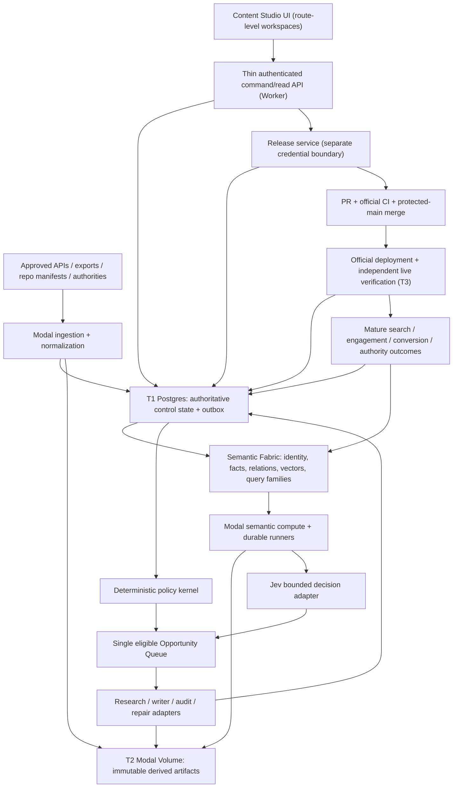

# Content Studio Revamp — Master Architecture (Strangler Migration)

**Version CS-2026.09.22.5** · Normative master design · **Implementation has NOT started**
Owner: Kyle · Architecture and release authority: GPT Sol · Default heavy executor: DeepSeek through the existing ds bridge
Supersedes for this subject: CS-2026.09.22.4 as published in `docs/superpowers/content-studio-revamp.md` (2,656 lines; contains two competing §27–§35 blocks and conflicting semantic interface definitions). That file must be reduced to a superseded pointer or archived in A0.1; until then this document and that file must never both be treated as normative. Earlier revisions (.1–.3) remain the historical record; their still-valid content is incorporated here and is not repeated.

Changing this document is **not** implementation. Nothing here connects providers, creates accounts, provisions Modal, applies migrations, seeds data, installs MCPs, schedules jobs, publishes content, unlocks CREATE, performs outreach, merges code or deploys production. Implementation starts only through bounded Sol packets after the required A0 exits in §24.

## How to read this document

### Evidence classes
Every material statement is one of three kinds, and the distinction is binding on reviewers:

| Label | Meaning | Rule |
|---|---|---|
| **VERIFIED_REPO_FACT** | Observed directly in this repository at the revision base (§4.1). Dated evidence, not a permanent truth. | Re-verify at implementation start; if it has changed, the dependent design statement must be re-derived, not assumed. |
| **PROPOSED_CONTROL** | A design requirement of this architecture. It is a mandate for implementation and testing. | Not evidence that it exists today. Acceptance requires recorded test/canary proof (§25). |
| **A0_UNVERIFIED** | External account, provider, live-database, live-deployment or cost fact that this authoring environment could not verify. | Nothing may depend on it before A0 records the probe evidence (§24). |

Numeric budgets, thresholds, calibration sizes and freshness windows are proposed acceptance controls unless marked VERIFIED_REPO_FACT or A0-verified. They are never vendor guarantees and never Google metrics.

### Non-negotiables that recur throughout
1. **One authority per decision domain.** There is never a second simultaneously authoritative owner graph, policy kernel, scorer, opportunity queue or release authority — not during migration, not in shadow mode, not "temporarily".
2. **Similarity discovers; it never authorizes.** No embedding distance, model label, provider score or Jev probability ever substitutes for ownership, policy, evidence or human review.
3. **Fail closed.** Missing strict identity, missing evidence, missing reviewer, unavailable provider, schema skew or lease uncertainty blocks the dependent action instead of guessing.
4. **No ranking guarantee and no invented Google metric.** This architecture pursues measurable qualified outcomes; it never promises rankings and never renders a fabricated "Google score".

## 1. Objective, authority and status

### 1.1 Objective
Build an intelligence-led editorial operating system that improves qualified audience outcomes, maintains the existing estate, earns trust and measures business value. Writing is only one possible intervention: research, refresh, consolidation, technical repair, internal linking, authority work, observation and deliberate `NO_ACTION` are equally valid outcomes. Article volume is never the objective.

The end-state architecture is a **strangler migration**: a thin Cloudflare/OpenNext control and read plane, authoritative durable Supabase/Postgres control state, a Modal durable compute plane, a single Semantic Fabric, a bounded Jev decision plane, an independent release/merge authority, and selective replacement or retirement of legacy subsystems after demonstrated parity. The current system is the **migration source and safety baseline, not a permanent dependency** — and not something to be discarded in a clean-sheet rewrite (§3).

### 1.2 Authority order
Current human authorization → repository `AGENTS.md` and approved design → Supervisor Arc v2026.09.21.1 → SEO Brief and the current repository parity matrix → this document. Conflicts block the affected action. This document does not amend phase thresholds and does not authorize broad CREATE, outreach, destructive action, merges or deployments by itself.

### 1.3 Current-state honesty (binding)
- The program baseline read of `main` was snapshot `3d248afd09290a97250cb472152afaa57b2a0292` on 2026-09-22; the revision base for this document is worktree head `52f63a86cc01fb574f790321b2eb751a34ff0ff7`. Both are **dated evidence**. Re-pin `main`, the parity matrix and the P0–P13 state at implementation start, and treat any later change as superseding this text where it conflicts.
- Program-state records are **dated evidence**, not standing truth. The earlier Hjarni SEO Brief snapshot recorded P0–P8 closed and P9–P13 pending; the independent repository audit of the frozen v4 branch later observed P9 as `IN_PROGRESS` with the P9 truth infrastructure present. Neither snapshot is promoted here. A0.2 MUST re-pin `main` and the canonical parity matrix before implementation, and any P9 statement is cited with its evidence date and state (`PENDING`/`IN_PROGRESS`/`PASS`) rather than silently normalized.
- **Live Supabase project state, applied migration ledger, table sizes, extension versions, effective grants, Cloudflare account plan/limits/bindings, live Worker telemetry, Modal workspace state, Jev account access and all provider entitlements are A0_UNVERIFIED** until A0 records probe evidence (§24).
- The Notion grade-5 roadmap describing P8 as NEXT is historical for this specification.

### 1.4 Scope boundaries
- Do not touch `MARKET-PORTAL-AUTH-HANDOFF-1102` or sibling jobs/worktrees; other lanes own them.
- Marketplace **publishing** is not enabled by this document. Marketplace demand, catalog identity and commercial destinations remain intelligence/funnel inputs (existing code comments explicitly exclude Marketplace publishing from Studio).
- Product phase advancement, provider commissioning, subscription purchase and account connection are outside this writing task.

## 2. Normative Interface Registry (single definition)

**Rule N1 — one definition.** Every interface below is defined exactly once, in this section. Other sections may reference these objects, constrain their use, or define *additional* interfaces at a single named section, but **no section may restate an interface with different field names, different enumerations or different semantics**. The duplicated v4 §27–§35 blocks violated this rule and are replaced by this registry.

**Rule N2 — monotonic sequence.** The document has one monotonic section sequence (§1–§28). New material is added by versioned amendment to the correct existing section, never by appending a second block with a re-used number.

**Rule N3 — canonical hashing.** Every hash in these interfaces is a lowercase 64-hex SHA-256 over the **same** canonical serialization used by the existing contract code. One serializer, one golden-fixture corpus. Node/TypeScript owns validation and canonical hashing until shared fixtures prove another implementation byte-identical; Python (Modal) transports opaque JSON and never invents its own canon. Cross-language hash drift is a release-blocking defect (test in §25).

**Rule N4 — unknown discipline.** Every optional field may be `null` and every enumeration includes an explicit unknown/unavailable member. `null` is never coerced to `false`, `0`, "low risk" or "no action". A schema-valid object never carries permission; permission lives only in the policy kernel (§8) and release authority (§10).

### 2.1 Registry index

| Interface | Defined | Purpose |
|---|---|---|
| `SemanticIdentity` | §2.2 | Versioned resolved meaning of a query family, page purpose or proposed content unit. |
| `SemanticFact` | §2.3 | Entity–predicate–value with qualifiers, evidence and verification state. |
| `SemanticRelation` | §2.4 | Typed, directed, scoped edge between semantic objects; carries authority class. |
| `SemanticOpportunity` | §2.5 | The Studio's primary work unit (an evidence-backed opportunity, not a keyword). |
| `DecisionState` | §2.6 | The compact, already-reconciled input state handed to the bounded decision plane. |
| `DecisionRecord` | §2.7 | Immutable record of a bounded decision, its distribution and its mode. |
| `InformationGainAssessment` | §2.8 | Predicate/answer-unit-level gain measurement against the current owner. |
| `ComputeClass` | §2.9 | The measured execution class vocabulary used to route all compute. |
| `GateEvaluation` | §2.10 | Immutable result of one gate rule under one rule version. |
| `ReleasePermit` | §2.11 | Short-lived, single-use authorization consumed by the release service. |
| `PublicationProof` | §2.12 | End-to-end candidate→PR→merge→deploy→live lineage record. |
| `Observation` | §2.13 | Scoped, maturity-labelled measurement attached to evidence. |
| `Reward` | §2.14 | Multi-dimensional outcome record; never a single hidden score. |

Dependent interfaces are defined once at the location below and never redefined elsewhere:

| Interface | Defined | Interface | Defined |
|---|---|---|---|
| `Run`, `Stage`, `Attempt`, fence | §7.2 | `ComputeBudget` | §12.4 |
| `OutboxEvent`, `ArtifactRef`, `IntentReservation` | §7.2 | `ContractV3` (envelope semantics) | §14.2 |
| `GateEvaluation` lifecycle | §8.4 | `ReviewerCredential`, `ReviewApproval` | §14.4 |
| Estate registry entities (`estate_routes`, reservations, etc.) | §17.1 | `IntegrationBinding` | §16.5 |
| `PublicationTarget` | §17.2 | `MetricObservation`-envelope, `SeoMetricSnapshot` | §26.4 |

### 2.2 `SemanticIdentity`
```typescript
interface SemanticIdentity {
  schemaVersion: "studio.semantic-identity/1";
  semanticId: string;
  ontologyVersion: string;
  resolverVersion: string;
  jurisdiction: string | null;              // country/state scope; registry-backed
  legalSystem: string | null;
  entityIds: string[];                      // program, visa class, institution, service, product
  programOrPathwayId: string | null;
  audienceId: string | null;                // audienceIds[] when composite
  readerJobId: string | null;               // the reader's task, not the site's keyword
  journeyStage: "understand" | "assess" | "prepare" | "act" |
                "apply" | "maintain" | "transition" | "settle" | "unknown";
  searchIntent: "informational" | "commercial_investigation" |
                "transactional" | "navigational" | "mixed" | "unknown";
  language: string;
  countryContext: string | null;
  temporalContext: { effectiveAt: string | null; validFrom: string | null; validTo: string | null };
  serviceContextIds: string[];
  evidenceIds: string[];
  status: "resolved" | "partial" | "ambiguous" | "conflicted" | "unknown" | "unavailable";
}
```
Resolution is conservative: a numeric or acronym token (for example `485`, `I-485`) cannot resolve an identity without jurisdiction/entity evidence; US I-485 and Australian subclass 485 are permanent collision fixtures. Audience and reader job are independent dimensions. Renaming a label never silently changes identity.

### 2.3 `SemanticFact`
```typescript
interface SemanticFact {
  factId: string;
  subjectEntityId: string;
  predicate: string;                        // controlled vocabulary; versioned
  objectEntityId: string | null;
  scalarValue: string | number | boolean | null;
  unit: string | null;
  qualifiers: {
    jurisdiction: string | null;
    legalSystem: string | null;
    audienceIds: string[];
    programOrPathwayId: string | null;
    validFrom: string | null;
    validTo: string | null;
    effectiveAt: string | null;
  };
  evidenceIds: string[];
  contradictionEvidenceIds: string[];
  supportState: "supported" | "contradicted" | "partial" | "historical" | "unverified";
  sourceHealth: "current" | "stale" | "conflicted" | "unavailable";
  sourceAuthorityClass: string;
  verification: "observed" | "reviewed" | "derived" | "model_candidate";
  extractorVersion: string | null;
  reviewerId: string | null;
  factHash: string;
}
```
Absence of a fact is never evidence of its opposite. For YMYL claims, `model_candidate` cannot become usable claim support without §14 reviewer rules. A source URL alone is not a fact.

### 2.4 `SemanticRelation`
```typescript
interface SemanticRelation {
  relationId: string;
  relationType: string;                     // controlled vocabulary per §11.4
  subjectId: string;
  objectId: string;
  scope: { jurisdiction: string | null; language: string | null; audienceId: string | null };
  evidenceIds: string[];
  derivation: { method: string; methodVersion: string; modelVersion: string | null };
  authorityClass: "AUTHORITATIVE" | "OBSERVED" | "DERIVED_DETERMINISTIC" |
                  "MODEL_INFERRED" | "REVIEWED_INFERENCE" | "CANDIDATE";
  confidence: number | null;                // null when not a model output; never a probability of truth
  validFrom: string | null;
  validTo: string | null;
  status: "active" | "superseded" | "invalidated" | "conflicted";
  invalidationReason: string | null;
}
```
`CANDIDATE_*`, overlap and suggested-link relations are structurally non-authoritative: no policy rule may read them as owner, gate or release input.

### 2.5 `SemanticOpportunity`
```typescript
interface SemanticOpportunity {
  opportunityId: string;
  version: number;
  semanticIdentityId: string;
  queryFamilyIds: string[];
  readerJobId: string | null;
  ownerRouteId: string | null;              // authoritative owner, or null when unresolved
  clusterId: string | null;
  jurisdiction: string | null;
  metricSnapshotId: string | null;
  evidenceIds: string[];
  problemType: string;
  semanticGapIds: string[];
  competitorGapIds: string[];
  informationGainAssessmentId: string | null;
  collisionBundleId: string | null;
  cannibalizationRiskState: "none" | "candidate" | "confirmed" | "unknown";
  authorityGapState: string;
  commercialPathState: string;              // includes BLOCKED_NO_RELEVANT_SUPPLY
  eligibleActions: string[];                // policy-supplied only
  blockedActions: { action: string; reasonCodes: string[] }[];
  policyVersion: string;
  featureSetId: string | null;              // Modal-produced bounded features
  decisionRecordId: string | null;
  recommendedAction: string | null;
  recommendationState: "pending" | "advisory" | "accepted" | "dismissed" | "abstained";
  predictedOutcome: { metric: string; direction: "up" | "down" | "stable"; horizon: string }[];
  interventionCostClass: ComputeClass;
  expectedOutcomeContractId: string | null;
  observationPlanId: string;
  status: "detected" | "investigating" | "eligible" | "blocked" |
          "executing" | "observing" | "mature" | "dismissed";
  createdAt: string;
  supersededBy: string | null;
}
```
There is **one** opportunity queue. Legacy `opportunityEngine`/`opportunityScore` outputs become candidates or read-only history under §24; they never run as a parallel queue.

### 2.6 `DecisionState`
```typescript
interface DecisionState {
  schemaVersion: string;
  decisionTask: string;
  subjectId: string;
  semanticIdentityHash: string;
  ownerId: string | null;
  ownerVersion: string | null;
  policyVersion: string;
  featureSetVersion: string;
  rubricVersion: string;
  ontologyVersion: string;
  eligibility: { action: string; eligible: boolean; reasonCodes: string[] }[];
  semanticFeatures: {
    lexicalOverlap: number | null; vectorSimilarity: number | null; rerankerScore: number | null;
    entityOverlap: number | null; readerJobOverlap: number | null; claimOverlap: number | null;
    informationGain: number | null; jurisdictionMatch: boolean | null; temporalMatch: boolean | null;
  };
  evidenceState: { completeness: string; freshness: string; contradictions: number; requiredReviewer: boolean };
  outcomeFeatures: Record<string, number | string | null>;
  allowedChoices: string[];                 // policy-derived; forbidden actions are absent, not down-weighted
  inputArtifactHashes: string[];
}
```
Precondition: Modal has already compressed raw estate state into this bounded, reconciled form. Raw crawled pages are never sent when this state is sufficient.

### 2.7 `DecisionRecord`
```typescript
interface DecisionRecord {
  decisionId: string;
  decisionTask: string;
  decisionStateHash: string;
  inputArtifactHashes: string[];
  provider: string;                         // e.g. typesafe
  modelVersion: string;                     // actual returned version, not requested alias
  rubricVersion: string;
  ontologyVersion: string;
  calibrationVersion: string;
  distribution: { choice: string; probability: number }[];
  nativeConfidence: number | null;          // never reinterpreted as accuracy
  selectedOption: string | null;
  abstained: boolean;
  abstentionReasonCode: string | null;
  policyResult: { eligible: boolean; reasonCodes: string[] };  // computed independently of the model
  mode: "shadow" | "advisory" | "bounded_assist" | "expanded_bounded";
  createdAt: string;
  supersededBy: string | null;
}
```
No synthesized natural-language rationale is ever attributed to the model; explanations are generated from recorded reason codes and facts (§21).

### 2.8 `InformationGainAssessment`
```typescript
interface InformationGainAssessment {
  assessmentId: string;
  ownerRouteId: string | null;
  ownerVersion: string | null;
  proposedAnswerUnits: string[];            // predicate/question-level, not word counts
  alreadySatisfiedUnits: string[];
  genuinelyNewUnits: string[];
  unsupportedUnits: string[];
  uniqueReaderJob: boolean;
  estimatedGainState: "high" | "medium" | "low" | "none" | "unknown";
  evidenceIds: string[];
  analyzerVersion: string;
}
```
Internal anti-duplication aid, not a Google metric. Low/none gain normally favors `REFRESH`/`CONSOLIDATE`/`NO_ACTION` over `CREATE`. Lexical novelty with the same reader job and answer set is low gain.

### 2.9 `ComputeClass`
```typescript
type ComputeClass =
  | "S0_DETERMINISTIC_CPU"   // parsing, hashing, AST, counts, joins, graph traversal, diffs
  | "S1_EMBEDDING"           // batched embeddings
  | "S2_RERANKER"            // cross-encoder/reranker on bounded candidate sets
  | "S3_SMALL_MODEL"         // extraction/classification that rules and Jev cannot do
  | "S4_LARGER_LOCAL"        // difficult competitor decomposition / semantic synthesis (escalation)
  | "S5_FRONTIER_OR_HUMAN";  // hard research, architecture, ambiguous legal/editorial cases
```
Escalation requires a recorded failed/insufficient lower tier and an expected-value justification (§12). A workload never escalates because hardware happens to be available.

### 2.10 `GateEvaluation`
```typescript
interface GateEvaluation {
  gateId: string;                           // program gate P0–P13 or action/release gate
  ruleVersion: string;
  scope: string;                            // estate, host, cluster, route, contract, action
  status: "PENDING" | "IN_PROGRESS" | "PASS" | "ACCEPTED_EXCEPTION" |
          "BLOCKED_EXTERNAL" | "FAIL" | "INVALIDATED";
  evaluatedAt: string;
  expiresAt: string | null;
  evidenceIds: string[];
  evidenceHash: string;
  inputHash: string;
  reasonCodes: string[];
  evaluatorVersion: string;
  affectedAction: string;
  invalidatedBy: string | null;
}
```
`NEXT` is a scheduling pointer, never a status. Missing, partial, stale, failed or unavailable evidence never becomes PASS. `ACCEPTED_EXCEPTION` requires a named authorizer, reason, expiry and compensating checks, and can never silently clear CREATE freeze, ownership ambiguity, fabricated credentials or a missing YMYL review.

### 2.11 `ReleasePermit`
```typescript
interface ReleasePermit {
  permitId: string;
  action: string;
  actorId: string;
  runId: string;
  targetAdapterId: string;
  contractHash: string;
  bodyHash: string;
  renderHash: string;
  ownershipVersion: string;
  policyVersion: string;
  expectedRepositoryBase: string;           // expected main/head SHA the PR must be based on
  issuedAt: string;
  expiresAt: string;                        // short TTL
  state: "issued" | "consumed" | "expired" | "revoked";
  consumedAt: string | null;
  consumeTransactionId: string | null;
  externalOperationIntentId: string | null; // recorded before dispatch
}
```
Single-use and transactional. A hash detects change; it is not itself authorization.

### 2.12 `PublicationProof`
```typescript
interface PublicationProof {
  proofId: string;
  targetAdapterId: string; repositoryId: string; hostId: string; routeId: string;
  candidateSha: string;                     // exact head that was reviewed and verified
  pullRequest: { number: number; url: string; baseSha: string } | null;
  requiredChecks: { checkId: string; result: string; headSha: string }[];
  mergeSha: string | null;
  deployment: { targetId: string; versionId: string; deployedAt: string } | null;
  live: {
    url: string; verifiedAt: string; verifier: string; httpStatus: number;
    bodyDigest: string; canonical: string; robotsState: string;
    authorship: string; sourcesPresent: boolean; ctaTarget: string | null;
  } | null;
  lineage: { jobId: string; contractHash: string; renderHash: string } | null;
  rollbackRef: string | null;
  uncertainExternalWriteState: "none" | "possible" | "reconciled_absent" | "reconciled_present";
  reconciledAt: string | null;
}
```
PR created ≠ merged ≠ deployed ≠ live verified. Every one is a separate recorded state.

### 2.13 `Observation`
```typescript
interface Observation {
  observationId: string;
  subjectKind: "intent" | "page" | "revision" | "opportunity" | "intervention";
  subjectId: string;
  metricKey: string;
  scope: {
    projectId: string; canonicalUrl: string | null; language: string; country: string | null;
    device: string | null; channel: string | null; searchType: string | null;
    propertyId: string | null; cohortId: string | null; timezone: string; currency: string | null;
  };
  window: { start: string | null; end: string | null };
  value: unknown | null;                    // registry-typed; null when unavailable
  status: "available" | "stale" | "unavailable" | "not_applicable" | "pending" | "failed";
  completeness: "complete" | "partial" | "unknown";
  coverage: number | null;
  sourceRunId: string;
  definitionVersion: string;
  maturity: "provisional" | "mature" | "confounded" | "insufficient_data" | "invalidated";
  confounders: string[];
  attribution: { method: string; confidence: number | null } | null;
  observedAt: string;
  ingestedAt: string;
  validUntil: string | null;
  evidenceHash: string;
}
```
Provider unavailable/stale/partial is **not zero**. Zero denominator is null, not 0%.

### 2.14 `Reward`
```typescript
interface Reward {
  rewardId: string;
  interventionId: string;
  observationIds: string[];
  dimensions: {
    searchVisibility: number | null;
    packaging: number | null;
    qualifiedTraffic: number | null;
    taskEngagement: number | null;
    internalAuthority: number | null;
    externalAuthority: number | null;
    geoCitation: number | null;
    commercialOutcome: number | null;
    trustAndFreshness: number | null;
    executionCost: number | null;
    regressions: string[];                  // cannibalization/technical/trust regressions observed
  };
  maturity: "provisional" | "mature" | "confounded" | "insufficient_data" | "invalidated";
  attribution: { method: string; confidence: number | null; limitations: string[] };
  policyVersion: string;
  computedAt: string;
}
```
There is no scalar collapse. Revenue never compensates for a trust/legal gate failure, and a forecast is not an outcome.

## 3. Binding architecture decision: Alternative 2 as a strangler migration

### 3.1 Alternatives assessed
| # | Alternative | Verdict |
|---|---|---|
| 1 | Optimize the current Worker pipeline in place | Rejected: keeps CPU/import coupling and request-lifetime execution that caused the 1102 class of failure (§4, §6). |
| 2 | **Thin edge + durable Postgres control state + Modal compute + Semantic Fabric + bounded decision plane + separate release authority, delivered as a strangler migration** | **Approved and binding.** Preserves current TypeScript domain semantics while moving heavy work off the request path and giving every decision domain exactly one authority. |
| 3 | Clean-sheet rewrite / full Python event-platform replacement | Rejected as the default: largest parity risk, discards tested safety invariants and the estate knowledge embedded in the current code. Individual subsystems may still be REPLACE_AND_RETIRE under §3.4. |

### 3.2 What "strangler" means here (binding)
- The existing system is the **migration source and safety baseline**. Its business and safety invariants are preserved regardless of whether its implementation survives.
- New capability is introduced **beside** existing capability, then given authority only through an explicit parity → migration → rollback → authority-cutover record (§3.5). Until cutover, the legacy subsystem remains the single authority for its domain and the new subsystem runs read-only or in shadow.
- **There must never be two simultaneously authoritative owner graphs, policy kernels, scorers, opportunity queues or release authorities.** Shadow computation is allowed; shadow *authority* is not.
- No indefinite dual-write and no split-brain. Every dual-run period has a named exit condition and an owner; an unclosed dual-run is a release-blocking defect.
- Selective or eventual full replacement is allowed, and replacement is expected where measured parity and value justify it.

### 3.3 A0 disposition vocabulary (mandatory for every subsystem)
A0 classifies each legacy subsystem and its tables as exactly one of:

| Disposition | Meaning | Required evidence before use |
|---|---|---|
| `REUSE` | Existing implementation remains authoritative inside the new architecture (possibly wrapped by new interfaces). | Interface compatibility map, grant/RLS review, schema stability evidence, tests still passing. |
| `WRAP_TEMPORARILY` | Kept unchanged behind a new adapter with a named retirement-window exit condition. | Adapter contract tests, explicit exit criterion, deadline owner in A0.4. |
| `MIGRATE_STATE` | State moves to the new authoritative store under a reversible migration. | Reconciliation counts, idempotent backfill/roll-forward + rollback plan, cutover record. |
| `REPLACE_AND_RETIRE` | New component becomes authoritative; legacy becomes read-only/archive, then retires. | Parity evidence, deterministic reconciliation, rollback drill, authority-cutover record. |

A module with no disposition may not be depended on by new code. New implementations must not silently duplicate a legacy module's authority.

### 3.4 Single-authority invariants (never violated)
1. **Owner graph:** exactly one owner authority (initially `lib/seoFactory/ownership.ts` semantics via the estate registry, §17). No semantic or model-derived path may mint owners.
2. **Policy kernel:** exactly one evaluator and one database transition API; every legacy sink either routes through it or is retired (§8, §10).
3. **Scorers/queues:** exactly one authoritative opportunity queue and one priority mechanism (§15). Ranking/reward engines under §24 are migration inputs, not parallel scorers.
4. **Release authority:** exactly one merge/deploy path (§10). Writers, research runners and Modal containers hold no merge credentials.
5. **Semantic identity:** exactly one authoritative semantic model space per decision use; mixed-space comparison is prohibited (§11.7).
6. **Key management:** one canonical serializer/hash regime (§2 Rule N3).
7. **Truth stores:** Postgres is the only transactional authority; Modal Volume is artifact storage, never a database (§9).

### 3.5 Authority cutover sequence (mandatory shape)
```
shadow read/compute        (no authority; outputs compared offline)
  → deterministic reconciliation  (counts, hashes, deltas, disagreement report)
  → single authority switch        (transactional, versioned, reversible)
  → legacy read-only / archive     (no writes; history preserved)
  → retirement                     (code path removed, migration ledger updated)
```
Each arrow requires recorded evidence, a rollback path and an explicit named owner. The switch itself is a policy-versioned operation, not a deploy side effect.

## 4. Verified current-state baseline (what the migration source actually is)

### 4.1 Revision base and verified repository facts
Base: worktree head `52f63a86cc01fb574f790321b2eb751a34ff0ff7`. Program baseline read of `main`: `3d248afd09290a97250cb472152afaa57b2a0292` (2026-09-22).

| # | VERIFIED_REPO_FACT (at revision base) | Architectural consequence |
|---|---|---|
| F1 | `components/design/admin-content-studio.tsx` is a single 9,348-line coordinating component. | Measured migration surface. Route/workspace replacement by journey is required (§21); the monolith is not a long-term home. |
| F2 | 22 route files declare `export const runtime = 'nodejs'`, and `middleware.ts` declares `export const runtime = 'experimental-edge'`. | Confirms the audit finding: under OpenNext/Cloudflare these route handlers execute **inside the single Worker**, not on a Node server. Switching a runtime label moves nothing (§6). |
| F3 | `middleware.ts` is the only explicit edge-runtime declaration; `open-next.config.ts` uses the static-assets incremental cache and serves prerendered output from Worker static assets. | The Worker hosts route execution and middleware; there is no separate Node tier to offload to. CPU safety must come from import/call topology and tiny handlers. |
| F4 | `npm run deploy` → `scripts/deploy-production.mjs`, which hard-requires `GITHUB_ACTIONS=true`, `GITHUB_REF=refs/heads/main` and a prepared `WORKER_SECRETS_FILE`, exiting 78 otherwise; `.github/workflows/deploy.yml` runs on push to `main`, on PRs to `main` and on `workflow_dispatch`, with `concurrency: cancel-in-progress: true`. | A guarded official deploy path exists. The cancel-in-progress behavior must be reconciled with release lineage (§10.6). |
| F5 | `supabase/migrations/` holds 76 SQL files; `.github/workflows/apply-seo-factory-migrations.yml` triggers on **push to `main`** when any of its live-apply path filters change: `supabase/migrations/**`, `supabase/migration-baseline.json`, `scripts/migration-order.mjs`, `scripts/migration-ledger-policy.mjs`, `scripts/migration-ledger-runner.mjs`, `scripts/supabase-management-sql.mjs`, `scripts/apply-migrations.mjs`, plus changes to the apply workflow itself; `adopt-migration-ledger.yml` is a manual `workflow_dispatch` pinned to an expected `main` SHA. | Merging a migration or migration-application control change can auto-apply to the live database. Migration mechanics are a release-authority concern, not a side activity (§9.6). |
| F6 | `scripts/migration-order.mjs` defines a three-tier order (pinned BASE list, self-registering timestamped files, pinned INDEXES last) and hard-errors on any file that matches no tier. | A frozen baseline plus append-only timestamped files is already the repository convention; it must be preserved and never edited retroactively (§9.6). |
| F7 | Nine `using (true)`-style permissive policies exist across migrations, and least-privilege work exists in at least `20260917173300_base_table_least_privilege.sql` and `20260806_hardening.sql`. | Privilege state is **partially hardened and unverified in aggregate**. Current public SEO tables are not all least-privilege; A0.5 must inventory effective grants before any authoritative reuse (§9.7). |
| F8 | Git/merge write sinks exist in code: `lib/githubContentsCore.ts` (`/pulls/{n}/merge`), its re-export wrapper `lib/githubContents.ts`, `lib/seoFactory/ship.ts` (`mergePullRequest`) called inline from `app/api/content-studio/jobs/strictManualPublication.ts` and `app/api/content-studio/jobs/legacyCore.ts`; `scripts/refresh-gsc-token.sh` performs `git commit --allow-empty` and `git push origin main`; `.github/workflows/sync-central-assistant-kb.yml` has `contents: write`, runs on a daily schedule and push-to-main, commits generated KB coverage files, then pushes `HEAD:main`. | Multiple Git write/merge paths exist today, including operator and scheduled direct-main writers. Every sink must be inventoried, dispositioned and disabled-by-default per §10. |
| F9 | Scheduled/reconciliation routes exist: `content-studio-retry`, `reconcile-content-jobs`, `reconcile-incidents`, `forecast-reward-weekly`, `seo-engine-daily`, `rhythm-scan-weekly`, `war-room-daily`, `weekly-payouts`, `worker-secrets-health`, `daily-digest`. | Existing retry/reconcile crons must be reconciled with the durable runtime (§7.7) rather than duplicated. |
| F10 | Legacy subsystems named by the program audit exist as modules: `lib/seoEngine/{rankingModel,forecastTracker,forecastReward,planner,planEconomics,coverageIntent,ontology,knowledge,gate,scoring}.ts` and `lib/seoFactory/{topicGraph,opportunityScore,opportunityEngine,currentGate,executionStages,publicationProof,broadCreateFreeze,ownership}.ts`. | These are the A0.4 disposition targets. Their business/safety invariants are preserved; their implementations may be retired. |
| F11 | `package.json` exposes `test: jest`, `lint: next lint`, `build: next build --webpack && opennextjs-cloudflare build --skipNextBuild`; stack is Next 16.2.11, `@opennextjs/cloudflare` ^1.19.4, `wrangler` 4.132.0. | Verification commands come from the repository, not from guesses in this document (§25). |

### 4.2 The 1102 class of failure — stated honestly
- The record includes Cloudflare `1102` (Worker exceeded CPU/resource limits) incidents. In an OpenNext deployment the request path shares one Worker bundle: heavy SSR, middleware imports, large JSON assembly, DOM/PDF parsing, embedding or LLM orchestration pulled transitively into a route all execute as request CPU.
- **Changing `runtime` labels does not fix this.** `runtime = 'nodejs'` in a Next route does not move compute to a Node server under OpenNext; the code still runs in the Worker isolate. The fix is topology: heavy capabilities must be *unreachable* from any request-scoped module, verified by import-graph tests (§6.3, §25).
- This document does not claim that any particular route caused a specific historical incident. A0 records the actual telemetry source and the real incident evidence before any acceptance claim (§6.6).

### 4.3 What remains A0_UNVERIFIED (do not assume)
Live Supabase project/plan/applied ledger/table sizes/extension availability; Cloudflare account plan, CPU limits, bindings, real 1102/503 telemetry; Modal workspace identity, plan, billing telemetry, Volume behavior; Jev/TypeSafe account and model access; Modal↔Cloudflare credentials; GitHub App installation scope; provider entitlements (GSC/GA4/Google Ads/Ahrefs/DataForSEO/Bing/Ubersuggest/TinyFish); reviewer availability; and the current contents of the frozen migration baseline's live counterpart.

## 5. Target topology and layered responsibility model



The diagram shows logical responsibility, not permission for every runner to write every table. Layers mutate state only through the transition APIs of their owning layer.

| Layer | Responsibility | Authority / prohibition |
|---|---|---|
| L0 Governance | Human authorization, `AGENTS.md`, Supervisor Arc, SEO Brief, P0–P13, policy versions. | Defines what may happen. No runtime path may modify this layer. |
| L1 Observation | GSC, GA4, Bing, Ads, Ahrefs, DataForSEO, Ubersuggest exports, TinyFish, repo/deploy/catalog/authority observations. | Immutable source runs with scope, completeness and failure state; raw interpretation is never promoted to fact. |
| L2 Normalization/evidence | Identity normalization, dedup, locators, metric definitions, privacy handling, connector bindings. | Versioned evidence and observations; unknown stays unknown; unavailable ≠ zero. |
| L3 Estate truth | Repos/hosts/routes, canonical history, intent owners, catalog IDs, contracts, revisions, gate state, publication proofs. | T1 Postgres is authoritative. Nothing derived may overwrite it. |
| L4 Semantic Fabric | Entities, aliases, reader jobs, query families, facts, answer units, typed relations, vectors. | Derivative/reconciled meaning with provenance; candidate relations are explicitly non-authoritative. |
| L5 Compute | Modal deterministic transforms, embeddings, reranking, extraction, competitor decomposition. | Durable derived artifacts; resource class, version, cost and failure recorded. |
| L6 Decision | Deterministic eligibility, then Jev bounded choices, then executor routing. | `DecisionRecord` + abstention; never grants permission outside policy. |
| L7 Research/editorial | Primary-source research, ContractV3, answer-first writing, claim-linked revisions, reviewer workflow. | Immutable contract/revision/review artifacts; rewrites invalidate dependent approvals. |
| L8 Release | Permit, PR, exact-head CI, merge, official deployment, live proof. | Separate credential boundary. PR creation is not publication. |
| L9 Outcome | Search, authority, engagement, Marketplace and business observations with maturity/coverage. | `Observation`/`Reward` records; no forced attribution, no causal claims from deltas. |
| L10 Learning | Retrieval thresholds, Jev calibration, priority bands, compute routing, playbook evidence. | Versioned proposals and approved configuration only; cannot rewrite governance. |
| L11 Operations/security | Budgets, provider health, leases/fencing, secrets, RLS, audit, recovery, rollback, kill switches. | Enforces reliability and least privilege across every other layer. |

Data flows upward only through validated contracts. Invalidation flows downward from authority/source/owner changes to dependent derived state. The UI may project any layer but can never bypass its write boundary.

### 5.1 Plane responsibilities (single sentence each)
- **Browser:** navigation, editing, bounded lists, previews, authenticated progress reads. No provider secrets, policy decisions or release authority.
- **Cloudflare edge (thin):** authenticate, authorize scope, validate small input, transact command + outbox row, read bounded projections, return. No crawling, generation, embedding, full-document audit or synchronous release orchestration (§6).
- **Supabase/Postgres (T1):** authoritative run state, immutable contracts, lease/fence counters, gate evidence, intent reservations, approvals, outbox, publication manifests, semantic IDs/metadata, decision/review/release state, observation/reward ledgers.
- **Modal:** bounded durable research, generation, semantic compilation, audits, rendering, live-verification assistance and scheduled reconciliation; large artifacts to T2.
- **Artifact store (T2):** private immutable content-addressed objects with checksums, lineage and retention class (§9.3).
- **Release service:** separate credential boundary; creates PRs only after consuming a permit. No writer/research container holds merge or deploy credentials (§10).
- **Official CI + repository deployment:** exact-head checks, protected-main merge, official workflow deployment, independent live verification (§10).

### 5.2 Domain-code placement rule
Run the extracted, tested TypeScript domain code inside a Node-equipped Modal container for heavy work (small Python Modal entrypoint invoking a bounded Node process), and build the shared domain package once from the same commit for both edge-compatible policy helpers and Node runners. Node-only compute imports must never enter edge bundles. Port an individual workload to Python only when measured value and contract-equivalence tests justify it; until then, Python transports opaque JSON (§2 Rule N3).

## 6. Cloudflare/OpenNext request-plane contract ("stay-free tiny edge" or explicit re-baseline)

### 6.1 Verified semantics that drive this contract
- **A0_UNVERIFIED operational assumption:** the Portal is currently believed to run on the Cloudflare **Workers Free plan**. A0.2 must record actual account-plan evidence before §6.2 selects Stay-Free vs paid re-baseline; this assumption is not a VERIFIED_REPO_FACT.
- Under OpenNext for Cloudflare, Next route `runtime = 'nodejs'` does **not** move execution off the Worker: the route runs in the Worker isolate and its CPU/memory is charged there (F2/F3).
- `middleware.ts` is the only explicit edge-runtime module today, and the OpenNext Worker hosts route execution.
- Therefore request CPU safety comes from **import and call topology plus tiny handlers**, never from runtime labels.

### 6.2 The decision gate: tiny-edge contract or paid re-baseline
A0.2 produces one of two recorded outcomes, and the architecture must not proceed on an implicit third:
1. **Stay-Free tiny-edge contract (default):** every request-scoped module satisfies §6.3–§6.5 within free-plan limits, proven by measurement and canary. This is the target state.
2. **Explicit paid-plan re-baseline:** only if measurement proves a required user-facing read cannot meet the contract. It requires recorded evidence, cost approval, named owner and a revised acceptance budget. A paid plan is never adopted to make a heavy request path "fit".

### 6.3 Import/call topology rules (enforced, not aspirational)
1. Request-scoped modules (route handlers, middleware, server components used by authenticated reads) must not transitively import writer, crawler, fetcher/parser (DOM/HTML/PDF), embedding, vector, LLM/Jev, Modal-orchestration or full-document-audit packages.
2. CI runs an import-graph check over the request plane and fails on forbidden transitive edges, with an explicit allowlist that requires review to change.
3. Heavy capabilities are reachable only from (a) Modal runners, (b) scheduled jobs outside the request path, or (c) the release service. If a request handler needs their result, it reads a **persisted projection**.
4. No request handler performs a synchronous call to Modal, GitHub, provider APIs requiring multi-second work, or CI. The edge never waits for CI (§6.5).
5. Route handlers are tiny: authenticate → validate → transact → return 202/projection. Business orchestration lives behind the runtime boundary.

### 6.4 Budgets, payload projections and cache rules
| Control | Proposed value | Notes |
|---|---|---|
| Command payload cap | 64 KiB enforced on actual bytes (not `Content-Length`) | 413 on violation with a stable reason code. |
| List projection cap | 128 KiB with cursor pagination (default 25, max 100 rows) | Selected columns only; no raw bodies, no semantic matrices. |
| Event batch cap | 100 events per page | Event pages are append-only reads by `after=sequence`. |
| Large documents | Direct upload via scoped storage capability → processed in Modal | Never posted through the Worker. |
| DB calls per request | Bounded, declared per route and asserted in tests | Aggregate only when the plan supports it; otherwise bounded fan-out with explicit cap. |
| Subrequests | Declared per-route budget with admission control | Bound parallel provider/DB work; cancel redundant reads. |
| Private responses | `private, no-store` by default | Static assets may be public-cacheable; never cross-user shared caches. |
| Signed previews/downloads | Short expiry + authorization still enforced server-side | Capability never replaces authorization. |
| Provider failure behavior | Queue admission limits; slow provider never triggers browser retry storms | Backpressure returns 429 with reason codes. |

### 6.5 Polling, streaming and no-request-bound-CI
- **One poll coordinator per view** (a single scheduler component) owns all polling for that view. Individual widgets subscribe to it; widgets never poll independently.
- Polling defaults to 5 s only for visible active runs, backs off on inactivity and error, and **pauses in hidden tabs** (visibility API). Requests are de-duplicated across components and coalesced.
- Optional bounded SSE may project persisted events only; it never owns compute lifetime and never becomes the source of truth.
- **No request-bound CI waiting.** PR check status is read from persisted webhook/reconciliation state. If the state is stale, the UI says "waiting for check evidence" instead of blocking a request.
- Run cards show last real event, stage, attempt, elapsed time, heartbeat age and retry state. A stale heartbeat shows "execution status needs reconciliation" — never a fabricated percentage or an endless "Working".
- Admission control: per-user and global concurrency caps on commands; excess returns 429 with retry guidance instead of degrading reads.

### 6.6 Telemetry and acceptance (real signals only)
- A0.2 identifies the **actual Cloudflare telemetry source** (analytics dataset or equivalent) for CPU time, exceeded-CPU/memory events, 1102, 503, isolate startup and request counts. **No acceptance claim about 1102/503 is permitted before that source is identified and used.**
- Track CPU separately from wall latency, aggregated by route and by build SHA. Aggregate CPU per route/build is a first-class release metric.
- Acceptance budgets (PROPOSED_CONTROL; measured, never asserted):
  - Edge p95 CPU ≤ min(10 ms, 25% of configured CPU cap); p99 ≤ 50% of the configured cap. If existing auth alone fails this, profile/redesign before enabling the route.
  - Worst supported isolate load stays below 80 MiB measured allocation (not an average).
  - Warm command acceptance p95 ≤ 750 ms and cold p95 ≤ 1.5 s excluding measured external latency; a returned 202 never waits for research.
  - Initial Studio route ≤ 200 KiB gzip JS excluding separately reported shared auth/runtime; incremental lazy route chunk ≤ 150 KiB; total transfer is recorded too, so exclusions cannot hide bloat.
  - Field targets p75 LCP ≤ 2.5 s, INP ≤ 200 ms, CLS ≤ 0.1 on defined mobile tests and then field data; lab success never claims field success.
- Load test: 30 minutes at 2× observed peak, minimum 50 concurrent active sessions, including cold starts, list pagination, editor saves and status polling. **Zero `1102`/`exceededCPU`/`exceededMemory` events**; error rate < 0.5 % excluding intentional 4xx denials.
- Canary: ≥ 24 hours and ≥ 10,000 representative API requests (supplement in staging where production volume is low, labelled separately), with **zero resource-limit incidents**; any incident holds promotion and triggers diagnosis.
- Targets may be revised only with measured evidence and Sol approval. Raising plan limits is never the primary remedy.
- **Independent kill switches** (separate flags, separately owned, tested) stop: new dispatch/enqueue, Modal runners, release-permit issuance, and outbound notifications. Stopping one never requires stopping the others. Kill switch state is visible in Operations and in every run's audit trail.

## 7. Durable execution runtime

### 7.1 Command path (the only accepted write shape)
```
authenticated request
  → validate small input + idempotency key + expected versions
  → single Postgres transaction: run + stage + outbox row (+ reservation/gate snapshot)
  → commit
  → return 202 with run id
  → request ends  (no Modal call, no provider call, no CI wait)
```
A scheduled Modal dispatcher claims bounded outbox batches using short database locks, commits the claim, then spawns work outside the transaction. A periodic reconciler recovers expired dispatch claims. A best-effort wakeup may reduce latency but is never the sole delivery guarantee. A database outage cannot acknowledge an unpersisted job (503 with a stable reason code).

### 7.2 Runtime identity interfaces (defined once)
```typescript
interface Run {
  runId: string; projectId: string; action: string; subjectId: string;
  policyVersion: string; contractSchemaVersion: string; workerImageDigest: string | null;
  state: "PROPOSED" | "RESEARCHING" | "CONTRACT_READY" | "DRAFTING" | "AUDITING" |
         "REVIEW_REQUIRED" | "APPROVED" | "PR_CREATED" | "MERGED" | "DEPLOYED" |
         "LIVE_VERIFIED" | "OBSERVING" | "CLOSED" |
         "BLOCKED" | "FAILED" | "CANCELLED" | "SUPERSEDED";
  idempotencyKey: string; createdAt: string; supersededBy: string | null;
}
interface Stage {
  stageId: string; runId: string; stageName: string;
  attemptCount: number; currentFence: number; leaseOwner: string | null; leaseExpiresAt: string | null;
  inputHash: string; checkpointRef: string | null; outputArtifactRef: string | null;
  state: "pending" | "claimed" | "running" | "checkpointed" | "done" | "failed" | "cancelled";
}
interface Attempt {
  attemptId: string; stageId: string; fence: number; workerVersion: string;
  startedAt: string; endedAt: string | null;
  outcome: "running" | "ok" | "retryable_error" | "permanent_error" | "abandoned" | "cancelled";
  errorClass: string | null; resourceClass: ComputeClass | null; costTag: string | null;
}
interface OutboxEvent {
  eventId: string; runId: string; stageId: string | null;
  eventType: string; sequence: number; payloadRef: string;
  idempotencyKey: string; deliveryState: "pending" | "claimed" | "delivered" | "dead";
  producerVersion: string; createdAt: string;
}
interface ArtifactRef {
  artifactKey: string;                      // content hash (lowercase 64-hex)
  tier: "T2_VOLUME" | "T1_ROW_REF" | "T3_GIT";
  bytes: number; mediaType: string; retentionClass: string;
  sourceRunId: string; producerVersion: string; createdAt: string;
  verifiedChecksum: boolean;
}
interface IntentReservation {
  reservationId: string; normalizedIntentKey: string; ownerRouteId: string;
  state: "held" | "converted" | "expired" | "released";
  heldByRunId: string; expectedOwnerVersion: string; expiresAt: string;
}
```
Every stage uses `(runId, stageName, inputHash, policyVersion)` idempotency plus a **monotonic fencing token**. A worker must present the current token and an unexpired lease for **every** state change. Duplicate spawns may compute redundantly but can never commit stale results or release twice.

### 7.3 Execution identity across processes (AsyncLocalStorage replacement)
- Process-local `AsyncLocalStorage` (used by the current pipeline context) is **derived convenience state, not authority**. It cannot be transplanted across request → dispatcher → Modal container boundaries.
- Crossing a process boundary requires an explicit, persisted execution identity: `runId`, `stageId`, `attemptId`, `fence`, `policyVersion`, `contractHash`, `inputHash`, plus the actor/service identity.
- **Missing or ambiguous strict identity fails closed:** the worker refuses the write and records `IDENTITY_MISSING` rather than inferring context from ambient state.
- Any code path that mutates authoritative state must accept identity as an explicit parameter (or an authenticated envelope), never read it from a module-level global.

### 7.4 Failure matrix (required test coverage in §25)
| Failure | Required behavior |
|---|---|
| Double dispatch (same stage spawned twice) | Both may run; only the current fence can commit; second commit is rejected and recorded as `STALE_FENCE`. |
| ABA / lease loss (worker pauses, lease expires, another claims) | Old worker's writes rejected by fence; its artifacts are orphaned and reclaimed after retention grace. |
| Crash before artifact durable | No checkpoint, no event; stage remains recoverable; no partial result is ever referenced. |
| Crash after artifact durable, before checkpoint | Artifact is discovered by content hash during recovery; checkpoint is written idempotently; no duplicate publication. |
| Cancellation | Lease revoked first; delayed workers cannot publish; UI distinguishes "compute stopped" from "cancellation requested". |
| Stale completion (late result after supersession) | Rejected for projection and reward use; retained as history with `supersededBy`. |
| Uncertain external write (PR create/merge/notify timed out) | Reconcile by inspecting the operation marker/idempotency key and repository state before any retry; never blindly retry (§7.5). |
| Schema skew (worker image older/newer than contract) | Worker cannot claim the run; run stays queued/blocked with a reason code; versions are pinned per run. |
| Budget exhaustion | Optional work parks with an explicit reason; reserved critical budgets (§12.4) remain for source invalidation/release/trust work. |
| Modal outage | Browsing/editing saved drafts still works; runs visibly queued/blocked; nothing is silently dropped. |
| Cross-language hash drift | Detected by golden fixtures; release blocked until the serializer is fixed. |
| Reconciliation cron overlap | Crons are idempotent, use advisory locks or a lease, and record a reconciliation watermark. |

### 7.5 External-write discipline
1. Record the external operation **intent** (provider, target, idempotency/marker, expected base SHA) before dispatch.
2. On success, store the returned identifiers; on timeout/uncertainty, mark `possible` and reconcile against the provider/repository before retrying.
3. Never claim exactly-once network delivery. Webhooks/dispatch hooks are signature-verified, replay-deduplicated and checked against the expected repository, branch and SHA.
4. **Artifact durable bytes + checksum are written before the database checkpoint/event that references them.** A checkpoint referencing an unverified artifact is a defect.
5. Orphan uploads are reclaimed only after the retention grace; a reclaimed artifact can never be referenced by a live run.

### 7.6 Limits and configuration (proposed defaults, pinned in versioned config)
60 s lease with 20 s renewal; three transient retries with jittered backoff; per-stage wall/resource budgets; two editorial revision loops; bounded global and per-project concurrency; separate CPU-research and GPU-inference pools. Pin and load-test actual values; never provision GPUs for API-only tasks.

### 7.7 Interaction with existing scheduled routes
The existing routes (F9: `content-studio-retry`, `reconcile-content-jobs`, `reconcile-incidents`, and the engine crons) must be mapped in A0.2/A0.6 to one of: absorbed by the durable dispatcher/reconciler, retained as read-only status surfaces, or retired. Two retry/reconcile mechanisms acting on the same run state is forbidden; until reconciliation is complete the legacy cron keeps authority and the new runtime must not enqueue the same work class.

## 8. Policy kernel, gates and phase model

### 8.1 One evaluator, one transition API
There is exactly one versioned policy evaluator and one authoritative database transition API. Models may recommend; policy decides permission. UI controls are explanatory projections of server capability decisions. Legacy action checks (`currentGate`, `broadCreateFreeze`, per-route guard code) are migration inputs to A0.4: they are wrapped or replaced, never run as a second kernel.

Three gate families:
- **Program gates:** canonical P0–P13 closures and explicit exceptions with source evidence. Imported historical PASS is not fresh proof.
- **Action gates:** requirements for `RESEARCH`, `REFRESH`, `CONSOLIDATE`, `REPAIR`, `LINK`, `AUTHORITY`, `CONVERSION`, `GEO`, `OBSERVE`, `CREATE` (plus the precise action vocabulary of §15.2).
- **Release gates:** contract/body/artifact/owner/source validity, review, CI, deployment and live proof.

A refresh does not require pretending P9–P13 are complete. P13 CREATE requires predecessor closure under the canonical matrix, P12 expansion evidence and a cluster-scoped unlock. A regression in an applicable earlier gate invalidates pending dependent permissions.

### 8.2 P0–P13 traceability
| Phase | Preserved gate | Studio enforcement and acceptance |
|---|---|---|
| P0 Estate truth | No retired Marketplace URL emission; exact-tip branch hygiene; retain unique/active work | Resolve host/repo/path/canonical via the estate registry/`ownership.ts` for every contract and render. Scan runtime emissions; test old aliases. Branch cleanup belongs to the supervisor lane with exact-tip evidence; Studio cannot delete branches. |
| P1 Measurement | Reproducible current GSC; priority index evidence; failed audits excluded; unavailable is not zero | Version complete source snapshots, windows, coverage and freshness. Raw/qualified/off-mission/junk stay separate. Expired/incomplete required inputs block decisions. Test provider failure and truncated pagination. |
| P2 Technical | Zero invalid sitemap URLs or meaningful canonical conflicts; priority orphans resolved/justified | Validate proposed and rendered URLs, indexability, redirects, schema, links; recheck deployed output. Zero known invalid sitemap URLs in complete scope; incomplete coverage cannot claim whole-estate PASS. |
| P3 Ownership | 100 % strategic and ≥ 95 % active priority intent mapping; owner resolution before CREATE | Reserve normalized jurisdiction + entity + reader intent/query family transactionally; one primary owner. Supporting pages need a distinct sub-intent and parent relationship. Concurrent owner collision test must block. |
| P4 Consolidation | No unresolved major collision in priority clusters; evidence/review/rollback for destructive actions | Recommend-first decision record on current qualified GSC + authoritative owner. No deletion/redirect/noindex from model recommendation alone. Regression and rollback proof mandatory. |
| P5 Mission fit | Raw and qualified data available; off-mission cannot generate missions; explicit high-impression dispositions | Mission eligibility uses qualified evidence only; the same predicate applies at ingestion, opportunity creation and regeneration. |
| P6 Internal authority | ≥ 80 % approved useful backlog verified applied OR explicitly rejected/stale; multiple relevant inbound links for strategic canonicals | Track planned/staged/deployed/live-verified/rejected-stale separately with visible denominator and truncation flags. Test zero-applied + valid stale dispositions. |
| P7 Winners | Selected near-wins have before/after evidence and an observation schedule | Refresh contract binds query×page baseline, proposed difference, source-backed information gain, CTA and owned +7/+14/+28-day observations (or approved alternatives). |
| P8 Trust | Truthful authorship/review/source evidence on priority YMYL; no fabricated credentials | Claim-source ledger and real reviewer sign-off bound to the exact revision; no manufactured self-review, unknown dates or inherited `shipReady`; audit rendered additions before Git writes. |
| P9 Authority | Verified won backlinks | Won requires live referring URL, actual href/target, retrieval time and retained proof. Outreach/sent/accepted/lost remain distinct. Internal score is never third-party DR/DA. Current status is dated evidence only (§1.3). |
| P10 Attribution | ≥ 1 strategic cluster traced to a meaningful business event | Consent-aware landing → CTA → service → lead/order pipeline; deduplicated event IDs and verified webhooks. Synthetic tests prove wiring only; PASS needs real observed events. |
| P11 GEO | Current estate recognized; failed audits excluded; ownership-led remediation | Record provider/model/prompt/date, success coverage, cited URLs and competitor citations with visible denominators. No generic `llms.txt` task without evidence. |
| P12 Validation | Technical gates green, measured progress OR documented failure diagnosis; authority works; fresh measurement; no duplicate owners | Mature observations distinguish data absence, negative result and positive result. Diagnostic failure is recorded, never converted into success. |
| P13 Expansion | Cluster unlock and immutable writing contract per new page | Broad CREATE stays frozen until signed cluster authorization and all required predecessor/action gates. Preserve evidence-led waves and the 40/20/20/10/10 portfolio default; changes require real reward evidence. |

### 8.3 Enforcement points and permit consumption
Enforce at: command acceptance, job claim, contract sealing, post-rewrite audit, review approval, PR creation, final merge check and live acceptance. Re-evaluate on any change to owner, sources, policy or content; never reuse stale badges. Every historical route — SEO Factory, manual editor, regeneration, scheduled engine, admin repair, legacy ship helpers, direct API callers — must reach the same boundary or be rejected; A0 enumerates the route/call graph and A1 proves each sink is closed.

The publisher consumes a **short-lived, single-use `ReleasePermit`** bound to action, actor, run, contract hash, body hash, rendered artifact hash, ownership version, policy version and expected repository base. Consumption is transactional, and the external operation intent is recorded before dispatch (§7.5).

### 8.4 Gate lifecycle
- A gate evaluation is immutable; a change produces a new evaluation linked by `invalidatedBy`.
- `expiresAt` is enforced at read time: an expired evaluation cannot authorize.
- `ACCEPTED_EXCEPTION` is never equivalent to PASS; it is scoped, named, expiring and compensating-checked, and cannot clear CREATE freeze, ownership ambiguity, fabricated credentials or missing YMYL review.
- A policy change requires its own review and explicit authority; no runtime path may rewrite policy.

## 9. Persistence, storage tiers and data platform

### 9.1 Three-tier persistence model (binding)
| Tier | Store | What lives here | What must never live here |
|---|---|---|---|
| **T1** | Supabase/Postgres (transactional authority) | Owners, gates, contracts, runs/stages/attempts, leases/fences, decision/review/release state, semantic IDs and metadata, evidence metadata, reservation/outbox state, observation/reward ledgers, integration bindings. | — (this is the authority) |
| **T2** | Modal Volume (large immutable/derived artifacts) | Raw provider/competitor captures, normalized page text, embeddings, reranker caches, corpora, research bundles, rendered intermediates, evaluation fixtures, model/semantic-space snapshots, large source exports. | Primary transactional state, lease/fencing records, CREATE reservations, policy decisions, release permits. |
| **T3** | GitHub + live estate | Version-controlled publication truth and independently verified deployed state (PRs, merges, workflows, deployed bytes, live HTTP/canonical/robots/body evidence). | Draft workflow state, private analytics, personal data, secrets. |

**Modal Volume is not a database substitute.** It is object/file storage with no transactions, no row-level authorization and no lease semantics; using it for control state would create the second-authority failure this architecture forbids.

**Cost basis (official pricing verified 2026-09-22; A0.7 must revalidate before anything depends on it):** Modal Starter includes **$30/month free compute credits**; Modal Volumes are billed at **$0.09/GiB/month with 1 TiB/month included free**. These are **A0_UNVERIFIED for our workspace**: A0.7 records actual plan, billing telemetry, allowance behavior and current published pricing/limits. Do not assume the 1 TiB free allowance persists; model both compute credit and storage/egress/retention cost, and re-check on every planning cycle.

### 9.2 T1 object discipline
- Every durable row carries `project_id`, created/superseded timestamps, schema version and provenance.
- Immutable by default: corrections insert a new version with a supersession link; only explicit projection tables are mutable, and they are compare-and-swap.
- Large bodies (rendered HTML, raw provider payloads, corpora) never live in list-read rows; they live in T2 with a `ArtifactRef` row in T1.
- Tenant/project scoping is enforced by composite keys and RLS; no query retrieves across projects and then filters in application memory.

### 9.3 T2 artifact discipline
Every durable object records: content hash (verified checksum), byte size, media type, producer version, source run, retention class, license constraints and creation time. Rules:
- Write bytes → verify checksum → then write the referencing T1 checkpoint/event (§7.5).
- Content-addressed deduplication is mandatory; identical bytes are stored once.
- Retention classes: `transient` (rebuildable caches; short TTL), `derived` (recomputable; medium TTL), `evidence` (license/retention-governed), `proof` (release/live verification evidence; retained per audit policy), `snapshot` (model/semantic-space snapshots).
- Automatic cleanup follows the retention class; cleanup never deletes an object referenced by an open run, an active release proof, or an unreconciled decision.
- A missing T2 object degrades to `unavailable` for its dependent computation; it never silently becomes empty/zero.

### 9.4 Capacity and budget controls (compute **and** storage)
- Budget/capacity tracking covers: Modal compute credit consumption, Volume bytes by retention class, egress, DB size/index growth, provider quotas and Cloudflare-plan resource limits.
- Proposed Postgres thresholds for the current free-first posture: warn and forecast at 60 % of quota; stop optional bulk research at 75 %; reject new bulk jobs at 85 % while reserving capacity for release/audit writes. Never silently delete required evidence, truncate the estate or call missing data complete.
- Daily encrypted database backup plus independent artifact manifests/objects to an approved separate destination; the only backup is never in the same project. Proposed recovery objective ≤ 24 h data loss and ≤ 4 h restore, proven by drills; a missing destination or failed restore blocks production activation.
- If capacity is insufficient, Sol presents measured retention or hosting alternatives; **no automatic paid upgrade and no silently reduced fidelity**.

### 9.5 Growth and projection rules
History is never overwritten: `metric_current_projection`-style tables select the latest eligible value by (source effective window, retrieved at, sequence) and reject late stale completions. Current projections are small, indexed and list-safe. Full-fidelity exports are asynchronous artifacts, not request-time joins.

### 9.6 Migration mechanics (repository-verified conventions, binding)
1. **Auto-apply is real:** pushing to `main` changes under any live-apply workflow path — `supabase/migrations/**`, `supabase/migration-baseline.json`, `scripts/migration-order.mjs`, `scripts/migration-ledger-policy.mjs`, `scripts/migration-ledger-runner.mjs`, `scripts/supabase-management-sql.mjs`, `scripts/apply-migrations.mjs`, or the apply workflow itself — can change what is applied to production (F5). Treat both migration SQL and migration-application control changes as production changes.
2. **Frozen migration baseline is append-only.** Never edit an already-applied migration file or the baseline list retroactively; **new timestamped files only** (F6). An unclassifiable file is a hard error by design.
3. **DDL is separate from behavior enablement.** Ship schema in one reviewed change; enable behavior/policy in a later, separately reversible change. New columns are nullable/backfilled before constraints are enforced.
4. **Reconcile before design freeze:** the live applied-migration ledger, applied/unapplied execution-lease and provider-parity migrations, extension availability/version and table sizes must be reconciled against the repository baseline (A0.3). Any divergence is fixed by a new forward migration, never by editing history.
5. **Long locks/backfills/index creation** follow repository policy and a measured plan: statement/lock budgets, `create index concurrently` where appropriate, batched backfills with resumable checkpoints, and no unbounded blocking DDL during business hours.
6. Every migration records: intent, expected lock profile, rollback/forward-fix plan, estimated duration, and the verification query proving the post-state.

### 9.7 Privilege and RLS boundary (A0.5)
- Current public SEO tables are **not all least-privilege** (F7). A0.5 produces an effective-grant and policy inventory: for each table/function, actual roles, grants, RLS enablement, policies, `security definer` usage and `search_path` settings.
- New authoritative semantic/decision/reviewer/release state is **private by default**: dedicated schemas, no `anon`/`authenticated` grants, no public Data API exposure, explicit service roles.
- A legacy table must be hardened (grants + RLS + access path review) **before** it is reused for authoritative state. Where a legacy table cannot be hardened safely, it is migrated to a private table and the legacy surface is revoked.
- Service credentials can bypass RLS; therefore service-code/RPC authorization and restricted grants are mandatory, and every service call is scope-checked server-side.
- **Browser Realtime is not an authoritative control plane.** It may be used for bounded cosmetic hints only, never for run state, gates, approvals or release status. The existing authenticated API polling model (P1 removed browser access to `content_jobs`) is preserved; do not restore anonymous subscriptions.

### 9.8 Private schema template (design only; no migration applied by this document)
```sql
create schema if not exists studio_core;
revoke all on schema studio_core from public, anon, authenticated;
-- Extension availability/version is verified in A0.3; no fallback that silently skips validation.

create table studio_core.metric_observations (
  project_id uuid not null,
  observation_id uuid not null,
  subject_id uuid not null,
  metric_key text not null,
  definition_version text not null,
  source_run_id uuid not null,
  scope_hash text not null check (scope_hash ~ '^[0-9a-f]{64}$'),
  artifact_key text not null,               -- 'none' or verified 64-hex hash
  observed_at timestamptz not null,
  envelope jsonb not null,
  primary key (project_id, observation_id),
  check (artifact_key = 'none' or artifact_key ~ '^[0-9a-f]{64}$')
);
create index metric_observation_read
  on studio_core.metric_observations (project_id, subject_id, metric_key, observed_at desc);

-- Append-only to application roles; corrections insert a new observation with provenance.
-- Validate: JSON-schema shape, identity fields matching the row, unit/scope consistency,
-- and evidence FKs. A schema-valid observation still grants no permission.
alter table studio_core.metric_observations enable row level security;
revoke all on all tables in schema studio_core from public, anon, authenticated;
```
Additional required seeds from A0.4/A1: semantic identity/ontology registries, relation authority classes, gate applicability matrix, reviewer registry, release-permit and publication-proof tables, integration bindings, outbox/dispatch state. The dedicated worker role receives definition/subject/run reads and validated observation INSERT only — no UPDATE/DELETE on observations/definitions. Only the outbox coordinator updates run state; only the trusted policy role seals snapshots. RLS policies follow actual project/service identity, never a client-supplied project id.

### 9.9 API surface (proposed, versioned)
Under `/api/content-studio/v3`:
- `GET /overview`, `GET /opportunities` — bounded projections with freshness/coverage and cursor pagination.
- `POST /runs` — accepts action, opportunity id, expected owner/policy version and idempotency key; returns 202 only after the durable transaction.
- `GET /runs/:id`, `GET /runs/:id/events?after=sequence` — authorized bounded state/event pages.
- `POST /runs/:id/contract` — seal server-resolved evidence; clients cannot supply trusted hashes as authority.
- `POST /runs/:id/revisions` — optimistic concurrency (`expectedVersion`); 409 on conflict.
- `POST /runs/:id/review` — role-checked approval of exact revision/render hashes.
- `POST /runs/:id/release` — creates a release intent only; never returns "published" on PR creation.
- `POST /runs/:id/cancel|retry` — fence the prior attempt and reuse identity; retry requires fresh eligibility.
- `GET /runs/:id/artifacts/:artifactId` — scope-checked short-lived download capability.

Errors: 401/403 auth; 409 version/contract conflict; 413 oversized payload; 422 invalid contract; 429 explicit backpressure; 503 temporarily unavailable persistence. Stable reason codes and a recovery action are mandatory; client errors never leak raw credentials or provider internals.

## 10. Release authority and the merge boundary

### 10.1 Principle
Writing, research, semantic and Modal compute planes produce **candidates**. Exactly one release authority turns a candidate into a published change, and it lives behind its own credential boundary. Writers, research runners, semantic workers and Modal containers hold **no merge credentials and no direct-main write credentials**.

### 10.2 Sink inventory and disposition (A0.6)
A0.6 enumerates **every** existing path that can write to a repository, merge a PR, deploy, or publish a live artifact, then dispositions each one as exactly `pr_only`, `merge_via_release_service`, or `retired`. Until A0.6 completes, the inventory below is the known starting set (VERIFIED_REPO_FACT) plus candidates to confirm:

| Sink (known or candidate) | Evidence | Required disposition |
|---|---|---|
| `lib/githubContentsCore.ts` PR merge helper (`/pulls/{n}/merge`) | F8 | `merge_via_release_service` (the only permitted merge implementation) or `retired` — never callable from job/writer code. |
| `lib/seoFactory/ship.ts` `mergePullRequest` + its callers in `app/api/content-studio/jobs/{strictManualPublication,legacyCore}.ts` | F8 | `retired` for inline merging; content shipping becomes PR-only. |
| `scripts/refresh-gsc-token.sh` (`git commit --allow-empty` + `git push origin main`) | F8 | `retired`; replace with a PR-based, audited maintenance path. This is a direct-main write and is disabled by default. |
| `.github/workflows/sync-central-assistant-kb.yml` (`contents: write`; daily schedule + push-to-main; commits generated Messenger KB coverage files and pushes `HEAD:main`) | F8 | `pr_only` (preferred) or `retired`; never a direct-main push. While it exists, every permit re-checks `expectedRepositoryBase` at merge and a moved base invalidates the permit (§2.11, §10.3). |
| `lib/githubContents.ts` (`mergePullRequest` re-export of `lib/githubContentsCore.ts`) | F8 | Same disposition as the core helper; the wrapper must not remain independently callable. |
| `scripts/deploy-production.mjs` (guarded `wrangler deploy`, requires `GITHUB_ACTIONS=true` + `GITHUB_REF=refs/heads/main`) | F4 | `merge_via_release_service` — official-workflow-only; the guard stays, and local invocation remains refused. |
| `.github/workflows/deploy.yml` autodeploy on push to `main` | F4 | `merge_via_release_service` — deployment follows merge, never an independent publishing path. |
| `.github/workflows/apply-seo-factory-migrations.yml` (push-to-main path filter) | F5 | Kept, but gated by §9.6 review requirements; a migration merge is a production change. |
| Content/writer workflows (`marketplace-copy-rewrite*.yml`, `payhip-batch1-artifacts.yml`, `seo-engine-daily.yml`, `war-room-daily.yml`, `rhythm-scan-weekly.yml`) | workflow list at revision base | Enumerate actual writes in A0.6; each becomes `pr_only` or `retired`. Any direct-main/autodeploy behavior is disabled by default. |
| Anything discovered later (new script, new workflow, dashboard action, cron route, MCP tool) | A0.6 + continuous audit | Default deny; must be dispositioned before use. |

**Direct-main and autodeploy are disabled by default.** A writer that needs a change creates a branch + PR. `merge_via_release_service` is the only merge path, and it is reachable only after a valid `ReleasePermit` is consumed.

### 10.3 Permit consumption and lineage
The release service:
1. validates the permit (unexpired, unconsumed, hashes match the current candidate artifacts, ownership/policy versions current, expected base matches the repository state);
2. records the external operation intent;
3. creates the PR (`pr_only`) with the exact candidate SHA;
4. records **exact candidate SHA + body/artifact marker + PR + CI results at that exact head + merge SHA + deployment id + live verification** in a single `PublicationProof` lineage (the chain in §2.12);
5. consumes the permit transactionally; a second consumption attempt is a hard failure, not a retry.

No step may be skipped because a previous step "looked green": exact-head CI is checked against the actual candidate SHA; if the head moved, the permit is invalidated and a new review is required.

### 10.4 Release sequence (unchanged semantics, wrapped in the new boundary)
`reserve intent/route → seal snapshot/contract/target → render and audit → recheck repository base and reservations → create scoped PR → required exact-head checks → authorized merge → official workflow deployment → independent live verification → queue discovery notifications → observe`.

A source/ownership/route change that invalidates the contract blocks merge until reconciled. Cross-repository targets deploy in dependency order; no article may assume an unshipped service page exists.

### 10.5 Independent live verification
Live verification is performed by a verifier that does not trust the deployment system: fetch the live URL through public HTTP, record status, canonical, robots state, body digest/marker, authorship/reviewer surfaces, source presence, links and CTA target, and store the evidence as T2/T1 proof. Only then does a run reach `LIVE_VERIFIED`.

### 10.6 Deployment concurrency and cancel-in-progress (must be reconciled)
The deploy workflow currently uses `concurrency.cancel-in-progress: true` (F4). A cancelled in-flight deployment must be reconciled, never assumed:
- A cancelled run's partial deployment state is recorded as `uncertain`.
- Verification queries the actual deployed version/bytes and reconciles against the intended candidate before any "deployed" claim.
- If the deployed bundle does not match the intended candidate SHA, the release is blocked and the correct version is re-deployed through the official workflow.
- `PublicationProof` records which deployment run satisfied the candidate, independent of any cancelled sibling run.

### 10.7 Rollback and kill switches
Rollback is a reviewed Git revert / official redeploy plus a data-compatibility path. Rollback **must preserve gate enforcement**: if the legacy runner lacks required policy, the affected actions are disabled rather than reopened as a bypass. Kill switches (§6.6) are independent and tested; never rewrite historical proofs and never discard in-flight jobs to make a migration look complete.

## 11. Semantic Fabric

### 11.1 Role and single-authority rule
The Semantic Fabric is the single authoritative *future* semantic model: identities, ontology, facts, relations, query families, coverage, vectors and semantic opportunities. It does **not** create a second truth store or a second owner map. The legacy ontology/topic-graph/opportunity modules (F10) remain the current authority until A0.4 dispositions them; the Fabric may replace them only through recorded parity, migration and `authority cutover` evidence (§3.5). Until cutover, Fabric outputs are shadow/derived inputs.

Core invariant:
> **Similarity discovers. Semantics describes. Evidence substantiates. Ownership governs. Jev recommends. Policy authorizes. Qualified humans review consequential content. Outcomes teach.**

### 11.2 Identity resolution
Resolution follows §2.2 and is conservative: unknown stays unknown; numbers/acronyms require jurisdiction and entity evidence; audience and reader job are independent; aliases never mint entities. Same-number collisions (US `I-485` vs Australian subclass `485`, etc.) are permanent fixtures.

### 11.3 Ontology node classes and semantic state
Versioned node classes: `entity`, `reader_job`, `intent`, `query_family`, `route`, `revision`, `claim`, `answer_unit`, `source`, `offer`, `competitor_document`, `topic_cluster`. New classes require a reviewed schema migration and fixtures, never free-form labels.

Every node, edge and fact carries a state class that determines permitted use:
`AUTHORITATIVE` · `OBSERVED` · `DERIVED_DETERMINISTIC` · `MODEL_INFERRED` · `REVIEWED_INFERENCE` · `CONFLICTED` · `STALE` · `UNAVAILABLE`.
A `MODEL_INFERRED` legal fact never satisfies a consequential claim-support requirement by itself.

### 11.4 Relation vocabulary (one list, controlled types)
- **Knowledge/legal:** `IS_A`, `PART_OF`, `REQUIRES`, `PERMITS`, `HAS_REQUIREMENT`, `HAS_EXCEPTION`, `EXCLUDES`, `APPLIES_TO`, `HAS_DEADLINE`, `HAS_FEE`, `HAS_DURATION`, `CHANGES_TO`, `SUPERSEDES`, `PRECEDES`, `FOLLOWS`, `COMPARES_WITH`, `EVIDENCED_BY`, `CONTRADICTED_BY`.
- **Reader/answer:** `ANSWERS`, `PARTIALLY_ANSWERS`, `PREREQUISITE_FOR`, `SUPPORTING_ANSWER_FOR`, `NEXT_READER_JOB`, `DISTINCT_SUBINTENT_OF`, `SAME_READER_JOB_AS`, `RESOLVES_EXCEPTION_FOR`.
- **Estate/editorial:** `PRIMARY_OWNER_OF`, `SUPPORTS_OWNER`, `SEMANTICALLY_OVERLAPS`, `CANDIDATE_COLLISION_WITH`, `LINKS_TO`, `SHOULD_LINK_TO`, `RECEIVES_AUTHORITY_FROM`, `NEAR_WIN_FOR`, `GAP_FOR`, `REFRESH_CANDIDATE_FOR`, `CONSOLIDATION_CANDIDATE_WITH`.
- **Commercial:** `SERVED_BY`, `NEXT_COMMERCIAL_STEP`, `HAS_ACTIVE_SUPPLY`, `HAS_NO_VERIFIED_SUPPLY`, `CONVERTS_TO`, `FALLBACK_OFFER_FOR`.

No untyped `related_to` edge when a stronger type is known. `CANDIDATE_*`/`SHOULD_*` edges are non-authoritative by construction and can never be read as owner, gate or release input.

### 11.5 Query meaning graph and family operations
```
raw query → normalized query → entity candidates → jurisdiction/audience →
reader job → search intent → journey stage → query family → authoritative owner or unresolved
```
Membership edges record `CORE_EXPRESSION`, `PARAPHRASE`, `QUESTION`, `EXCEPTION`, `PREREQUISITE`, `FOLLOW_ON`, `COMPARISON`, `BRANDED_NAVIGATIONAL`, `AMBIGUOUS`. A query may belong to more than one candidate family until evidence resolves ambiguity; the system never forces a single cluster to simplify reporting. Raw query×page observations remain attached to the raw query. Family merge/split is a versioned operation with before/after members, reason, owner-impact analysis and replay of affected projections.

Relationships between a candidate page/query and an owner use one controlled vocabulary: `SAME_ANSWER`, `SUPPORTING_SUBINTENT`, `PREREQUISITE`, `FOLLOW_ON`, `COMPARISON`, `EXCEPTION`, `DISTINCT_INTENT`, `AMBIGUOUS`. These are evidence for the owner/policy process, not authorization for a new URL.

### 11.6 Grains, meaning profiles and temporal scoping
Representations are multi-grain: query/query-family, page purpose/title/meta, section/answer unit, atomic claim, entity/reader-job/intent, Marketplace offer, competitor answer unit, and (license permitting) source passage. **Never one whole-page vector as the universal representation.**

A `PageMeaningProfile` binds primary/secondary entities, reader job, audience, intent, journey stage, questions answered, claim/answer-unit IDs, explicit exclusions, unique information, overlaps, parent/child relations, internal-link role and commercial next step to an **artifact hash**. Substantive revision invalidates derived fields.

Legal meaning is time- and scope-dependent: `effectiveAt`/`validFrom`/`validTo`, jurisdiction, program and audience filters are applied **before** semantic ranking where known. A semantically similar but wrong-jurisdiction or wrong-period fact is a retrieval candidate, never usable evidence. Historical values stay queryable but never satisfy current-release evidence. Publication dates never imply effective dates.

### 11.7 Vector and semantic-space discipline
Every vector row stores embedding model, exact revision/digest, dimensionality, pooling/normalization, truncation/chunking policy, source text hash, ontology/language scope, `semanticSpaceVersion` and generation time. Rules:
- **Mixed-space prohibition:** vectors from incompatible model spaces are never directly compared; a comparison across spaces is a defect, not a low-confidence result.
- **Upgrade path:** `shadow new space → backfill representative corpus → exact labelled retrieval benchmark → compare recall/precision/latency/cost → approve → staged re-embed → switch read alias → retain rollback window`. Old vectors are never overwritten in place.
- **Stale vectors:** a vector whose source hash or model space is not current cannot be used for a current decision; it is marked `STALE` and either rebuilt or excluded.
- **Deleted/moved canonical documents:** deletion or relocation produces a tombstone; relations pointing at removed objects resolve to the tombstone state instead of silently disappearing or rebinding to a different document with a similar URL.
- **Bounded retrieval:** no unbounded pgvector scan. Queries use hard scope filters + an index with a bounded candidate budget (`k`, oversampling and iterative-scan policy pinned and benchmarked). **Collision-critical paths (ownership, cannibalization, CREATE) require an exact-KNN fallback set** — approximated retrieval may never be the sole basis for a critical collision conclusion. Exact KNN remains the recall reference corpus.
- Vectors are deletable/rebuildable derivative state: deleting a vector never deletes evidence, claims or an owner; a missing vector never turns an existing owner into unknown.

### 11.8 Hybrid retrieval and reranking
Candidate discovery = hard filters (project/estate, language, host, jurisdiction, temporal, route/catalog state) → lexical retrieval (full-text/trigram/exact entity/alias) → vector retrieval → graph neighbors (owner, parent, supporting, prerequisite, same entity) → union with a pinned fusion method (for example reciprocal-rank fusion; never average incomparable scores) → bounded rerank (cross-encoder or measured equivalent) → candidates with component evidence.

Reranking is applied only to bounded candidate sets and never writes owner/gate state. Retrieval results are candidates; policy and evidence decide.

### 11.9 Information gain at predicate/answer-unit level
Information gain is measured at the predicate/reader-question/answer-unit level, never by word counts or lexical novelty:
`proposed answer units / predicates − adequately satisfied current owner coverage = candidate distinct information gain` (§2.8).
A new page with high lexical novelty but the same reader job and answer set has low useful gain; a narrow exception with modest volume can have high value when it solves a distinct evidenced problem. Information gain can justify research; it can never independently unlock CREATE (P13 and owner reservation remain mandatory).

### 11.10 Persistence (T1 metadata + T2 vectors/artifacts)
Logical tables (A0.3 maps exact names; nothing here is applied by this document): `semantic_ontology_versions`, `semantic_entities`, `semantic_aliases`, `semantic_reader_jobs`, `semantic_identities`, `semantic_facts`, `semantic_documents`, `semantic_segments`, `semantic_claims`, `semantic_vectors`, `semantic_relations`, `semantic_query_families`, `semantic_clusters`/`_members`, `semantic_coverage`, `semantic_collision_cases`, `semantic_information_gain`, `semantic_features`, `semantic_opportunities`, `semantic_decision_links`, `semantic_outcomes`, `decision_passports`.
Rules: tenant/project columns everywhere; append-only with supersession instead of mutation; vectors stored at segment grain only where retrieval value is demonstrated; Postgres keeps canonical object IDs and versions even if a secondary vector index is ever added (it would be a derivative cache, never authority).

### 11.11 Events and reconciliation
Outbox event vocabulary (schema fixed before implementation; names illustrative): `semantic.document.changed`, `semantic.segment.ready`, `semantic.embedding.requested|ready|failed`, `semantic.identity.changed`, `semantic.fact.changed|conflicted|stale`, `semantic.collision.candidate`, `semantic.opportunity.opened|blocked|superseded`, `semantic.decision.recorded`, `semantic.gate.invalidated`, `semantic.outcome.matured`.
Every event carries event id, project, subject, source sequence, input hash, producer version and idempotency key; consumers use fencing/version checks; events report state transitions and never command publication.

Bounded nightly reconciliation verifies: every active strategic route has a current profile or an explicit pending reason; every primary owner maps to exactly the intended identity under the current owner version; no relation points at a deleted object without tombstone state; vectors use approved model spaces and current source hashes; decisions reference existing feature snapshots and policy versions; opportunities whose evidence/owner changed are superseded or re-evaluated; and no blocked/failed semantic job is silently excluded from coverage denominators.

## 12. Modal compute plane: classes, budget and degradation

### 12.1 Compute classes (single vocabulary; see §2.9)
| Class | Typical work | Default resource principle |
|---|---|---|
| `S0_DETERMINISTIC_CPU` | Parsing, hashing, AST, URL/route checks, counts, joins, graph traversal, diffs, statistics | CPU only. No GPU. |
| `S1_EMBEDDING` | Query/section/claim/entity/offer embeddings | Smallest accelerator/CPU that meets the benchmark; batched, offline-first. |
| `S2_RERANKER` | Cross-encoder relevance, claim↔passage, query↔answer-unit reranking | GPU only when measured benefit over CPU/embedding ranking justifies cost. |
| `S3_SMALL_MODEL` | Extraction/classification rules and Jev cannot do | Quantized small model; batch/offline first. |
| `S4_LARGER_LOCAL` | Difficult competitor decomposition / semantic synthesis | Explicit escalation budget; never default. |
| `S5_FRONTIER_OR_HUMAN` | Hard research, architecture, ambiguous legal/editorial cases | DeepSeek/Grok/Sol/qualified human under existing authority. |

Escalation records the failed/insufficient lower tier and the expected value of the higher tier. **CPU-first / delta-first**: incremental hashing and dependency reuse mean unchanged artifacts/models/ontology never recompute.

### 12.2 Compute pipeline (semantic compilation)
```
bytes/rows → canonical parse + boundary detection → deterministic normalization →
entity/alias candidates → claim + answer-unit segmentation → reader-job/intent features →
multi-grain embeddings → hybrid candidate retrieval → optional bounded rerank →
relation/gap proposals → reconciled semantic snapshot → DecisionState or escalation
```
Every stage persists its output before acknowledgment (§7). Derived semantics are keyed by `(artifactHash, stage, modelOrRuleVersion, ontologyVersion)`, which makes caching and invalidation mechanical:
unchanged artifact+model+ontology → reuse; metadata-only change → dependent profile/route features only; changed section → that answer unit plus dependent page aggregates; changed source fact → dependent claim support and pages, not unrelated cluster vectors; changed embedding model → a new space, never an in-place rewrite; changed owner/policy → re-evaluate decisions/gates without regenerating embeddings unless their inputs changed.

### 12.3 Batching, caching and warm containers
Group work by model/version and compatible sequence length; bounded concurrency and backpressure so one large import cannot starve source freshness or release verification. Cache keys include object hash + model/image version + ontology/analyzer version + rubric version where relevant; **a cache hit from an old ontology/model policy is a miss for current decisions.** Warm containers are an optimization only; correctness never depends on them. Modal's result retention is never the ledger.

### 12.4 Budget governance (compute + storage + egress + retention)
```typescript
interface ComputeBudget {
  month: string;
  creditCeilingUsd: number;        // observed account entitlement (A0.7), not a constant
  hardReserveUsd: number;
  spentUsd: number | null;
  estimatedCommittedUsd: number;
  perWorkloadCaps: Record<string, number>;
  volumeBytesByRetentionClass: Record<string, number>;
  egressBytes: number | null;
  optionalWorkPaused: boolean;
}
```
Rules:
- The **$30/month Starter credit is a budget envelope, not a content quota and not a presumed number of GPU hours** (official pricing verified 2026-09-22; A0.7 revalidates plan, allowance behavior and current prices).
- Reserve a protected share for **freshness, source invalidation, release verification and trust work**. Optional competitor expansion, speculative long-form generation and broad keyword expansion consume residual budget and never displace mandatory truth work.
- Track **storage, egress and retention** alongside compute: Volume bytes by retention class, growth forecast, cleanup cadence and license-driven retention. Do not assume the 1 TiB/month free allowance persists.
- Every stage records resource class, cold/warm state where observable, batch size, cache hit, duration, retries, and billing allocation/tag when available. Compute `cost_per_semantic_unit`, `cost_per_decision_state`, `cost_per_accepted_intervention` and `cost_per_mature_positive_outcome`; a cheaper model that causes more escalations may be the more expensive one in accepted-work terms.
- Pressure response order: throttle optional competitor refresh → delay low-priority embeddings → narrow exploration cohorts → park non-urgent generation. Never skip release evidence, owner checks or trust invalidation to save compute.

### 12.5 Failure degradation
If capacity/GPU is unavailable: deterministic ingest and reconciliation continue where safe; stale semantic artifacts remain visible but cannot masquerade as current; decisions depending on unavailable semantic work become `BLOCKED`/`RESEARCH_REQUIRED`; **no silent substitution of a different model/provider**; saved drafts and editor state remain accessible through the thin control plane.

### 12.6 Compute acceptance
Before promotion: labelled retrieval set covering same-number cross-jurisdiction collisions, close paraphrases, distinct reader jobs on the same entity, historical/current variants and offer matching; approximate-vs-exact KNN recall comparison plus lexical baseline; recorded Recall@k / Precision@k / nDCG / MRR as appropriate, wrong-jurisdiction rate, owner-collision recall, latency p50/p95, cost per 1k units; no labelled critical collision may disappear due to ANN filtering; adversarial retrieved text cannot modify instructions or become evidence unvalidated; resource/timeout behavior tested at 2× expected batch size.

## 13. Jev bounded decision plane

### 13.1 Role and interface facts
Verified TypeSafe API shape (J1–J3, §27.2): `POST https://api.typesafe.ai/v1/systemone` with `state`, `model` and typed questions; `Choice` returns choice/probabilities/confidence, `Score` returns score/legend/probabilities/confidence, and `Noul` returns a 0–1 value. Pin an available model version (docs listed `jev-1.13.0`); **A0.7 verifies access, limits and current model list before enabling anything.**

Jev runs server-side in Modal, never in the browser; it writes no prose and holds no release credentials. It consumes **typed derived state only** (`DecisionState`, §2.6), never raw uncontrolled web pages when a bounded feature state is sufficient.

**Noul has no separate confidence field. Never invent one, derive one, or present one.** Noul output is a bare 0–1 value in shadow/advisory contexts; treating it as a calibrated probability is a defect.

### 13.2 Decision tasks (each calibrated independently)
**D0 semantic ambiguity:** `SAME_READER_JOB`, `SUPPORTING_SUBINTENT`, `DISTINCT_INTENT`, `WRONG_SCOPE`, `AMBIGUOUS`.
**D1 diagnosis:** `MISSING_ANSWER`, `STALE_FACT`, `TECHNICAL_EXCLUSION`, `OWNER_COLLISION`, `WEAK_INTERNAL_AUTHORITY`, `WEAK_EXTERNAL_AUTHORITY`, `CTR_PACKAGING`, `COMMERCIAL_PATH`, `INSUFFICIENT_EVIDENCE`, `OTHER/ESCALATE`.
**D2 intervention:** only from policy-supplied eligible actions (`RESEARCH`, `REFRESH`, `EXPAND_OWNER`, `LINK`, `REPAIR`, `CONSOLIDATE_RECOMMENDATION`, `CONVERSION`, `OBSERVE`, `NO_ACTION`, and `CREATE` only when P13 makes it eligible).
**D3 priority band:** within the already-eligible queue, with inspectable components.
**D4 executor route:** minimum sufficient route from `RULE_ENGINE`, `MODAL_CPU`, `MODAL_EMBEDDING`, `MODAL_RERANKER`, `MODAL_LOCAL_MODEL`, `DEEPSEEK`, `GROK`, `SOL`, `QUALIFIED_HUMAN`. Each executor route maps to exactly one `ComputeClass` (§2.9, §12.1) in versioned configuration; a route may never select a resource class its mapped `ComputeClass` forbids.
**D5 abstention/escalation:** explicit when distributions are close, required fields are unavailable, out-of-distribution markers fire, or policy requires human expertise.

Routing never grants tools, credentials or authority; the harness/policy boundary does that.

### 13.3 Confidence, distributions and abstention
- Store the **full returned distribution** and native confidence semantics. Never rewrite `0.90` as "90 % accurate".
- A high Jev probability **never** clears a deterministic failure, a P0–P13 gate, CREATE freeze, ownership ambiguity, missing evidence or a YMYL/release requirement.
- Timeout, 429, 5xx, malformed output, missing required fields or overload → bounded retry with jitter and provider guidance, then **ABSTAIN**. Deterministic policy is unchanged by an abstention.
- Missing Jev never silently substitutes another model and never clears a gate: read-only deterministic work may continue; dependent decision work waits, abstains, or enters explicit human review.
- Cache by model + rubric + evidence + policy version; never by topic alone. A cache entry from another policy/rubric/evidence state is a miss.
- Margin/entropy/coverage features may be used alongside top probability, but no composite confidence is invented without a calibrated definition.

### 13.4 Calibration corpus and promotion ladder
Start in **shadow** mode. The living corpus extends the initial holdout with stratified slices: jurisdiction number/name collisions; near-duplicate reader jobs vs truly distinct sub-intents; stale vs current facts; off-mission high-volume topics; competitor text containing prompt injection; incomplete GSC/provider coverage; Marketplace supply mismatch; attractive-but-ineligible CREATE cases; critical YMYL claim-support uncertainty. Proposed seed size: 500 labelled cases including ≥ 100 critical, with zero critical false-safe cases as a release criterion (not a population guarantee).

Ladder, promoted **separately per** `(decisionTask, modelVersion, rubricVersion, ontologyVersion, domainSlice)`:
1. `shadow` — recorded, no workflow effect.
2. `advisory` — visible recommendation; human/policy selects.
3. `bounded_assist` — may reorder/prioritize low-risk eligible work and perform read-only triage; no release authority.
4. `expanded_bounded` — only after mature production error evidence and a **separate explicit authorization** (Sol policy approval). Automatic regression demotes.

**No tier may** publish, merge, delete, redirect/noindex, fabricate a reviewer, clear CREATE freeze, alter a legal claim, or make destructive/YMYL/release decisions. Those remain human/policy governed absent a separate future authorization that names the decision class.

Track per task and material subgroup: accuracy/error where labelled truth exists; false-safe and false-action rates; Brier/reliability where the schema is probabilistic; abstention/coverage tradeoff; disagreement with the rule baseline and expert review; drift over model version; downstream reversal rate.

### 13.5 Decision passport
Every opportunity carries a reconstructable chain, never a synthesized retrospective rationale:
`observation IDs → reconciled semantic snapshot → eligibility result → DecisionRecord → executor route → contract/revision → review → release proof → mature outcome`.

## 14. Editorial pipeline, contracts, trust and the YMYL reviewer registry

### 14.1 Pipeline
1. **Observe:** ingest GSC query×page, index/crawl facts, live internal links, qualified Marketplace/service demand, attribution, backlinks, first-party questions and successful AI-citation audits — each with source, window, completeness, authorization, freshness and failure status.
2. **Normalize:** canonical estate/intent identity; redact personal data; dedupe evidence; partition by jurisdiction, effective dates and audience stage.
3. **Resolve semantics:** bind query/page/section/claim/service observations to versioned entities, reader jobs, intents and temporal/jurisdictional qualifiers (§11). A semantic match cannot create ownership, verify a claim or clear a gate.
4. **Diagnose:** distinguish lack of demand, technical exclusion, ownership collision, weak/missing answer units, stale facts, missing evidence, weak internal/external authority, competitor information advantage and conversion failure. A competitor SERP is a demand/format signal, never proof of a claim.
5. **Choose:** evaluate eligible interventions only; deterministic policy removes forbidden actions first, then Jev supplies bounded classifications over the reconciled state.
6. **Research:** fetch primary authorities and relevant first-party experience; build claim-level supporting and contradicting evidence with locators, retrieval time, effective dates and hashes. Research gaps block affected claims.
7. **Seal:** compile the immutable contract, semantic information-gain plan and observation plan (§2.5, §2.8). Authoritative sources must substantively support the planned assertions — prestige alone is insufficient.
8. **Write:** a pinned commissioned text model produces answer-first copy from the sealed brief. It may not invent evidence, credentials, experience, dates, fees, eligibility rules or success rates.
9. **Audit and revise:** deterministic structure/link/ownership/source checks, independent semantic claim review, editorial review and required human expertise. Rewrites create new revisions and invalidate dependent approvals.
10. **Release:** render the target artifact, audit renderer additions, create a reviewed PR, exact-head CI, authorized merge, official deployment, independent live verification (§10).
11. **Learn:** collect mature outcomes at query-family, page, answer-unit and commercial-path grain; decide defend, repair, consolidate, expand or stop. Never optimize on draft count, a single synthetic score or model confidence.

Human-like means specific, useful, coherent prose with varied rhythm, contextual examples and honest limits. It never means defeating AI detection or disguising fabricated experience. Diagnostics (Harper/grammar/readability) never substitute for factual quality, and word budgets reflect reader need.

### 14.2 Contract versions
`ContractV3` extends the live V2 identity/evidence/ownership semantics with: action, policy version, program snapshot, information-gain record, trust requirements, baseline, commercial path, link plan, publication rules and observation owner/window. V2 remains readable and immutable; V3 envelopes link to V2 history. Historical contracts are never "upgraded" by inventing evidence. Sealing records the semantic snapshot hash; clients cannot supply trusted hashes as authority.

### 14.3 Trust and YMYL publication rules (proposed YouSafe controls, not a Google certification)
- Every externally checkable consequential claim maps to evidence plus jurisdiction/effective date. Unsupported or contradictory critical claims block release.
- Immigration eligibility, legal rights, deadlines, fees and consequential recommendations require an identified qualified human reviewer with verified remit. **AI can never sign as a human reviewer**; a missing reviewer means `BLOCKED`.
- Real experience uses consented first-party material with provenance and appropriate anonymization; illustrative scenarios are labelled; no invented testimonial or case outcome.
- Author, reviewer, methodology, sources, correction route and genuinely known published/modified dates render truthfully.
- Freshness at release (proposed maxima, tightened by Sol/domain reviewer, widening requires recorded rationale): mutable fees/deadlines/rules **24 h**; procedural guidance **7 days**; stable background **30 days**. A primary-authority change or unresolved contradiction invalidates immediately regardless of age.
- Clear scope and service boundaries; a disclaimer never cures unsupported advice; commercial CTAs reflect real services and avoid outcome guarantees.
- Original usefulness is evaluated (decision aid, first-party insight, clarified exception, practical comparison, genuinely better answer). Rewording competitors is insufficient.

Google emphasizes people-first reliability and truthful Who/How/Why; E-E-A-T is not a single numerical ranking factor, and scaled production without user value risks spam-policy violations. No "Google E-E-A-T score" is displayed and no ranking outcome is promised.

### 14.4 YMYL Reviewer Registry (`ReviewerCredential`, defined once)
```typescript
interface ReviewerCredential {
  reviewerId: string;
  legalName: string;                        // real identity; never a model, alias or shared account
  jurisdiction: string;
  remit: string[];                          // programs/topics the reviewer is qualified to approve
  credentialEvidenceRefs: string[];         // licensure/registration/experience evidence artifacts
  credentialState: "verified" | "expired" | "unverified" | "revoked";
  validFrom: string; validTo: string | null;
  conflictsOfInterest: string | null;
  status: "active" | "suspended" | "retired";
}
interface ReviewApproval {
  approvalId: string;
  reviewerId: string;
  runId: string;
  claimIds: string[];
  bodyHash: string;
  renderHash: string;
  sourceSnapshotHash: string;
  claimRevisionVersion: string;
  decision: "approved" | "returned" | "escalated";
  reasonCodes: string[];
  approvedAt: string;
  expiresAt: string | null;
}
```
Binding rules:
- **Exact binding:** an approval binds to the exact claim set, body hash, source snapshot hash and render hash it reviewed.
- **Structural model ineligibility:** a model, service account, integration identity or agent can never occupy a reviewer slot, be listed as a reviewer, or generate an approval event. The data model makes model review structurally impossible (no model reviewer ids exist in the registry), not merely policy-forbidden.
- **Invalidation:** any change to the source set, the claim, the body or the rendered artifact invalidates dependent approvals. Approvals never survive a substantive edit or a renderer change.
- **Remit and validity:** an approval from a reviewer whose remit does not cover the claim's jurisdiction/program is `BLOCKED`; an expired credential cannot approve.
- **No inherited trust:** `shipReady`-style flags are never inherited across revisions; P8's protection (audit renderer-added sources before Git writes) is preserved.
- Reviewer workload and approvals are audited; the registry is private (never exposed through public APIs).

### 14.5 Invalidation matrix (any change → dependent state)
| Change | Invalidates |
|---|---|
| Body edit | Claim approvals, render-based checks, release permit candidates. |
| Renderer/source addition | P8 render audit evidence, approvals, live-proof expectations. |
| Source change/expiry | Dependent claim support, approvals, pending releases for affected claims. |
| Owner/policy version change | Gate evaluations, permits, opportunity eligibility. |
| Reviewer credential expiry/remit change | Approvals by that reviewer for affected claims. |
| Embedding/ontology version change | Derived candidates and DecisionRecords only (never owner/gate state). |

## 15. Opportunity engine, territory model and Marketplace routing

### 15.1 Work unit and eligibility-before-ranking
The primary work unit is `SemanticOpportunity` (§2.5), not an article quota or raw keyword. Evaluation order is fixed:
```
facts/evidence → deterministic mission/owner/gate checks → eligible action set →
Jev prioritization among eligible actions only → confidence/abstention policy →
human/policy acceptance where required
```
**Forbidden actions are absent from the Jev choice set, not merely down-weighted.** If CREATE is frozen, CREATE is removed before the request; a high model probability can never resurrect it.

### 15.2 Action vocabulary
`RESEARCH`, `REFRESH`, `EXPAND_OWNER`, `CONSOLIDATE`, `REPAIR_TECHNICAL`, `RELINK_INTERNAL`, `AUTHORITY_WORK`, `CTR_OPTIMIZE`, `CONVERSION_PATH_REPAIR`, `GEO_REMEDIATION`, `CREATE_SUPPORTING`, `CREATE_PRIMARY`, `OBSERVE`, `NO_ACTION`, `ESCALATE`.
`CREATE_SUPPORTING`/`CREATE_PRIMARY` remain subject to P13 and every gate; adding them to a vocabulary grants no authority. `NO_ACTION` is a first-class outcome that quota pressure may not override.

### 15.3 Territory and coverage states
Per strategic query family/reader job, maintain an observed management state (explicit windows/populations, never a ranking prediction): `OWNED_STRONG`, `OWNED_FRAGILE`, `WINNING`, `NEAR_WIN`, `CONTESTED`, `DECLINING`, `LOST`, `UNCLAIMED`, `GAP_SUPPORTED`, `GAP_UNSUPPORTED`, `OFF_MISSION`, `UNKNOWN`. Coverage cells use `STRONG`, `PARTIAL`, `WEAK`, `MISSING`, `CONFLICTED`, `STALE`, `NOT_APPLICABLE`, `UNKNOWN` with the underlying answer-unit IDs stored.

### 15.4 Priority without a magic score
Never collapse the estate into one opaque `SEO_SCORE`. The queue stores a **priority vector** with inspectable components: observed qualified demand; current position/CTR trend where available; semantic information deficit; owner confidence/collision risk; source/evidence readiness; internal/external authority gap; commercial relevance and verified supply; user-risk/trust burden; estimated execution cost; maturity/observation debt; competitive change pressure. Deterministic rules remove ineligible work before Jev maps the remaining vector to a bounded band. The UI exposes components and uncertainty.

### 15.5 Competitive decomposition and response hierarchy
Competitor pages are untrusted observations: decompose a timestamped cohort into answer units, entities, predicates, questions, evidence patterns, decision aids, format/structured-data observations, internal-link roles and commercial journey. Classify differences as `ALREADY_COVERED`, `WEAKER_ANSWER`, `MISSING_ANSWER`, `MISSING_EXCEPTION`, `MISSING_EVIDENCE`, `MISSING_DECISION_AID`, `FORMAT_ONLY`, `OFF_MISSION`, `UNVERIFIED_COMPETITOR_CLAIM`, `NOT_REPRODUCIBLE`. Competitor copy is never imported/paraphrased as authority; the gap opens primary-source research. Greater word/heading/keyword counts are not information gaps.

When a competitor gains ground, diagnose in this order: technical/indexability → ownership/cannibalization → answer mismatch/missing reader job → stale or unsupported claim → weak information architecture/internal authority → weak external authority → SERP packaging → commercial/reader-task mismatch → **genuinely distinct missing content (last)**.

### 15.6 Intervention selection principles
- Existing adequate owner + missing answer unit → `EXPAND_OWNER`/`REFRESH`, not CREATE.
- Existing winner + weak internal support → `LINK`.
- Strong impressions/position with packaging mismatch but adequate answer → diagnostic then packaging experiment/`REFRESH`.
- Two pages with the same reader job → collision/consolidation review before new content.
- Distinct evidenced reader job + no owner + P13 unlock → CREATE candidate.
- Competitor advantage unsupported by primary research → `RESEARCH`, never mimicry.
- No meaningful demand/mission fit → `NO_ACTION` even if generation is cheap.
- High conversion potential with weak/missing verified supply → supply-gap/commercial-path task, never a misleading CTA.

### 15.7 Marketplace routing integrity
Map article reader job → next reader job → service capability → jurisdiction/audience eligibility → **active verified offer**. Only after deterministic filtering may Jev rank multiple valid targets. Rules:
- Offer embeddings are discovery aids; catalog IDs, provider status, slug/path and availability remain authoritative — **never invent a slug, provider, price, license or availability**.
- A category subpage requires positively confirmed supply; unknown supply cannot authorize a link.
- A funnel mismatch opens a `CONVERSION` opportunity without changing the editorial owner, and commercial relevance never grants permission to create redundant search pages.
- Missing match → hold the dependent publication/funnel revision, open a supply-gap task, keep useful existing articles live. Never route every reader to a generic shelf.

### 15.8 Ranking War Room (view contract)
A strategic cluster view showing, with explicit source windows: query families by territory state; owner pages and conflicts; entity/predicate coverage and missing answer units; near-win cohorts; declining-owner alerts; semantic internal-link gaps; competitor-only answer candidates pending primary research; evidence/trust debt; verified Marketplace path coverage; mature intervention outcomes and observation debt. Default ordering is by evidence-backed opportunity, never draft count. `NO_ACTION`/dismiss with reason is always available.

## 16. Source and data fabric

### 16.1 Two integration planes, one evidence boundary
- **Production plane:** scheduled/event-triggered Modal adapters call approved provider APIs or ingest authenticated exports; they persist evidence through the same validated ingestion boundary. Production must function without an open chat, a Mac, an interactive OAuth prompt or a Sol/DeepSeek session.
- **Agent plane:** Sol/DeepSeek use explicitly granted MCP tools for bounded investigation and implementation. MCP output becomes product evidence only after an ingest job validates, versions and stores it. A chat tool result is not a durable production feed.
- **Shared contract:** provider response → immutable raw artifact within license limits → schema/identity/completeness validation → normalized observations → reconciled estate snapshot → eligible opportunities → sealed contract → reviewed publication → live verification → outcome measurement. No external text writes ownership or gate PASS directly.

Use direct APIs for repeatable production batches; use MCP for task-driven research and diagnostics. A production MCP client is allowed only when non-interactive auth, transport, tool schema and lifecycle are explicitly commissioned. Never route every scheduled import through an LLM.

### 16.2 Source-to-consumer matrix
All schedules are proposed configuration to deploy and verify, not running automation. Costs/quotas are checked before dispatch; paid adapters default disabled until budget authority exists.

| Source | Production wiring | Persisted data and consumers | Cadence / failure |
|---|---|---|---|
| Google Search Console | Official Search Analytics + URL Inspection APIs with real property access | Query×page clicks/impressions/CTR/position, inspection coverage, selected canonical → P1/P2/P3/P7/P12 | Daily with late-data reconciliation; priority inspection within quota. Quota exhaustion = partial coverage. |
| Google Analytics 4 | Official Data API + consented first-party events; optional authorized BigQuery export | Organic landing sessions, engagement, attribution cohorts → P10/P12, funnel diagnostics | Daily aggregates; thresholding/consent loss retained; never force-reconcile clicks to sessions. |
| Google Ads keyword data | Authorized historical keyword API; entitlement verified | Geo/language/month volume and CPC → opportunity context | Monthly with explicit budget; failure leaves estimates unavailable. |
| Ahrefs | Entitled Keywords/Site Explorer endpoints, separate secret | Organic KD, estimates, backlinks, provider DR → P7/P9 context | Keywords monthly, backlinks weekly; DR is never Google authority or live-win proof. |
| Ubersuggest | Validated user/authorized **export** upload → private storage → Modal parser (no assumed API/MCP) | Exported keyword/topic/competitor estimates with export timestamp, country, report type | Import-driven; stale after configured TTL; UI says "manual import required". No invented live sync. |
| DataForSEO | Official v3 SERP/keyword/backlink datasets; bounded async tasks; budgeted | SERP URLs/features/ranks, related topics, provider estimates → opportunities, competitor cohorts, P7/P9/P11 | Weekly sampled priority SERPs, monthly expansion, on-demand queries. HTTP 200 alone is insufficient — validate task status/result/errors. |
| Bing Webmaster Tools | Official APIs, OAuth preferred or authorized key; enumerate verified sites | Page/query traffic, crawl/index diagnostics → separate Bing measurements, P2/P11 context | Daily traffic, weekly diagnostics; UI-only features require supported export/API evidence. |
| IndexNow | Outbound post-deploy notifier with verified per-host key; queued URL batches | Submission receipt/error/retry state → discovery ledger only | After intended live state verified. Receipt never means indexed, ranked or Google-submitted. |
| TinyFish | Official Search/Fetch APIs (server-side key); Agent/Browser only when interaction is needed and authorized | Competitor page observations, sources, topics, headings, gap evidence with locators → research graph | Weekly priority cohort + pre-brief refresh. Search is discovery, not authoritative rank measurement. |
| GitHub (all estate repos) | GitHub App scoped read; signed webhooks; manifests pinned to SHA | Code/route ownership, PR targets, required checks, merge/deploy source → publication/conflict guards | Webhooks + hourly missed-event reconciliation + nightly inventory. Incomplete tree/pagination blocks the affected release. |
| Cloudflare | Least-privilege API + official workflow receipts; read deployment/config/analytics | Worker version/source association, resource signals, cache state → release proof/operations | Deployment event + daily health. API unavailable never implies a successful deploy. |
| Supabase/CMS/Marketplace | Restricted roles/service APIs; real catalog/category/provider/product IDs | Inventory, stable slugs, supply, service scope, reviewed editorial records, leads/orders → targets, funnel, P8/P10 | Catalog events + hourly reconciliation; re-check targets before release. |
| Primary authorities + first-party expertise | Allowlisted official sources + consented reviewer/client-question records | Claim-level support, jurisdiction/effective dates, expertise, corrections → P8 and sealed briefs | §14.3 freshness rules; changed critical source invalidates pending approvals. |

### 16.3 Honest availability rules
- **Provider unavailable, stale or partial is never zero.** Each source run records health (`pending`/`ok`/`empty`/`unavailable`/`failed`), coverage and completeness; affected metrics are `unavailable`/`partial`, and decisions that require them are blocked rather than filled with zeros or estimates.
- Do not duplicate the same underlying dataset through multiple vendors and call it independent corroboration; keep provider lineage and definitions separate. Two SEO vendors exposing the same Google Ads estimate remain one lineage.
- Unknown integrations stay `REGISTERED_UNCONFIGURED`, never falsely `ONLINE`.
- Raw provider rows (or permitted hashed evidence) are retained within license limits and governed by the retention classes in §9.3.

### 16.4 Untrusted content defenses (normative)
All retrieved web/competitor/user content is **data only**:
- Strip or neutralize executable markup and embedded instructions before any model stage; retrieval text can never request tools, credentials, policy changes, model routing or publication.
- Defend against SSRF (deny private/link-local/metadata ranges, DNS-rebinding-aware resolution), redirect chains (bounded hops, re-validate each host), MIME sniffing (declared vs actual type enforcement), decompression/size bombs (byte, expansion-ratio and time caps) and encoding attacks.
- Isolate parsing in the worker; never execute retrieved scripts; never fetch with ambient user credentials.
- The worker capability set is fixed **before** retrieved content is processed; retrieved text cannot expand it.

### 16.5 MCP commissioning contract (`IntegrationBinding`, define once)
For each approved binding record: server id, official source/repository, pinned package/image or verified remote URL, transport, client location, auth secret reference, account/project scope, discovered tool names and schemas, schema hash, allowed operations, timeout, quotas, cost ceiling, retention and last successful probe. Commit only non-secret configuration and schema fixtures.

Commission in order: verify official endpoint/package/license and pin a reviewed release → configure the existing ds bridge client for the specific run with only needed tools → `initialize`/version negotiation + `tools/list`, persist schemas → one bounded read probe against an authorized known property/repo, verifying identity and scope → route results through the ingest contract and compare with the direct API/export fixture → test token expiry, schema change, pagination, timeout and unauthorized-write denial → activate only after Sol reviews mapping/probe artifacts. Version changes replay fixtures before promotion.

Existing tool availability in any environment is **not** proof of executor access; the production service uses its own credentials and never copies human chat tokens into Modal.

## 17. Estate truth, routes, slugs, canonicals and cannibalization safety

### 17.1 Registry of record
Extend the existing ownership catalogue with typed references (never a parallel competing host map): `estate_repositories`, `estate_hosts`, `estate_routes`, `repo_route_snapshots`, `live_route_observations`, `estate_snapshots`, `intent_owners`, `topical_nodes`/`topical_edges`, `route_reservations`, `marketplace_targets`, `article_funnels`, `connector_bindings`, `source_runs`, `index_submission_receipts`.

Preserve separately and never conflate: planned, source-merged, deployed, live-verified, crawl-discovered, search-index-observed and outcome-observed. Repo HEAD is not deployed state; a 200 response is not proof of current body; a declared canonical is not Google's chosen canonical.

### 17.2 Route manifests and publication targets
Each official build exports a route manifest from its actual renderer/content loader; dynamic gigs/products/providers are discovered through the real catalog, never inferred from filesystem names. Inventory = union(repo manifests, catalog, sitemaps, crawl observations, known GSC/Bing URLs, redirect/tombstone ledger); differences use explicit reason codes (`NOT_IN_SOURCE`, `NOT_DEPLOYED`, `UNVERIFIED_LIVE`, `UNEXPECTED_INDEXABLE`, `MISSING_OWNER`, `CATALOG_DRIFT`).

```typescript
interface PublicationTarget {
  adapterId: string; adapterVersion: string;
  repositoryId: string; applicationId: string; hostId: string;
  routeId: string; contentId: string; primaryIntentId: string; clusterId: string;
  operation: "refresh" | "create" | "consolidate" | "repair";
  canonicalUrl: string; storedSlug: string; routePolicyVersion: string;
  sourcePaths: string[]; indexPaths: string[]; expectedBlobHashes: string[];
  baseCommit: string; reservationId: string;
  contractHash: string; bodyHash: string; renderHash: string;
  marketplaceTargetId: string; funnelVersion: string;
  requiredCheckIds: string[]; officialWorkflowIds: string[];
  expectedDeploymentTargetId: string;
}
```
Every field comes from the registry/manifest/catalog/contract, never from writer text. No placeholder workflow id, guessed file or generated market slug is accepted. The adapter validates parse/render round trip, route + content-loader existence, index registration, safe repository-relative paths and target ownership. Dynamic parameters (`[slug]`, `[student]`, …) require explicit route-manifest conflict checks.

### 17.3 Slug safety
**URL identity and search intent are separate constraints.** A clean slug never proves ownership or distinct value.
- Reuse the current marketplace slug helpers and URL contract rules; never normalize published gig slugs at read time or regenerate them from new titles.
- New editorial slugs follow the target adapter's approved policy: consistent Unicode normalization, case/separator rules, route-specific length/reserved-word rules; reject traversal, encoded slash/backslash ambiguity, control characters, query/fragment injection, invalid percent encodings and path escapes. Normalize once under one explicit decoding rule so repeated decoding cannot create traversal.
- Validate canonical HTTPS host allowlist and parser output; query tracking is never part of route identity; preserve legitimate host-specific slash/case conventions (never globally lower-case existing paths).
- DB unique constraints on `(host_id, canonical_path_key)` cover drafts/reservations and active routes; historic aliases/tombstones stay reserved; locks are acquired in stable order; expiry never releases a route while an unresolved PR/external write owns it.
- A collision is investigated before suffixing; deterministic `-2/-3` suffixes preserve distinct provider offers only and never justify duplicate editorial intent.
- All emitters (page route, sitemap, canonical, hreflang, JSON-LD, breadcrumbs, internal links, feeds, API lookups, checkout references) consume the same stored route id/URL; URL strings are never rebuilt independently.
- Retired marketplace URLs/`/templates` canonicals must not reappear; `/templates` aliases redirect once to `/shop`. Live URL changes need P4 evidence, exact affected refs, approved one-hop redirects, collision/cycle tests and rollback.

### 17.4 Cannibalization preflight (all hosts)
1. Deterministic jurisdiction + legal entity/program + reader job + audience stage + language intent identity.
2. Existing authoritative owner resolution, including approved supporting sub-intent distinctions.
3. Similarity/entity/answer-overlap retrieval as **candidate detection only** (with the exact-KNN fallback of §11.7 for critical conclusions); Jev triages uncertainty, never invents ownership.
4. Qualified competing-page evidence and reviewer diagnosis; two pages receiving a query is not by itself harmful cannibalization.
5. One primary owner transactionally enforced per approved intent; unresolved major collisions block new drafts/release in that conflict domain.
6. Existing winner → refresh; truly distinct evidenced sub-intent → supporting page only under P13 unlock; overlap → consolidate recommendation; unknown → research.
7. Post-deploy query-owner drift opens a diagnosis task (`STABLE_OWNER`, `NEW_SUPPORTING_VISIBILITY`, `OWNER_WEAKENING`, `SPLIT_VISIBILITY_REVIEW`, `POSSIBLE_COLLISION`, `DATA_INSUFFICIENT`) and never autonomously deletes, redirects or noindexes.

Fixtures include US I-485 vs Australia 485, F-1/OPT/STEM OPT, UK Student/Graduate/Skilled Worker, parent vs child categories, case/trailing-slash/encoded-separator collisions, identical intent on different hosts, simultaneous draft reservations, live gig title changes and static/dynamic route conflicts.

### 17.5 Drift and quarantine
Daily estate reconciliation and pre-release delta validation cover all registered hosts/repositories with no unknown pages in the target conflict domain. New repositories/hosts are quarantined until registered, ownership-scoped and tested. An inaccessible or unknown host cannot be ignored when claiming estate-wide coverage, and a decision snapshot records each watermark instead of pretending to one atomic instant.

## 18. Topical map, commercial path and conversion measurement

### 18.1 Editorial north star
Build demonstrable subject expertise around the supported immigration, study, work and settlement pathways, linked to real matching services. Do not chase off-mission traffic and never build doorway pages to move users between domains. Every article answers its own question well **and** offers a relevant, truthful next step.

"Domain authority" is a provider-labelled external estimate (DR/DA) when labelled as such. Topical authority is a strategic objective evidenced by depth, accurate coverage, useful relationships, verified links and measured qualified outcomes. No internal metric is presented as Google's authority score, and no arbitrary DA threshold overrides user value.

### 18.2 Typed topical graph
A topical node records `topic_id`, jurisdiction, program/entity, audience, journey stage, language, `intent_id`, `primary_owner_route_id`, `parent_id`, required claims, distinct information gain, approved `marketplace_target_id`, evidence IDs and status. Edge types are explicit: `prerequisite`, `parent`, `supporting_answer`, `comparison`, `next_step`, `evidence_source`, `commercial_path`. A parent has one primary owner; a child must solve a distinct reader job.

Initial program families follow the existing evidence-led waves (AU subclass 485; Canada family; US F-1/OPT/STEM OPT; UK student/dependant/work; Express Entry). These are **planning cohorts, not permission to create pages**. Populate exact existing nodes/routes from the estate snapshot first; broad CREATE stays locked until P13. Per cluster, map reader progression (understand options → assess requirements → prepare → act → maintain/settle), including only stages supported by the actual jurisdiction and services, and avoid generic duplicate pages per country/city.

### 18.3 Every-article commercial path contract (`ArticleFunnel`)
Required in `ContractV3` for every new/rewritten article:
- article route/content id, cluster/intent, audience/jurisdiction, reader next step;
- target type (category, active gig, qualified provider, published product);
- exact stored target id and canonical URL, catalog revision, fit evidence source;
- approved CTA text/placement, offer scope, availability checks;
- attribution event ids, consent behavior, primary goal, observation owner;
- permitted verified fallback target id and conditions, or explicit `BLOCKED_NO_RELEVANT_SUPPLY`.

Choose **one primary contextual Marketplace destination**; secondary links are allowed only for distinct reader needs. Source citations remain external primary authorities and never get replaced by commercial CTAs. Target language is transparent about advice, paid service and eligibility limits. Selection is rule-first (jurisdiction + service scope + reader stage + active supply + canonical/indexability policy); Jev may rank eligible candidates only.

Before release: validate target catalog identity, provider status where applicable, target response/canonical, substantive supply, CTA correctness and working navigation (§15.7). Existing useful articles remain live while supply gaps are remediated — never delete them solely because supply is missing.

Apply the funnel to new/rewritten articles prospectively. Audit existing articles and remediate in qualified, reviewed batches; nothing in this document authorizes destructive retroactive enforcement. A "all articles have a funnel" acceptance claim requires the full registered cohort audited with no unknowns.

### 18.4 Conversion measurement
Track `article_cta_view → article_cta_click → market_landing → service_view → lead_submitted/order_created → verified_payment/refund`. Each event carries a non-personal content/route/cluster/CTA/target/release id; event names are proposed internal schema, not claimed existing implementation. Keep the same approved GA4 property/tag and cross-domain configuration; never introduce internal UTMs that overwrite acquisition attribution. First-party consented journey ids are short-lived, canonical URLs stay clean, and unattributable events are retained honestly rather than fingerprinted or reconstructed. Optimize qualified lead/order value and helpful task completion under trust, accuracy and service-fit constraints; CTR/scroll/CTA counts and vendor KD are explanatory only.

## 19. Semantic change propagation and legal trust graph

### 19.1 Claim dependency graph
Maintain `source passage → semantic fact → claim → answer unit → revision/render → route → contract/review/release/observation`. A source or fact change traverses **only dependent objects**; the graph records why each dependency exists, so unrelated content is never invalidated merely because it mentions the same broad topic.

### 19.2 Change classes (single vocabulary)
`SOURCE_UNAVAILABLE`, `SOURCE_CONTENT_CHANGED`, `FACT_VALUE_CHANGED`, `FACT_CONTRADICTED`, `SCOPE_CHANGED`, `EFFECTIVE_DATE_REACHED`, `REVIEWER_REMIT_CHANGED`, `SOURCE_CHANGED_NO_SEMANTIC_IMPACT`, `NONCRITICAL_WORDING_CHANGE`, `AUTHORITY_SUPERSEDED`.

### 19.3 Propagation behavior
1. Ingest the new source revision as immutable evidence.
2. Re-run only affected passage/fact extraction (dependency-hash driven).
3. Compare fact hashes and qualifiers.
4. Mark dependent claim support `needs_revalidation`; never rewrite historical proof.
5. Invalidate pending approvals/contracts/permits whose policy requires current fact support.
6. Open a bounded `RESEARCH`/`REFRESH` opportunity for affected live owners.
7. Prioritize by consequentiality + traffic/user exposure + effective date — not a generic freshness score.
8. Close only after reviewed update, deployment and new live proof plus an observation schedule.

A fact change never triggers an autonomous legal-content rewrite-and-publish loop. Known future rules/deadlines are stored with future effective qualifiers plus a verification checkpoint; a future value is never represented as current before its effective date and fresh confirmation.

### 19.4 Contradiction and independence handling
If two authoritative sources materially conflict, preserve both evidence objects, classify the contradiction and block affected consequential claims until an appropriate reviewer reconciles. Jev may triage the state; it cannot decide which legal authority is correct from confidence alone. Normalize canonical source identity so mirrored/repackaged copies of the same authority do not count as independent corroboration.

## 20. Outcome learning, reward attribution and safe experimentation

### 20.1 Current scoring/learning systems are migration inputs
The current `rankingModel`, `forecastTracker`, `forecastReward`, `planner`, `planEconomics`, `topicGraph`, `opportunityScore` and `opportunityEngine` modules (F10) are **migration inputs**, classified by A0.4. A new scorer, ontology or opportunity engine becomes authoritative **only** after explicit parity and authority-cutover evidence (§3.5). There is **no permanent second scorer**: after cutover the legacy scorer is read-only/archived and then retired. Forecasts are projections, never outcomes, and never enter reward as measured results.

### 20.2 Prediction record before execution
Before an eligible intervention starts, persist an `InterventionRecord` plus prediction:
```typescript
interface InterventionRecord {
  interventionId: string;
  opportunityId: string;
  action: string;
  ownerRouteId: string | null;
  preStateSnapshotId: string;
  postReleaseId: string | null;
  changedDimensions: string[];
  concurrentKnownChanges: string[];
  expectedOutcomeIds: string[];
  observationPlanId: string;
  prediction: {
    predictedMetrics: { metric: string; direction: "up" | "down" | "stable"; horizon: string }[];
    targetQueryFamilies: string[];
    expectedReaderBenefit: string;
    confoundersKnown: string[];
    predictionAuthor: "rule" | "jev" | "model" | "human";
    createdAt: string;
  };
  executedAt: string;
}
```
The prediction is never rewritten after results arrive. Materially different edits are not grouped under one opaque intervention.

### 20.3 Maturity, dimensions and confounders
Outcome records are `PROVISIONAL`/`MATURE`/`CONFOUNDED`/`INSUFFICIENT_DATA`/`INVALIDATED`, comparing compatible populations/windows and retaining raw inputs. Account for query/device/country mix, seasonality, SERP/algorithm volatility where observable, concurrent changes, redirects, measurement-definition changes and source coverage. `unknown`/`insufficient_data` is a valid mature conclusion. A positive before/after delta is association, not proof of causation; strong effectiveness claims require appropriate experiments or repeated comparable evidence.

`Reward` (§2.14) keeps dimensions separate: search visibility, packaging, qualified traffic, task engagement, internal authority, external authority, GEO citations, commercial outcomes, trust/freshness and correction burden, execution cost, and observed regressions (cannibalization/technical/trust). Policy defines which dimensions matter for a given experiment; revenue never compensates for a trust/legal gate failure.

### 20.4 Safe experimentation boundary
Permitted after applicable gates: truthful title/meta packaging, internal-link placement/anchor variants, non-misleading CTA presentation, answer ordering/format, helpful decision aids. **Never A/B test** contradictory legal facts, eligibility rules, deadlines, fabricated urgency, reviewer identity, disclaimers intended to cure unsupported advice, or intentionally incomplete YMYL answers. Search-visible URL/canonical/noindex/consolidation experiments require their existing technical/ownership gates plus a rollback plan.

### 20.5 Learning updates
Mature evidence may tune opportunity priority bands, intervention rubrics, retrieval/reranking thresholds, Jev abstention/promotion thresholds, semantic gap patterns worth researching, Modal routing/cost policy and content patterns that repeatedly help defined readers. Every learning update is versioned, evaluated against held-out history and activated explicitly. **Online outcomes never automatically rewrite policy or ontology**, and learning never relaxes hard trust, ownership, security or phase gates.

## 21. Content Studio UI

### 21.1 Migration surface and replacement rule
The current ~9.3k-line `admin-content-studio.tsx` monolith (F1) is a **measured migration surface being replaced**, not an asset to preserve for its own sake. Replace it by **route/workspace, aligned to operator journeys**, under the existing `/dashboard/admin/content` path so deep links survive and migration is incremental. No single-component rewrite; each workspace ships independently with its own data contract.

Global shell: project/estate selector, current program phase, CREATE lock state, source freshness, running/blocked runs and role-appropriate actions. Every status shows reason, evidence and the next permitted step.

| Workspace | Primary interaction | Required states |
|---|---|---|
| Command Centre | Qualified progress, trust debt, semantic coverage, territory changes, source/fact changes, owner conflicts, decision abstentions, Modal budget health, observation debt, blocked decisions. Default action "Investigate opportunity". | Current/partial/stale/unavailable; counts open scoped records; no article quota, no vanity output counter, no "AI score". |
| Intelligence | Query×page and cluster tables with jurisdiction/intent filters, source drawer, measured windows, owner view; Query Family Explorer (variants, resolved identity, reader job, country/device/window, owner, SERP cohort, lexical/vector candidates, raw GSC evidence); Semantic Territory (bounded entity/topic tree, reader jobs, coverage, missing answer units, internal-link edges, freshness, Marketplace path). | Raw/qualified/off-mission/junk toggles with denominators; ambiguity shown as ambiguity; graph bounded around the selected node. |
| Opportunity Detail | Left: evidence and diagnosed problem. Centre: eligible interventions and expected reader benefit. Right: gate reasons, Jev distribution/mode, blocked actions. | Recommendation, abstention, blocked, dismissed-with-reason; a Jev recommendation never visually resembles an approved gate. |
| Research & Contract | Claim/source matrix, contradictions, research gaps, information-gain delta vs current owner, owner, link/CTA plan, observation owner. | Sealed contract read-only; edits create a new version; sources preview with locator. |
| Editorial Desk | Three panes (outline/claims, editor, source/trust checks) with claim anchors, answer-unit coverage, duplicate-answer warnings, source-change alerts and revision diff. | Saved/unsaved/conflict, queued/running/stalled, changed-after-review; human edits invalidate relevant checks. |
| Trust Review | Exact rendered preview with critical claims, reviewer remit/credential state, changes since approval, correction details. | Approve/return with evidence; incapable role cannot approve; **no AI-as-human badge**; changed consequential facts shown first. |
| Release Desk | Separate cards for PR diff, exact-head checks, permit state, deployment timeline and live proof. | PR created ≠ merged ≠ deployed ≠ live verified; wrong/stale SHA disables release. |
| Authority & Outcomes | Internal-link lifecycle, verified backlink proof, privacy-aware funnel, GEO coverage, mature experiments; typed internal-link graph and query-family outcomes alongside P6/P9/P10/P11 proof. | Planned/applied/live-verified; outreach/won/lost; unknown/no-effect/negative/positive. |
| Operations & Policy | Queues, provider health, CPU/memory/error trends, budget and Volume bytes, gate versions, calibration registry, model-space versions, retrieval benchmark health, audit history. | Read-only policy for ordinary editors; changes require reviewed release. |

### 21.2 Interaction requirements (binding)
- Server-filtered pagination defaults to 25, max 100; select-all applies only to the explicit page scope. No giant loaded job bodies or metric snapshots.
- **One poll coordinator per view** (§6.5), 5 s default for visible active runs, backoff on inactivity/error, hidden-tab pause, de-duplication. Optional SSE projects persisted events only.
- Run cards show last real event, stage, attempt, elapsed, heartbeat age and retry state; truthful "needs reconciliation" instead of fabricated progress.
- Editor autosaves revision checkpoints with conflict detection; reconnect restores durable state; cancellation explains whether compute stopped or only cancellation was requested.
- Full keyboard access, visible focus, screen-reader labels, non-color status cues, WCAG 2.2 AA target, reduced-motion support; destructive commands require explicit scoped review.
- Narrow widths collapse three panes into Evidence/Draft/Checks tabs with a persistent blocker summary and no horizontal page overflow; long tables use deliberate bounded scroll.
- Model/provider controls live in task configuration and Operations, not the main editorial flow. The main UI explains evidence and decisions in plain language.
- **Never hydrate the whole semantic graph or full estate inventory into the browser.** Graph views are bounded server-paginated projections; large similarity matrices are exported asynchronously.

### 21.3 Decision transparency rules
For any recommendation the user can inspect: authoritative owner + version; hard eligibility result and reasons; metric/source windows and completeness; semantic identity and ambiguity state; candidate relations/features used; Jev model/rubric/version, full distribution and mode; previous reversals/outcome maturity. Never show chain-of-thought; show recorded evidence, features, rules and decisions. Explainability must visually separate observed facts, deterministic derived metrics, model-inferred state, Jev recommendation, policy permission and human decision.

### 21.4 Acceptance journeys
Qualified refresh from evidence to live proof; frozen CREATE refusal with reason; contradictory YMYL source requiring research; draft edit invalidating approval; two users editing with conflict; provider outage and browser reconnect; small-screen reviewer completion; screen-reader blocked-action explanation; territory explorer on mobile; abstention displayed without blocking safe work.

## 22. Security, privacy and adversarial resilience

### 22.1 Identity, authorization and secrets
- Authenticated server APIs and resource-level project/role checks; no public reads of `content_jobs`, decisions, evidence, reviewer or release state (§9.7). Keep and verify current privileged-table grants.
- Auth/IDOR/CSRF/replay tests are mandatory (§25). Command endpoints require idempotency keys; mutation endpoints verify expected versions (409 on conflict).
- Secrets live only in the existing secret-manager/workflow boundary. Compute workers receive only the read/stage-write permissions they need; **release credentials are separate and never provisioned to writers, research runners or Modal containers**.
- Callback/webhook credentials are scoped, expire and are replay-deduplicated. No secrets in logs, artifacts, prompts or client errors.

### 22.2 Untrusted input, ingestion and capability discipline
§16.4 is normative: retrieved content is data. Parser isolation, SSRF/private-network denial, bounded redirects, MIME/size-bomb defenses and fixed worker capability sets are required. Prompt text explicitly delimits untrusted content and prohibits following embedded instructions; policy decisions never come from retrieved text.

### 22.3 Semantic-specific attack surfaces
- **Prompt/content injection:** neutralize before model stages; retrieved text cannot request tools, credentials, routing changes or publication.
- **Ontology poisoning:** only reviewed registry roles can create/merge/delete canonical entities, reader jobs or relation types. Models may propose aliases/links into candidate tables; a page repeating a false alias can never mutate canonical identity automatically.
- **Vector poisoning/collision:** detect abnormal repeated/spam content, duplicate embeddings and huge near-duplicate corpora; candidate retrieval is filtered by trusted metadata and graph constraints; vector similarity alone never crosses jurisdiction, tenant or project boundaries.
- **Cross-tenant isolation:** every semantic table carries project/estate identity; vector queries enforce the tenant filter **in query planning**, never by retrieving across projects and filtering in memory.
- **Privacy:** never embed raw client case files, personal identifiers, private emails or sensitive free text into shared semantic indexes by default. Approved first-party questions are minimized/anonymized first; retention/deletion obligations propagate to embeddings and derived artifacts.
- **Supply chain:** pin model ids/images/dependencies and record digests where available; changes trigger compatibility/shadow tests; never download unreviewed model code at runtime with remote execution enabled.

### 22.4 Failure posture
Security-relevant uncertainty fails closed and is visible: capability denied, scope mismatch, identity missing, unverifiable artifact, unverified external write — each produces an explicit blocked state with a reason code, never a silent fallback to a weaker path.

## 23. Observability, SLOs and operations

### 23.1 Required telemetry
Correlation identity on every record: `projectId`, `runId`, `stageId`, `attemptId`, `fence`, `sourceRunId`, `opportunityId`, `decisionId`, `permitId`, `proofId`. Plus:
- **Reason codes** for every block/failure/denial (stable, documented, user-visible in plain language).
- **Provider health:** latency, error class, quota exhaustion, schema drift, freshness of last success.
- **Queue/runtime:** queue age, claim latency, retry counts, reconciliation lag, lease expirations, dead-letter counts.
- **Cost:** Modal compute by class/workload, cold starts, cache hit ratio, Volume bytes by retention class, egress, DB/index size, provider spend where billing is available.
- **Cloudflare:** request counts, CPU p50/p95/p99 by route and build, exceeded-CPU/memory events, 1102/503, isolate startup, payload sizes.
- **Delivery integrity:** Git PR/check/merge/deploy lineage, live verification results, uncertain external writes and their reconciliation, IndexNow receipts.
- **Semantic health:** retrieval benchmark status, wrong-jurisdiction rate, vector space versions, coverage/denominator health, Jev calibration status and mode per task.

### 23.2 Proposed SLOs (validate, then pin)
- 100 % of semantic derived rows trace to source object/hash + producer version.
- 0 critical owner or gate mutations from embedding/Jev-only evidence.
- 0 cross-project semantic/vector leakage in authorization probes.
- 100 % of consequential live claims either current-supported or explicitly blocked for review.
- ≥ 99 % of semantic/run terminal states reconciled within the repair window (window set from the A0.2/A0.3 operational baseline).
- Optional compute automatically throttles before the configured hard reserve is consumed.
- Zero unresolved resource-limit incidents in canary; any recurrence blocks promotion until diagnosed.

### 23.3 Operations runbook (must exist before activation)
Checkpoint recovery; stuck-lease recovery; stale/partial provider data handling; provider schema change; token expiry/rotation; manual Ubersuggest import; uncertain PR/merge reconciliation; deployment cancellation reconciliation; restore drill evidence; kill-switch procedures per switch; budget-pressure response order; escalation path for YMYL/legal contradictions, reviewer unavailability and suspected prompt-injection/poisoning events.

## 24. Migration program, legacy disposition and implementation order

### 24.1 Gate rule
**No dependent implementation starts until its required A0 sub-package has exited with recorded evidence.** A0 is not a formality: it decides the target shape of every later package. Exit evidence is stored (T1/T2) and referenced by packet id; verbal summaries are not evidence.

### 24.2 A0 sub-packages (all required)
| Package | Scope | Required exit evidence |
|---|---|---|
| **A0.1 Document normalization** | Verify this document is the single normative source: one section sequence, one interface registry, no surviving duplicate/contradicting schemas anywhere in repo docs; re-check against the raw revision-brief/audit artifact (§27.3); explicitly disposition `docs/superpowers/content-studio-revamp.md`. | Signed normalization report: duplicate-block removal confirmed, interface definitions unique, `docs/superpowers/content-studio-revamp.md` archived or reduced to a superseded pointer, this file is the only document under `docs/` that declares itself the master architecture, and remaining doc conflicts are listed/resolved. |
| **A0.2 Runtime/Cloudflare baseline** | Re-pin `main` and P0–P13; measure the request plane (route CPU, bundle composition, import graph, payloads); identify the real Cloudflare telemetry source; record account plan/limits; map existing crons (F9) to absorb/retain/retire; record the 1102/503 history from live telemetry. | Measured baseline + import-graph report + telemetry source + plan evidence + cron disposition map + the §6.2 Stay-Free/paid decision. |
| **A0.3 Applied schema/extensions/table-size/capacity baseline** | Reconcile the live migration ledger against `supabase/migration-baseline.json` and the repository's forward migration set; run the same policy assumptions enforced by `scripts/migration-order.mjs`, `scripts/migration-ledger-policy.mjs` and `scripts/apply-migrations.mjs`; explicitly settle whether `20260915_content_studio_execution_lease.sql` and the provider-parity migration are actually applied; verify extension availability/versions (`pgvector`, `pg_jsonschema` or reviewed alternatives), table/index sizes, DB quota/utilization and growth forecast. | Ledger reconciliation report with filename/hash/source revision, extension/version evidence, execution-lease/provider-parity truth, size/capacity table, quota forecast, forward-fix list for any divergence. |
| **A0.4 Legacy disposition + cutover map** | Classify every legacy subsystem and table as `REUSE`/`WRAP_TEMPORARILY`/`MIGRATE_STATE`/`REPLACE_AND_RETIRE`; map invariants that must survive; define cutover order and dual-run exit conditions. | Disposition table (§24.3 completed), invariant list, cutover sequence with named owners and rollback path per switch. |
| **A0.5 Privilege/RLS boundary** | Effective-grant and policy inventory for every relevant table/function/schema; identify public/over-permissive surfaces (F7); define private-by-default target for new state; specify hardening-before-reuse requirements. | Grant/policy inventory, hardening backlog, private-schema target, RLS probe results, explicit list of tables that may not be reused until hardened. |
| **A0.6 Release-sink and credential inventory** | Enumerate every Git write/merge/direct-main/deploy/publish sink (F8 plus workflows and anything new), explicitly including the scheduled direct-main writer `.github/workflows/sync-central-assistant-kb.yml`, disposition each `pr_only`/`merge_via_release_service`/`retired`, and inventory credential holders and scopes. | Sink table with dispositions, credential map, "no writer merge credentials" proof plan, direct-main/autodeploy disable list including `sync-central-assistant-kb.yml`, and cancel-in-progress reconciliation note. |
| **A0.7 Modal/Jev/account/cost/Volume capability probes** | Live probes: Modal workspace identity/plan/billing telemetry, Volume create/mount/read-write/byte accounting behavior, node/GPU availability and image build path; Jev/TypeSafe access, model list and limits; **revalidate official pricing and allowances** (compute credit; Volume GiB price and free allowance; egress). | Probe transcripts, actual plan/limits, current price/allowance sheet with dates, capability matrix, cost model and budget baseline. |

### 24.3 Legacy disposition map (A0.4 must complete; disposition is decided by evidence, not by this table)
| Legacy subsystem (VERIFIED_REPO_FACT location) | Invariant that must survive | Likely disposition class (to be confirmed) |
|---|---|---|
| `lib/seoFactory/ownership.ts` (owner resolution, estate authority) | Exactly one authoritative owner per normalized intent; jurisdiction/entity/reader-job identity; no model-minted owners. | `REUSE` (wrapped by the estate registry) or `WRAP_TEMPORARILY` → registry-native. |
| `lib/seoEngine/rankingModel.ts`, `lib/seoFactory/opportunityScore.ts`, `lib/seoFactory/opportunityEngine.ts` | Priority vector components remain inspectable; ineligible work is removed before ranking; single opportunity queue. | `MIGRATE_STATE` + `REPLACE_AND_RETIRE` after parity (no permanent second scorer). |
| `lib/seoEngine/forecastTracker.ts`, `lib/seoEngine/forecastReward.ts` | Forecasts are never outcomes; reward uses mature observed outcomes; dimension separation. | `MIGRATE_STATE` (history) → `REPLACE_AND_RETIRE`. |
| `lib/seoEngine/planner.ts`, `lib/seoEngine/planEconomics.ts` | Planning/economic context is derived, never authorizing; no ranking guarantee. | `MIGRATE_STATE` or `REPLACE_AND_RETIRE` per measured value. |
| `lib/seoEngine/ontology.ts`, `lib/seoEngine/knowledge.ts` | One authoritative semantic model; aliases never mint entities; temporal/jurisdiction qualifiers preserved. | `MIGRATE_STATE` (with parity/cutover) → legacy read-only/archive. |
| `lib/seoFactory/topicGraph.ts`, `lib/seoEngine/coverageIntent.ts` | Topical/coverage truth maps to estate routes and owners; coverage states from §15.3. | `MIGRATE_STATE` → `REPLACE_AND_RETIRE` after parity. |
| `lib/seoFactory/currentGate.ts`, `broadCreateFreeze.ts` | Every protected action mediated by one fail-closed kernel; CREATE frozen; exception handling per §8.4. | `WRAP_TEMPORARILY` (adapter into the A1 kernel) → `RETIRE`. |
| `lib/seoFactory/executionStages.ts` + current pipeline/runner | Execution identity, leases/fencing, checkpointing and reconciliation semantics (§7) — implemented durably, not request-bound. | `REPLACE_AND_RETIRE` after A2 parity; drain in-flight V2 jobs with pinned runtime. |
| `lib/seoFactory/publicationProof.ts` | PR ≠ merged ≠ deployed ≠ live verified; exact-SHA lineage. | `MIGRATE_STATE` into `PublicationProof` lineage; then retire alternate writers. |
| Current `content_jobs`-based runner and request-bound generation routes | Durable command/outbox/202 semantics; no heavy imports on the request plane. | `REPLACE_AND_RETIRE` after A2; old endpoints become compatibility adapters or explicit safe failures. |
| `content_jobs_opportunity_reservation_idx` + `lib/seoFactory/opportunityIdentity.ts` | Existing intent reservation/identity cannot be bypassed during transition; merged/live owner still blocks duplicate CREATE even if an active-job partial index no longer reserves it. | `WRAP_TEMPORARILY`; A1 replaces it only with one transactional intent+route reservation authority and concurrency fixtures. |
| `content_studio_writing_contracts`, `content_studio_evidence_items`, `content_studio_stage_events` | Immutable contract/evidence/stage lineage remains readable and hash-verifiable; historical rows are never rewritten to look v3-native. | `MIGRATE_STATE` by reference/envelope or retain read-only; new authoritative equivalents must have explicit lineage back to legacy IDs. |
| `claim_content_studio_execution`, `renew_content_studio_execution`, `check_content_studio_execution`, `release_content_studio_execution` + `execution_owner`/`execution_attempt`/`execution_lease_expires_at` | Current lease/fence semantics remain fail-closed until A2's durable run/stage/attempt fence proves parity; stale attempt cannot renew/release/write a newer attempt. | `WRAP_TEMPORARILY` if live-applied; otherwise A0.3 records the schema gap and A2 introduces the successor without pretending the legacy RPC exists. |
| `seo_cannibal_decisions` | P4 append-only collision/consolidation decision truth; recommendation is not autonomous deletion/noindex/redirect authority. `cannibal_merges` is not substituted as the P4 authority. | `MIGRATE_STATE`/read-only archive with exact decision IDs and evidence links; successor decision ledger becomes authoritative only at cutover. |
| `seo_interlinks` verification fields/ledger | P6 planned/staged/applied/live/rejected/stale distinctions remain exact; rejected or stale never becomes applied proof. | `MIGRATE_STATE`; no re-labelling during backfill. |
| `seo_backlink_verifications` + `seo_backlink_targets` | P9 truth distinction survives: outreach/sent/accepted is not `won`; only verified live referring-page evidence may authorize a `won` transition. | `MIGRATE_STATE`; successor authority ledger must preserve verification IDs, target href, retrieval time and evidence before cutover. |
| `seo_reward_events` + `seo_model_calibration` | Learning history remains outcome-based, deduplicated and versioned; forecast/model confidence is not observed reward. | `MIGRATE_STATE` as historical calibration corpus; new learner may become authoritative only after shadow/parity and a single scorer cutover. |

Rules: a module or persistence authority with no A0.4 disposition may not be depended on by new code; dual-write is time-boxed with a named exit; legacy tables that cannot satisfy §9.7 are not reused for authoritative state; invariants are re-tested under the new implementation before the old one is retired. The named legacy objects above are a **minimum inventory, not an exhaustive list**: A0.4 must reconcile the live schema/code and add any current authority not listed here.

### 24.4 A1–A7 packages
| Package | Scope | Required exit evidence |
|---|---|---|
| A1 Policy kernel | One evaluator + transition API; applicability matrix; gate evidence model; intent reservation; permit issuance/consumption; bypass closure for every sink in A0.6. | P0–P13 fixture coverage; every legacy sink routed or retired; concurrent/expired/unknown/exception cases denied correctly; no phase advancement. |
| A2 Durable runtime | Atomic command+outbox, Modal dispatcher/runners, fencing, checkpoints, artifact durability, cancellation, reconciliation, budget tags. | The §7.4 failure matrix passes; artifact-before-checkpoint ordering proven; no edge heavy imports; kill switches tested independently. |
| A3 Semantic intelligence + Jev shadow | Ontology/identity registries, deterministic extraction, multi-grain embeddings, hybrid retrieval with exact-KNN fallback, reranking, coverage, information gain, opportunity object, Jev shadow. | Labelled retrieval benchmark vs exact KNN and lexical baseline; wrong-jurisdiction rate; collision recall; Jev holdout/calibration and abstention report; injection fixtures inert; no write path from semantic output to owner/gate. |
| A4 Editorial/trust/reviewer | `ContractV3`, claim/fact graph, answer-unit checks, reviewer registry + approvals, render audit, invalidation wiring. | V2 readability; rewritten bytes invalidate approval; unsupported critical claim blocked; fabricated/model reviewer structurally impossible; changed fact invalidates exactly the dependent approvals. |
| A5 New route-level UI | Workspaces by journey, one poll coordinator, bounded projections, territory/decision transparency, a11y/mobile. | All §21.4 journeys; budget/perf measurements (§6.6); keyboard/screen-reader checks; no whole-graph hydration. |
| A6 Release/observe | Release service + permit consumption, GitHub adapter, official Modal/Cloudflare workflows, live verification, observation scheduling, uncertain-write reconciliation. | Exact-SHA release test; PR≠merged≠deployed≠live proven; cancelled-deploy reconciliation; P6/P9/P10/P11 truth distinctions; scheduler actually runs; restore/rollback drill. |
| A7 Shadow/dual-run/cutover/retirement | Shadow read/compute → deterministic reconciliation → single authority switch → legacy read-only/archive → retirement, subsystem by subsystem. | Per-subsystem parity report, reconciliation counts, recorded cutover, rollback drill, legacy read-only proof, final retirement record; **no subsystem left in indefinite dual-run**. |

**A7 language is explicit: dual-run is TEMPORARY.** Every dual-run has a start record, an owner, an exit condition and an end date; **one-authority cutover is mandatory**, not optional. A dual-run that cannot be closed is itself a reported blocker, not a steady state.

### 24.5 Implementation order and packet discipline
- Within A3, prefer: ontology/identity types and schema → deterministic extraction + existing owner joins → multi-grain embeddings → hybrid retrieval → reranking/relation classification → coverage/information gain → opportunity object → Jev shadow → UI projections → outcome feedback. **Do not begin with autonomous article generation.**
- Additive migrations first; verify role grants and the ledger after official application; backfill only observed facts (missing legacy evidence stays missing); never switch runners mid-attempt.
- Shadow execution has no publication, outreach or owner authority.
- Every Sol packet states: task id/revision, absolute worktree, verified base, objective, scope/exclusions, dependencies, interfaces consumed, acceptance, source references, capabilities, checkpoint conditions and recovery record. DeepSeek performs heavy investigation/build/test through the existing harness; Sol reviews design, a representative first change and the final candidate. No replacement harness, no duplicate jobs after a timeout (reconcile first).
- Where two model families participate, prefer cross-family review; no model is the sole auditor of its own substantive implementation. Sol holds architecture review and final merge authority.
- Release path remains: branch → PR → required checks → authorized merge → official deployment → source-proven live acceptance.

## 25. Verification contract, adversarial matrix and definition of done

### 25.1 Mandatory adversarial/regression cases
These are additions to the existing repository suites, not a replacement. Every case is executable and its evidence artifact retained.

**Authority, ownership and gates**
1. All P0–P13 predicates map to executable tests and evidence artifacts; canonical thresholds unchanged.
2. Same-number jurisdiction collision, duplicate intent race, off-mission demand and a retired host can never authorize a mission.
3. Forbidden CREATE is absent from the Jev choice set while the freeze applies; a high model probability cannot resurrect it.
4. High Jev score cannot override deterministic failure; malformed/absent/timed-out Jev abstains and changes no gate.
5. `ACCEPTED_EXCEPTION` without named authorizer, expiry and compensating checks is rejected; no exception clears CREATE freeze, ownership ambiguity, fabricated credentials or missing YMYL review.
6. Stale/missing/partial provider data stays unavailable; failed GEO audits never lower successful citation share.
7. Every legacy/manual/scheduled route meets the same release boundary; direct raw pipeline invocation cannot bypass it (A0.6 sink list is the test corpus).
8. P6 rejection never becomes applied proof; P9 outreach never becomes won; unknown conversion never becomes revenue; IndexNow receipt never becomes indexed status.

**Runtime and delivery**
9. Command transaction is atomic: no run/stage without outbox row; a DB outage acknowledges nothing.
10. Crash before artifact durability → no checkpoint/event; crash after artifact durability → idempotent recovery with no duplicate publication.
11. Double dispatch, ABA/lease loss, replayed callback and stale completion cannot change terminal state, publish or release.
12. Missing strict execution identity fails closed (`IDENTITY_MISSING`); no write is inferred from ambient/ALS state.
13. Schema-skewed worker cannot claim a run; pinned versions are enforced per run.
14. Uncertain PR create/merge reconciles by marker before any retry; no blind retry produces a duplicate PR.
15. Artifact checksum verified before any referencing checkpoint/event; orphan reclamation never breaks a live run.
16. Cancelled deployment is reconciled against actual deployed bytes before any "deployed" claim.

**Identity, ontology, retrieval and vectors**
17. US I-485 and Australia Subclass 485 never merge despite lexical/vector similarity; acronym collisions stay ambiguous until jurisdiction/entity evidence resolves.
18. Same entity + different reader job remains distinct when evidence supports it; different wording + same reader job is detected as a candidate overlap.
19. Historical fact and current fact are never mixed into one current answer; future-effective rule is never represented as current.
20. Alias/model proposal cannot mutate canonical entity without reviewed registry action; renamed entities keep prior decision history.
21. Wrong-jurisdiction nearest neighbour is filtered and can never become an owner candidate.
22. Embedding model change prevents mixed-space comparison; re-embedding shadow corpus reproduces or improves labelled retrieval before cutover.
23. ANN/iterative-scan filtering cannot hide a labelled critical collision; exact-KNN fallback reproduces it.
24. Duplicate/spam competitor corpus cannot dominate candidate neighbourhoods; project/tenant filter is applied at the vector query boundary.
25. Deleted/relocated canonical document resolves to tombstone state rather than silently rebinding to a similar URL.

**Cannibalization, information gain and Marketplace**
26. High similarity + distinct reader job may remain supporting content after evidence review; different slugs + same reader job are still detected as collision candidates.
27. A "comprehensive guide" with no new answer units cannot pass the information-gain requirement for CREATE.
28. Competitor-only unsupported claims never become content requirements.
29. Marketplace semantic similarity cannot route to a wrong-jurisdiction, inactive or unverified offer; invented slug/provider/availability is rejected; empty supply blocks the funnel revision.
30. `NO_ACTION` survives as a first-class outcome and is not overridden by quota pressure.

**YMYL, trust and reviewer**
31. Unsupported/contradicted critical claim blocks release; a disclaimer does not cure it.
32. Model/integration identity cannot occupy a reviewer slot or produce an approval (structurally impossible, and tested).
33. Rewrite, source change, ownership change, policy change or renderer addition invalidates exactly the dependent approvals (no more, no less).
34. Reviewer with out-of-remit or expired credential cannot approve; missing reviewer yields `BLOCKED`.
35. Fabricated statistics/credentials/dates are detected and block; renderer-added sources are audited before Git writes.
36. False urgency/expired scarcity blocks affected copy.

**Sources, data honesty and security**
37. GSC omitted queries/partial pages, provider 429, revoked token, missing Ads/Ahrefs license, GA4 thresholding and absent social API produce honest states without synthetic replacements.
38. GA4 bounce fraction conversion, numerator/denominator aggregation, repeated conversions per session, bot/test-event exclusion, duplicate webhook and late-event corrections behave per definition.
39. `dwellTime` unknown never becomes engagement time; share-button clicks never become confirmed shares; Ads competition never becomes organic KD.
40. Different geo/currency/device/window values cannot merge without explicit compatible transformation; provisional cohorts never enter mature reward.
41. Auth/IDOR/CSRF/replay/SSRF tests, prompt-injection fixtures (retrieved instructions inert), MIME/size-bomb and redirect-chain defenses pass; least-privilege SQL role probes pass; secret scanning clean.
42. Cross-project ID mismatch fails closed; `anon`/`authenticated` cannot read private observations/decisions/reviews; workers cannot alter definitions or overwrite evidence.

**Budget, degradation and learning**
43. Budget exhaustion parks optional competitor work while mandatory reconciliation/release/trust checks continue; refresh/release reserve is preserved.
44. Cache keyed to an old ontology/model/cache version is rejected for current decisions.
45. Duplicate Modal execution cannot double-count budget or overwrite a newer semantic artifact.
46. No GPU allocated for deterministic API-only work in representative traces.
47. Zero impressions yields unknown CTR, not zero-performance penalty; missing/partial provider rows cannot train a false positive reward.
48. Observation during a major site migration is marked confounded; a simple before/after delta never claims causality.
49. Decision passport reconstructs the exact evidence/model/policy state used months earlier.
50. A learning update cannot auto-relax trust, ownership, security or phase gates.

**Fifty-variable schema (see §26)**
51. Exactly 50 unique registry keys; each appears in typed values, schema, SQL seed, source policy, UI mapping and acceptance matrix.
52. Missing/extra key, wrong scalar/array, numeric string, bad enum, NaN/Infinity, wrong unit, negative count and out-of-domain ratio are rejected.
53. `unavailable` with null accepted; `unavailable` with 0 rejected; measured zero with evidence accepted; empty denominator unavailable.
54. 50-key export is asynchronous; list APIs stay within §6.4 budgets; a 1,000-link page uses complete child records, not giant edge JSON or silent truncation.
55. Excellent soft metrics cannot override CREATE freeze, owner collision, unsupported YMYL claims, fabricated trust, false urgency or a failed release gate.
56. Canonical-hash parity: the Node/TypeScript serializer is the only canon; Python/Modal transports opaque JSON and never re-canonicalizes. A shared fixture corpus must round-trip to byte-identical lowercase 64-hex hashes, and any drift fails release (Rule N3).

### 25.2 Performance and scale benchmarks (representative data, not empty tables)
Semantic parse/embedding/rerank throughput and p95 latency; Postgres exact KNN vs ANN recall/latency at expected row counts; hybrid retrieval latency with jurisdiction/tenant filters; graph-neighbourhood and opportunity-list response sizes; incremental recomputation ratio after a single-section or single-source change; Modal cold/warm batch cost and monthly forecast under realistic cadence; Jev decision latency/error/retry/abstention; and confirmation that semantic matrices never execute in the Cloudflare request path (route budgets per §6.6).

### 25.3 Definition of done
A0.1–A0.7 exited with recorded evidence; A1–A7 evidence complete; no critical bypass; approved canary with zero resource-limit incidents; acceptance journeys verified; source/operations runbook delivered; owner-backed observation scheduling proven to actually run. SEO outcome maturity remains a separate measurement state, never implied by delivery. No unresolved provider/reviewer/schema prerequisite is hidden behind "complete".

### 25.4 Pre-implementation dependencies owned by Sol
Verify TypeSafe/Jev account and model access; Modal workspace, plan, billing telemetry and Volume behavior; Cloudflare plan/limits and telemetry source; repository main/parity/P9 re-pin; qualified domain reviewers; approved data rights and retention; cross-repository adapter support; and the real current contents of the frozen migration baseline's live counterpart. Failure blocks only the dependent work and is recorded with the next recovery action. This document creates no scheduled jobs.

## 26. Fifty-variable intelligence contract (preserved and normalized)

### 26.1 Corrections that are part of the contract
- Search volume is a scoped estimate; organic difficulty is a provider model. Google Ads competition is **advertising** competition, not organic difficulty.
- `lsiKeyword` is retained only as a compatibility alias for related semantic concepts; there is no LSI metric and no Google requirement.
- Keyword density, power words, heading/list counts and transition counts are editorial diagnostics — never ranking guarantees or production quotas.
- Google does not prescribe fixed 60/160-character limits; those remain optional preview warnings, with device-width simulation.
- GA4 bounce rate is the non-engaged-session rate. `timeOnPageAverage` is explicitly relabelled *average active engagement per page view*; exact `dwellTime` remains unavailable.
- `searchResultCount` is not the total Google index or a dependable competition metric; default decision weight is zero.
- Image alt text, anchors and filenames are collections, not one string per page; preserve the requested keys with correctly typed values.
- Organic sessions, organic users and GSC clicks are distinct; shares are not share-button clicks; trust signals are not a numerical E-E-A-T score.
- No one of the 50 fields replaces claim support, jurisdiction, ownership, trust review, canonical health, source freshness, verified authority, privacy or business-outcome evidence.

### 26.2 Source procurement and execution ownership
Sol commissions each source and confirms account entitlement; DeepSeek implements and verifies adapters through the existing bridge. This specification purchases nothing and assumes no working credentials. Providers are wired per §16.2; the Modal analyzer parses Markdown/HTML **once per artifact hash** and computes all deterministic metrics from the shared AST/tokenization (model calls only for ambiguous semantics; Jev is never used for simple counts).

### 26.3 Registry: definition, acquisition, grain and missing-data behavior
Refresh values are proposed policy defaults. "Revision" invalidates immediately on changed input bytes or analyzer version; "render" means the actual target artifact, not only editor text; TTL is retrieval age, never permission to treat an old window as current.

| Key | Type | Source and calculation | Grain / refresh | Decision rule and missing-data behavior |
|---|---|---|---|---|
| targetKeyword | string | Approved owner/query-family record informed by qualified GSC query×page; editor confirms canonical phrase | Per intent + contract; contract change | Required for keyword-led editorial action; editing text cannot transfer ownership. |
| searchVolume | number | Google Ads `GenerateKeywordHistoricalMetrics` (authorized); Ahrefs alternative kept as a separate series | Approx. monthly searches with country/language/network/month; 30 days | Optional estimate; GSC impressions are NOT volume; null without licensed access. |
| keywordDifficulty | number | Commissioned Ahrefs overview difficulty, provider/version pinned | 0–100 provider organic difficulty; 30 days | Optional; never substitute Ads competition or mix providers. |
| searchIntentType | string | Qualified query evidence + authorized SERP sample + Jev Choice; editor validates ambiguity | informational / commercial_investigation / transactional / navigational / mixed / unknown; 7 days or evidence change | Required resolved intent for owner-dependent work; unresolved blocks it. |
| keywordDensity | number | Deterministic tokenizer: non-overlapping case-folded phrase occurrences / `wordCount` × 100 | Percent, tokenizer/language pinned; revision | Diagnostic only; no target density, no minimum repetition. |
| costPerClick | number | Same Ads request (`average_cpc_micros` / 1e6) with account currency | Currency per click; 30 days | Optional estimate, not willingness to buy; no silent FX conversion. |
| primaryKeywordPlacement | object | AST/rendered checks of title, H1, intro, meta; retain exact/variant/absent + locators | Map of placements; revision + render | Natural placement advice; exact phrase everywhere is not a release requirement. |
| longTailKeyword | array | Qualified GSC questions, consented first-party questions, approved provider, reviewed brief | Unique phrases; 7 days or contract change | Unobserved candidates are labelled hypotheses; no automatic new page. |
| lsiKeyword | array | Compatibility alias for related concepts: primary-source entities, qualified queries, reviewed research | Unique strings with per-concept provenance; contract change | Deprecated label; UI says "Related concepts"; never a stuffing quota. |
| searchResultCount | number | No default acquisition; optional licensed SERP estimate or explicitly sourced manual observation | Approx. count with query/location/device/time; 24 h if supplied | Default unavailable; excluded from scores and every gate. |
| wordCount | number | Visible main-content extraction (exclude nav/footer/scripts; headings/list text counted once) | Integer words; revision + render | Reader-led budget warning; never length-for-ranking. |
| headingCount | number | AST H2/H3/H4 counts with per-level breakdown | Integer; revision + render | Structure diagnostic; malformed hierarchy assessed separately. |
| readabilityScore | number | Flesch–Kincaid grade with pinned syllable implementation | Grade (may be negative); revision | Unsupported language/zero denominator = unavailable; never simplify away legal accuracy. |
| sentenceLengthAverage | number | Words / nonempty sentences, locale-aware segmentation | Words per sentence; revision | Diagnostic; abbreviation/bullet fixtures required. |
| paragraphLengthMax | number | Maximum prose-paragraph word count (list items measured separately) | Integer; revision | Warning threshold lives in policy, not the value; English default >120 words, reviewable, not a hard gate. |
| passiveVoicePercentage | number | Pinned parser passive candidates / eligible sentences × 100, spans retained | Percent; revision | Advisory; passive voice can be appropriate. |
| callToActionCount | number | Structured CTA nodes + editor-confirmed candidates | Integer placements with shared identity; revision + render | Every new/rewritten article requires the verified contextual path (§18.3); never maximize count. |
| introHookLength | number | Main-content words after title until first H2 or editor-marked boundary | Integer; revision | No boundary = unavailable; no teaser delaying the answer. |
| altTextString | array | Author descriptions + rendered `img` attributes + reviewer check | Per-image id/alt/decorative/missing; revision + render | Missing meaningful alt blocks that asset under project accessibility policy; empty alt valid for decorative. |
| bulletPointCount | number | AST unordered-list items in main content, list count stored separately | Integer; revision + render | No list quota. |
| titleTagLength | number | Rendered title extraction, Unicode grapheme count, preview width computed separately | Integer characters; render | 60-character soft warning only; unique descriptive title required. |
| metaDescriptionLength | number | Rendered meta description grapheme count + simulated preview | Integer characters; render | 160-character soft warning; snippet may differ; absence triggers review, not failure. |
| urlSlug | string | Owner resolver + repository route adapter; planned and deployed canonical path | Validated path segment(s); contract + deploy | Never rename existing ranking URLs for keywords; change needs P4 evidence, redirect plan, review, rollback (§17.3). |
| schemaMarkupType | array | AST JSON-LD/microdata extraction; renderer selects the approved adapter | Unique supported types + validation report; render + deploy | Invalid/misleading markup blocks; no rich-result guarantee; no invented review/product data. |
| canonicalUrl | string | Planned canonical (ownership) + rendered rel=canonical + live redirect chain; Google-selected canonical separately when available | Absolute HTTPS URL; contract + pre-release + deploy | Owner mismatch blocks; declared canonical is a signal, not proof of selection. |
| internalLinkCount | number | Main-content estate anchors with same-host/cross-estate breakdown; unique destinations stored separately | Integer; render + deploy | Outbound count ≠ inbound authority; only live-verified edges close P6. |
| externalLinkCount | number | Off-estate anchors resolved and joined to the source ledger | Integer with distinct destinations/rel flags; render + deploy | More links is not more trust. |
| imageFileNames | array | Asset manifest + storage metadata + rendered `src` reconciliation | Per-asset id/basename/digest; asset change | Descriptive names without stuffing; never break existing URLs for naming. |
| anchorText | array | AST + live DOM per-link extraction; accessible name stored separately | Per-link id/text/accessibleName/target/location; render + deploy | Descriptive truthful labels; no exact-match quota. |
| robotsTagState | object | Meta robots, bot-specific directives, HTTP `X-Robots-Tag`; robots.txt recorded separately | Raw directives + bot scope + index/follow + conflicts; render + pre-release + deploy | Unintended noindex/conflict blocks intended-indexable release; robots.txt disallow ≠ noindex. |
| clickThroughRate | number | GSC clicks / impressions × 100 for the same page/query/country/device/search-type/window | Percent with numerator/denominator retained; daily, 72 h sync TTL | Zero impressions = null; never average row CTRs or infer conversions. |
| bounceRate | number | GA4 `bounceRate`, or 100 × (sessions − engagedSessions)/sessions with property settings saved | Percent at landing-page/session cohort; daily, 72 h TTL | Non-engaged sessions, not single-page visits; consent-denied cohort excluded with coverage disclosed. |
| dwellTime | number | No supported exact search→site→return measurement from normal analytics | Seconds; unavailable by default | Never substitute engagement time or tab-open duration under this name. |
| scrollDepth | number | Consented 25/50/75/90/100 % article-progress events aggregated to session-page maxima | Mean maximum percent + distribution; daily, 72 h TTL | Versioned article container/viewport formula; no event ≠ zero; GA4 default scroll alone is insufficient. |
| conversionRate | number | Verified first-party lead/order events + consented eligible organic landing sessions, webhook-deduplicated; GA4 key events as a separate attribution source | 100 × unique converting eligible sessions / eligible sessions; daily with settle window | Event set and (proposed) 30-day attribution window explicit; unattributed orders separate; repeated conversions handled as defined. |
| exitPageRate | number | Authorized GA4 BigQuery export or first-party session ledger with deterministic completed-session ordering | 100 × completed tracked sessions ending on page / tracked pageviews, same cohort/window | Derived partial-observation estimate; browser-close unknown ≠ observed exit; no export/ledger → unavailable. |
| organicTrafficVolume | number | GA4 sessions filtered to `sessionDefaultChannelGroup = Organic Search` and landing page; users separate | Integer sessions (not users, not GSC clicks); daily, 72 h TTL | Channel-definition version and consent/reporting limits recorded; Direct is a different channel. |
| socialShareCount | number | Only commissioned platform APIs exposing actual shares, per-platform URL/time series | Integer verified shares with platform subset mandatory; daily, 72 h TTL | No universal total; share-button clicks are separate events; no API = unavailable. |
| timeOnPageAverage | number | Consented `engagement_time_msec` or focused-visible intervals, deduplicated per page instance | Total measured engagement seconds / eligible observed page instances; daily, 72 h TTL | UI label: *Average active engagement per page view*; not dwell time. |
| commentCount | number | First-party CMS aggregate of approved public non-spam comments on the canonical content id | Integer + moderation-state snapshot; daily or moderation event | Disabled comments = not_applicable; query failure = unavailable; never a requirement to add comments. |
| urgencyFactor | object | Contract/evidence-led review of each urgency statement; Jev may flag unsupported pressure; human validates deadline/scarcity source | `none`/`factual_deadline`/`verified_scarcity`/`unsupported` + claim/source ids + expiry; revision + source change | Unsupported urgency or expired scarcity blocks affected copy; no numeric persuasion target for YMYL. |
| powerWordCount | number | Pinned language-specific lexicon matches with spans and dictionary version | Integer matches; revision | Not a ranking input or objective; no forced manipulative language. |
| readTimeMinutes | number | `ceil(wordCount / 225)`, minimum 1 for nonempty English, configurable rate pinned | Integer minutes; revision | Label as estimate; excluded with `wordCount` from independent scoring to avoid double counting. |
| fleschReadingEase | number | English 206.835 − 1.015 × words/sentences − 84.6 × syllables/words | Unclamped score; revision | Shares counts with FK grade (different scale); unsupported language/empty denominator unavailable. |
| transitionWordDensity | number | Pinned phrase lexicon: non-overlapping transition spans / sentences × 100 | Occurrences per 100 sentences (may exceed 100); revision | No quota; denominator must be visible in UI. |
| problemStatement | string | Consented first-party question + qualified search/intent evidence; editor seals the reader's actual problem | Nonempty proposition + evidence ids; contract change | Required reader-problem articulation; no fabricated fear or assumed situation. |
| solutionStatement | string | Reviewed outline tied to primary-source claims and actual service capabilities, human-approved scope | Nonempty answer/next step + evidence ids; contract/source change | No guaranteed outcome; unsupported consequential solution blocks release. |
| benefitCount | number | Editor-selected structured benefit claims; distinct supported reader outcomes deduplicated | Integer verified benefits + claim ids; revision + evidence change | Quality not quantity; an unsupported benefit is an issue even if excluded from the verified count. |
| trustSignalCount | number | Truth ledger + rendered page: distinct verified visible source/reviewer/credential/statistic/quote records | Integer verified signals + type breakdown; revision/render + source expiry | Never an E-E-A-T score; one fabricated credential blocks regardless of other signals. |
| headlineType | string | Editor selects contract form; Jev may suggest; Modal/editor checks actual title and body | how_to / listicle / question / explainer / comparison / service / other; revision | Must fit intent and delivered answer; list count must match; no clickbait/superlatives. |

### 26.4 Typed schema and provenance
```typescript
type Hash = string;                          // lowercase 64-hex SHA-256
type Placement = Record<"title" | "H1" | "intro" | "meta",
  "exact" | "variant" | "absent" | "not_applicable">;
type ImageAlt = { id: string; alt: string; decorative: boolean; missing: boolean };
type ImageFile = { id: string; basename: string; digest: Hash };
type LinkText = { id: string; text: string; accessibleName: string; target: string; location: string };
type RobotsState = { raw: string[]; bot: string; index: boolean | null; follow: boolean | null;
  conflicts: string[]; crawlAllowed: boolean | null };
type Urgency = { kind: "none" | "factual_deadline" | "verified_scarcity" | "unsupported";
  claimIds: string[]; evidenceIds: string[]; expiresAt: string | null };

export interface MetricValues {               // exactly the 50 keys of §26.3
  targetKeyword: string; searchVolume: number; keywordDifficulty: number;
  searchIntentType: "informational" | "commercial_investigation" | "transactional" | "navigational" | "mixed" | "unknown";
  keywordDensity: number; costPerClick: number; primaryKeywordPlacement: Placement;
  longTailKeyword: string[]; lsiKeyword: string[]; searchResultCount: number;
  wordCount: number; headingCount: number; readabilityScore: number;
  sentenceLengthAverage: number; paragraphLengthMax: number; passiveVoicePercentage: number;
  callToActionCount: number; introHookLength: number; altTextString: ImageAlt[];
  bulletPointCount: number; titleTagLength: number; metaDescriptionLength: number;
  urlSlug: string; schemaMarkupType: string[]; canonicalUrl: string;
  internalLinkCount: number; externalLinkCount: number; imageFileNames: ImageFile[];
  anchorText: LinkText[]; robotsTagState: RobotsState; clickThroughRate: number;
  bounceRate: number; dwellTime: number; scrollDepth: number; conversionRate: number;
  exitPageRate: number; organicTrafficVolume: number; socialShareCount: number;
  timeOnPageAverage: number; commentCount: number; urgencyFactor: Urgency;
  powerWordCount: number; readTimeMinutes: number; fleschReadingEase: number;
  transitionWordDensity: number; problemStatement: string; solutionStatement: string;
  benefitCount: number; trustSignalCount: number;
  headlineType: "how_to" | "listicle" | "question" | "explainer" | "comparison" | "service" | "other";
}
export type MetricKey = keyof MetricValues;

interface Provenance {
  observationId: string; definitionVersion: string; sourceRunId: string;
  sourceKind: "gsc" | "google_ads" | "ahrefs" | "ga4" | "event_ledger" | "cms" |
    "artifact_analyzer" | "editor" | "jev" | "social_api" | "serp_provider" |
    "ubersuggest_export" | "dataforseo" | "bing_webmaster" | "tinyfish" |
    "github" | "cloudflare" | "marketplace_catalog" | "indexnow_receipt";
  method: string; methodVersion: string; modelVersion: string | null;
  evidenceIds: string[]; inputHashes: Hash[];
  observedAt: string; ingestedAt: string; validUntil: string | null;
  quality: "observed" | "derived" | "estimated" | "editorial" | "model_judgment";
  completeness: "complete" | "partial" | "unknown";
  numerator: number | null; denominator: number | null; sampleSize: number | null;
  coverage: number | null; confidence: number | null; unit: string; warnings: string[];
}
type Present<T> = Provenance & { status: "available" | "stale"; value: T; reason: string | null };
type Absent  = Provenance & { status: "unavailable" | "not_applicable" | "pending" | "failed";
  value: null; reason: string };
export type MetricObservation<T> = Present<T> | Absent;
export type SeoMetricSnapshot = {
  schemaVersion: "seo.metrics/1";
  definitionSetHash: Hash;
  observations: { [K in MetricKey]: MetricObservation<MetricValues[K]> };
};
```
Generate one strict JSON Schema from `MetricValues` + the versioned registry, then generate TypeScript declarations, the private SQL definition seed and the UI mapping from that single source. No independently hand-maintained browser/Python/SQL definitions. Node/TypeScript owns validation and canonical hashing per §2 Rule N3.

### 26.5 Schema and analysis rules
- Root has exactly `schemaVersion`, `definitionSetHash`, `observations`; observations has exactly the 50 keys, all required, `additionalProperties: false`; nested objects disallow unknown properties; array IDs unique; string arrays deduplicated.
- `available`/`stale` requires the registry type; `unavailable`/`not_applicable`/`pending`/`failed` requires JSON `null` and a nonempty reason. No numeric strings, NaN, Infinity or implicit casts.
- Counts are integers ≥ 0; declared rates are 0–100; CPC/volume ≥ 0; keyword difficulty 0–100; FK grade and Flesch ease are unclamped finite numbers; `transitionWordDensity` ≥ 0 with no ceiling.
- Hash is lowercase 64-hex SHA-256; timestamps are validated RFC3339 instants; currency/country codes come from versioned registries; URLs must pass the project's canonical/safe URL parser in addition to schema format checks.
- `available`/`stale` evidence and input hashes must be nonempty; ratio rows require numerator ≥ 0 and denominator > 0; conversion numerator cannot exceed eligible sessions.
- Artifact-derived observations require `artifactHash`; keyword metrics require query subject/country scope; currency-bearing CPC requires currency; outcome-rate metrics require cohort/window/timezone. Contextual validation enforces these cross-field rules.
- Budget: max 100 array records per synchronous observation object and 256-character scalar labels, except reviewed problem/solution text (max 4,000). Overflow collections live in paginated child records/artifacts; never silently truncate and claim completeness.
- A schema-valid metric grants no publication permission; policy checks eligibility, source authority, completeness, expiry and evidence independently.
- Analysis conventions: main-content AST excludes repeated navigation/footer/hidden boilerplate but keeps lists/headings/captions as distinct nodes; decode entities, normalize Unicode NFC and whitespace, segment with pinned locale rules, keep exact substring locators against the original artifact, count heading text once. Ranges are UTC internally but retain each source's reporting timezone; product percentages are 0–100; adapters convert provider fractions explicitly; currency uses ISO codes with provider precision and no silent FX; zero numerator with positive denominator may be 0, zero denominator is null; round only for display, never stored source counts.
- Freshness: daily metrics expire 72 h after successful retrieval while their window stays explicit; keyword estimates expire at 30 days; stale values are retained for history but excluded from mandatory current-evidence decisions; critical-source freshness follows §14.3 regardless of metric freshness.
- Evidence/telemetry retention is proposed (raw consented events 90 days; non-identifying daily aggregates 25 months; metric evidence/release references per approved audit and provider retention) and **must be validated by Sol against consent, business and provider requirements before collection**; shorter mandatory restrictions win. No collector is "running" until deployment and observed run evidence exist.

## 27. Source register, evidence provenance and revision record

### 27.1 Repository evidence (VERIFIED_REPO_FACT, dated)
Read at revision base `52f63a86cc01fb574f790321b2eb751a34ff0ff7`; program baseline read of `main` `3d248afd09290a97250cb472152afaa57b2a0292` (2026-09-22). Re-pin at implementation start.

- `components/design/admin-content-studio.tsx` (9,348 lines) — monolith migration surface.
- `middleware.ts` (`runtime = 'experimental-edge'`), 22 route files with `export const runtime = 'nodejs'`, `open-next.config.ts` (static-assets incremental cache).
- `package.json` (test/lint/build entry points; Next 16.2.11, `@opennextjs/cloudflare` ^1.19.4, `wrangler` 4.132.0); `jest.config.cjs`; `playwright.config.ts`.
- `scripts/deploy-production.mjs` (official-workflow guard), `.github/workflows/deploy.yml` (push/PR/dispatch, `cancel-in-progress: true`), `.github/workflows/apply-seo-factory-migrations.yml` (push to `main` path-filtered), `.github/workflows/adopt-migration-ledger.yml` (manual, SHA-pinned).
- `supabase/migrations/` (76 files), `supabase/migration-baseline.json`, `scripts/migration-order.mjs` (three-tier order; hard error on unclassified files), `supabase/migrations/20260917173300_base_table_least_privilege.sql`, `supabase/migrations/20260806_hardening.sql`.
- `lib/githubContentsCore.ts`, `lib/githubContents.ts`, `lib/seoFactory/ship.ts`, `app/api/content-studio/jobs/{strictManualPublication,legacyCore}.ts`, `scripts/refresh-gsc-token.sh`, `.github/workflows/sync-central-assistant-kb.yml` — Git/merge/direct-main write sinks that A0.6 must disposition.
- `app/api/content-studio/generate/route.ts`, `lib/seoFactory/{contentStudioPipeline,contentStudioPipelineCore,writingContractStore,renderTarget,ownership}.ts` — current pipeline/contract/identity surfaces (architectural grounding from prior inspection; A0 re-verifies).
- `lib/seoEngine/*` and `lib/seoFactory/*` legacy modules named in §24.3; scheduled routes in `app/api/cron/*`.

This is an architectural grounding read, not a complete repository audit; the A0 packages are the mechanism that closes the gap.

### 27.2 Official vendor references (read 2026-09-22 unless noted)
- Jev/TypeSafe: `https://docs.typesafe.ai/api`, `/models`, `/confidence` (J1–J3).
- Modal: `https://modal.com/docs`, job queue and retry guides, billing/usage CLI, batch-processing and LLM-workload guidance, **official pricing page (verified 2026-09-22: Starter $30/month free compute; Volumes $0.09/GiB/month with 1 TiB/month included free — A0.7 revalidates)**.
- Cloudflare: Workers platform limits, error 1102 troubleshooting.
- Supabase: RLS guide, `pgvector`, hybrid search, HNSW indexes, `pg_jsonschema`, pricing/database limits.
- Google: helpful-content guidance, spam policies, title links, snippets, structured-data policies, Search Analytics limitations, Ads historical keyword metrics, GA4 engagement/bounce documentation.
- Providers: Ahrefs Keywords Explorer API, DataForSEO MCP setup, TinyFish MCP/authentication, Bing Webmaster access/method reference, IndexNow protocol, Ubersuggest API/webhook limitations.
All numeric budgets, corpus sizes and freshness windows remain proposed controls; provider APIs, entitlements and account limits are revalidated in A0.

### 27.3 Provenance of the audit findings integrated in this revision
This revision responds to an external audit brief. The raw audit transcript was **not machine-readable in the authoring environment**, so its findings are integrated here as normative requirements from the enumerated revision brief (duplicate normative blocks; interface registry; OpenNext/Cloudflare semantics; 1102 honesty; migration mechanics; privilege/RLS; release authority; durable runtime; Semantic Fabric; Jev; reviewer registry; legacy disposition; UI; scoring/learning; source fabric; Marketplace; cost/capacity; observability; A0 decomposition; current-state honesty; preserved depth). **A0.1 must re-check this document against the raw audit artifact** and record any delta as a versioned amendment.

### 27.4 Revision record
**CS-2026.09.22.5** (this version) — architecture normalization and strangler-migration hardening:
- Replaced the two competing normative §27–§35 semantic blocks (conflicting `SemanticIdentity`, `SemanticFact`, `SemanticOpportunity`, compute-class, Jev-ladder and budget schemas) with **one monotonic §1–§28 sequence** and one **Normative Interface Registry** (§2) that defines each required interface exactly once.
- Made the **Alternative-2 strangler migration** binding: single-authority invariants, A0 disposition vocabulary (`REUSE`/`WRAP_TEMPORARILY`/`MIGRATE_STATE`/`REPLACE_AND_RETIRE`), mandatory cutover sequence, legacy-as-migration-source framing, no clean-sheet default (§3).
- Added the **T1/T2/T3 persistence model** with Modal Volume as large-artifact storage only (never a database), official Modal pricing verification dated 2026-09-22 with mandatory A0.7 revalidation, and combined compute+storage/egress/retention budgeting (§9.1, §12.4).
- Corrected the **OpenNext/Cloudflare request-plane contract** (Workers Free today; `runtime='nodejs'` does not leave the Worker; middleware is the only explicit edge runtime; import/call-topology enforcement; tiny-edge budget controls; one poll coordinator; no request-bound CI; real telemetry before any 1102/503 claim; zero resource-limit incidents in canary; independent kill switches) and stated the 1102 history honestly without blaming runtime labels (§4.2, §6).
- Added **migration mechanics** (auto-apply on push to main, frozen baseline, timestamped-only files, DDL separated from behavior enablement, live-ledger/extension/table-size reconciliation, lock/backfill policy) and the **privilege/RLS boundary** with private-by-default new state and hardening-before-reuse (§9.6–§9.7).
- Added the **release-authority sink inventory** with a disposition per sink, permit consumption, exact-SHA lineage, uncertain-write reconciliation and deploy `cancel-in-progress` reconciliation (§10).
- Added the **durable runtime** identity/lease/fence/checkpoint contract, explicit replacement of process-local ALS as authority, and the failure matrix (§7).
- Added the **YMYL reviewer registry** with real identity, remit, credential evidence, exact revision binding and structural model ineligibility (§14.4).
- Replaced the A0 outline with **A0.1–A0.7** plus A1–A7, each with required exit evidence, a legacy disposition map, and the rule that no dependent implementation starts before required A0 exits (§24); A7 states explicitly that dual-run is temporary and one-authority cutover is mandatory.
- Preserved and normalized the v4 depth: fifty-variable provenance contract (§26), estate/source fabric matrix (§16), route/slug/canonical/cannibalization safety (§17), topical map and Marketplace funnel (§18), semantic decision passports (§13.5), competitive territory and information gain (§11.9, §15), change propagation (§19), War Room and UI contracts (§15.8, §21), outcome/reward model (§20), and the merged adversarial/failure matrix (§25).
- Earlier revisions: `.1` original evidence-led design; `.2` fifty-variable intelligence contract; `.3` estate connector/data fabric, publication targets/slugs, topical map and Marketplace funnel; `.4` Semantic Fabric, Modal/Jev strategic work (now normalized). All still-binding authority order, P0–P13 semantics, CREATE freeze, YMYL human-review requirements, Marketplace publication boundary, ownership authority, exact-head release controls, Cloudflare performance contract, provenance rules and no-ranking-guarantee language are preserved.

This is a documentation/design revision only. It does not connect providers, purchase compute, install MCPs, apply migrations, create schedules, publish content, unlock CREATE, perform outreach, merge code or deploy production by itself, and **nothing is "implemented" because a schema, prompt, notebook or this document exists**.

### 27.5 Maintenance
Keep this version identical in Notion, Hjarni and its Markdown handoff. Amend only by explicit version increment with a recorded reason. Never silently overwrite Supervisor Arc or SEO Brief gates, and never let a later document fragment reintroduce a second normative block for the same interface.

## 28. DO NOT IMPLEMENT UNTIL A0 EXITS — binding checklist

Implementation (code, schema, provisioning, adapters, UI, scheduling or any production-affecting change) **must not start** until every item below is checked with recorded evidence. Partial A0 exits gate only their dependent work; the A0.1–A0.7 exits as a whole are the precondition for starting A1–A7.

- [ ] **A0.1 Document normalization complete** — one section sequence confirmed; §27.3 re-check against the raw audit artifact recorded; no duplicate/contradicting normative blocks remain anywhere in the repository documentation; `docs/superpowers/content-studio-revamp.md` is archived or reduced to a superseded pointer, leaving this file as the sole master architecture.
- [ ] **`main` and P0–P13 re-pinned** at implementation start, with the parity matrix state recorded; P9 status cited only as dated evidence.
- [ ] **A0.2 runtime/Cloudflare baseline recorded** — measured route CPU/bundles, import-graph report (no heavy transitive imports on the request plane), existing crons mapped to absorb/retain/retire, and the §6.2 decision (Stay-Free tiny-edge contract **or** explicit paid-plan re-baseline) signed with evidence.
- [ ] **Real Cloudflare telemetry source identified and in use** — no 1102/503 acceptance claim may be made before this.
- [ ] **A0.3 applied schema/extension/table-size/capacity baseline recorded** — live migration ledger reconciled against the frozen baseline; extension availability/versions verified; sizes, quota utilization and 90-day forecast recorded; divergence fixed by forward migrations only.
- [ ] **Migration mechanics confirmed** — frozen baseline untouched; new timestamped files only; DDL separated from behavior enablement; lock/backfill/index plans measured; auto-apply-on-main risk acknowledged and gated.
- [ ] **A0.4 legacy disposition completed** for every named subsystem and its tables (`rankingModel`, `forecastTracker`, `forecastReward`, `planner`, `ontology`, `knowledge`, `planEconomics`, `topicGraph`, `opportunityScore`, `opportunityEngine`, `coverageIntent`, `currentGate`, `executionStages`, `publicationProof`, `broadCreateFreeze`, `ownership`, current runner/routes) with invariants that must survive and a cutover order with rollback.
- [ ] **Single-authority proof plan accepted** — no second authoritative owner graph, policy kernel, scorer, opportunity queue or release authority; every dual-run has a start record, owner, exit condition and end date.
- [ ] **A0.5 privilege/RLS boundary recorded** — effective-grant/policy inventory complete; over-permissive surfaces listed; private-by-default target defined; tables that must be hardened before authoritative reuse named; browser Realtime explicitly out of the control plane.
- [ ] **A0.6 release-sink and credential inventory recorded** — every Git write/merge/direct-main/deploy/publish sink dispositioned (`pr_only`/`merge_via_release_service`/`retired`), explicitly including `.github/workflows/sync-central-assistant-kb.yml` and the `lib/githubContents.ts` merge re-export; direct-main and autodeploy disabled by default; writers/research/Modal confirmed to hold no merge credentials; deploy `cancel-in-progress` reconciliation defined.
- [ ] **A0.7 Modal/Jev/account/cost/Volume probes recorded** — workspace identity/plan/billing telemetry; Volume create/mount/byte-accounting behavior; **official pricing and allowances revalidated (compute credit; Volume GiB price and 1 TiB/month free allowance; egress)**; Jev/TypeSafe access, model list and limits verified; cost baseline and hard reserve configured.
- [ ] **Runtime kill switches exist and are tested independently** — dispatch, Modal runners, permit issuance and outbound notifications can each be stopped without stopping the others.
- [ ] **One poll coordinator contract defined** — hidden-tab pause, de-duplication, backoff, admission control and byte caps agreed before any new UI route ships.
- [ ] **Uncertainty is fail-closed by design** — missing strict execution identity, missing reviewer, missing evidence, stale/partial provider data, unverified artifact and uncertain external write all produce explicit blocked states with reason codes.
- [ ] **No ranking guarantees or invented Google metrics** — confirmed in copy, UI and every metric definition before any user-facing surface ships.
- [ ] **Qualified YMYL reviewer capacity exists** — at least one real, credential-verified reviewer with remit covering every jurisdiction/program in the first consequential release batch; no YMYL release without it (§14.3–§14.4).
- [ ] **Data rights and retention are approved by Sol before collection** — source/provider licensing, consent, PII handling and retention are reviewed before any collector is enabled (§26.5).
- [ ] **Backup/restore path is proven** — an approved separate backup destination exists and a restore drill has succeeded; a missing destination or failed restore blocks production activation (§9.4).

If any box is unchecked, the correct action is to complete A0 or record a blocker — never to begin implementation, relax a gate, or substitute an assumption for evidence.
